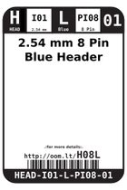
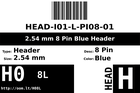
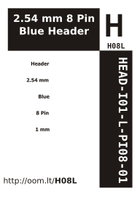
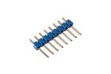
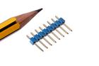

Contents
========

* [H08L > 2.54 mm 8 Pin Blue Header](#h08l--254-mm-8-pin-blue-header)
	* [Datasheets](#datasheets)
	* [Labels](#labels)
	* [EDA](#eda)
	* [Images](#images)
	* [Tags](#tags)
  
![][im]
# H08L > 2.54 mm 8 Pin Blue Header

- ID: HEAD-I01-L-PI08-01
- Hex ID: H08L
- Name: 2.54 mm 8 Pin Blue Header
- Description: 2.54 mm 8 Pin Blue Header
- Long Link: [http://oom.lt/HEAD-I01-L-PI08-01](http://oom.lt/HEAD-I01-L-PI08-01)
- Short Link: [http://oom.lt/H08L](http://oom.lt/H08L)

## Datasheets

- Datasheet: [datasheet.pdf](datasheet.pdf)

## Labels
  
  

|label-front|label-inventory|label-spec|
| :---: | :---: | :---: |
||||

## EDA

### Footprints
  

|  [FOOTPRINT-eagle-SparkFun-Eagle-Libraries-Sparkfun-Connectors-1X08](https://github.com/oomlout/oomlout_OOMP_eda/tree/main/FOOTPRINT/eagle/SparkFun-Eagle-Libraries/Sparkfun-Connectors/1X08/)|  [FOOTPRINT-eagle-SparkFun-Eagle-Libraries-Sparkfun-Connectors-1X08_LOCK](https://github.com/oomlout/oomlout_OOMP_eda/tree/main/FOOTPRINT/eagle/SparkFun-Eagle-Libraries/Sparkfun-Connectors/1X08_LOCK/)|  [FOOTPRINT-eagle-SparkFun-Eagle-Libraries-Sparkfun-Connectors-1X08_LOCK_LONGPADS](https://github.com/oomlout/oomlout_OOMP_eda/tree/main/FOOTPRINT/eagle/SparkFun-Eagle-Libraries/Sparkfun-Connectors/1X08_LOCK_LONGPADS/)|  [FOOTPRINT-eagle-SparkFun-Eagle-Libraries-Sparkfun-Connectors-1X08_NO_SILK](https://github.com/oomlout/oomlout_OOMP_eda/tree/main/FOOTPRINT/eagle/SparkFun-Eagle-Libraries/Sparkfun-Connectors/1X08_NO_SILK/)|
| :---: | :---: | :---: | :---: |
|  [FOOTPRINT-eagle-Adafruit-Eagle-Library-adafruit-1X08-CLEANBIG](https://github.com/oomlout/oomlout_OOMP_eda/tree/main/FOOTPRINT/eagle/Adafruit-Eagle-Library/adafruit/1X08-CLEANBIG/)|  [FOOTPRINT-eagle-Adafruit-Eagle-Library-adafruit-1X08-LOCK](https://github.com/oomlout/oomlout_OOMP_eda/tree/main/FOOTPRINT/eagle/Adafruit-Eagle-Library/adafruit/1X08-LOCK/)|  [----](https://github.com/oomlout/oomlout_OOMP_parts/tree/main/----/)|  [FOOTPRINT-kicad-kicad-footprints-Connector_PinHeader_2.54mm-PinHeader_1x08_P2.54mm_Vertical](https://github.com/oomlout/oomlout_OOMP_eda/tree/main/FOOTPRINT/kicad/kicad-footprints/Connector_PinHeader_2.54mm/PinHeader_1x08_P2.54mm_Vertical/)|
|||||

### Symbols
  

|  [SYMBOL-kicad-kicad-symbols-Connector-Conn_01x08_Male](https://github.com/oomlout/oomlout_OOMP_parts/tree/main/SYMBOL-kicad-kicad-symbols-Connector-Conn_01x08_Male/)|  [----](https://github.com/oomlout/oomlout_OOMP_parts/tree/main/----/)|||
| :---: | :---: | :---: | :---: |

## Images
  
  

|image|image_RE|label-front|label-inventory|label-spec|
| :---: | :---: | :---: | :---: | :---: |
||||||

## Tags

- oompID: HEAD-I01-L-PI08-01
- name: 2.54 mm 8 Pin Blue Header
- hexID: H08L
- oompSort: 
- oompClass: Through Hole
- oompClassCode: THTH
- oompType: HEAD
- oompSize: I01
- oompColor: L
- oompDesc: PI08
- oompIndex: 01
- oompVersion: 40
- ooPitch: 2.54
- ooPinHeight: 11.60
- ooPinWidth: 0.64
- ooPinOffset: 1.53
- ooNumPins: 8
- ooFootprint: OOMP-HEAD-I01-X-PI08-01
- oompBbls: variable;clear
- oompBbls: variable;pins;8
- oompBbls: template;XXXX-I01-X-XX-01-bbls
- oompDiag: variable;clear
- oompDiag: variable;pins;8
- oompDiag: template;HEAD-I01-X-XX-01-diag
- oompIden: variable;clear
- oompIden: variable;pins;8
- oompIden: template;XXXX-I01-X-XX-01-iden
- oompSchem: variable;clear
- oompSchem: variable;pins;8
- oompSchem: template;XXXX-XX-X-XX-01-PINS-EVEN-schem
- oompSimp: variable;clear
- oompSimp: variable;pins;8
- oompSimp: template;XXXX-I01-X-XX-01-simp
- ooDesignator: J1
- schematicSymbol: HEAD-XX-X-PI08-XX
- pcbFootprint: HEAD-I01-X-PI08-01
- footprintEagle: FOOTPRINT-eagle-SparkFun-Eagle-Libraries-Sparkfun-Connectors-1X08
- footprintEagle: FOOTPRINT-eagle-SparkFun-Eagle-Libraries-Sparkfun-Connectors-1X08_LOCK
- footprintEagle: FOOTPRINT-eagle-SparkFun-Eagle-Libraries-Sparkfun-Connectors-1X08_LOCK_LONGPADS
- footprintEagle: FOOTPRINT-eagle-SparkFun-Eagle-Libraries-Sparkfun-Connectors-1X08_NO_SILK
- footprintEagle: FOOTPRINT-eagle-Adafruit-Eagle-Library-adafruit-1X08-CLEANBIG
- footprintEagle: FOOTPRINT-eagle-Adafruit-Eagle-Library-adafruit-1X08-LOCK
- footprintEagle: FOOTPRINT-eagle-Pimoroni-Eagle-Library-pimoroni-headers-108
- footprintKicad: FOOTPRINT-kicad-kicad-footprints-Connector_PinHeader_2.54mm-PinHeader_1x08_P2.54mm_Vertical
- symbolKicad: SYMBOL-kicad-kicad-symbols-Connector-Conn_01x08_Male
- symbolKicad: SYMBOL-kicad-kicad-symbols-Connector_Generic-Conn_01x08_Male

[im]: image_450.jpg
