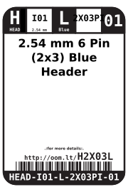
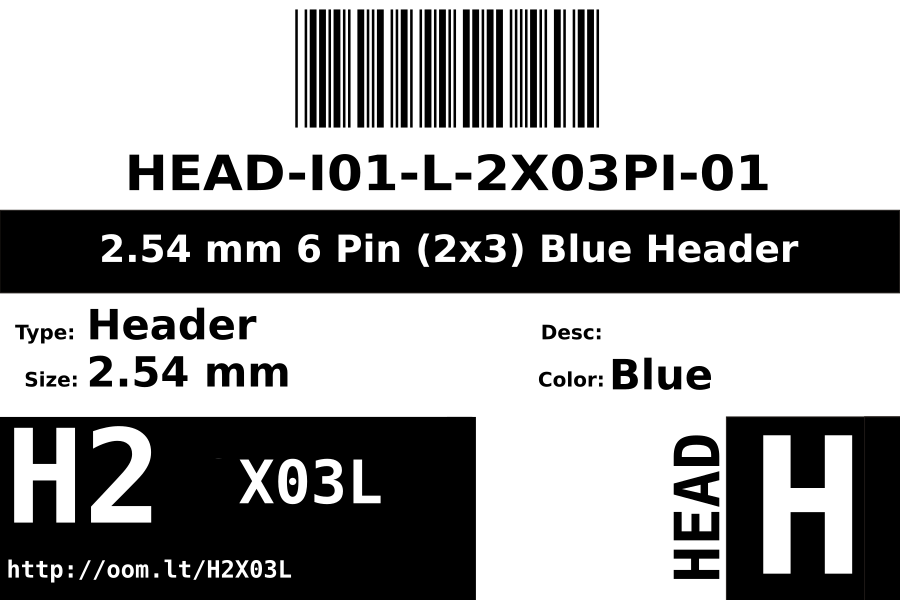
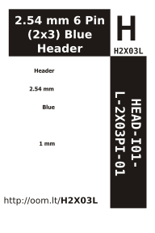

Contents
========

* [HEAD-I01-L-PI2X03-01>2.54 mm 6 Pin (2x3) Blue Header](#head-i01-l-pi2x03-01254-mm-6-pin-2x3-blue-header)
	* [Images](#images)
	* [Datasheets](#datasheets)
	* [Labels](#labels)
	* [EDA](#eda)
		* [Symbols](#symbols)
	* [Tags](#tags)
  
![][im]
# HEAD-I01-L-PI2X03-01>2.54 mm 6 Pin (2x3) Blue Header

- ID: HEAD-I01-L-PI2X03-01
- Name: HEAD-I01-L-PI2X03-01

## Images
  
  

|image|image_RE|
| :---: | :---: |
|||

## Datasheets

- Datasheet: [datasheet.pdf](datasheet.pdf)

## Labels
  
  

|label-front|label-inventory|label-spec|
| :---: | :---: | :---: |
||||

## EDA

### Symbols

## Tags

- hexID: H2X03L
- oompSort: 
- oompClass: Through Hole
- oompClassCode: THTH
- oompType: HEAD
- oompSize: I01
- oompColor: L
- oompDesc: PI2X03
- oompIndex: 01
- oompVersion: 40
- ooPitch: 2.54
- ooPinHeight: 11.60
- ooPinWidth: 0.64
- ooPinOffset: 1.53
- ooNumRows: 2
- ooNumPins: 6
- ooFootprint: OOMP-HEAD-I01-X-PI2X03-01
- ooDesignator: J1
- oompID: HEAD-I01-L-PI2X03-01

[im]: image_600.jpg
