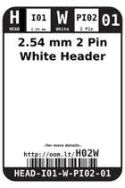

Contents
========

* [H02W > 2.54 mm 2 Pin White Header](#h02w--254-mm-2-pin-white-header)
	* [Datasheets](#datasheets)
	* [Labels](#labels)
	* [EDA](#eda)
	* [Images](#images)
	* [Tags](#tags)

# H02W > 2.54 mm 2 Pin White Header

- ID: HEAD-I01-W-PI02-01
- Hex ID: H02W
- Name: 2.54 mm 2 Pin White Header
- Description: 2.54 mm 2 Pin White Header
- Long Link: [http://oom.lt/HEAD-I01-W-PI02-01](http://oom.lt/HEAD-I01-W-PI02-01)
- Short Link: [http://oom.lt/H02W](http://oom.lt/H02W)

## Datasheets

- Datasheet: [datasheet.pdf](datasheet.pdf)

## Labels
  
  

|label-front|label-inventory|label-spec|
| :---: | :---: | :---: |
||||

## EDA

### Footprints
  

|  [kicad/FOOTPRINT-kicad-kicad-footprints-Connector_PinHeader_2.54mm-PinHeader_1x02_P2.54mm_Vertical](https://github.com/oomlout/oomlout_OOMP_eda/tree/main/footprints/kicad/FOOTPRINT-kicad-kicad-footprints-Connector_PinHeader_2.54mm-PinHeader_1x02_P2.54mm_Vertical/)|  [eagle/FOOTPRINT-eagle-SparkFun-Eagle-Libraries-Sparkfun-Connectors-1X02](https://github.com/oomlout/oomlout_OOMP_eda/tree/main/footprints/eagle/FOOTPRINT-eagle-SparkFun-Eagle-Libraries-Sparkfun-Connectors-1X02/)|  [eagle/FOOTPRINT-eagle-SparkFun-Eagle-Libraries-Sparkfun-Connectors-1X02_BIG](https://github.com/oomlout/oomlout_OOMP_eda/tree/main/footprints/eagle/FOOTPRINT-eagle-SparkFun-Eagle-Libraries-Sparkfun-Connectors-1X02_BIG/)|  [eagle/FOOTPRINT-eagle-SparkFun-Eagle-Libraries-Sparkfun-Connectors-1X02_LOCK](https://github.com/oomlout/oomlout_OOMP_eda/tree/main/footprints/eagle/FOOTPRINT-eagle-SparkFun-Eagle-Libraries-Sparkfun-Connectors-1X02_LOCK/)|
| :---: | :---: | :---: | :---: |
|  [eagle/FOOTPRINT-eagle-SparkFun-Eagle-Libraries-Sparkfun-Connectors-1X02_LOCK_LONGPADS](https://github.com/oomlout/oomlout_OOMP_eda/tree/main/footprints/eagle/FOOTPRINT-eagle-SparkFun-Eagle-Libraries-Sparkfun-Connectors-1X02_LOCK_LONGPADS/)|  [eagle/FOOTPRINT-eagle-SparkFun-Eagle-Libraries-Sparkfun-Connectors-1X02_NO_SILK](https://github.com/oomlout/oomlout_OOMP_eda/tree/main/footprints/eagle/FOOTPRINT-eagle-SparkFun-Eagle-Libraries-Sparkfun-Connectors-1X02_NO_SILK/)|  [eagle/FOOTPRINT-eagle-SparkFun-Eagle-Libraries-Sparkfun-Connectors-1X02_PP_HOLES_ONLY](https://github.com/oomlout/oomlout_OOMP_eda/tree/main/footprints/eagle/FOOTPRINT-eagle-SparkFun-Eagle-Libraries-Sparkfun-Connectors-1X02_PP_HOLES_ONLY/)||

### Symbols

## Images
  
  

|label-front|label-inventory|label-spec|
| :---: | :---: | :---: |
||||

## Tags

- oompID: HEAD-I01-W-PI02-01
- name: 2.54 mm 2 Pin White Header
- hexID: H02W
- oompSort: HEADI0102PI
- oompType: HEAD
- oompSize: I01
- oompColor: W
- oompDesc: PI02
- oompIndex: 01
- oompVersion: 98
- ooPitch: 2.54
- ooPinHeight: 11.60
- ooPinWidth: 0.64
- ooPinOffset: 1.53
- ooNumPins: 2
- ooFootprint: OOMP-HEAD-I01-X-PI02-01
- oompBbls: variable;clear
- oompBbls: variable;pins;2
- oompBbls: template;XXXX-I01-X-XX-01-bbls
- oompDiag: variable;clear
- oompDiag: variable;pins;2
- oompDiag: template;HEAD-I01-X-XX-01-diag
- drawItem: variable;clear
- drawItem: variable;pins;2
- drawItem: template;XXXX-I01-X-XX-01-iden
- oompSchem: variable;clear
- oompSchem: variable;pins;2
- oompSchem: template;XXXX-XX-X-XX-01-PINS-EVEN-schem
- oompSimp: variable;clear
- oompSimp: variable;pins;2
- oompSimp: template;XXXX-I01-X-XX-01-simp
- ooDesignator: J1
- footprintEagle: FOOTPRINT-eagle-SparkFun-Eagle-Libraries-Sparkfun-Connectors-1X02
- footprintEagle: FOOTPRINT-eagle-SparkFun-Eagle-Libraries-Sparkfun-Connectors-1X02_BIG
- footprintEagle: FOOTPRINT-eagle-SparkFun-Eagle-Libraries-Sparkfun-Connectors-1X02_LOCK
- footprintEagle: FOOTPRINT-eagle-SparkFun-Eagle-Libraries-Sparkfun-Connectors-1X02_LOCK_LONGPADS
- footprintEagle: FOOTPRINT-eagle-SparkFun-Eagle-Libraries-Sparkfun-Connectors-1X02_NO_SILK
- footprintEagle: FOOTPRINT-eagle-SparkFun-Eagle-Libraries-Sparkfun-Connectors-1X02_PP_HOLES_ONLY
- footprintKicad: FOOTPRINT-kicad-kicad-footprints-Connector_PinHeader_2.54mm-PinHeader_1x02_P2.54mm_Vertical
- symbolKicad: SYMBOL-kicad-kicad-symbols-Connector-Conn_01x02_Male
- symbolKicad: SYMBOL-kicad-kicad-symbols-Connector_Generic-Conn_01x02_Male
