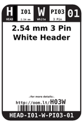
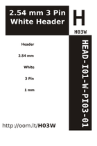

Contents
========

* [H03W > 2.54 mm 3 Pin White Header](#h03w--254-mm-3-pin-white-header)
	* [Datasheets](#datasheets)
	* [Labels](#labels)
	* [EDA](#eda)
	* [Images](#images)
	* [Tags](#tags)

# H03W > 2.54 mm 3 Pin White Header

- ID: HEAD-I01-W-PI03-01
- Hex ID: H03W
- Name: 2.54 mm 3 Pin White Header
- Description: 2.54 mm 3 Pin White Header
- Long Link: [http://oom.lt/HEAD-I01-W-PI03-01](http://oom.lt/HEAD-I01-W-PI03-01)
- Short Link: [http://oom.lt/H03W](http://oom.lt/H03W)

## Datasheets

- Datasheet: [datasheet.pdf](datasheet.pdf)

## Labels
  
  

|label-front|label-inventory|label-spec|
| :---: | :---: | :---: |
||||

## EDA

### Footprints
  

|[  FOOTPRINT-eagle-SparkFun-Eagle-Libraries-Sparkfun-Connectors-1X03](https://github.com/oomlout/oomlout_OOMP_eda/tree/main/FOOTPRINT/eagle/SparkFun-Eagle-Libraries/Sparkfun-Connectors/1X03/)|[  FOOTPRINT-eagle-SparkFun-Eagle-Libraries-Sparkfun-Connectors-1X03_LOCK](https://github.com/oomlout/oomlout_OOMP_eda/tree/main/FOOTPRINT/eagle/SparkFun-Eagle-Libraries/Sparkfun-Connectors/1X03_LOCK/)|[  FOOTPRINT-eagle-SparkFun-Eagle-Libraries-Sparkfun-Connectors-1X03_LOCK_LONGPADS](https://github.com/oomlout/oomlout_OOMP_eda/tree/main/FOOTPRINT/eagle/SparkFun-Eagle-Libraries/Sparkfun-Connectors/1X03_LOCK_LONGPADS/)|[  FOOTPRINT-eagle-SparkFun-Eagle-Libraries-Sparkfun-Connectors-1X03_NO_SILK](https://github.com/oomlout/oomlout_OOMP_eda/tree/main/FOOTPRINT/eagle/SparkFun-Eagle-Libraries/Sparkfun-Connectors/1X03_NO_SILK/)|
| :---: | :---: | :---: | :---: |
|[  FOOTPRINT-eagle-SparkFun-Eagle-Libraries-Sparkfun-Connectors-1X03_PP_HOLES_ONLY](https://github.com/oomlout/oomlout_OOMP_eda/tree/main/FOOTPRINT/eagle/SparkFun-Eagle-Libraries/Sparkfun-Connectors/1X03_PP_HOLES_ONLY/)|[  FOOTPRINT-eagle-Adafruit-Eagle-Library-adafruit-1X03](https://github.com/oomlout/oomlout_OOMP_eda/tree/main/FOOTPRINT/eagle/Adafruit-Eagle-Library/adafruit/1X03/)|[  FOOTPRINT-eagle-Adafruit-Eagle-Library-adafruit-1X03-CLEANBIG](https://github.com/oomlout/oomlout_OOMP_eda/tree/main/FOOTPRINT/eagle/Adafruit-Eagle-Library/adafruit/1X03-CLEANBIG/)|[  FOOTPRINT-kicad-kicad-footprints-Connector_PinHeader_2.54mm-PinHeader_1x03_P2.54mm_Vertical](https://github.com/oomlout/oomlout_OOMP_eda/tree/main/FOOTPRINT/kicad/kicad-footprints/Connector_PinHeader_2.54mm/PinHeader_1x03_P2.54mm_Vertical/)|
|||||

### Symbols
  

|[  SYMBOL-kicad-kicad-symbols-Connector-Conn_01x03_Male](https://github.com/oomlout/oomlout_OOMP_eda/tree/main/SYMBOL/kicad/kicad-symbols/Connector/Conn_01x03_Male/)|[  SYMBOL-kicad-kicad-symbols-Connector_Generic-Conn_01x03](https://github.com/oomlout/oomlout_OOMP_eda/tree/main/SYMBOL/kicad/kicad-symbols/Connector_Generic/Conn_01x03/)|||
| :---: | :---: | :---: | :---: |

## Images
  
  

|label-front|label-inventory|label-spec|
| :---: | :---: | :---: |
||||

## Tags

- oompID: HEAD-I01-W-PI03-01
- name: 2.54 mm 3 Pin White Header
- hexID: H03W
- oompSort: 
- oompClass: Through Hole
- oompClassCode: THTH
- oompType: HEAD
- oompSize: I01
- oompColor: W
- oompDesc: PI03
- oompIndex: 01
- oompVersion: 40
- ooPitch: 2.54
- ooPinHeight: 11.60
- ooPinWidth: 0.64
- ooPinOffset: 1.53
- ooNumPins: 3
- ooFootprint: OOMP-HEAD-I01-X-PI03-01
- oompBbls: variable;clear
- oompBbls: variable;pins;3
- oompBbls: template;XXXX-I01-X-XX-01-bbls
- oompDiag: variable;clear
- oompDiag: variable;pins;3
- oompDiag: template;HEAD-I01-X-XX-01-diag
- drawItem: variable;clear
- drawItem: variable;pins;3
- drawItem: template;XXXX-I01-X-XX-01-iden
- oompSchem: variable;clear
- oompSchem: variable;pins;3
- oompSchem: template;XXXX-XX-X-XX-01-PINS-ODD-schem
- oompSimp: variable;clear
- oompSimp: variable;pins;3
- oompSimp: template;XXXX-I01-X-XX-01-simp
- ooDesignator: J1
- symbolKicad: SYMBOL-kicad-kicad-symbols-Connector-Conn_01x03_Male
- symbolKicad: SYMBOL-kicad-kicad-symbols-Connector_Generic-Conn_01x03
- footprintEagle: FOOTPRINT-eagle-SparkFun-Eagle-Libraries-Sparkfun-Connectors-1X03
- footprintEagle: FOOTPRINT-eagle-SparkFun-Eagle-Libraries-Sparkfun-Connectors-1X03_LOCK
- footprintEagle: FOOTPRINT-eagle-SparkFun-Eagle-Libraries-Sparkfun-Connectors-1X03_LOCK_LONGPADS
- footprintEagle: FOOTPRINT-eagle-SparkFun-Eagle-Libraries-Sparkfun-Connectors-1X03_NO_SILK
- footprintEagle: FOOTPRINT-eagle-SparkFun-Eagle-Libraries-Sparkfun-Connectors-1X03_PP_HOLES_ONLY
- footprintEagle: FOOTPRINT-eagle-Adafruit-Eagle-Library-adafruit-1X03
- footprintEagle: FOOTPRINT-eagle-Adafruit-Eagle-Library-adafruit-1X03-CLEANBIG
- footprintKicad: FOOTPRINT-kicad-kicad-footprints-Connector_PinHeader_2.54mm-PinHeader_1x03_P2.54mm_Vertical
