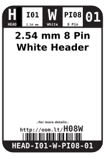
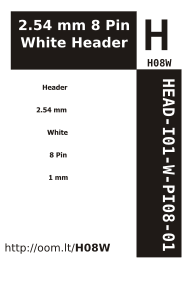

Contents
========

* [HEAD-I01-W-PI08-01>2.54 mm 8 Pin White Header](#head-i01-w-pi08-01254-mm-8-pin-white-header)
	* [Datasheets](#datasheets)
	* [Labels](#labels)
	* [EDA](#eda)
		* [Symbols](#symbols)
	* [Tags](#tags)

# HEAD-I01-W-PI08-01>2.54 mm 8 Pin White Header

- ID: HEAD-I01-W-PI08-01
- Name: HEAD-I01-W-PI08-01

## Datasheets

- Datasheet: [datasheet.pdf](datasheet.pdf)

## Labels
  
  

|label-front|label-inventory|label-spec|
| :---: | :---: | :---: |
||||

## EDA

### Symbols

## Tags

- oompID: HEAD-I01-W-PI08-01
- name: 2.54 mm 8 Pin White Header
- hexID: H08W
- oompSort: 
- oompClass: Through Hole
- oompClassCode: THTH
- oompType: HEAD
- oompSize: I01
- oompColor: W
- oompDesc: PI08
- oompIndex: 01
- oompVersion: 40
- ooPitch: 2.54
- ooPinHeight: 11.60
- ooPinWidth: 0.64
- ooPinOffset: 1.53
- ooNumPins: 8
- ooFootprint: OOMP-HEAD-I01-X-PI08-01
- oompBbls: variable;clear
- oompBbls: variable;pins;8
- oompBbls: template;XXXX-I01-X-XX-01-bbls
- oompDiag: variable;clear
- oompDiag: variable;pins;8
- oompDiag: template;HEAD-I01-X-XX-01-diag
- drawItem: variable;clear
- drawItem: variable;pins;8
- drawItem: template;XXXX-I01-X-XX-01-iden
- oompSchem: variable;clear
- oompSchem: variable;pins;8
- oompSchem: template;XXXX-XX-X-XX-01-PINS-EVEN-schem
- oompSimp: variable;clear
- oompSimp: variable;pins;8
- oompSimp: template;XXXX-I01-X-XX-01-simp
- ooDesignator: J1
