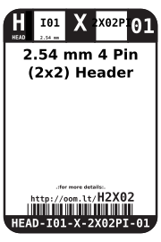
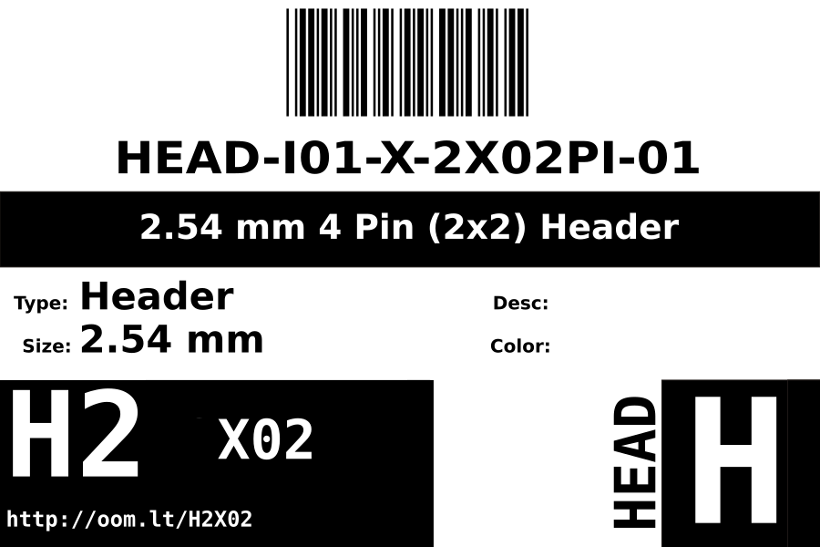
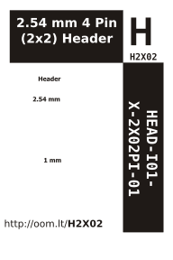

Contents
========

* [HEAD-I01-X-2X02PI-01>2.54 mm 4 Pin (2x2) Header](#head-i01-x-2x02pi-01254-mm-4-pin-2x2-header)
	* [Datasheets](#datasheets)
	* [Labels](#labels)
	* [EDA](#eda)
		* [Symbols](#symbols)
	* [Tags](#tags)

# HEAD-I01-X-2X02PI-01>2.54 mm 4 Pin (2x2) Header

- ID: HEAD-I01-X-2X02PI-01
- Name: HEAD-I01-X-2X02PI-01

## Datasheets

- Datasheet: [datasheet.pdf](datasheet.pdf)

## Labels
  
  

|Front|Inventory|Specifications|
| :---: | :---: | :---: |
||||

## EDA

### Symbols

## Tags

- oompID: HEAD-I01-X-PI2x02-01
- name: 2.54 mm 4 Pin (2x2) Header
- hexID: H2X02
- oompSort: A0101Z2X02
- oompType: HEAD
- oompSize: I01
- oompColor: X
- oompDesc: 2X02PI
- oompIndex: 01
- oompVersion: 99
- oompSkip: true
- ooPitch: 2.54 mm
- ooWidth: 5.08mm
- ooHeight: 11.8 mm
- ooLength: 5.08 mm
- ooMaterial: 
- ooNumRows: 2
- ooNumPins: 4
- ooFootprint: OOMP-HEAD-I01-X-PI2x02-01
- oompClass: Through Hole Component
- oompClassCode: THTH
- ooDesignator: J1
