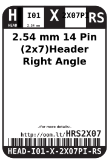
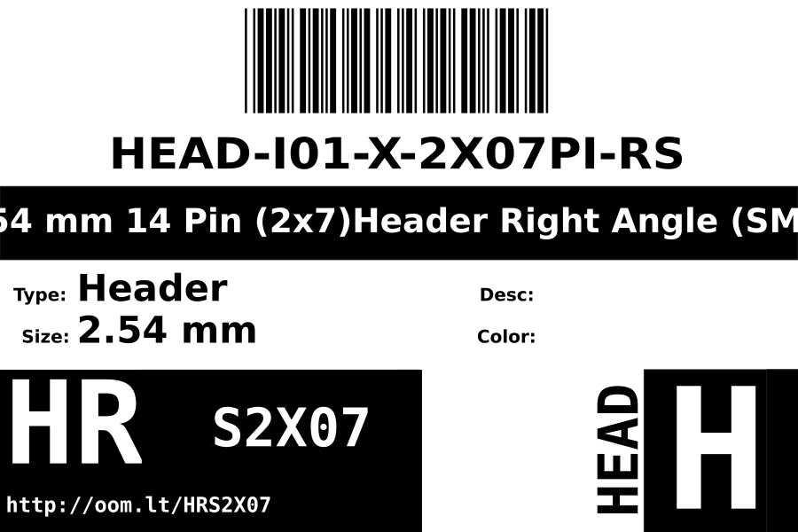
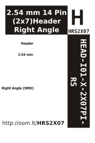

Contents
========

* [HEAD-I01-X-2X07PI-RS>2.54 mm 14 Pin (2x7)Header Right Angle (SMD)](#head-i01-x-2x07pi-rs254-mm-14-pin-2x7header-right-angle-smd)
	* [Labels](#labels)
	* [EDA](#eda)
		* [Symbols](#symbols)
	* [Tags](#tags)

# HEAD-I01-X-2X07PI-RS>2.54 mm 14 Pin (2x7)Header Right Angle (SMD)

- ID: HEAD-I01-X-2X07PI-RS
- Name: HEAD-I01-X-2X07PI-RS

## Labels
  
  

|label-front|label-inventory|label-spec|
| :---: | :---: | :---: |
||||

## EDA

### Symbols

## Tags

- oompID: HEAD-I01-X-PI2x07-RS
- name: 2.54 mm 14 Pin (2x7)Header Right Angle (SMD)
- oompSort: 
- oompType: HEAD
- oompSize: I01
- oompColor: X
- oompDesc: 2X07PI
- oompIndex: RS
- oompVersion: 999
- hexID: HRS2X07
- ooPitch: 2.54 mm
- ooWidth: 17.78 mm
- ooHeight: 5.08 mm
- ooLength: 17.66 mm
- numPins: 14
- numRows: 2
- oompFootprint: HEAD-I01-X-PI2x07-RS
