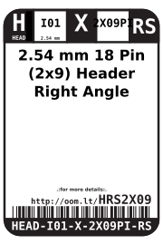
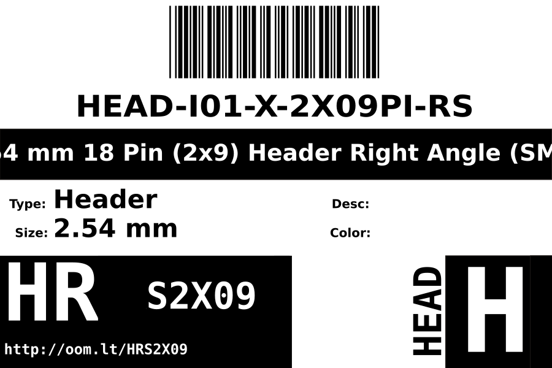
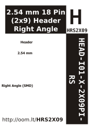

Contents
========

* [HEAD-I01-X-2X09PI-RS>2.54 mm 18 Pin (2x9) Header Right Angle (SMD)](#head-i01-x-2x09pi-rs254-mm-18-pin-2x9-header-right-angle-smd)
	* [Datasheets](#datasheets)
	* [Labels](#labels)
	* [EDA](#eda)
		* [Symbols](#symbols)
	* [Tags](#tags)

# HEAD-I01-X-2X09PI-RS>2.54 mm 18 Pin (2x9) Header Right Angle (SMD)

- ID: HEAD-I01-X-2X09PI-RS
- Name: HEAD-I01-X-2X09PI-RS

## Datasheets

- Datasheet: [datasheet.pdf](datasheet.pdf)

## Labels
  
  

|Front|Inventory|Specifications|
| :---: | :---: | :---: |
||||

## EDA

### Symbols

## Tags

- oompID: HEAD-I01-X-PI2x09-RS
- name: 2.54 mm 18 Pin (2x9) Header Right Angle (SMD)
- oompSort: 
- oompType: HEAD
- oompSize: I01
- oompColor: X
- oompDesc: 2X09PI
- oompIndex: RS
- oompVersion: 999
- hexID: HRS2X09
- ooPitch: 2.54 mm
- ooWidth: 22.86 mm
- ooHeight: 5.08 mm
- ooLength: 17.66 mm
- numPins: 18
- numRows: 2
- oompFootprint: HEAD-I01-X-PI2x09-RS
