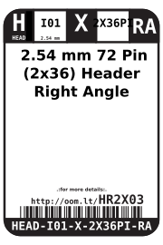
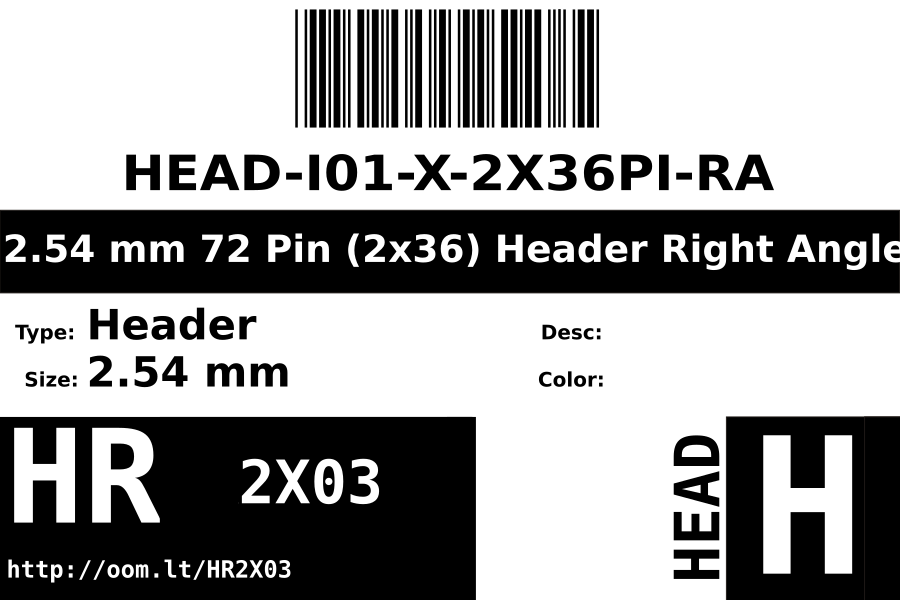
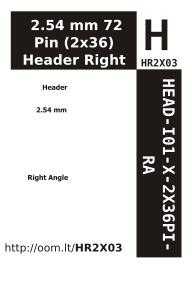

Contents
========

* [HEAD-I01-X-2X36PI-RA> 2.54 mm 72 Pin (2x36) Header Right Angle ](#head-i01-x-2x36pi-ra-254-mm-72-pin-2x36-header-right-angle-)
	* [Labels](#labels)
	* [EDA](#eda)
		* [Symbols](#symbols)
	* [Tags](#tags)

# HEAD-I01-X-2X36PI-RA> 2.54 mm 72 Pin (2x36) Header Right Angle 

- ID: HEAD-I01-X-2X36PI-RA
- Name: HEAD-I01-X-2X36PI-RA

## Labels
  
  

|label-front|label-inventory|label-spec|
| :---: | :---: | :---: |
||||

## EDA

### Symbols

## Tags

- oompID: HEAD-I01-X-PI2x36-RA
- name:  2.54 mm 72 Pin (2x36) Header Right Angle 
- hexID: HR2X03
- oompSort: 
- oompType: HEAD
- oompSize: I01
- oompColor: X
- oompDesc: 2X36PI
- oompIndex: RA
- oompVersion: 98
- ooNumRows: 2
- ooNumPins: 72
- ooFootprint: OOMP-HEAD-I01-X-PI2x36-RA
