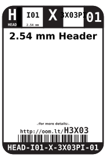
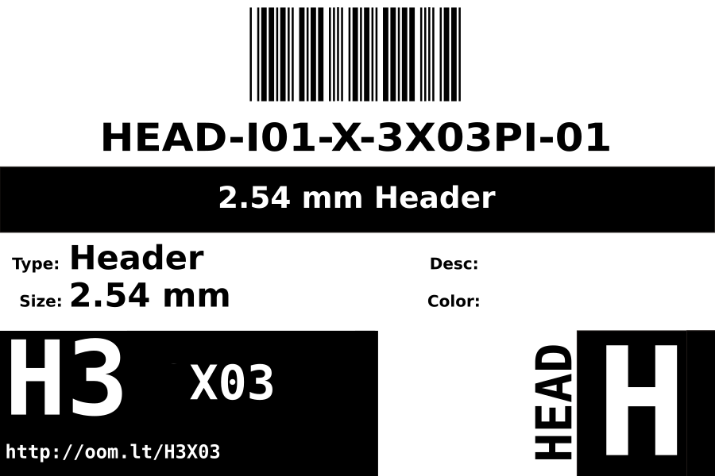
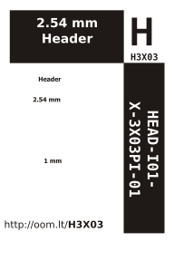

Contents
========

* [HEAD-I01-X-3X03PI-01>2.54 mm Header](#head-i01-x-3x03pi-01254-mm-header)
	* [Labels](#labels)
	* [EDA](#eda)
		* [Symbols](#symbols)
	* [Tags](#tags)

# HEAD-I01-X-3X03PI-01>2.54 mm Header

- ID: HEAD-I01-X-3X03PI-01
- Name: HEAD-I01-X-3X03PI-01

## Labels
  
  

|label-front|label-inventory|label-spec|
| :---: | :---: | :---: |
||||

## EDA

### Symbols

## Tags

- hexID: H3X03
- oompSort: 
- oompType: HEAD
- oompSize: I01
- oompColor: X
- oompDesc: 3X03PI
- oompIndex: 01
- oompVersion: 98
- ooNumRows: 3
- ooNumPins: 3
- ooFootprint: OOMP-HEAD-I01-X-PI3X03-01
- oompID: HEAD-I01-X-3X03PI-01
