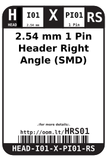
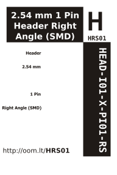

Contents
========

* [HEAD-I01-X-PI01-RS>2.54 mm 1 Pin Header Right Angle (SMD)](#head-i01-x-pi01-rs254-mm-1-pin-header-right-angle-smd)
	* [Datasheets](#datasheets)
	* [Labels](#labels)
	* [EDA](#eda)
		* [Symbols](#symbols)
	* [Tags](#tags)

# HEAD-I01-X-PI01-RS>2.54 mm 1 Pin Header Right Angle (SMD)

- ID: HEAD-I01-X-PI01-RS
- Name: HEAD-I01-X-PI01-RS

## Datasheets

- Datasheet: [datasheet.pdf](datasheet.pdf)

## Labels
  
  

|label-front|label-inventory|label-spec|
| :---: | :---: | :---: |
||||

## EDA

### Symbols

## Tags

- oompID: HEAD-I01-X-PI01-RS
- name: 2.54 mm 1 Pin Header Right Angle (SMD)
- oompSort: 
- oompType: HEAD
- oompSize: I01
- oompColor: X
- oompDesc: PI01
- oompIndex: RS
- oompVersion: 999
- hexID: HRS01
- ooPitch: 2.54 mm
- ooWidth: 2.54 mm
- ooHeight: 2.54 mm
- ooLength: 13.04 mm
- numPins: 1
- oompFootprint: HEAD-I01-X-PI01-RS
