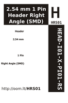

Contents
========

* [HRS01 > 2.54 mm 1 Pin Header Right Angle (SMD)](#hrs01--254-mm-1-pin-header-right-angle-smd)
	* [Datasheets](#datasheets)
	* [Labels](#labels)
	* [EDA](#eda)
	* [Images](#images)
	* [Tags](#tags)

# HRS01 > 2.54 mm 1 Pin Header Right Angle (SMD)

- ID: HEAD-I01-X-PI01-RS
- Hex ID: HRS01
- Name: 2.54 mm 1 Pin Header Right Angle (SMD)
- Description: 2.54 mm 1 Pin Header Right Angle (SMD)
- Long Link: [http://oom.lt/HEAD-I01-X-PI01-RS](http://oom.lt/HEAD-I01-X-PI01-RS)
- Short Link: [http://oom.lt/HRS01](http://oom.lt/HRS01)

## Datasheets

- Datasheet: [datasheet.pdf](datasheet.pdf)

## Labels
  
  

|label-front|label-inventory|label-spec|
| :---: | :---: | :---: |
||||

## EDA

### Footprints
  

|  [kicad/kicad-footprints/Connector_PinHeader_2.54mm/PinHeader_1x01_P2.54mm_Vertical](https://github.com/oomlout/oomlout_OOMP_eda/tree/main/footprints/kicad/kicad-footprints/Connector_PinHeader_2.54mm/PinHeader_1x01_P2.54mm_Vertical/)|  [eagle/SparkFun-Eagle-Libraries-Sparkfun-Connectors-1X01](https://github.com/oomlout/oomlout_OOMP_eda/tree/main/footprints/eagle/SparkFun-Eagle-Libraries-Sparkfun-Connectors-1X01/)|  [eagle/SparkFun-Eagle-Libraries-Sparkfun-Connectors-1X01_NO_SILK](https://github.com/oomlout/oomlout_OOMP_eda/tree/main/footprints/eagle/SparkFun-Eagle-Libraries-Sparkfun-Connectors-1X01_NO_SILK/)|  [eagle/FOOTPRINT-eagle-Adafruit-Eagle-Library-adafruit-1X01](https://github.com/oomlout/oomlout_OOMP_eda/tree/main/footprints/eagle/FOOTPRINT-eagle-Adafruit-Eagle-Library-adafruit-1X01/)|
| :---: | :---: | :---: | :---: |
|  [eagle/FOOTPRINT-eagle-Adafruit-Eagle-Library-adafruit-1X01-CLEANBIG](https://github.com/oomlout/oomlout_OOMP_eda/tree/main/footprints/eagle/FOOTPRINT-eagle-Adafruit-Eagle-Library-adafruit-1X01-CLEANBIG/)|  [eagle/FOOTPRINT-eagle-Pimoroni-Eagle-Library-pimoroni-headers-101-0.1&quot;-CASTELLATED-BCREAM](https://github.com/oomlout/oomlout_OOMP_eda/tree/main/footprints/eagle/FOOTPRINT-eagle-Pimoroni-Eagle-Library-pimoroni-headers-101-0.1&quot;-CASTELLATED-BCREAM/)|  [eagle/FOOTPRINT-eagle-Pimoroni-Eagle-Library-pimoroni-headers-101-0.1&quot;-CASTELLATED-BIGGER-ROUNDED](https://github.com/oomlout/oomlout_OOMP_eda/tree/main/footprints/eagle/FOOTPRINT-eagle-Pimoroni-Eagle-Library-pimoroni-headers-101-0.1&quot;-CASTELLATED-BIGGER-ROUNDED/)|  [eagle/FOOTPRINT-eagle-Pimoroni-Eagle-Library-pimoroni-headers-101-0.1&quot;-CASTELLATED-BIGGER](https://github.com/oomlout/oomlout_OOMP_eda/tree/main/footprints/eagle/FOOTPRINT-eagle-Pimoroni-Eagle-Library-pimoroni-headers-101-0.1&quot;-CASTELLATED-BIGGER/)|
|  [eagle/FOOTPRINT-eagle-Pimoroni-Eagle-Library-pimoroni-headers-101-0.1&quot;-CASTELLATED](https://github.com/oomlout/oomlout_OOMP_eda/tree/main/footprints/eagle/FOOTPRINT-eagle-Pimoroni-Eagle-Library-pimoroni-headers-101-0.1&quot;-CASTELLATED/)||||

### Symbols

## Images
  
  

|label-front|label-inventory|label-spec|
| :---: | :---: | :---: |
||||

## Tags

- oompID: HEAD-I01-X-PI01-RS
- name: 2.54 mm 1 Pin Header Right Angle (SMD)
- oompSort: 
- oompType: HEAD
- oompSize: I01
- oompColor: X
- oompDesc: PI01
- oompIndex: RS
- oompVersion: 999
- hexID: HRS01
- ooPitch: 2.54 mm
- ooWidth: 2.54 mm
- ooHeight: 2.54 mm
- ooLength: 13.04 mm
- numPins: 1
- oompFootprint: HEAD-I01-X-PI01-RS
- footprintEagle: SparkFun-Eagle-Libraries-Sparkfun-Connectors-1X01
- footprintEagle: SparkFun-Eagle-Libraries-Sparkfun-Connectors-1X01_NO_SILK
- footprintEagle: FOOTPRINT-eagle-Adafruit-Eagle-Library-adafruit-1X01
- footprintEagle: FOOTPRINT-eagle-Adafruit-Eagle-Library-adafruit-1X01-CLEANBIG
- footprintEagle: FOOTPRINT-eagle-Pimoroni-Eagle-Library-pimoroni-headers-101-0.1&quot;-CASTELLATED-BCREAM
- footprintEagle: FOOTPRINT-eagle-Pimoroni-Eagle-Library-pimoroni-headers-101-0.1&quot;-CASTELLATED-BIGGER-ROUNDED
- footprintEagle: FOOTPRINT-eagle-Pimoroni-Eagle-Library-pimoroni-headers-101-0.1&quot;-CASTELLATED-BIGGER
- footprintEagle: FOOTPRINT-eagle-Pimoroni-Eagle-Library-pimoroni-headers-101-0.1&quot;-CASTELLATED
- footprintKicad: kicad-footprints/Connector_PinHeader_2.54mm/PinHeader_1x01_P2.54mm_Vertical
