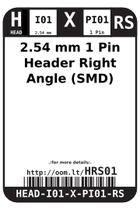

Contents
========

* [HRS01 > 2.54 mm 1 Pin Header Right Angle (SMD)](#hrs01--254-mm-1-pin-header-right-angle-smd)
	* [Datasheets](#datasheets)
	* [Labels](#labels)
	* [EDA](#eda)
	* [Images](#images)
	* [Tags](#tags)

# HRS01 > 2.54 mm 1 Pin Header Right Angle (SMD)

- ID: HEAD-I01-X-PI01-RS
- Hex ID: HRS01
- Name: 2.54 mm 1 Pin Header Right Angle (SMD)
- Description: 2.54 mm 1 Pin Header Right Angle (SMD)
- Long Link: [http://oom.lt/HEAD-I01-X-PI01-RS](http://oom.lt/HEAD-I01-X-PI01-RS)
- Short Link: [http://oom.lt/HRS01](http://oom.lt/HRS01)

## Datasheets

- Datasheet: [datasheet.pdf](datasheet.pdf)

## Labels
  
  

|label-front|label-inventory|label-spec|
| :---: | :---: | :---: |
||||

## EDA

### Symbols
  

|  [SYMBOL-kicad-kicad-symbols-Connector-Conn_01x01_Male](https://github.com/oomlout/oomlout_OOMP_parts/tree/main/SYMBOL-kicad-kicad-symbols-Connector-Conn_01x01_Male/)|  [----](https://github.com/oomlout/oomlout_OOMP_parts/tree/main/----/)|||
| :---: | :---: | :---: | :---: |

## Images
  
  

|label-front|label-inventory|label-spec|
| :---: | :---: | :---: |
||||

## Tags

- oompID: HEAD-I01-X-PI01-RS
- name: 2.54 mm 1 Pin Header Right Angle (SMD)
- oompSort: 
- oompType: HEAD
- oompSize: I01
- oompColor: X
- oompDesc: PI01
- oompIndex: RS
- oompVersion: 999
- hexID: HRS01
- ooPitch: 2.54 mm
- ooWidth: 2.54 mm
- ooHeight: 2.54 mm
- ooLength: 13.04 mm
- numPins: 1
- oompFootprint: HEAD-I01-X-PI01-RS
- symbolKicad: SYMBOL-kicad-kicad-symbols-Connector-Conn_01x01_Male
- symbolKicad: SYMBOL-kicad-kicad-symbols-Connector_Generic-Conn_01x01_Male
