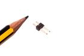
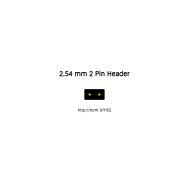
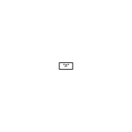
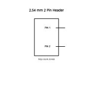
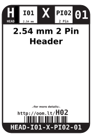
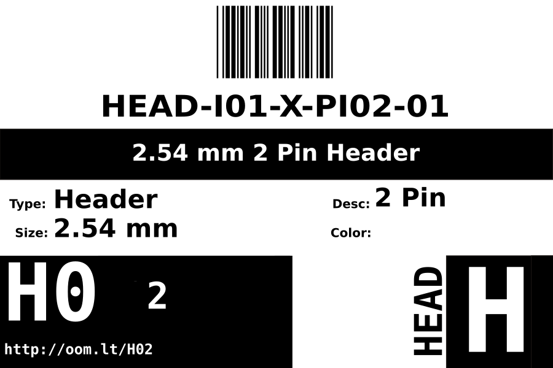

Contents
========

* [HEAD-I01-X-PI02-01>2.54 mm 2 Pin Header](#head-i01-x-pi02-01254-mm-2-pin-header)
	* [Images](#images)
	* [Diagrams](#diagrams)
	* [Datasheets](#datasheets)
	* [Labels](#labels)
	* [EDA](#eda)
		* [Footprints](#footprints)
		* [Symbols](#symbols)
	* [Tags](#tags)
  
![][im]
# HEAD-I01-X-PI02-01>2.54 mm 2 Pin Header

- ID: HEAD-I01-X-PI02-01
- Name: HEAD-I01-X-PI02-01

## Images
  
  

|image|image_RE|
| :---: | :---: |
|||

## Diagrams
  
  

|Breadboard Layout|Diagram|Identifier|Schematic|Simple|
| :---: | :---: | :---: | :---: | :---: |
||||||

## Datasheets

- Datasheet: [datasheet.pdf](datasheet.pdf)

## Labels
  
  

|label-front|label-inventory|label-spec|
| :---: | :---: | :---: |
||||

## EDA

### Footprints
  

|  [eagle/SparkFun-Eagle-Libraries/Sparkfun-Connectors/1X02](https://github.com/oomlout/oomlout_OOMP_eda/tree/main/footprints/eagle/SparkFun-Eagle-Libraries/Sparkfun-Connectors/1X02/)|  [eagle/SparkFun-Eagle-Libraries/Sparkfun-Connectors/1X02_BIG](https://github.com/oomlout/oomlout_OOMP_eda/tree/main/footprints/eagle/SparkFun-Eagle-Libraries/Sparkfun-Connectors/1X02_BIG/)|  [eagle/SparkFun-Eagle-Libraries/Sparkfun-Connectors/1X02_LOCK](https://github.com/oomlout/oomlout_OOMP_eda/tree/main/footprints/eagle/SparkFun-Eagle-Libraries/Sparkfun-Connectors/1X02_LOCK/)|  [eagle/SparkFun-Eagle-Libraries/Sparkfun-Connectors/1X02_LOCK_LONGPADS](https://github.com/oomlout/oomlout_OOMP_eda/tree/main/footprints/eagle/SparkFun-Eagle-Libraries/Sparkfun-Connectors/1X02_LOCK_LONGPADS/)|
| :---: | :---: | :---: | :---: |
|  [eagle/SparkFun-Eagle-Libraries/Sparkfun-Connectors/1X02_NO_SILK](https://github.com/oomlout/oomlout_OOMP_eda/tree/main/footprints/eagle/SparkFun-Eagle-Libraries/Sparkfun-Connectors/1X02_NO_SILK/)|  [eagle/SparkFun-Eagle-Libraries/Sparkfun-Connectors/1X02_PP_HOLES_ONLY](https://github.com/oomlout/oomlout_OOMP_eda/tree/main/footprints/eagle/SparkFun-Eagle-Libraries/Sparkfun-Connectors/1X02_PP_HOLES_ONLY/)|||

### Symbols

## Tags

- oompType: HEAD
- oompSize: I01
- oompColor: X
- oompDesc: PI02
- oompIndex: 01
- hexID: H02
- oompSort: 
- oompClass: Through Hole
- oompClassCode: THTH
- ooPitch: 2.54
- ooPinHeight: 11.60
- ooPinWidth: 0.64
- ooPinOffset: 1.53
- oompBbls: variable;pins;2
- oompBbls: template;XXXX-I01-X-XX-01-bbls
- oompDiag: variable;pins;2
- oompDiag: template;HEAD-I01-X-XX-01-diag
- oompIden: variable;pins;2
- oompIden: template;XXXX-I01-X-XX-01-iden
- oompSchem: variable;pins;2
- oompSchem: template;XXXX-XX-X-XX-01-PINS-EVEN-schem
- oompSimp: variable;pins;2
- oompSimp: template;XXXX-I01-X-XX-01-simp
- ooNumPins: 2
- ooFootprint: OOMP-HEAD-I01-X-PI02-01
- ooDesignator: J1
- schematicSymbol: HEAD-XX-X-PI02-XX
- pcbFootprint: HEAD-I01-X-PI02-01
- kicadSymbol: Connector/Conn_01x02_Male
- footprintEagle: SparkFun-Eagle-Libraries/Sparkfun-Connectors/1X02
- footprintEagle: SparkFun-Eagle-Libraries/Sparkfun-Connectors/1X02_BIG
- footprintEagle: SparkFun-Eagle-Libraries/Sparkfun-Connectors/1X02_LOCK
- footprintEagle: SparkFun-Eagle-Libraries/Sparkfun-Connectors/1X02_LOCK_LONGPADS
- footprintEagle: SparkFun-Eagle-Libraries/Sparkfun-Connectors/1X02_NO_SILK
- footprintEagle: SparkFun-Eagle-Libraries/Sparkfun-Connectors/1X02_PP_HOLES_ONLY
- footprintKicad: kicad-footprints/Connector_PinHeader_2.54mm/PinHeader_1x02_P2.54mm_Vertical
- oompID: HEAD-I01-X-PI02-01

[im]: image_600.jpg
