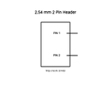
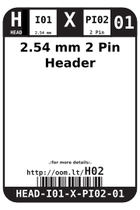
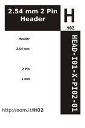

Contents
========

* [H02 > 2.54 mm 2 Pin Header](#h02--254-mm-2-pin-header)
	* [Diagrams](#diagrams)
	* [Datasheets](#datasheets)
	* [Labels](#labels)
	* [EDA](#eda)
	* [Images](#images)
	* [Tags](#tags)
  
![][im]
# H02 > 2.54 mm 2 Pin Header

- ID: HEAD-I01-X-PI02-01
- Hex ID: H02
- Name: 2.54 mm 2 Pin Header
- Description: 2.54 mm 2 Pin Header
- Long Link: [http://oom.lt/HEAD-I01-X-PI02-01](http://oom.lt/HEAD-I01-X-PI02-01)
- Short Link: [http://oom.lt/H02](http://oom.lt/H02)

## Diagrams
  
  

|diagBBLS|diagDIAG|diagIDEN|diagSCHEM|diagSIMP|
| :---: | :---: | :---: | :---: | :---: |
||||||

## Datasheets

- Datasheet: [datasheet.pdf](datasheet.pdf)

## Labels
  
  

|label-front|label-inventory|label-spec|
| :---: | :---: | :---: |
||||

## EDA

### Footprints
  

|[  FOOTPRINT-eagle-SparkFun-Eagle-Libraries-Sparkfun-Connectors-1X02](https://github.com/oomlout/oomlout_OOMP_eda/tree/main/FOOTPRINT/eagle/SparkFun-Eagle-Libraries/Sparkfun-Connectors/1X02/)|[  FOOTPRINT-eagle-SparkFun-Eagle-Libraries-Sparkfun-Connectors-1X02_BIG](https://github.com/oomlout/oomlout_OOMP_eda/tree/main/FOOTPRINT/eagle/SparkFun-Eagle-Libraries/Sparkfun-Connectors/1X02_BIG/)|[  FOOTPRINT-eagle-SparkFun-Eagle-Libraries-Sparkfun-Connectors-1X02_LOCK](https://github.com/oomlout/oomlout_OOMP_eda/tree/main/FOOTPRINT/eagle/SparkFun-Eagle-Libraries/Sparkfun-Connectors/1X02_LOCK/)|[  FOOTPRINT-eagle-SparkFun-Eagle-Libraries-Sparkfun-Connectors-1X02_LOCK_LONGPADS](https://github.com/oomlout/oomlout_OOMP_eda/tree/main/FOOTPRINT/eagle/SparkFun-Eagle-Libraries/Sparkfun-Connectors/1X02_LOCK_LONGPADS/)|
| :---: | :---: | :---: | :---: |
|[  FOOTPRINT-eagle-SparkFun-Eagle-Libraries-Sparkfun-Connectors-1X02_NO_SILK](https://github.com/oomlout/oomlout_OOMP_eda/tree/main/FOOTPRINT/eagle/SparkFun-Eagle-Libraries/Sparkfun-Connectors/1X02_NO_SILK/)|[  FOOTPRINT-eagle-SparkFun-Eagle-Libraries-Sparkfun-Connectors-1X02_PP_HOLES_ONLY](https://github.com/oomlout/oomlout_OOMP_eda/tree/main/FOOTPRINT/eagle/SparkFun-Eagle-Libraries/Sparkfun-Connectors/1X02_PP_HOLES_ONLY/)|[  FOOTPRINT-kicad-kicad-footprints-Connector_PinHeader_2.54mm-PinHeader_1x02_P2.54mm_Vertical](https://github.com/oomlout/oomlout_OOMP_eda/tree/main/FOOTPRINT/kicad/kicad-footprints/Connector_PinHeader_2.54mm/PinHeader_1x02_P2.54mm_Vertical/)||

### Symbols
  

|[  SYMBOL-kicad-kicad-symbols-Connector-Conn_01x02_Male](https://github.com/oomlout/oomlout_OOMP_eda/tree/main/SYMBOL/kicad/kicad-symbols/Connector/Conn_01x02_Male/)|[  ----](https://github.com/oomlout/oomlout_OOMP_parts/tree/main/----/)|||
| :---: | :---: | :---: | :---: |
  

### Instances
  
Used 317 times.  
Prevalance: (317\10986) 2.8855%  

|OOMP Instances|
| :---: |
|[PROJ-ADAF-1430-STAN-01  Adafruit NeoPixel Shield PCB  Used 1 times. JP1](https://github.com/oomlout/oomlout_OOMP_projects/tree/main/PROJ-ADAF-1430-STAN-01/)|
|[PROJ-ADAF-1571-STAN-01  Adafruit STMPE610 Breakout PCB  Used 2 times. JP4, JP5](https://github.com/oomlout/oomlout_OOMP_projects/tree/main/PROJ-ADAF-1571-STAN-01/)|
|[PROJ-ADAF-1788-STAN-01  Adafruit Music Maker MP3 Shield PCB  Used 1 times. JP3](https://github.com/oomlout/oomlout_OOMP_projects/tree/main/PROJ-ADAF-1788-STAN-01/)|
|[PROJ-ADAF-1916-STAN-01  Adafruit Cupcade Adapter PCB  Used 5 times. BUTTON_A, BUTTON_B, BUTTON_CREDIT, BUTTON_START, SPEAKER](https://github.com/oomlout/oomlout_OOMP_projects/tree/main/PROJ-ADAF-1916-STAN-01/)|
|[PROJ-ADAF-1944-STAN-01  Adafruit PowerBoost 500 Charger PCB  Used 1 times. JP2](https://github.com/oomlout/oomlout_OOMP_projects/tree/main/PROJ-ADAF-1944-STAN-01/)|
|[PROJ-ADAF-1963-STAN-01  Adafruit FONA 800 GSM Breakout PCB  Used 2 times. JP2, JP3](https://github.com/oomlout/oomlout_OOMP_projects/tree/main/PROJ-ADAF-1963-STAN-01/)|
|[PROJ-ADAF-2000-STAN-01  Adafruit Pro Trinket PCBs  Used 1 times. JP2](https://github.com/oomlout/oomlout_OOMP_projects/tree/main/PROJ-ADAF-2000-STAN-01/)|
|[PROJ-ADAF-2218-STAN-01  Adafruit TFP401 HDMI To 40Pin TFT PCB  Used 3 times. JP1, JP2, JP6](https://github.com/oomlout/oomlout_OOMP_projects/tree/main/PROJ-ADAF-2218-STAN-01/)|
|[PROJ-ADAF-2468-STAN-01  Adafruit FONA 800 Shield PCB  Used 4 times. JP1, JP2, JP3, JP9](https://github.com/oomlout/oomlout_OOMP_projects/tree/main/PROJ-ADAF-2468-STAN-01/)|
|[PROJ-ADAF-2542-STAN-01  Adafruit FONA 808 Breakout PCB  Used 1 times. JP3](https://github.com/oomlout/oomlout_OOMP_projects/tree/main/PROJ-ADAF-2542-STAN-01/)|
|[PROJ-ADAF-259-STAN-01  Adafruit_MCP73833_PCB  Used 4 times. JP1, JP3, JP5, JP6](https://github.com/oomlout/oomlout_OOMP_projects/tree/main/PROJ-ADAF-259-STAN-01/)|
|[PROJ-ADAF-2636-STAN-01  Adafruit FONA808 Shield PCB  Used 3 times. JP1, JP2, JP3](https://github.com/oomlout/oomlout_OOMP_projects/tree/main/PROJ-ADAF-2636-STAN-01/)|
|[PROJ-ADAF-3133-STAN-01  Adafruit Ultimate GPS FeatherWing PCB  Used 1 times. JP3](https://github.com/oomlout/oomlout_OOMP_projects/tree/main/PROJ-ADAF-3133-STAN-01/)|
|[PROJ-ADAF-3229-STAN-01  Adafruit Radio FeatherWing PCB  Used 1 times. JP6](https://github.com/oomlout/oomlout_OOMP_projects/tree/main/PROJ-ADAF-3229-STAN-01/)|
|[PROJ-ADAF-3297-STAN-01  Adafruit DRV8833 Motor Driver Breakout PCB  Used 3 times. JP2, JP3, JP4](https://github.com/oomlout/oomlout_OOMP_projects/tree/main/PROJ-ADAF-3297-STAN-01/)|
|[PROJ-ADAF-3357-STAN-01  Adafruit Music Maker FeatherWing PCB  Used 2 times. JP2, JP4](https://github.com/oomlout/oomlout_OOMP_projects/tree/main/PROJ-ADAF-3357-STAN-01/)|
|[PROJ-ADAF-3422-STAN-01  Adafruit Arcade Bonnet PCB  Used 6 times. JP4, JP6, JP7, JP8, JP9, JP10](https://github.com/oomlout/oomlout_OOMP_projects/tree/main/PROJ-ADAF-3422-STAN-01/)|
|[PROJ-ADAF-3695-STAN-01  Adafruit DragonTail for micro bit PCB  Used 1 times. JP4](https://github.com/oomlout/oomlout_OOMP_projects/tree/main/PROJ-ADAF-3695-STAN-01/)|
|[PROJ-ADAF-3779-STAN-01  Adafruit AS7262 Breakout PCB  Used 1 times. EXT_LED](https://github.com/oomlout/oomlout_OOMP_projects/tree/main/PROJ-ADAF-3779-STAN-01/)|
|[PROJ-ADAF-390-STAN-01  USB DC Solar Lithium Ion Polymer charger  Used 4 times. JP1, JP2, JP3, JP4](https://github.com/oomlout/oomlout_OOMP_projects/tree/main/PROJ-ADAF-390-STAN-01/)|
|[PROJ-ADAF-3988-STAN-01  Adafruit Prop Maker FeatherWing PCB  Used 2 times. EN_PINS, JP2](https://github.com/oomlout/oomlout_OOMP_projects/tree/main/PROJ-ADAF-3988-STAN-01/)|
|[PROJ-ADAF-4037-STAN-01  Adafruit I2S Audio Bonnet for Raspberry Pi PCB  Used 4 times. JP1, JP3, JP5, JP6](https://github.com/oomlout/oomlout_OOMP_projects/tree/main/PROJ-ADAF-4037-STAN-01/)|
|[PROJ-ADAF-4132-STAN-01  Adafruit GPIO Expander Bonnet PCBs  Used 6 times. JP1, JP3, JP5, JP6, JP8, JP9](https://github.com/oomlout/oomlout_OOMP_projects/tree/main/PROJ-ADAF-4132-STAN-01/)|
|[PROJ-ADAF-4282-STAN-01  Adafruit PiRTC DS3231 PCB  Used 1 times. JP1](https://github.com/oomlout/oomlout_OOMP_projects/tree/main/PROJ-ADAF-4282-STAN-01/)|
|[PROJ-ADAF-4775-STAN-01  Adafruit Metro ESP32 S2 PCB  Used 1 times. JP2](https://github.com/oomlout/oomlout_OOMP_projects/tree/main/PROJ-ADAF-4775-STAN-01/)|
|[PROJ-ADAF-4800-STAN-01  Adafruit_MagTag_PCBs  Used 1 times. JP2](https://github.com/oomlout/oomlout_OOMP_projects/tree/main/PROJ-ADAF-4800-STAN-01/)|
|[PROJ-ADAF-4978-STAN-01  Adafruit NeoKey Breakout PCB  Used 2 times. JP2, JP4](https://github.com/oomlout/oomlout_OOMP_projects/tree/main/PROJ-ADAF-4978-STAN-01/)|
|[PROJ-ADAF-5423-STAN-01  Adafruit TSC2007 PCB  Used 2 times. JP4, JP5](https://github.com/oomlout/oomlout_OOMP_projects/tree/main/PROJ-ADAF-5423-STAN-01/)|
|[PROJ-ADAF-904-STAN-01  Adafruit INA219 Current Sensor PCB  Used 1 times. JP2](https://github.com/oomlout/oomlout_OOMP_projects/tree/main/PROJ-ADAF-904-STAN-01/)|
|[PROJ-SPAR-10116-STAN-01  Arduino Fio  Used 3 times. JP2, JP6, JP7](https://github.com/oomlout/oomlout_OOMP_projects/tree/main/PROJ-SPAR-10116-STAN-01/)|
|[PROJ-SPAR-10154-STAN-01  RF Transceiver Breakout-RFM22B  Used 2 times. JP0, JP5](https://github.com/oomlout/oomlout_OOMP_projects/tree/main/PROJ-SPAR-10154-STAN-01/)|
|[PROJ-SPAR-10182-STAN-01  Monster Moto Shield  Used 3 times. JP1, JP2, JP3](https://github.com/oomlout/oomlout_OOMP_projects/tree/main/PROJ-SPAR-10182-STAN-01/)|
|[PROJ-SPAR-10217-STAN-01  Lipo Charger Basic-microUSB  Used 1 times. JP8](https://github.com/oomlout/oomlout_OOMP_projects/tree/main/PROJ-SPAR-10217-STAN-01/)|
|[PROJ-SPAR-10255-STAN-01  LiPower Boost Converter  Used 2 times. JP1, JP7](https://github.com/oomlout/oomlout_OOMP_projects/tree/main/PROJ-SPAR-10255-STAN-01/)|
|[PROJ-SPAR-10401-STAN-01  Lipo Charger Basic-miniUSB  Used 1 times. JP8](https://github.com/oomlout/oomlout_OOMP_projects/tree/main/PROJ-SPAR-10401-STAN-01/)|
|[PROJ-SPAR-10495-STAN-01  Coin Cell Battery Holder Breakout-24.5mm  Used 1 times. J3](https://github.com/oomlout/oomlout_OOMP_projects/tree/main/PROJ-SPAR-10495-STAN-01/)|
|[PROJ-SPAR-10507-STAN-01  Quadstepper Motor Driver  Used 3 times. JP3, JP4, JP21](https://github.com/oomlout/oomlout_OOMP_projects/tree/main/PROJ-SPAR-10507-STAN-01/)|
|[PROJ-SPAR-10615-STAN-01  PWM Shield  Used 1 times. JP21](https://github.com/oomlout/oomlout_OOMP_projects/tree/main/PROJ-SPAR-10615-STAN-01/)|
|[PROJ-SPAR-10616-STAN-01  LED Driver Breakout-TLC5940  Used 2 times. JP19, JP20](https://github.com/oomlout/oomlout_OOMP_projects/tree/main/PROJ-SPAR-10616-STAN-01/)|
|[PROJ-SPAR-10617-STAN-01  Lipo Fuel Gauge  Used 1 times. JP5](https://github.com/oomlout/oomlout_OOMP_projects/tree/main/PROJ-SPAR-10617-STAN-01/)|
|[PROJ-SPAR-10653-STAN-01  Voice Recorder Breakout-ISD1932  Used 3 times. JP4, JP5, JP8](https://github.com/oomlout/oomlout_OOMP_projects/tree/main/PROJ-SPAR-10653-STAN-01/)|
|[PROJ-SPAR-10661-STAN-01  VoiceBox Shield  Used 1 times. JP3](https://github.com/oomlout/oomlout_OOMP_projects/tree/main/PROJ-SPAR-10661-STAN-01/)|
|[PROJ-SPAR-10743-STAN-01  Mega Pro Mini  Used 1 times. JP18](https://github.com/oomlout/oomlout_OOMP_projects/tree/main/PROJ-SPAR-10743-STAN-01/)|
|[PROJ-SPAR-10878-STAN-01  EL Escudo Dos  Used 10 times. JP1, JP2, JP3, JP4, JP5, JP6, JP7, JP8, JP12, JP13](https://github.com/oomlout/oomlout_OOMP_projects/tree/main/PROJ-SPAR-10878-STAN-01/)|
|[PROJ-SPAR-10889-STAN-01  ProtoSnap-Pro Mini  Used 2 times. JP2, JP9](https://github.com/oomlout/oomlout_OOMP_projects/tree/main/PROJ-SPAR-10889-STAN-01/)|
|[PROJ-SPAR-10914-STAN-01  Arduino Pro 328  Used 2 times. JP6, JP7](https://github.com/oomlout/oomlout_OOMP_projects/tree/main/PROJ-SPAR-10914-STAN-01/)|
|[PROJ-SPAR-10936-STAN-01  Bar Graph Breakout Kit  Used 1 times. JP3](https://github.com/oomlout/oomlout_OOMP_projects/tree/main/PROJ-SPAR-10936-STAN-01/)|
|[PROJ-SPAR-11007-STAN-01  Mega Pro  Used 2 times. JP5, JP6](https://github.com/oomlout/oomlout_OOMP_projects/tree/main/PROJ-SPAR-11007-STAN-01/)|
|[PROJ-SPAR-11013-STAN-01  LilyPad MP3 Player  Used 1 times. JP3](https://github.com/oomlout/oomlout_OOMP_projects/tree/main/PROJ-SPAR-11013-STAN-01/)|
|[PROJ-SPAR-11043-STAN-01  fabFM-Kit  Used 2 times. JP3, JP4](https://github.com/oomlout/oomlout_OOMP_projects/tree/main/PROJ-SPAR-11043-STAN-01/)|
|[PROJ-SPAR-11044-STAN-01  Mono Audio Amp Breakout-TPA2005D1  Used 2 times. JP2, JP3](https://github.com/oomlout/oomlout_OOMP_projects/tree/main/PROJ-SPAR-11044-STAN-01/)|
|[PROJ-SPAR-11087-STAN-01  Uh-Oh Battery Indicator  Used 2 times. JP3, JP4](https://github.com/oomlout/oomlout_OOMP_projects/tree/main/PROJ-SPAR-11087-STAN-01/)|
|[PROJ-SPAR-11113-STAN-01  Pro Mini Candy  Used 1 times. JP2](https://github.com/oomlout/oomlout_OOMP_projects/tree/main/PROJ-SPAR-11113-STAN-01/)|
|[PROJ-SPAR-11129-STAN-01  Si4707 Breakout  Used 1 times. J4](https://github.com/oomlout/oomlout_OOMP_projects/tree/main/PROJ-SPAR-11129-STAN-01/)|
|[PROJ-SPAR-11197-STAN-01  ATmega128RFA1 Dev  Used 3 times. JP1, JP5, JP7](https://github.com/oomlout/oomlout_OOMP_projects/tree/main/PROJ-SPAR-11197-STAN-01/)|
|[PROJ-SPAR-11214-STAN-01  MOSFET Power Controller  Used 2 times. JP2, JP5](https://github.com/oomlout/oomlout_OOMP_projects/tree/main/PROJ-SPAR-11214-STAN-01/)|
|[PROJ-SPAR-11323-STAN-01  EL Sequencer  Used 11 times. JP1, JP6, JP7, JP9, JP10, JP11, JP12, JP13, JP14, JP15, JP16](https://github.com/oomlout/oomlout_OOMP_projects/tree/main/PROJ-SPAR-11323-STAN-01/)|
|[PROJ-SPAR-114-STAN-01  Breadboard Power Supply 5V 3.3V  Used 1 times. JP5](https://github.com/oomlout/oomlout_OOMP_projects/tree/main/PROJ-SPAR-114-STAN-01/)|
|[PROJ-SPAR-11420-STAN-01  MiniGen  Used 1 times. JP2](https://github.com/oomlout/oomlout_OOMP_projects/tree/main/PROJ-SPAR-11420-STAN-01/)|
|[PROJ-SPAR-11447-STAN-01  Wake on shake  Used 1 times. JP5](https://github.com/oomlout/oomlout_OOMP_projects/tree/main/PROJ-SPAR-11447-STAN-01/)|
|[PROJ-SPAR-11520-STAN-01  Fio v3  Used 3 times. JP6, JP7, JP14](https://github.com/oomlout/oomlout_OOMP_projects/tree/main/PROJ-SPAR-11520-STAN-01/)|
|[PROJ-SPAR-11561-STAN-01  RaspiRobot  Used 4 times. JP3, JP4, JP5, JP6](https://github.com/oomlout/oomlout_OOMP_projects/tree/main/PROJ-SPAR-11561-STAN-01/)|
|[PROJ-SPAR-11622-STAN-01  RedBot with Optical Encoder  Used 3 times. JP14, JP15, JP16](https://github.com/oomlout/oomlout_OOMP_projects/tree/main/PROJ-SPAR-11622-STAN-01/)|
|[PROJ-SPAR-11629-STAN-01  Serial7SegmentDisplay  Used 4 times. JP2, JP6, JP7, JP8](https://github.com/oomlout/oomlout_OOMP_projects/tree/main/PROJ-SPAR-11629-STAN-01/)|
|[PROJ-SPAR-11645-STAN-01  OpenSegment  Used 4 times. JP9, JP10, JP12, JP13](https://github.com/oomlout/oomlout_OOMP_projects/tree/main/PROJ-SPAR-11645-STAN-01/)|
|[PROJ-SPAR-11703-STAN-01  UDB5  Used 6 times. JP1, JP4, JP10, JP13, JP14, JP17](https://github.com/oomlout/oomlout_OOMP_projects/tree/main/PROJ-SPAR-11703-STAN-01/)|
|[PROJ-SPAR-11850-STAN-01  PicoBuck  Used 2 times. JP3, JP4](https://github.com/oomlout/oomlout_OOMP_projects/tree/main/PROJ-SPAR-11850-STAN-01/)|
|[PROJ-SPAR-11890-STAN-01  MiniMoto  Used 3 times. J1, J3, J5](https://github.com/oomlout/oomlout_OOMP_projects/tree/main/PROJ-SPAR-11890-STAN-01/)|
|[PROJ-SPAR-11924-STAN-01  Purpletooth Jamboree  Used 8 times. JP3, JP4, JP5, JP7, JP8, JP9, JP21, JP22](https://github.com/oomlout/oomlout_OOMP_projects/tree/main/PROJ-SPAR-11924-STAN-01/)|
|[PROJ-SPAR-11927-STAN-01  BC127 Breakout Board  Used 1 times. JP6](https://github.com/oomlout/oomlout_OOMP_projects/tree/main/PROJ-SPAR-11927-STAN-01/)|
|[PROJ-SPAR-12000-STAN-01  WAV Trigger  Used 2 times. J5, J9](https://github.com/oomlout/oomlout_OOMP_projects/tree/main/PROJ-SPAR-12000-STAN-01/)|
|[PROJ-SPAR-12052-STAN-01  LTC4150 Coulomb Counter BOB  Used 2 times. JP2, JP3](https://github.com/oomlout/oomlout_OOMP_projects/tree/main/PROJ-SPAR-12052-STAN-01/)|
|[PROJ-SPAR-12069-STAN-01  H2OhNo  Used 1 times. JP3](https://github.com/oomlout/oomlout_OOMP_projects/tree/main/PROJ-SPAR-12069-STAN-01/)|
|[PROJ-SPAR-12081-STAN-01  USB Weather Board  Used 2 times. JP2, JP8](https://github.com/oomlout/oomlout_OOMP_projects/tree/main/PROJ-SPAR-12081-STAN-01/)|
|[PROJ-SPAR-12082-STAN-01  AD5330 Breakout  Used 2 times. JP8, JP9](https://github.com/oomlout/oomlout_OOMP_projects/tree/main/PROJ-SPAR-12082-STAN-01/)|
|[PROJ-SPAR-12699-STAN-01  Solderable Breadboard Large  Used 6 times. JG1, JG2, JG3, JG4, JG5, JG6](https://github.com/oomlout/oomlout_OOMP_projects/tree/main/PROJ-SPAR-12699-STAN-01/)|
|[PROJ-SPAR-12707-STAN-01  Sparkpunk Sequencer  Used 9 times. JP200, JP300, JP400, JP500, JP600, JP700, JP800, JP900, JP1000](https://github.com/oomlout/oomlout_OOMP_projects/tree/main/PROJ-SPAR-12707-STAN-01/)|
|[PROJ-SPAR-12711-STAN-01  USB LiPolyCharger SingleCell  Used 2 times. JP1, JP2](https://github.com/oomlout/oomlout_OOMP_projects/tree/main/PROJ-SPAR-12711-STAN-01/)|
|[PROJ-SPAR-12773-STAN-01  CryptoCape  Used 6 times. JP3, JP4, JP7, JP8, JP13, JP14](https://github.com/oomlout/oomlout_OOMP_projects/tree/main/PROJ-SPAR-12773-STAN-01/)|
|[PROJ-SPAR-12775-STAN-01  RFM69HCW Breakout  Used 1 times. JP1](https://github.com/oomlout/oomlout_OOMP_projects/tree/main/PROJ-SPAR-12775-STAN-01/)|
|[PROJ-SPAR-12779-STAN-01  Easy Driver  Used 5 times. JP1, JP4, JP5, JP6, JP7](https://github.com/oomlout/oomlout_OOMP_projects/tree/main/PROJ-SPAR-12779-STAN-01/)|
|[PROJ-SPAR-12858-STAN-01  Vernier Interface Shield  Used 1 times. JP11](https://github.com/oomlout/oomlout_OOMP_projects/tree/main/PROJ-SPAR-12858-STAN-01/)|
|[PROJ-SPAR-12859-STAN-01  Big Easy Driver  Used 2 times. JP1, JP6](https://github.com/oomlout/oomlout_OOMP_projects/tree/main/PROJ-SPAR-12859-STAN-01/)|
|[PROJ-SPAR-12885-STAN-01  SunnyBuddy  Used 2 times. J5, JP4](https://github.com/oomlout/oomlout_OOMP_projects/tree/main/PROJ-SPAR-12885-STAN-01/)|
|[PROJ-SPAR-12886-STAN-01  Electric Imp Breakout  Used 2 times. JP2, JP3](https://github.com/oomlout/oomlout_OOMP_projects/tree/main/PROJ-SPAR-12886-STAN-01/)|
|[PROJ-SPAR-12887-STAN-01  Electric Imp Shield  Used 2 times. JP1, JP2](https://github.com/oomlout/oomlout_OOMP_projects/tree/main/PROJ-SPAR-12887-STAN-01/)|
|[PROJ-SPAR-12918-STAN-01  MCP4725 Breakout  Used 1 times. JP6](https://github.com/oomlout/oomlout_OOMP_projects/tree/main/PROJ-SPAR-12918-STAN-01/)|
|[PROJ-SPAR-12935-STAN-01  FTDI SmartBasic  Used 1 times. JP2](https://github.com/oomlout/oomlout_OOMP_projects/tree/main/PROJ-SPAR-12935-STAN-01/)|
|[PROJ-SPAR-12958-STAN-01  Electric Imp imp002 Breakout  Used 2 times. JP2, JP4](https://github.com/oomlout/oomlout_OOMP_projects/tree/main/PROJ-SPAR-12958-STAN-01/)|
|[PROJ-SPAR-12959-STAN-01  MOSFET Power Control Kit  Used 1 times. JP3](https://github.com/oomlout/oomlout_OOMP_projects/tree/main/PROJ-SPAR-12959-STAN-01/)|
|[PROJ-SPAR-13032-STAN-01  Breadboard Power Supply Stick 5V-3.3V  Used 1 times. JP5](https://github.com/oomlout/oomlout_OOMP_projects/tree/main/PROJ-SPAR-13032-STAN-01/)|
|[PROJ-SPAR-13035-STAN-01  Edison OLED Block  Used 1 times. JP1](https://github.com/oomlout/oomlout_OOMP_projects/tree/main/PROJ-SPAR-13035-STAN-01/)|
|[PROJ-SPAR-13036-STAN-01  Edison Arduino Block  Used 2 times. JP4, JP5](https://github.com/oomlout/oomlout_OOMP_projects/tree/main/PROJ-SPAR-13036-STAN-01/)|
|[PROJ-SPAR-13037-STAN-01  Edison Battery Block  Used 1 times. JP3](https://github.com/oomlout/oomlout_OOMP_projects/tree/main/PROJ-SPAR-13037-STAN-01/)|
|[PROJ-SPAR-13042-STAN-01  Edison PWM Block  Used 1 times. JP9](https://github.com/oomlout/oomlout_OOMP_projects/tree/main/PROJ-SPAR-13042-STAN-01/)|
|[PROJ-SPAR-13058-STAN-01  MiP ProMini-Pack  Used 2 times. JP2, JP3](https://github.com/oomlout/oomlout_OOMP_projects/tree/main/PROJ-SPAR-13058-STAN-01/)|
|[PROJ-SPAR-13116-STAN-01  Spectrum Shield  Used 1 times. JP2](https://github.com/oomlout/oomlout_OOMP_projects/tree/main/PROJ-SPAR-13116-STAN-01/)|
|[PROJ-SPAR-13118-STAN-01  Servo Trigger  Used 3 times. JP1, JP3, JP4](https://github.com/oomlout/oomlout_OOMP_projects/tree/main/PROJ-SPAR-13118-STAN-01/)|
|[PROJ-SPAR-13120-STAN-01  MG2639 Cellular Shield  Used 2 times. JP2, JP7](https://github.com/oomlout/oomlout_OOMP_projects/tree/main/PROJ-SPAR-13120-STAN-01/)|
|[PROJ-SPAR-13124-STAN-01  Proto Pedal  Used 5 times. JP3, JP14, JP15, JP16, JP19](https://github.com/oomlout/oomlout_OOMP_projects/tree/main/PROJ-SPAR-13124-STAN-01/)|
|[PROJ-SPAR-13157-STAN-01  Breadboard Power Supply Stick 3.3V-1.8V  Used 1 times. JP5](https://github.com/oomlout/oomlout_OOMP_projects/tree/main/PROJ-SPAR-13157-STAN-01/)|
|[PROJ-SPAR-13158-STAN-01  LiPower-Shield  Used 2 times. JP1, JP4](https://github.com/oomlout/oomlout_OOMP_projects/tree/main/PROJ-SPAR-13158-STAN-01/)|
|[PROJ-SPAR-13230-STAN-01  HX711-Load-Cell-Amplifier  Used 1 times. JP2](https://github.com/oomlout/oomlout_OOMP_projects/tree/main/PROJ-SPAR-13230-STAN-01/)|
|[PROJ-SPAR-13261-STAN-01  OpenScale  Used 1 times. JP2](https://github.com/oomlout/oomlout_OOMP_projects/tree/main/PROJ-SPAR-13261-STAN-01/)|
|[PROJ-SPAR-13288-STAN-01  Teensy Arduino Shield Adapter  Used 3 times. JP1, JP6, JP7](https://github.com/oomlout/oomlout_OOMP_projects/tree/main/PROJ-SPAR-13288-STAN-01/)|
|[PROJ-SPAR-13664-STAN-01  SAMD21 Mini Breakout  Used 1 times. JP4](https://github.com/oomlout/oomlout_OOMP_projects/tree/main/PROJ-SPAR-13664-STAN-01/)|
|[PROJ-SPAR-13672-STAN-01  SAMD21 Dev Breakout  Used 2 times. JP1, JP9](https://github.com/oomlout/oomlout_OOMP_projects/tree/main/PROJ-SPAR-13672-STAN-01/)|
|[PROJ-SPAR-13679-STAN-01  Current Sensor Breakout-ACS723  Used 1 times. J3](https://github.com/oomlout/oomlout_OOMP_projects/tree/main/PROJ-SPAR-13679-STAN-01/)|
|[PROJ-SPAR-13688-STAN-01  MyoWare LED Shield  Used 1 times. JP3](https://github.com/oomlout/oomlout_OOMP_projects/tree/main/PROJ-SPAR-13688-STAN-01/)|
|[PROJ-SPAR-13711-STAN-01  ESP8266 Thing Dev 4H  Used 1 times. JP5](https://github.com/oomlout/oomlout_OOMP_projects/tree/main/PROJ-SPAR-13711-STAN-01/)|
|[PROJ-SPAR-13716-STAN-01  FemtoBuck  Used 1 times. JP2](https://github.com/oomlout/oomlout_OOMP_projects/tree/main/PROJ-SPAR-13716-STAN-01/)|
|[PROJ-SPAR-13720-STAN-01  MP3 Trigger  Used 1 times. JP5](https://github.com/oomlout/oomlout_OOMP_projects/tree/main/PROJ-SPAR-13720-STAN-01/)|
|[PROJ-SPAR-13741-STAN-01  RedStick  Used 2 times. JP5, JP6](https://github.com/oomlout/oomlout_OOMP_projects/tree/main/PROJ-SPAR-13741-STAN-01/)|
|[PROJ-SPAR-13750-STAN-01  GPS Shield  Used 1 times. JP15](https://github.com/oomlout/oomlout_OOMP_projects/tree/main/PROJ-SPAR-13750-STAN-01/)|
|[PROJ-SPAR-13777-STAN-01  Battery Babysitter  Used 5 times. JP2, JP4, JP5, JP8, JP11](https://github.com/oomlout/oomlout_OOMP_projects/tree/main/PROJ-SPAR-13777-STAN-01/)|
|[PROJ-SPAR-13810-STAN-01  tsunami  Used 2 times. J1, J2](https://github.com/oomlout/oomlout_OOMP_projects/tree/main/PROJ-SPAR-13810-STAN-01/)|
|[PROJ-SPAR-13830-STAN-01  USB UART Serial Breakout-CY7C65213  Used 1 times. J2](https://github.com/oomlout/oomlout_OOMP_projects/tree/main/PROJ-SPAR-13830-STAN-01/)|
|[PROJ-SPAR-13956-STAN-01  Weather Shield  Used 1 times. JP2](https://github.com/oomlout/oomlout_OOMP_projects/tree/main/PROJ-SPAR-13956-STAN-01/)|
|[PROJ-SPAR-13990-STAN-01  nRF52832 Breakout  Used 1 times. J2](https://github.com/oomlout/oomlout_OOMP_projects/tree/main/PROJ-SPAR-13990-STAN-01/)|
|[PROJ-SPAR-14001-STAN-01  9DOF Razor IMU  Used 1 times. J6](https://github.com/oomlout/oomlout_OOMP_projects/tree/main/PROJ-SPAR-14001-STAN-01/)|
|[PROJ-SPAR-14030-STAN-01  Mini GPS Shield  Used 1 times. J5](https://github.com/oomlout/oomlout_OOMP_projects/tree/main/PROJ-SPAR-14030-STAN-01/)|
|[PROJ-SPAR-14051-STAN-01  Wireless Joystick  Used 1 times. J6](https://github.com/oomlout/oomlout_OOMP_projects/tree/main/PROJ-SPAR-14051-STAN-01/)|
|[PROJ-SPAR-14129-STAN-01  Ardumoto-Motor Driver Shield  Used 4 times. J9, J15, JP9, JP10](https://github.com/oomlout/oomlout_OOMP_projects/tree/main/PROJ-SPAR-14129-STAN-01/)|
|[PROJ-SPAR-14130-STAN-01  Roshamglo  Used 1 times. J1](https://github.com/oomlout/oomlout_OOMP_projects/tree/main/PROJ-SPAR-14130-STAN-01/)|
|[PROJ-SPAR-14285-STAN-01  Wireless Motor Driver Shield  Used 1 times. J3](https://github.com/oomlout/oomlout_OOMP_projects/tree/main/PROJ-SPAR-14285-STAN-01/)|
|[PROJ-SPAR-14347-STAN-01  Qwiic Spectral Sensor AS726X  Used 1 times. J3](https://github.com/oomlout/oomlout_OOMP_projects/tree/main/PROJ-SPAR-14347-STAN-01/)|
|[PROJ-SPAR-14380-STAN-01  Adjustable Lipo Charger  Used 2 times. J2, J4](https://github.com/oomlout/oomlout_OOMP_projects/tree/main/PROJ-SPAR-14380-STAN-01/)|
|[PROJ-SPAR-14411-STAN-01  LiPo Charger Booster 5V 1A  Used 4 times. J2, J3, J5, J7](https://github.com/oomlout/oomlout_OOMP_projects/tree/main/PROJ-SPAR-14411-STAN-01/)|
|[PROJ-SPAR-14449-STAN-01  Variable Load  Used 1 times. J6](https://github.com/oomlout/oomlout_OOMP_projects/tree/main/PROJ-SPAR-14449-STAN-01/)|
|[PROJ-SPAR-14459-STAN-01  Qwiic Hat for Raspberry Pi  Used 2 times. J2, J12](https://github.com/oomlout/oomlout_OOMP_projects/tree/main/PROJ-SPAR-14459-STAN-01/)|
|[PROJ-SPAR-14538-STAN-01  Haptic Motor Driver  Used 1 times. JP2](https://github.com/oomlout/oomlout_OOMP_projects/tree/main/PROJ-SPAR-14538-STAN-01/)|
|[PROJ-SPAR-14544-STAN-01  Current Sensor Breakout-ACS723-Low Current  Used 1 times. J3](https://github.com/oomlout/oomlout_OOMP_projects/tree/main/PROJ-SPAR-14544-STAN-01/)|
|[PROJ-SPAR-14554-STAN-01  Papa Soundie Audio Player  Used 6 times. J3, J5, J8, J9, J10, J11](https://github.com/oomlout/oomlout_OOMP_projects/tree/main/PROJ-SPAR-14554-STAN-01/)|
|[PROJ-SPAR-14587-STAN-01  Qwiic Accelerometer MMA8452Q  Used 1 times. J1](https://github.com/oomlout/oomlout_OOMP_projects/tree/main/PROJ-SPAR-14587-STAN-01/)|
|[PROJ-SPAR-14589-STAN-01  SparkFun Differential I2C Breakout PCA9615 Qwiic  Used 1 times. J4](https://github.com/oomlout/oomlout_OOMP_projects/tree/main/PROJ-SPAR-14589-STAN-01/)|
|[PROJ-SPAR-14666-STAN-01  Qwiic Flex Glove Controller  Used 2 times. J3, J4](https://github.com/oomlout/oomlout_OOMP_projects/tree/main/PROJ-SPAR-14666-STAN-01/)|
|[PROJ-SPAR-14686-STAN-01  Qwiic IMU BNO080  Used 2 times. J7, J8](https://github.com/oomlout/oomlout_OOMP_projects/tree/main/PROJ-SPAR-14686-STAN-01/)|
|[PROJ-SPAR-14765-STAN-01  Single Supply Logic Level Converter  Used 1 times. JP7](https://github.com/oomlout/oomlout_OOMP_projects/tree/main/PROJ-SPAR-14765-STAN-01/)|
|[PROJ-SPAR-14779-STAN-01  LumiDrive  Used 3 times. J1, J3, J4](https://github.com/oomlout/oomlout_OOMP_projects/tree/main/PROJ-SPAR-14779-STAN-01/)|
|[PROJ-SPAR-14916-STAN-01  SAMD21 Pro RF  Used 3 times. J7, J8, J9](https://github.com/oomlout/oomlout_OOMP_projects/tree/main/PROJ-SPAR-14916-STAN-01/)|
|[PROJ-SPAR-14997-STAN-01  LTE Cat M1 Shield  Used 2 times. J10, J11](https://github.com/oomlout/oomlout_OOMP_projects/tree/main/PROJ-SPAR-14997-STAN-01/)|

## Images
  
  

|image|image_RE|diagBBLS|diagDIAG|diagIDEN|diagSCHEM|diagSIMP|label-front|label-inventory|label-spec|
| :---: | :---: | :---: | :---: | :---: | :---: | :---: | :---: | :---: | :---: |
|||||||||||

## Tags

- oompType: HEAD
- oompSize: I01
- oompColor: X
- oompDesc: PI02
- oompIndex: 01
- hexID: H02
- oompSort: 
- oompClass: Through Hole
- oompClassCode: THTH
- ooPitch: 2.54
- ooPinHeight: 11.60
- ooPinWidth: 0.64
- ooPinOffset: 1.53
- oompBbls: variable;pins;2
- oompBbls: template;XXXX-I01-X-XX-01-bbls
- oompDiag: variable;pins;2
- oompDiag: template;HEAD-I01-X-XX-01-diag
- oompIden: variable;pins;2
- oompIden: template;XXXX-I01-X-XX-01-iden
- oompSchem: variable;pins;2
- oompSchem: template;XXXX-XX-X-XX-01-PINS-EVEN-schem
- oompSimp: variable;pins;2
- oompSimp: template;XXXX-I01-X-XX-01-simp
- ooNumPins: 2
- ooDesignator: J1
- schematicSymbol: HEAD-XX-X-PI02-XX
- oompID: HEAD-I01-X-PI02-01
- oompInstances: {'PROJECT': 'PROJ-ADAF-1430-STAN-01', 'ID': 'JP1'}
- oompInstances: {'PROJECT': 'PROJ-ADAF-1571-STAN-01', 'ID': 'JP4'}
- oompInstances: {'PROJECT': 'PROJ-ADAF-1571-STAN-01', 'ID': 'JP5'}
- oompInstances: {'PROJECT': 'PROJ-ADAF-1788-STAN-01', 'ID': 'JP3'}
- oompInstances: {'PROJECT': 'PROJ-ADAF-1916-STAN-01', 'ID': 'BUTTON_A'}
- oompInstances: {'PROJECT': 'PROJ-ADAF-1916-STAN-01', 'ID': 'BUTTON_B'}
- oompInstances: {'PROJECT': 'PROJ-ADAF-1916-STAN-01', 'ID': 'BUTTON_CREDIT'}
- oompInstances: {'PROJECT': 'PROJ-ADAF-1916-STAN-01', 'ID': 'BUTTON_START'}
- oompInstances: {'PROJECT': 'PROJ-ADAF-1916-STAN-01', 'ID': 'SPEAKER'}
- oompInstances: {'PROJECT': 'PROJ-ADAF-1944-STAN-01', 'ID': 'JP2'}
- oompInstances: {'PROJECT': 'PROJ-ADAF-1963-STAN-01', 'ID': 'JP2'}
- oompInstances: {'PROJECT': 'PROJ-ADAF-1963-STAN-01', 'ID': 'JP3'}
- oompInstances: {'PROJECT': 'PROJ-ADAF-2000-STAN-01', 'ID': 'JP2'}
- oompInstances: {'PROJECT': 'PROJ-ADAF-2218-STAN-01', 'ID': 'JP1'}
- oompInstances: {'PROJECT': 'PROJ-ADAF-2218-STAN-01', 'ID': 'JP2'}
- oompInstances: {'PROJECT': 'PROJ-ADAF-2218-STAN-01', 'ID': 'JP6'}
- oompInstances: {'PROJECT': 'PROJ-ADAF-2468-STAN-01', 'ID': 'JP1'}
- oompInstances: {'PROJECT': 'PROJ-ADAF-2468-STAN-01', 'ID': 'JP2'}
- oompInstances: {'PROJECT': 'PROJ-ADAF-2468-STAN-01', 'ID': 'JP3'}
- oompInstances: {'PROJECT': 'PROJ-ADAF-2468-STAN-01', 'ID': 'JP9'}
- oompInstances: {'PROJECT': 'PROJ-ADAF-2542-STAN-01', 'ID': 'JP3'}
- oompInstances: {'PROJECT': 'PROJ-ADAF-259-STAN-01', 'ID': 'JP1'}
- oompInstances: {'PROJECT': 'PROJ-ADAF-259-STAN-01', 'ID': 'JP3'}
- oompInstances: {'PROJECT': 'PROJ-ADAF-259-STAN-01', 'ID': 'JP5'}
- oompInstances: {'PROJECT': 'PROJ-ADAF-259-STAN-01', 'ID': 'JP6'}
- oompInstances: {'PROJECT': 'PROJ-ADAF-2636-STAN-01', 'ID': 'JP1'}
- oompInstances: {'PROJECT': 'PROJ-ADAF-2636-STAN-01', 'ID': 'JP2'}
- oompInstances: {'PROJECT': 'PROJ-ADAF-2636-STAN-01', 'ID': 'JP3'}
- oompInstances: {'PROJECT': 'PROJ-ADAF-3133-STAN-01', 'ID': 'JP3'}
- oompInstances: {'PROJECT': 'PROJ-ADAF-3229-STAN-01', 'ID': 'JP6'}
- oompInstances: {'PROJECT': 'PROJ-ADAF-3297-STAN-01', 'ID': 'JP2'}
- oompInstances: {'PROJECT': 'PROJ-ADAF-3297-STAN-01', 'ID': 'JP3'}
- oompInstances: {'PROJECT': 'PROJ-ADAF-3297-STAN-01', 'ID': 'JP4'}
- oompInstances: {'PROJECT': 'PROJ-ADAF-3357-STAN-01', 'ID': 'JP2'}
- oompInstances: {'PROJECT': 'PROJ-ADAF-3357-STAN-01', 'ID': 'JP4'}
- oompInstances: {'PROJECT': 'PROJ-ADAF-3422-STAN-01', 'ID': 'JP4'}
- oompInstances: {'PROJECT': 'PROJ-ADAF-3422-STAN-01', 'ID': 'JP6'}
- oompInstances: {'PROJECT': 'PROJ-ADAF-3422-STAN-01', 'ID': 'JP7'}
- oompInstances: {'PROJECT': 'PROJ-ADAF-3422-STAN-01', 'ID': 'JP8'}
- oompInstances: {'PROJECT': 'PROJ-ADAF-3422-STAN-01', 'ID': 'JP9'}
- oompInstances: {'PROJECT': 'PROJ-ADAF-3422-STAN-01', 'ID': 'JP10'}
- oompInstances: {'PROJECT': 'PROJ-ADAF-3695-STAN-01', 'ID': 'JP4'}
- oompInstances: {'PROJECT': 'PROJ-ADAF-3779-STAN-01', 'ID': 'EXT_LED'}
- oompInstances: {'PROJECT': 'PROJ-ADAF-390-STAN-01', 'ID': 'JP1'}
- oompInstances: {'PROJECT': 'PROJ-ADAF-390-STAN-01', 'ID': 'JP2'}
- oompInstances: {'PROJECT': 'PROJ-ADAF-390-STAN-01', 'ID': 'JP3'}
- oompInstances: {'PROJECT': 'PROJ-ADAF-390-STAN-01', 'ID': 'JP4'}
- oompInstances: {'PROJECT': 'PROJ-ADAF-3988-STAN-01', 'ID': 'EN_PINS'}
- oompInstances: {'PROJECT': 'PROJ-ADAF-3988-STAN-01', 'ID': 'JP2'}
- oompInstances: {'PROJECT': 'PROJ-ADAF-4037-STAN-01', 'ID': 'JP1'}
- oompInstances: {'PROJECT': 'PROJ-ADAF-4037-STAN-01', 'ID': 'JP3'}
- oompInstances: {'PROJECT': 'PROJ-ADAF-4037-STAN-01', 'ID': 'JP5'}
- oompInstances: {'PROJECT': 'PROJ-ADAF-4037-STAN-01', 'ID': 'JP6'}
- oompInstances: {'PROJECT': 'PROJ-ADAF-4132-STAN-01', 'ID': 'JP1'}
- oompInstances: {'PROJECT': 'PROJ-ADAF-4132-STAN-01', 'ID': 'JP3'}
- oompInstances: {'PROJECT': 'PROJ-ADAF-4132-STAN-01', 'ID': 'JP5'}
- oompInstances: {'PROJECT': 'PROJ-ADAF-4132-STAN-01', 'ID': 'JP6'}
- oompInstances: {'PROJECT': 'PROJ-ADAF-4132-STAN-01', 'ID': 'JP8'}
- oompInstances: {'PROJECT': 'PROJ-ADAF-4132-STAN-01', 'ID': 'JP9'}
- oompInstances: {'PROJECT': 'PROJ-ADAF-4282-STAN-01', 'ID': 'JP1'}
- oompInstances: {'PROJECT': 'PROJ-ADAF-4775-STAN-01', 'ID': 'JP2'}
- oompInstances: {'PROJECT': 'PROJ-ADAF-4800-STAN-01', 'ID': 'JP2'}
- oompInstances: {'PROJECT': 'PROJ-ADAF-4978-STAN-01', 'ID': 'JP2'}
- oompInstances: {'PROJECT': 'PROJ-ADAF-4978-STAN-01', 'ID': 'JP4'}
- oompInstances: {'PROJECT': 'PROJ-ADAF-5423-STAN-01', 'ID': 'JP4'}
- oompInstances: {'PROJECT': 'PROJ-ADAF-5423-STAN-01', 'ID': 'JP5'}
- oompInstances: {'PROJECT': 'PROJ-ADAF-904-STAN-01', 'ID': 'JP2'}
- oompInstances: {'PROJECT': 'PROJ-SPAR-10116-STAN-01', 'ID': 'JP2'}
- oompInstances: {'PROJECT': 'PROJ-SPAR-10116-STAN-01', 'ID': 'JP6'}
- oompInstances: {'PROJECT': 'PROJ-SPAR-10116-STAN-01', 'ID': 'JP7'}
- oompInstances: {'PROJECT': 'PROJ-SPAR-10154-STAN-01', 'ID': 'JP0'}
- oompInstances: {'PROJECT': 'PROJ-SPAR-10154-STAN-01', 'ID': 'JP5'}
- oompInstances: {'PROJECT': 'PROJ-SPAR-10182-STAN-01', 'ID': 'JP1'}
- oompInstances: {'PROJECT': 'PROJ-SPAR-10182-STAN-01', 'ID': 'JP2'}
- oompInstances: {'PROJECT': 'PROJ-SPAR-10182-STAN-01', 'ID': 'JP3'}
- oompInstances: {'PROJECT': 'PROJ-SPAR-10217-STAN-01', 'ID': 'JP8'}
- oompInstances: {'PROJECT': 'PROJ-SPAR-10255-STAN-01', 'ID': 'JP1'}
- oompInstances: {'PROJECT': 'PROJ-SPAR-10255-STAN-01', 'ID': 'JP7'}
- oompInstances: {'PROJECT': 'PROJ-SPAR-10401-STAN-01', 'ID': 'JP8'}
- oompInstances: {'PROJECT': 'PROJ-SPAR-10495-STAN-01', 'ID': 'J3'}
- oompInstances: {'PROJECT': 'PROJ-SPAR-10507-STAN-01', 'ID': 'JP3'}
- oompInstances: {'PROJECT': 'PROJ-SPAR-10507-STAN-01', 'ID': 'JP4'}
- oompInstances: {'PROJECT': 'PROJ-SPAR-10507-STAN-01', 'ID': 'JP21'}
- oompInstances: {'PROJECT': 'PROJ-SPAR-10615-STAN-01', 'ID': 'JP21'}
- oompInstances: {'PROJECT': 'PROJ-SPAR-10616-STAN-01', 'ID': 'JP19'}
- oompInstances: {'PROJECT': 'PROJ-SPAR-10616-STAN-01', 'ID': 'JP20'}
- oompInstances: {'PROJECT': 'PROJ-SPAR-10617-STAN-01', 'ID': 'JP5'}
- oompInstances: {'PROJECT': 'PROJ-SPAR-10653-STAN-01', 'ID': 'JP4'}
- oompInstances: {'PROJECT': 'PROJ-SPAR-10653-STAN-01', 'ID': 'JP5'}
- oompInstances: {'PROJECT': 'PROJ-SPAR-10653-STAN-01', 'ID': 'JP8'}
- oompInstances: {'PROJECT': 'PROJ-SPAR-10661-STAN-01', 'ID': 'JP3'}
- oompInstances: {'PROJECT': 'PROJ-SPAR-10743-STAN-01', 'ID': 'JP18'}
- oompInstances: {'PROJECT': 'PROJ-SPAR-10878-STAN-01', 'ID': 'JP1'}
- oompInstances: {'PROJECT': 'PROJ-SPAR-10878-STAN-01', 'ID': 'JP2'}
- oompInstances: {'PROJECT': 'PROJ-SPAR-10878-STAN-01', 'ID': 'JP3'}
- oompInstances: {'PROJECT': 'PROJ-SPAR-10878-STAN-01', 'ID': 'JP4'}
- oompInstances: {'PROJECT': 'PROJ-SPAR-10878-STAN-01', 'ID': 'JP5'}
- oompInstances: {'PROJECT': 'PROJ-SPAR-10878-STAN-01', 'ID': 'JP6'}
- oompInstances: {'PROJECT': 'PROJ-SPAR-10878-STAN-01', 'ID': 'JP7'}
- oompInstances: {'PROJECT': 'PROJ-SPAR-10878-STAN-01', 'ID': 'JP8'}
- oompInstances: {'PROJECT': 'PROJ-SPAR-10878-STAN-01', 'ID': 'JP12'}
- oompInstances: {'PROJECT': 'PROJ-SPAR-10878-STAN-01', 'ID': 'JP13'}
- oompInstances: {'PROJECT': 'PROJ-SPAR-10889-STAN-01', 'ID': 'JP2'}
- oompInstances: {'PROJECT': 'PROJ-SPAR-10889-STAN-01', 'ID': 'JP9'}
- oompInstances: {'PROJECT': 'PROJ-SPAR-10914-STAN-01', 'ID': 'JP6'}
- oompInstances: {'PROJECT': 'PROJ-SPAR-10914-STAN-01', 'ID': 'JP7'}
- oompInstances: {'PROJECT': 'PROJ-SPAR-10936-STAN-01', 'ID': 'JP3'}
- oompInstances: {'PROJECT': 'PROJ-SPAR-11007-STAN-01', 'ID': 'JP5'}
- oompInstances: {'PROJECT': 'PROJ-SPAR-11007-STAN-01', 'ID': 'JP6'}
- oompInstances: {'PROJECT': 'PROJ-SPAR-11013-STAN-01', 'ID': 'JP3'}
- oompInstances: {'PROJECT': 'PROJ-SPAR-11043-STAN-01', 'ID': 'JP3'}
- oompInstances: {'PROJECT': 'PROJ-SPAR-11043-STAN-01', 'ID': 'JP4'}
- oompInstances: {'PROJECT': 'PROJ-SPAR-11044-STAN-01', 'ID': 'JP2'}
- oompInstances: {'PROJECT': 'PROJ-SPAR-11044-STAN-01', 'ID': 'JP3'}
- oompInstances: {'PROJECT': 'PROJ-SPAR-11087-STAN-01', 'ID': 'JP3'}
- oompInstances: {'PROJECT': 'PROJ-SPAR-11087-STAN-01', 'ID': 'JP4'}
- oompInstances: {'PROJECT': 'PROJ-SPAR-11113-STAN-01', 'ID': 'JP2'}
- oompInstances: {'PROJECT': 'PROJ-SPAR-11129-STAN-01', 'ID': 'J4'}
- oompInstances: {'PROJECT': 'PROJ-SPAR-11197-STAN-01', 'ID': 'JP1'}
- oompInstances: {'PROJECT': 'PROJ-SPAR-11197-STAN-01', 'ID': 'JP5'}
- oompInstances: {'PROJECT': 'PROJ-SPAR-11197-STAN-01', 'ID': 'JP7'}
- oompInstances: {'PROJECT': 'PROJ-SPAR-11214-STAN-01', 'ID': 'JP2'}
- oompInstances: {'PROJECT': 'PROJ-SPAR-11214-STAN-01', 'ID': 'JP5'}
- oompInstances: {'PROJECT': 'PROJ-SPAR-11323-STAN-01', 'ID': 'JP1'}
- oompInstances: {'PROJECT': 'PROJ-SPAR-11323-STAN-01', 'ID': 'JP6'}
- oompInstances: {'PROJECT': 'PROJ-SPAR-11323-STAN-01', 'ID': 'JP7'}
- oompInstances: {'PROJECT': 'PROJ-SPAR-11323-STAN-01', 'ID': 'JP9'}
- oompInstances: {'PROJECT': 'PROJ-SPAR-11323-STAN-01', 'ID': 'JP10'}
- oompInstances: {'PROJECT': 'PROJ-SPAR-11323-STAN-01', 'ID': 'JP11'}
- oompInstances: {'PROJECT': 'PROJ-SPAR-11323-STAN-01', 'ID': 'JP12'}
- oompInstances: {'PROJECT': 'PROJ-SPAR-11323-STAN-01', 'ID': 'JP13'}
- oompInstances: {'PROJECT': 'PROJ-SPAR-11323-STAN-01', 'ID': 'JP14'}
- oompInstances: {'PROJECT': 'PROJ-SPAR-11323-STAN-01', 'ID': 'JP15'}
- oompInstances: {'PROJECT': 'PROJ-SPAR-11323-STAN-01', 'ID': 'JP16'}
- oompInstances: {'PROJECT': 'PROJ-SPAR-114-STAN-01', 'ID': 'JP5'}
- oompInstances: {'PROJECT': 'PROJ-SPAR-11420-STAN-01', 'ID': 'JP2'}
- oompInstances: {'PROJECT': 'PROJ-SPAR-11447-STAN-01', 'ID': 'JP5'}
- oompInstances: {'PROJECT': 'PROJ-SPAR-11520-STAN-01', 'ID': 'JP6'}
- oompInstances: {'PROJECT': 'PROJ-SPAR-11520-STAN-01', 'ID': 'JP7'}
- oompInstances: {'PROJECT': 'PROJ-SPAR-11520-STAN-01', 'ID': 'JP14'}
- oompInstances: {'PROJECT': 'PROJ-SPAR-11561-STAN-01', 'ID': 'JP3'}
- oompInstances: {'PROJECT': 'PROJ-SPAR-11561-STAN-01', 'ID': 'JP4'}
- oompInstances: {'PROJECT': 'PROJ-SPAR-11561-STAN-01', 'ID': 'JP5'}
- oompInstances: {'PROJECT': 'PROJ-SPAR-11561-STAN-01', 'ID': 'JP6'}
- oompInstances: {'PROJECT': 'PROJ-SPAR-11622-STAN-01', 'ID': 'JP14'}
- oompInstances: {'PROJECT': 'PROJ-SPAR-11622-STAN-01', 'ID': 'JP15'}
- oompInstances: {'PROJECT': 'PROJ-SPAR-11622-STAN-01', 'ID': 'JP16'}
- oompInstances: {'PROJECT': 'PROJ-SPAR-11629-STAN-01', 'ID': 'JP2'}
- oompInstances: {'PROJECT': 'PROJ-SPAR-11629-STAN-01', 'ID': 'JP6'}
- oompInstances: {'PROJECT': 'PROJ-SPAR-11629-STAN-01', 'ID': 'JP7'}
- oompInstances: {'PROJECT': 'PROJ-SPAR-11629-STAN-01', 'ID': 'JP8'}
- oompInstances: {'PROJECT': 'PROJ-SPAR-11645-STAN-01', 'ID': 'JP9'}
- oompInstances: {'PROJECT': 'PROJ-SPAR-11645-STAN-01', 'ID': 'JP10'}
- oompInstances: {'PROJECT': 'PROJ-SPAR-11645-STAN-01', 'ID': 'JP12'}
- oompInstances: {'PROJECT': 'PROJ-SPAR-11645-STAN-01', 'ID': 'JP13'}
- oompInstances: {'PROJECT': 'PROJ-SPAR-11703-STAN-01', 'ID': 'JP1'}
- oompInstances: {'PROJECT': 'PROJ-SPAR-11703-STAN-01', 'ID': 'JP4'}
- oompInstances: {'PROJECT': 'PROJ-SPAR-11703-STAN-01', 'ID': 'JP10'}
- oompInstances: {'PROJECT': 'PROJ-SPAR-11703-STAN-01', 'ID': 'JP13'}
- oompInstances: {'PROJECT': 'PROJ-SPAR-11703-STAN-01', 'ID': 'JP14'}
- oompInstances: {'PROJECT': 'PROJ-SPAR-11703-STAN-01', 'ID': 'JP17'}
- oompInstances: {'PROJECT': 'PROJ-SPAR-11850-STAN-01', 'ID': 'JP3'}
- oompInstances: {'PROJECT': 'PROJ-SPAR-11850-STAN-01', 'ID': 'JP4'}
- oompInstances: {'PROJECT': 'PROJ-SPAR-11890-STAN-01', 'ID': 'J1'}
- oompInstances: {'PROJECT': 'PROJ-SPAR-11890-STAN-01', 'ID': 'J3'}
- oompInstances: {'PROJECT': 'PROJ-SPAR-11890-STAN-01', 'ID': 'J5'}
- oompInstances: {'PROJECT': 'PROJ-SPAR-11924-STAN-01', 'ID': 'JP3'}
- oompInstances: {'PROJECT': 'PROJ-SPAR-11924-STAN-01', 'ID': 'JP4'}
- oompInstances: {'PROJECT': 'PROJ-SPAR-11924-STAN-01', 'ID': 'JP5'}
- oompInstances: {'PROJECT': 'PROJ-SPAR-11924-STAN-01', 'ID': 'JP7'}
- oompInstances: {'PROJECT': 'PROJ-SPAR-11924-STAN-01', 'ID': 'JP8'}
- oompInstances: {'PROJECT': 'PROJ-SPAR-11924-STAN-01', 'ID': 'JP9'}
- oompInstances: {'PROJECT': 'PROJ-SPAR-11924-STAN-01', 'ID': 'JP21'}
- oompInstances: {'PROJECT': 'PROJ-SPAR-11924-STAN-01', 'ID': 'JP22'}
- oompInstances: {'PROJECT': 'PROJ-SPAR-11927-STAN-01', 'ID': 'JP6'}
- oompInstances: {'PROJECT': 'PROJ-SPAR-12000-STAN-01', 'ID': 'J5'}
- oompInstances: {'PROJECT': 'PROJ-SPAR-12000-STAN-01', 'ID': 'J9'}
- oompInstances: {'PROJECT': 'PROJ-SPAR-12052-STAN-01', 'ID': 'JP2'}
- oompInstances: {'PROJECT': 'PROJ-SPAR-12052-STAN-01', 'ID': 'JP3'}
- oompInstances: {'PROJECT': 'PROJ-SPAR-12069-STAN-01', 'ID': 'JP3'}
- oompInstances: {'PROJECT': 'PROJ-SPAR-12081-STAN-01', 'ID': 'JP2'}
- oompInstances: {'PROJECT': 'PROJ-SPAR-12081-STAN-01', 'ID': 'JP8'}
- oompInstances: {'PROJECT': 'PROJ-SPAR-12082-STAN-01', 'ID': 'JP8'}
- oompInstances: {'PROJECT': 'PROJ-SPAR-12082-STAN-01', 'ID': 'JP9'}
- oompInstances: {'PROJECT': 'PROJ-SPAR-12699-STAN-01', 'ID': 'JG1'}
- oompInstances: {'PROJECT': 'PROJ-SPAR-12699-STAN-01', 'ID': 'JG2'}
- oompInstances: {'PROJECT': 'PROJ-SPAR-12699-STAN-01', 'ID': 'JG3'}
- oompInstances: {'PROJECT': 'PROJ-SPAR-12699-STAN-01', 'ID': 'JG4'}
- oompInstances: {'PROJECT': 'PROJ-SPAR-12699-STAN-01', 'ID': 'JG5'}
- oompInstances: {'PROJECT': 'PROJ-SPAR-12699-STAN-01', 'ID': 'JG6'}
- oompInstances: {'PROJECT': 'PROJ-SPAR-12707-STAN-01', 'ID': 'JP200'}
- oompInstances: {'PROJECT': 'PROJ-SPAR-12707-STAN-01', 'ID': 'JP300'}
- oompInstances: {'PROJECT': 'PROJ-SPAR-12707-STAN-01', 'ID': 'JP400'}
- oompInstances: {'PROJECT': 'PROJ-SPAR-12707-STAN-01', 'ID': 'JP500'}
- oompInstances: {'PROJECT': 'PROJ-SPAR-12707-STAN-01', 'ID': 'JP600'}
- oompInstances: {'PROJECT': 'PROJ-SPAR-12707-STAN-01', 'ID': 'JP700'}
- oompInstances: {'PROJECT': 'PROJ-SPAR-12707-STAN-01', 'ID': 'JP800'}
- oompInstances: {'PROJECT': 'PROJ-SPAR-12707-STAN-01', 'ID': 'JP900'}
- oompInstances: {'PROJECT': 'PROJ-SPAR-12707-STAN-01', 'ID': 'JP1000'}
- oompInstances: {'PROJECT': 'PROJ-SPAR-12711-STAN-01', 'ID': 'JP1'}
- oompInstances: {'PROJECT': 'PROJ-SPAR-12711-STAN-01', 'ID': 'JP2'}
- oompInstances: {'PROJECT': 'PROJ-SPAR-12773-STAN-01', 'ID': 'JP3'}
- oompInstances: {'PROJECT': 'PROJ-SPAR-12773-STAN-01', 'ID': 'JP4'}
- oompInstances: {'PROJECT': 'PROJ-SPAR-12773-STAN-01', 'ID': 'JP7'}
- oompInstances: {'PROJECT': 'PROJ-SPAR-12773-STAN-01', 'ID': 'JP8'}
- oompInstances: {'PROJECT': 'PROJ-SPAR-12773-STAN-01', 'ID': 'JP13'}
- oompInstances: {'PROJECT': 'PROJ-SPAR-12773-STAN-01', 'ID': 'JP14'}
- oompInstances: {'PROJECT': 'PROJ-SPAR-12775-STAN-01', 'ID': 'JP1'}
- oompInstances: {'PROJECT': 'PROJ-SPAR-12779-STAN-01', 'ID': 'JP1'}
- oompInstances: {'PROJECT': 'PROJ-SPAR-12779-STAN-01', 'ID': 'JP4'}
- oompInstances: {'PROJECT': 'PROJ-SPAR-12779-STAN-01', 'ID': 'JP5'}
- oompInstances: {'PROJECT': 'PROJ-SPAR-12779-STAN-01', 'ID': 'JP6'}
- oompInstances: {'PROJECT': 'PROJ-SPAR-12779-STAN-01', 'ID': 'JP7'}
- oompInstances: {'PROJECT': 'PROJ-SPAR-12858-STAN-01', 'ID': 'JP11'}
- oompInstances: {'PROJECT': 'PROJ-SPAR-12859-STAN-01', 'ID': 'JP1'}
- oompInstances: {'PROJECT': 'PROJ-SPAR-12859-STAN-01', 'ID': 'JP6'}
- oompInstances: {'PROJECT': 'PROJ-SPAR-12885-STAN-01', 'ID': 'J5'}
- oompInstances: {'PROJECT': 'PROJ-SPAR-12885-STAN-01', 'ID': 'JP4'}
- oompInstances: {'PROJECT': 'PROJ-SPAR-12886-STAN-01', 'ID': 'JP2'}
- oompInstances: {'PROJECT': 'PROJ-SPAR-12886-STAN-01', 'ID': 'JP3'}
- oompInstances: {'PROJECT': 'PROJ-SPAR-12887-STAN-01', 'ID': 'JP1'}
- oompInstances: {'PROJECT': 'PROJ-SPAR-12887-STAN-01', 'ID': 'JP2'}
- oompInstances: {'PROJECT': 'PROJ-SPAR-12918-STAN-01', 'ID': 'JP6'}
- oompInstances: {'PROJECT': 'PROJ-SPAR-12935-STAN-01', 'ID': 'JP2'}
- oompInstances: {'PROJECT': 'PROJ-SPAR-12958-STAN-01', 'ID': 'JP2'}
- oompInstances: {'PROJECT': 'PROJ-SPAR-12958-STAN-01', 'ID': 'JP4'}
- oompInstances: {'PROJECT': 'PROJ-SPAR-12959-STAN-01', 'ID': 'JP3'}
- oompInstances: {'PROJECT': 'PROJ-SPAR-13032-STAN-01', 'ID': 'JP5'}
- oompInstances: {'PROJECT': 'PROJ-SPAR-13035-STAN-01', 'ID': 'JP1'}
- oompInstances: {'PROJECT': 'PROJ-SPAR-13036-STAN-01', 'ID': 'JP4'}
- oompInstances: {'PROJECT': 'PROJ-SPAR-13036-STAN-01', 'ID': 'JP5'}
- oompInstances: {'PROJECT': 'PROJ-SPAR-13037-STAN-01', 'ID': 'JP3'}
- oompInstances: {'PROJECT': 'PROJ-SPAR-13042-STAN-01', 'ID': 'JP9'}
- oompInstances: {'PROJECT': 'PROJ-SPAR-13058-STAN-01', 'ID': 'JP2'}
- oompInstances: {'PROJECT': 'PROJ-SPAR-13058-STAN-01', 'ID': 'JP3'}
- oompInstances: {'PROJECT': 'PROJ-SPAR-13116-STAN-01', 'ID': 'JP2'}
- oompInstances: {'PROJECT': 'PROJ-SPAR-13118-STAN-01', 'ID': 'JP1'}
- oompInstances: {'PROJECT': 'PROJ-SPAR-13118-STAN-01', 'ID': 'JP3'}
- oompInstances: {'PROJECT': 'PROJ-SPAR-13118-STAN-01', 'ID': 'JP4'}
- oompInstances: {'PROJECT': 'PROJ-SPAR-13120-STAN-01', 'ID': 'JP2'}
- oompInstances: {'PROJECT': 'PROJ-SPAR-13120-STAN-01', 'ID': 'JP7'}
- oompInstances: {'PROJECT': 'PROJ-SPAR-13124-STAN-01', 'ID': 'JP3'}
- oompInstances: {'PROJECT': 'PROJ-SPAR-13124-STAN-01', 'ID': 'JP14'}
- oompInstances: {'PROJECT': 'PROJ-SPAR-13124-STAN-01', 'ID': 'JP15'}
- oompInstances: {'PROJECT': 'PROJ-SPAR-13124-STAN-01', 'ID': 'JP16'}
- oompInstances: {'PROJECT': 'PROJ-SPAR-13124-STAN-01', 'ID': 'JP19'}
- oompInstances: {'PROJECT': 'PROJ-SPAR-13157-STAN-01', 'ID': 'JP5'}
- oompInstances: {'PROJECT': 'PROJ-SPAR-13158-STAN-01', 'ID': 'JP1'}
- oompInstances: {'PROJECT': 'PROJ-SPAR-13158-STAN-01', 'ID': 'JP4'}
- oompInstances: {'PROJECT': 'PROJ-SPAR-13230-STAN-01', 'ID': 'JP2'}
- oompInstances: {'PROJECT': 'PROJ-SPAR-13261-STAN-01', 'ID': 'JP2'}
- oompInstances: {'PROJECT': 'PROJ-SPAR-13288-STAN-01', 'ID': 'JP1'}
- oompInstances: {'PROJECT': 'PROJ-SPAR-13288-STAN-01', 'ID': 'JP6'}
- oompInstances: {'PROJECT': 'PROJ-SPAR-13288-STAN-01', 'ID': 'JP7'}
- oompInstances: {'PROJECT': 'PROJ-SPAR-13664-STAN-01', 'ID': 'JP4'}
- oompInstances: {'PROJECT': 'PROJ-SPAR-13672-STAN-01', 'ID': 'JP1'}
- oompInstances: {'PROJECT': 'PROJ-SPAR-13672-STAN-01', 'ID': 'JP9'}
- oompInstances: {'PROJECT': 'PROJ-SPAR-13679-STAN-01', 'ID': 'J3'}
- oompInstances: {'PROJECT': 'PROJ-SPAR-13688-STAN-01', 'ID': 'JP3'}
- oompInstances: {'PROJECT': 'PROJ-SPAR-13711-STAN-01', 'ID': 'JP5'}
- oompInstances: {'PROJECT': 'PROJ-SPAR-13716-STAN-01', 'ID': 'JP2'}
- oompInstances: {'PROJECT': 'PROJ-SPAR-13720-STAN-01', 'ID': 'JP5'}
- oompInstances: {'PROJECT': 'PROJ-SPAR-13741-STAN-01', 'ID': 'JP5'}
- oompInstances: {'PROJECT': 'PROJ-SPAR-13741-STAN-01', 'ID': 'JP6'}
- oompInstances: {'PROJECT': 'PROJ-SPAR-13750-STAN-01', 'ID': 'JP15'}
- oompInstances: {'PROJECT': 'PROJ-SPAR-13777-STAN-01', 'ID': 'JP2'}
- oompInstances: {'PROJECT': 'PROJ-SPAR-13777-STAN-01', 'ID': 'JP4'}
- oompInstances: {'PROJECT': 'PROJ-SPAR-13777-STAN-01', 'ID': 'JP5'}
- oompInstances: {'PROJECT': 'PROJ-SPAR-13777-STAN-01', 'ID': 'JP8'}
- oompInstances: {'PROJECT': 'PROJ-SPAR-13777-STAN-01', 'ID': 'JP11'}
- oompInstances: {'PROJECT': 'PROJ-SPAR-13810-STAN-01', 'ID': 'J1'}
- oompInstances: {'PROJECT': 'PROJ-SPAR-13810-STAN-01', 'ID': 'J2'}
- oompInstances: {'PROJECT': 'PROJ-SPAR-13830-STAN-01', 'ID': 'J2'}
- oompInstances: {'PROJECT': 'PROJ-SPAR-13956-STAN-01', 'ID': 'JP2'}
- oompInstances: {'PROJECT': 'PROJ-SPAR-13990-STAN-01', 'ID': 'J2'}
- oompInstances: {'PROJECT': 'PROJ-SPAR-14001-STAN-01', 'ID': 'J6'}
- oompInstances: {'PROJECT': 'PROJ-SPAR-14030-STAN-01', 'ID': 'J5'}
- oompInstances: {'PROJECT': 'PROJ-SPAR-14051-STAN-01', 'ID': 'J6'}
- oompInstances: {'PROJECT': 'PROJ-SPAR-14129-STAN-01', 'ID': 'J9'}
- oompInstances: {'PROJECT': 'PROJ-SPAR-14129-STAN-01', 'ID': 'J15'}
- oompInstances: {'PROJECT': 'PROJ-SPAR-14129-STAN-01', 'ID': 'JP9'}
- oompInstances: {'PROJECT': 'PROJ-SPAR-14129-STAN-01', 'ID': 'JP10'}
- oompInstances: {'PROJECT': 'PROJ-SPAR-14130-STAN-01', 'ID': 'J1'}
- oompInstances: {'PROJECT': 'PROJ-SPAR-14285-STAN-01', 'ID': 'J3'}
- oompInstances: {'PROJECT': 'PROJ-SPAR-14347-STAN-01', 'ID': 'J3'}
- oompInstances: {'PROJECT': 'PROJ-SPAR-14380-STAN-01', 'ID': 'J2'}
- oompInstances: {'PROJECT': 'PROJ-SPAR-14380-STAN-01', 'ID': 'J4'}
- oompInstances: {'PROJECT': 'PROJ-SPAR-14411-STAN-01', 'ID': 'J2'}
- oompInstances: {'PROJECT': 'PROJ-SPAR-14411-STAN-01', 'ID': 'J3'}
- oompInstances: {'PROJECT': 'PROJ-SPAR-14411-STAN-01', 'ID': 'J5'}
- oompInstances: {'PROJECT': 'PROJ-SPAR-14411-STAN-01', 'ID': 'J7'}
- oompInstances: {'PROJECT': 'PROJ-SPAR-14449-STAN-01', 'ID': 'J6'}
- oompInstances: {'PROJECT': 'PROJ-SPAR-14459-STAN-01', 'ID': 'J2'}
- oompInstances: {'PROJECT': 'PROJ-SPAR-14459-STAN-01', 'ID': 'J12'}
- oompInstances: {'PROJECT': 'PROJ-SPAR-14538-STAN-01', 'ID': 'JP2'}
- oompInstances: {'PROJECT': 'PROJ-SPAR-14544-STAN-01', 'ID': 'J3'}
- oompInstances: {'PROJECT': 'PROJ-SPAR-14554-STAN-01', 'ID': 'J3'}
- oompInstances: {'PROJECT': 'PROJ-SPAR-14554-STAN-01', 'ID': 'J5'}
- oompInstances: {'PROJECT': 'PROJ-SPAR-14554-STAN-01', 'ID': 'J8'}
- oompInstances: {'PROJECT': 'PROJ-SPAR-14554-STAN-01', 'ID': 'J9'}
- oompInstances: {'PROJECT': 'PROJ-SPAR-14554-STAN-01', 'ID': 'J10'}
- oompInstances: {'PROJECT': 'PROJ-SPAR-14554-STAN-01', 'ID': 'J11'}
- oompInstances: {'PROJECT': 'PROJ-SPAR-14587-STAN-01', 'ID': 'J1'}
- oompInstances: {'PROJECT': 'PROJ-SPAR-14589-STAN-01', 'ID': 'J4'}
- oompInstances: {'PROJECT': 'PROJ-SPAR-14666-STAN-01', 'ID': 'J3'}
- oompInstances: {'PROJECT': 'PROJ-SPAR-14666-STAN-01', 'ID': 'J4'}
- oompInstances: {'PROJECT': 'PROJ-SPAR-14686-STAN-01', 'ID': 'J7'}
- oompInstances: {'PROJECT': 'PROJ-SPAR-14686-STAN-01', 'ID': 'J8'}
- oompInstances: {'PROJECT': 'PROJ-SPAR-14765-STAN-01', 'ID': 'JP7'}
- oompInstances: {'PROJECT': 'PROJ-SPAR-14779-STAN-01', 'ID': 'J1'}
- oompInstances: {'PROJECT': 'PROJ-SPAR-14779-STAN-01', 'ID': 'J3'}
- oompInstances: {'PROJECT': 'PROJ-SPAR-14779-STAN-01', 'ID': 'J4'}
- oompInstances: {'PROJECT': 'PROJ-SPAR-14916-STAN-01', 'ID': 'J7'}
- oompInstances: {'PROJECT': 'PROJ-SPAR-14916-STAN-01', 'ID': 'J8'}
- oompInstances: {'PROJECT': 'PROJ-SPAR-14916-STAN-01', 'ID': 'J9'}
- oompInstances: {'PROJECT': 'PROJ-SPAR-14997-STAN-01', 'ID': 'J10'}
- oompInstances: {'PROJECT': 'PROJ-SPAR-14997-STAN-01', 'ID': 'J11'}
- footprintEagle: FOOTPRINT-eagle-SparkFun-Eagle-Libraries-Sparkfun-Connectors-1X02
- footprintEagle: FOOTPRINT-eagle-SparkFun-Eagle-Libraries-Sparkfun-Connectors-1X02_BIG
- footprintEagle: FOOTPRINT-eagle-SparkFun-Eagle-Libraries-Sparkfun-Connectors-1X02_LOCK
- footprintEagle: FOOTPRINT-eagle-SparkFun-Eagle-Libraries-Sparkfun-Connectors-1X02_LOCK_LONGPADS
- footprintEagle: FOOTPRINT-eagle-SparkFun-Eagle-Libraries-Sparkfun-Connectors-1X02_NO_SILK
- footprintEagle: FOOTPRINT-eagle-SparkFun-Eagle-Libraries-Sparkfun-Connectors-1X02_PP_HOLES_ONLY
- footprintKicad: FOOTPRINT-kicad-kicad-footprints-Connector_PinHeader_2.54mm-PinHeader_1x02_P2.54mm_Vertical
- symbolKicad: SYMBOL-kicad-kicad-symbols-Connector-Conn_01x02_Male
- symbolKicad: SYMBOL-kicad-kicad-symbols-Connector_Generic-Conn_01x02_Male

[im]: image_450.jpg
