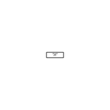
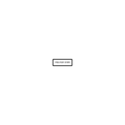
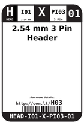
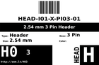

Contents
========

* [H03 > 2.54 mm 3 Pin Header](#h03--254-mm-3-pin-header)
	* [Diagrams](#diagrams)
	* [Datasheets](#datasheets)
	* [Labels](#labels)
	* [EDA](#eda)
	* [Images](#images)
	* [Tags](#tags)
  
![][im]
# H03 > 2.54 mm 3 Pin Header

- ID: HEAD-I01-X-PI03-01
- Hex ID: H03
- Name: 2.54 mm 3 Pin Header
- Description: 2.54 mm 3 Pin Header
- Long Link: [http://oom.lt/HEAD-I01-X-PI03-01](http://oom.lt/HEAD-I01-X-PI03-01)
- Short Link: [http://oom.lt/H03](http://oom.lt/H03)

## Diagrams
  
  

|diagBBLS|diagDIAG|diagIDEN|diagSCHEM|diagSIMP|
| :---: | :---: | :---: | :---: | :---: |
||||||

## Datasheets

- Datasheet: [datasheet.pdf](datasheet.pdf)

## Labels
  
  

|label-front|label-inventory|label-spec|
| :---: | :---: | :---: |
||||

## EDA

### Footprints
  

|  [FOOTPRINT-eagle-SparkFun-Eagle-Libraries-Sparkfun-Connectors-1X03](https://github.com/oomlout/oomlout_OOMP_eda/tree/main/FOOTPRINT/eagle/SparkFun-Eagle-Libraries/Sparkfun-Connectors/1X03/)|  [FOOTPRINT-eagle-SparkFun-Eagle-Libraries-Sparkfun-Connectors-1X03_LOCK](https://github.com/oomlout/oomlout_OOMP_eda/tree/main/FOOTPRINT/eagle/SparkFun-Eagle-Libraries/Sparkfun-Connectors/1X03_LOCK/)|  [FOOTPRINT-eagle-SparkFun-Eagle-Libraries-Sparkfun-Connectors-1X03_LOCK_LONGPADS](https://github.com/oomlout/oomlout_OOMP_eda/tree/main/FOOTPRINT/eagle/SparkFun-Eagle-Libraries/Sparkfun-Connectors/1X03_LOCK_LONGPADS/)|  [FOOTPRINT-eagle-SparkFun-Eagle-Libraries-Sparkfun-Connectors-1X03_NO_SILK](https://github.com/oomlout/oomlout_OOMP_eda/tree/main/FOOTPRINT/eagle/SparkFun-Eagle-Libraries/Sparkfun-Connectors/1X03_NO_SILK/)|
| :---: | :---: | :---: | :---: |
|  [FOOTPRINT-eagle-SparkFun-Eagle-Libraries-Sparkfun-Connectors-1X03_PP_HOLES_ONLY](https://github.com/oomlout/oomlout_OOMP_eda/tree/main/FOOTPRINT/eagle/SparkFun-Eagle-Libraries/Sparkfun-Connectors/1X03_PP_HOLES_ONLY/)|  [FOOTPRINT-eagle-Adafruit-Eagle-Library-adafruit-1X03](https://github.com/oomlout/oomlout_OOMP_eda/tree/main/FOOTPRINT/eagle/Adafruit-Eagle-Library/adafruit/1X03/)|  [FOOTPRINT-eagle-Adafruit-Eagle-Library-adafruit-1X03-CLEANBIG](https://github.com/oomlout/oomlout_OOMP_eda/tree/main/FOOTPRINT/eagle/Adafruit-Eagle-Library/adafruit/1X03-CLEANBIG/)|  [FOOTPRINT-kicad-kicad-footprints-Connector_PinHeader_2.54mm-PinHeader_1x03_P2.54mm_Vertical](https://github.com/oomlout/oomlout_OOMP_eda/tree/main/FOOTPRINT/kicad/kicad-footprints/Connector_PinHeader_2.54mm/PinHeader_1x03_P2.54mm_Vertical/)|
|||||

### Symbols
  

|  [SYMBOL-kicad-kicad-symbols-Connector-Conn_01x03_Male](https://github.com/oomlout/oomlout_OOMP_parts/tree/main/SYMBOL-kicad-kicad-symbols-Connector-Conn_01x03_Male/)|  [----](https://github.com/oomlout/oomlout_OOMP_parts/tree/main/----/)|||
| :---: | :---: | :---: | :---: |
  

### Instances
  
Used 247 times.  
Prevalance: (247\10986) 2.2483%  

|OOMP Instances|
| :---: |
|[PROJ-ADAF-1063-STAN-01  Adafruit MAX4466 Electret Mic Amplifier PCBs  Used 1 times. JP1](https://github.com/oomlout/oomlout_OOMP_projects/tree/main/PROJ-ADAF-1063-STAN-01/)|
|[PROJ-ADAF-1312-STAN-01  Adafruit_Breadboard_NeoPixel_PCB  Used 2 times. JP1, JP2](https://github.com/oomlout/oomlout_OOMP_projects/tree/main/PROJ-ADAF-1312-STAN-01/)|
|[PROJ-ADAF-1384-STAN-01  Adafruit GA1A1S202WP Breakout PCB  Used 1 times. JP1](https://github.com/oomlout/oomlout_OOMP_projects/tree/main/PROJ-ADAF-1384-STAN-01/)|
|[PROJ-ADAF-1438-STAN-01  Adafruit Motor Shield V2 PCB  Used 2 times. SERVO1, SERVO2](https://github.com/oomlout/oomlout_OOMP_projects/tree/main/PROJ-ADAF-1438-STAN-01/)|
|[PROJ-ADAF-1487-STAN-01  Adafruit NeoPixel 8x8 Matrix  Used 2 times. JP1, JP2](https://github.com/oomlout/oomlout_OOMP_projects/tree/main/PROJ-ADAF-1487-STAN-01/)|
|[PROJ-ADAF-1510-STAN-01  Adafruit CC3000 Breakout PCB  Used 1 times. JP1](https://github.com/oomlout/oomlout_OOMP_projects/tree/main/PROJ-ADAF-1510-STAN-01/)|
|[PROJ-ADAF-1788-STAN-01  Adafruit Music Maker MP3 Shield PCB  Used 1 times. JP2](https://github.com/oomlout/oomlout_OOMP_projects/tree/main/PROJ-ADAF-1788-STAN-01/)|
|[PROJ-ADAF-1916-STAN-01  Adafruit Cupcade Adapter PCB  Used 1 times. AUDIO](https://github.com/oomlout/oomlout_OOMP_projects/tree/main/PROJ-ADAF-1916-STAN-01/)|
|[PROJ-ADAF-1918-STAN-01  Adafruit GUVA Analog UV Sensor Breakout PCB  Used 1 times. JP2](https://github.com/oomlout/oomlout_OOMP_projects/tree/main/PROJ-ADAF-1918-STAN-01/)|
|[PROJ-ADAF-2741-STAN-01  Pixie 3W Smart LED PCB  Used 2 times. IN, OUT](https://github.com/oomlout/oomlout_OOMP_projects/tree/main/PROJ-ADAF-2741-STAN-01/)|
|[PROJ-ADAF-2746-STAN-01  Adafruit Bluefruit LE Shield PCB  Used 1 times. JP8](https://github.com/oomlout/oomlout_OOMP_projects/tree/main/PROJ-ADAF-2746-STAN-01/)|
|[PROJ-ADAF-2748-STAN-01  Adafruit ALS PT19 Sensor Breakout PCB  Used 1 times. JP2](https://github.com/oomlout/oomlout_OOMP_projects/tree/main/PROJ-ADAF-2748-STAN-01/)|
|[PROJ-ADAF-3028-STAN-01  Adafruit DS3231 Precision RTC FeatherWing PCB  Used 1 times. JP2](https://github.com/oomlout/oomlout_OOMP_projects/tree/main/PROJ-ADAF-3028-STAN-01/)|
|[PROJ-ADAF-3088-STAN-01  Adafruit LED Backpack FeatherWing PCB  Used 1 times. JP3](https://github.com/oomlout/oomlout_OOMP_projects/tree/main/PROJ-ADAF-3088-STAN-01/)|
|[PROJ-ADAF-3178-STAN-01  Adafruit Feather M0 RFM LoRa PCB  Used 1 times. JP5](https://github.com/oomlout/oomlout_OOMP_projects/tree/main/PROJ-ADAF-3178-STAN-01/)|
|[PROJ-ADAF-3201-STAN-01  Adafruit Ethernet FeatherWing PCB  Used 1 times. JP1](https://github.com/oomlout/oomlout_OOMP_projects/tree/main/PROJ-ADAF-3201-STAN-01/)|
|[PROJ-ADAF-3211-STAN-01  Adafruit RGB Matrix Bonnet PCB  Used 1 times. JP1](https://github.com/oomlout/oomlout_OOMP_projects/tree/main/PROJ-ADAF-3211-STAN-01/)|
|[PROJ-ADAF-3229-STAN-01  Adafruit Radio FeatherWing PCB  Used 2 times. JP4, JP5](https://github.com/oomlout/oomlout_OOMP_projects/tree/main/PROJ-ADAF-3229-STAN-01/)|
|[PROJ-ADAF-3346-STAN-01  Adafruit Stereo Speaker Bonnet PCB  Used 3 times. JP2, JP4, JP5](https://github.com/oomlout/oomlout_OOMP_projects/tree/main/PROJ-ADAF-3346-STAN-01/)|
|[PROJ-ADAF-3356-STAN-01  Adafruit Animated Eyes Bonnet PCB  Used 3 times. JP5, JP6, JP7](https://github.com/oomlout/oomlout_OOMP_projects/tree/main/PROJ-ADAF-3356-STAN-01/)|
|[PROJ-ADAF-3422-STAN-01  Adafruit Arcade Bonnet PCB  Used 2 times. JP2, JP3](https://github.com/oomlout/oomlout_OOMP_projects/tree/main/PROJ-ADAF-3422-STAN-01/)|
|[PROJ-ADAF-4074-STAN-01  Adafruit Radio Bonnet PCB  Used 1 times. JP2](https://github.com/oomlout/oomlout_OOMP_projects/tree/main/PROJ-ADAF-4074-STAN-01/)|
|[PROJ-ADAF-4369-STAN-01  Adafruit PCT2075 PCB  Used 1 times. JP2](https://github.com/oomlout/oomlout_OOMP_projects/tree/main/PROJ-ADAF-4369-STAN-01/)|
|[PROJ-ADAF-4409-STAN-01  Adafruit STEMMA Non Latching Mini Relay PCB  Used 1 times. JP1](https://github.com/oomlout/oomlout_OOMP_projects/tree/main/PROJ-ADAF-4409-STAN-01/)|
|[PROJ-ADAF-4686-STAN-01  Adafruit TMP235 PCB  Used 1 times. JP1](https://github.com/oomlout/oomlout_OOMP_projects/tree/main/PROJ-ADAF-4686-STAN-01/)|
|[PROJ-ADAF-4984-STAN-01  Adafruit DVI Breakout Board PCB  Used 1 times. JP1](https://github.com/oomlout/oomlout_OOMP_projects/tree/main/PROJ-ADAF-4984-STAN-01/)|
|[PROJ-ADAF-572-STAN-01  Adafruit BeagleBone ProtoBoard PCB  Used 2 times. JP34, JP35](https://github.com/oomlout/oomlout_OOMP_projects/tree/main/PROJ-ADAF-572-STAN-01/)|
|[PROJ-ADAF-795-STAN-01  Adafruit Menta PCB  Used 1 times. PWR_SEL](https://github.com/oomlout/oomlout_OOMP_projects/tree/main/PROJ-ADAF-795-STAN-01/)|
|[PROJ-SPAR-10025-STAN-01  EiBotBoard  Used 8 times. JP1, JP2, JP3, JP4, JP5, JP6, JP7, JP8](https://github.com/oomlout/oomlout_OOMP_projects/tree/main/PROJ-SPAR-10025-STAN-01/)|
|[PROJ-SPAR-10124-STAN-01  RS-485 Breakout  Used 1 times. JP3](https://github.com/oomlout/oomlout_OOMP_projects/tree/main/PROJ-SPAR-10124-STAN-01/)|
|[PROJ-SPAR-10154-STAN-01  RF Transceiver Breakout-RFM22B  Used 1 times. JP3](https://github.com/oomlout/oomlout_OOMP_projects/tree/main/PROJ-SPAR-10154-STAN-01/)|
|[PROJ-SPAR-10587-STAN-01  Music Instrument Shield  Used 1 times. JP3](https://github.com/oomlout/oomlout_OOMP_projects/tree/main/PROJ-SPAR-10587-STAN-01/)|
|[PROJ-SPAR-10615-STAN-01  PWM Shield  Used 16 times. J9, JP0, JP1, JP2, JP3, JP4, JP5, JP6, JP7, JP8, JP10, JP11, JP12, JP13, JP14, JP15](https://github.com/oomlout/oomlout_OOMP_projects/tree/main/PROJ-SPAR-10615-STAN-01/)|
|[PROJ-SPAR-10616-STAN-01  LED Driver Breakout-TLC5940  Used 16 times. JP1, JP2, JP3, JP4, JP5, JP6, JP7, JP8, JP9, JP10, JP11, JP12, JP13, JP14, JP15, JP16](https://github.com/oomlout/oomlout_OOMP_projects/tree/main/PROJ-SPAR-10616-STAN-01/)|
|[PROJ-SPAR-10617-STAN-01  Lipo Fuel Gauge  Used 2 times. JP2, JP4](https://github.com/oomlout/oomlout_OOMP_projects/tree/main/PROJ-SPAR-10617-STAN-01/)|
|[PROJ-SPAR-10701-STAN-01  Color Light Sensor Evaluation Board  Used 1 times. JP3](https://github.com/oomlout/oomlout_OOMP_projects/tree/main/PROJ-SPAR-10701-STAN-01/)|
|[PROJ-SPAR-10889-STAN-01  ProtoSnap-Pro Mini  Used 2 times. JP10, JP21](https://github.com/oomlout/oomlout_OOMP_projects/tree/main/PROJ-SPAR-10889-STAN-01/)|
|[PROJ-SPAR-10967-STAN-01  NCP1402-3.3V  Used 1 times. JP1](https://github.com/oomlout/oomlout_OOMP_projects/tree/main/PROJ-SPAR-10967-STAN-01/)|
|[PROJ-SPAR-10968-STAN-01  NCP1402-5V Breakout  Used 1 times. JP1](https://github.com/oomlout/oomlout_OOMP_projects/tree/main/PROJ-SPAR-10968-STAN-01/)|
|[PROJ-SPAR-11044-STAN-01  Mono Audio Amp Breakout-TPA2005D1  Used 2 times. JP1, JP4](https://github.com/oomlout/oomlout_OOMP_projects/tree/main/PROJ-SPAR-11044-STAN-01/)|
|[PROJ-SPAR-11129-STAN-01  Si4707 Breakout  Used 1 times. JP3](https://github.com/oomlout/oomlout_OOMP_projects/tree/main/PROJ-SPAR-11129-STAN-01/)|
|[PROJ-SPAR-11343-STAN-01  IOIO-OTG  Used 6 times. JP1, JP2, JP4, JP5, JP6, JP17](https://github.com/oomlout/oomlout_OOMP_projects/tree/main/PROJ-SPAR-11343-STAN-01/)|
|[PROJ-SPAR-11447-STAN-01  Wake on shake  Used 1 times. JP3](https://github.com/oomlout/oomlout_OOMP_projects/tree/main/PROJ-SPAR-11447-STAN-01/)|
|[PROJ-SPAR-11622-STAN-01  RedBot with Optical Encoder  Used 2 times. JP1, JP2](https://github.com/oomlout/oomlout_OOMP_projects/tree/main/PROJ-SPAR-11622-STAN-01/)|
|[PROJ-SPAR-11703-STAN-01  UDB5  Used 18 times. I1, I2, I3, I4, I5, I6, I7, I8, JP7, JP15, O1, O2, O3, O4, O5, O6, O7, O8](https://github.com/oomlout/oomlout_OOMP_projects/tree/main/PROJ-SPAR-11703-STAN-01/)|
|[PROJ-SPAR-11722-STAN-01  Rotary Encoder Breakout-Illuminated  Used 1 times. JP1](https://github.com/oomlout/oomlout_OOMP_projects/tree/main/PROJ-SPAR-11722-STAN-01/)|
|[PROJ-SPAR-11769-STAN-01  RedBot Line Sensor  Used 1 times. JP1](https://github.com/oomlout/oomlout_OOMP_projects/tree/main/PROJ-SPAR-11769-STAN-01/)|
|[PROJ-SPAR-11820-STAN-01  WS2812 Breakout  Used 2 times. JP1, JP2](https://github.com/oomlout/oomlout_OOMP_projects/tree/main/PROJ-SPAR-11820-STAN-01/)|
|[PROJ-SPAR-11924-STAN-01  Purpletooth Jamboree  Used 2 times. JP18, JP20](https://github.com/oomlout/oomlout_OOMP_projects/tree/main/PROJ-SPAR-11924-STAN-01/)|
|[PROJ-SPAR-11999-STAN-01  RedBot Whisker Bumper  Used 1 times. JP1](https://github.com/oomlout/oomlout_OOMP_projects/tree/main/PROJ-SPAR-11999-STAN-01/)|
|[PROJ-SPAR-12013-STAN-01  Touch Shield  Used 1 times. JP5](https://github.com/oomlout/oomlout_OOMP_projects/tree/main/PROJ-SPAR-12013-STAN-01/)|
|[PROJ-SPAR-12071-STAN-01  CC3000 WiFi Shield  Used 1 times. JP1](https://github.com/oomlout/oomlout_OOMP_projects/tree/main/PROJ-SPAR-12071-STAN-01/)|
|[PROJ-SPAR-12080-STAN-01  VKey Voltage Keypad  Used 1 times. JP1](https://github.com/oomlout/oomlout_OOMP_projects/tree/main/PROJ-SPAR-12080-STAN-01/)|
|[PROJ-SPAR-12567-STAN-01  RedBot Buzzer  Used 1 times. JP1](https://github.com/oomlout/oomlout_OOMP_projects/tree/main/PROJ-SPAR-12567-STAN-01/)|
|[PROJ-SPAR-12650-STAN-01  AD8232 Heart Rate Monitor  Used 1 times. JP1](https://github.com/oomlout/oomlout_OOMP_projects/tree/main/PROJ-SPAR-12650-STAN-01/)|
|[PROJ-SPAR-12651-STAN-01  Digital Sandbox  Used 1 times. JP2](https://github.com/oomlout/oomlout_OOMP_projects/tree/main/PROJ-SPAR-12651-STAN-01/)|
|[PROJ-SPAR-12660-STAN-01  MP3 Player Shield  Used 1 times. JP3](https://github.com/oomlout/oomlout_OOMP_projects/tree/main/PROJ-SPAR-12660-STAN-01/)|
|[PROJ-SPAR-12775-STAN-01  RFM69HCW Breakout  Used 1 times. JP5](https://github.com/oomlout/oomlout_OOMP_projects/tree/main/PROJ-SPAR-12775-STAN-01/)|
|[PROJ-SPAR-12779-STAN-01  Easy Driver  Used 1 times. JP2](https://github.com/oomlout/oomlout_OOMP_projects/tree/main/PROJ-SPAR-12779-STAN-01/)|
|[PROJ-SPAR-12858-STAN-01  Vernier Interface Shield  Used 2 times. JP9, JP10](https://github.com/oomlout/oomlout_OOMP_projects/tree/main/PROJ-SPAR-12858-STAN-01/)|
|[PROJ-SPAR-12886-STAN-01  Electric Imp Breakout  Used 1 times. JP5](https://github.com/oomlout/oomlout_OOMP_projects/tree/main/PROJ-SPAR-12886-STAN-01/)|
|[PROJ-SPAR-12959-STAN-01  MOSFET Power Control Kit  Used 1 times. JP5](https://github.com/oomlout/oomlout_OOMP_projects/tree/main/PROJ-SPAR-12959-STAN-01/)|
|[PROJ-SPAR-13042-STAN-01  Edison PWM Block  Used 8 times. JP1, JP2, JP3, JP4, JP5, JP6, JP7, JP8](https://github.com/oomlout/oomlout_OOMP_projects/tree/main/PROJ-SPAR-13042-STAN-01/)|
|[PROJ-SPAR-13099-STAN-01  Rotary Switch Potentiometer  Used 1 times. JP1](https://github.com/oomlout/oomlout_OOMP_projects/tree/main/PROJ-SPAR-13099-STAN-01/)|
|[PROJ-SPAR-13118-STAN-01  Servo Trigger  Used 1 times. JP2](https://github.com/oomlout/oomlout_OOMP_projects/tree/main/PROJ-SPAR-13118-STAN-01/)|
|[PROJ-SPAR-13124-STAN-01  Proto Pedal  Used 14 times. JP6, JP9, JP21, JP22, JP23, JP25, JP26, JP27, JP91, JP92, JP93, JP95, JP96, JP97](https://github.com/oomlout/oomlout_OOMP_projects/tree/main/PROJ-SPAR-13124-STAN-01/)|
|[PROJ-SPAR-13183-STAN-01  CryptoShield  Used 1 times. JP2](https://github.com/oomlout/oomlout_OOMP_projects/tree/main/PROJ-SPAR-13183-STAN-01/)|
|[PROJ-SPAR-13261-STAN-01  OpenScale  Used 5 times. J2, J3, J4, J5, JP1](https://github.com/oomlout/oomlout_OOMP_projects/tree/main/PROJ-SPAR-13261-STAN-01/)|
|[PROJ-SPAR-13281-STAN-01  Load Sensor Combinator  Used 5 times. JP1, JP2, JP3, JP4, JP7](https://github.com/oomlout/oomlout_OOMP_projects/tree/main/PROJ-SPAR-13281-STAN-01/)|
|[PROJ-SPAR-13310-STAN-01  Ludus ProtoShield  Used 20 times. JP0, JP1, JP2, JP3, JP4, JP5, JP6, JP7, JP8, JP9, JP10, JP11, JP12, JP13, JP14, JP15, JP16, JP17, JP18, JP19](https://github.com/oomlout/oomlout_OOMP_projects/tree/main/PROJ-SPAR-13310-STAN-01/)|
|[PROJ-SPAR-13598-STAN-01  Photon Proto Shield  Used 2 times. JP3, JP4](https://github.com/oomlout/oomlout_OOMP_projects/tree/main/PROJ-SPAR-13598-STAN-01/)|
|[PROJ-SPAR-13630-STAN-01  Photon Weather Shield  Used 2 times. JP2, JP3](https://github.com/oomlout/oomlout_OOMP_projects/tree/main/PROJ-SPAR-13630-STAN-01/)|
|[PROJ-SPAR-13679-STAN-01  Current Sensor Breakout-ACS723  Used 1 times. J1](https://github.com/oomlout/oomlout_OOMP_projects/tree/main/PROJ-SPAR-13679-STAN-01/)|
|[PROJ-SPAR-13684-STAN-01  MyoWare Power Shield  Used 2 times. JP1, JP2](https://github.com/oomlout/oomlout_OOMP_projects/tree/main/PROJ-SPAR-13684-STAN-01/)|
|[PROJ-SPAR-13687-STAN-01  MyoWare Cable Shield  Used 5 times. JP1, JP2, JP4, JP5, JP6](https://github.com/oomlout/oomlout_OOMP_projects/tree/main/PROJ-SPAR-13687-STAN-01/)|
|[PROJ-SPAR-13688-STAN-01  MyoWare LED Shield  Used 2 times. JP1, JP2](https://github.com/oomlout/oomlout_OOMP_projects/tree/main/PROJ-SPAR-13688-STAN-01/)|
|[PROJ-SPAR-13709-STAN-01  MyoWare Proto Shield  Used 4 times. JP1, JP2, JP18, JP19](https://github.com/oomlout/oomlout_OOMP_projects/tree/main/PROJ-SPAR-13709-STAN-01/)|
|[PROJ-SPAR-13762-STAN-01  MPU-9250 Breakout  Used 1 times. J2](https://github.com/oomlout/oomlout_OOMP_projects/tree/main/PROJ-SPAR-13762-STAN-01/)|
|[PROJ-SPAR-13819-STAN-01  Arduino ProtoShield Bare PCB  Used 1 times. GND_RAIL_2](https://github.com/oomlout/oomlout_OOMP_projects/tree/main/PROJ-SPAR-13819-STAN-01/)|
|[PROJ-SPAR-14066-STAN-01  Simultaneous RFID Tag Reader  Used 2 times. J5, J7](https://github.com/oomlout/oomlout_OOMP_projects/tree/main/PROJ-SPAR-14066-STAN-01/)|
|[PROJ-SPAR-14153-STAN-01  ESP32 Environment Sensor Shield  Used 2 times. J3, J5](https://github.com/oomlout/oomlout_OOMP_projects/tree/main/PROJ-SPAR-14153-STAN-01/)|
|[PROJ-SPAR-14193-STAN-01  CCS811 Air Quality Breakout  Used 1 times. J2](https://github.com/oomlout/oomlout_OOMP_projects/tree/main/PROJ-SPAR-14193-STAN-01/)|
|[PROJ-SPAR-14285-STAN-01  Wireless Motor Driver Shield  Used 22 times. JP0, JP1, JP2, JP3, JP4, JP5, JP6, JP7, JP8, JP9, JP10, JP11, JP12, JP13, JP14, JP15, JP16, JP17, JP18, JP19, JP23, JP24](https://github.com/oomlout/oomlout_OOMP_projects/tree/main/PROJ-SPAR-14285-STAN-01/)|
|[PROJ-SPAR-14348-STAN-01  Qwiic BME280 CCS811 Combo  Used 1 times. J2](https://github.com/oomlout/oomlout_OOMP_projects/tree/main/PROJ-SPAR-14348-STAN-01/)|
|[PROJ-SPAR-14477-STAN-01  Qwiic Shield for Photon  Used 2 times. JP3, JP4](https://github.com/oomlout/oomlout_OOMP_projects/tree/main/PROJ-SPAR-14477-STAN-01/)|
|[PROJ-SPAR-14544-STAN-01  Current Sensor Breakout-ACS723-Low Current  Used 1 times. JP3](https://github.com/oomlout/oomlout_OOMP_projects/tree/main/PROJ-SPAR-14544-STAN-01/)|
|[PROJ-SPAR-14997-STAN-01  LTE Cat M1 Shield  Used 2 times. J6, J7](https://github.com/oomlout/oomlout_OOMP_projects/tree/main/PROJ-SPAR-14997-STAN-01/)|

## Images
  
  

|image|image_RE|diagBBLS|diagDIAG|diagIDEN|diagSCHEM|diagSIMP|label-front|label-inventory|label-spec|
| :---: | :---: | :---: | :---: | :---: | :---: | :---: | :---: | :---: | :---: |
|||||||||||

## Tags

- oompType: HEAD
- oompSize: I01
- oompColor: X
- oompDesc: PI03
- oompIndex: 01
- hexID: H03
- oompSort: 
- oompClass: Through Hole
- oompClassCode: THTH
- ooPitch: 2.54
- ooPinHeight: 11.60
- ooPinWidth: 0.64
- ooPinOffset: 1.53
- oompBbls: variable;pins;3
- oompBbls: template;XXXX-I01-X-XX-01-bbls
- oompDiag: variable;pins;3
- oompDiag: template;HEAD-I01-X-XX-01-diag
- oompIden: variable;pins;3
- oompIden: template;XXXX-I01-X-XX-01-iden
- oompSchem: variable;pins;3
- oompSchem: template;XXXX-XX-X-XX-01-PINS-ODD-schem
- oompSimp: variable;pins;3
- oompSimp: template;XXXX-I01-X-XX-01-simp
- ooNumPins: 3
- ooDesignator: J1
- schematicSymbol: HEAD-XX-X-PI03-XX
- oompID: HEAD-I01-X-PI03-01
- oompInstances: {'PROJECT': 'PROJ-ADAF-1063-STAN-01', 'ID': 'JP1'}
- oompInstances: {'PROJECT': 'PROJ-ADAF-1312-STAN-01', 'ID': 'JP1'}
- oompInstances: {'PROJECT': 'PROJ-ADAF-1312-STAN-01', 'ID': 'JP2'}
- oompInstances: {'PROJECT': 'PROJ-ADAF-1384-STAN-01', 'ID': 'JP1'}
- oompInstances: {'PROJECT': 'PROJ-ADAF-1438-STAN-01', 'ID': 'SERVO1'}
- oompInstances: {'PROJECT': 'PROJ-ADAF-1438-STAN-01', 'ID': 'SERVO2'}
- oompInstances: {'PROJECT': 'PROJ-ADAF-1487-STAN-01', 'ID': 'JP1'}
- oompInstances: {'PROJECT': 'PROJ-ADAF-1487-STAN-01', 'ID': 'JP2'}
- oompInstances: {'PROJECT': 'PROJ-ADAF-1510-STAN-01', 'ID': 'JP1'}
- oompInstances: {'PROJECT': 'PROJ-ADAF-1788-STAN-01', 'ID': 'JP2'}
- oompInstances: {'PROJECT': 'PROJ-ADAF-1916-STAN-01', 'ID': 'AUDIO'}
- oompInstances: {'PROJECT': 'PROJ-ADAF-1918-STAN-01', 'ID': 'JP2'}
- oompInstances: {'PROJECT': 'PROJ-ADAF-2741-STAN-01', 'ID': 'IN'}
- oompInstances: {'PROJECT': 'PROJ-ADAF-2741-STAN-01', 'ID': 'OUT'}
- oompInstances: {'PROJECT': 'PROJ-ADAF-2746-STAN-01', 'ID': 'JP8'}
- oompInstances: {'PROJECT': 'PROJ-ADAF-2748-STAN-01', 'ID': 'JP2'}
- oompInstances: {'PROJECT': 'PROJ-ADAF-3028-STAN-01', 'ID': 'JP2'}
- oompInstances: {'PROJECT': 'PROJ-ADAF-3088-STAN-01', 'ID': 'JP3'}
- oompInstances: {'PROJECT': 'PROJ-ADAF-3178-STAN-01', 'ID': 'JP5'}
- oompInstances: {'PROJECT': 'PROJ-ADAF-3201-STAN-01', 'ID': 'JP1'}
- oompInstances: {'PROJECT': 'PROJ-ADAF-3211-STAN-01', 'ID': 'JP1'}
- oompInstances: {'PROJECT': 'PROJ-ADAF-3229-STAN-01', 'ID': 'JP4'}
- oompInstances: {'PROJECT': 'PROJ-ADAF-3229-STAN-01', 'ID': 'JP5'}
- oompInstances: {'PROJECT': 'PROJ-ADAF-3346-STAN-01', 'ID': 'JP2'}
- oompInstances: {'PROJECT': 'PROJ-ADAF-3346-STAN-01', 'ID': 'JP4'}
- oompInstances: {'PROJECT': 'PROJ-ADAF-3346-STAN-01', 'ID': 'JP5'}
- oompInstances: {'PROJECT': 'PROJ-ADAF-3356-STAN-01', 'ID': 'JP5'}
- oompInstances: {'PROJECT': 'PROJ-ADAF-3356-STAN-01', 'ID': 'JP6'}
- oompInstances: {'PROJECT': 'PROJ-ADAF-3356-STAN-01', 'ID': 'JP7'}
- oompInstances: {'PROJECT': 'PROJ-ADAF-3422-STAN-01', 'ID': 'JP2'}
- oompInstances: {'PROJECT': 'PROJ-ADAF-3422-STAN-01', 'ID': 'JP3'}
- oompInstances: {'PROJECT': 'PROJ-ADAF-4074-STAN-01', 'ID': 'JP2'}
- oompInstances: {'PROJECT': 'PROJ-ADAF-4369-STAN-01', 'ID': 'JP2'}
- oompInstances: {'PROJECT': 'PROJ-ADAF-4409-STAN-01', 'ID': 'JP1'}
- oompInstances: {'PROJECT': 'PROJ-ADAF-4686-STAN-01', 'ID': 'JP1'}
- oompInstances: {'PROJECT': 'PROJ-ADAF-4984-STAN-01', 'ID': 'JP1'}
- oompInstances: {'PROJECT': 'PROJ-ADAF-572-STAN-01', 'ID': 'JP34'}
- oompInstances: {'PROJECT': 'PROJ-ADAF-572-STAN-01', 'ID': 'JP35'}
- oompInstances: {'PROJECT': 'PROJ-ADAF-795-STAN-01', 'ID': 'PWR_SEL'}
- oompInstances: {'PROJECT': 'PROJ-SPAR-10025-STAN-01', 'ID': 'JP1'}
- oompInstances: {'PROJECT': 'PROJ-SPAR-10025-STAN-01', 'ID': 'JP2'}
- oompInstances: {'PROJECT': 'PROJ-SPAR-10025-STAN-01', 'ID': 'JP3'}
- oompInstances: {'PROJECT': 'PROJ-SPAR-10025-STAN-01', 'ID': 'JP4'}
- oompInstances: {'PROJECT': 'PROJ-SPAR-10025-STAN-01', 'ID': 'JP5'}
- oompInstances: {'PROJECT': 'PROJ-SPAR-10025-STAN-01', 'ID': 'JP6'}
- oompInstances: {'PROJECT': 'PROJ-SPAR-10025-STAN-01', 'ID': 'JP7'}
- oompInstances: {'PROJECT': 'PROJ-SPAR-10025-STAN-01', 'ID': 'JP8'}
- oompInstances: {'PROJECT': 'PROJ-SPAR-10124-STAN-01', 'ID': 'JP3'}
- oompInstances: {'PROJECT': 'PROJ-SPAR-10154-STAN-01', 'ID': 'JP3'}
- oompInstances: {'PROJECT': 'PROJ-SPAR-10587-STAN-01', 'ID': 'JP3'}
- oompInstances: {'PROJECT': 'PROJ-SPAR-10615-STAN-01', 'ID': 'J9'}
- oompInstances: {'PROJECT': 'PROJ-SPAR-10615-STAN-01', 'ID': 'JP0'}
- oompInstances: {'PROJECT': 'PROJ-SPAR-10615-STAN-01', 'ID': 'JP1'}
- oompInstances: {'PROJECT': 'PROJ-SPAR-10615-STAN-01', 'ID': 'JP2'}
- oompInstances: {'PROJECT': 'PROJ-SPAR-10615-STAN-01', 'ID': 'JP3'}
- oompInstances: {'PROJECT': 'PROJ-SPAR-10615-STAN-01', 'ID': 'JP4'}
- oompInstances: {'PROJECT': 'PROJ-SPAR-10615-STAN-01', 'ID': 'JP5'}
- oompInstances: {'PROJECT': 'PROJ-SPAR-10615-STAN-01', 'ID': 'JP6'}
- oompInstances: {'PROJECT': 'PROJ-SPAR-10615-STAN-01', 'ID': 'JP7'}
- oompInstances: {'PROJECT': 'PROJ-SPAR-10615-STAN-01', 'ID': 'JP8'}
- oompInstances: {'PROJECT': 'PROJ-SPAR-10615-STAN-01', 'ID': 'JP10'}
- oompInstances: {'PROJECT': 'PROJ-SPAR-10615-STAN-01', 'ID': 'JP11'}
- oompInstances: {'PROJECT': 'PROJ-SPAR-10615-STAN-01', 'ID': 'JP12'}
- oompInstances: {'PROJECT': 'PROJ-SPAR-10615-STAN-01', 'ID': 'JP13'}
- oompInstances: {'PROJECT': 'PROJ-SPAR-10615-STAN-01', 'ID': 'JP14'}
- oompInstances: {'PROJECT': 'PROJ-SPAR-10615-STAN-01', 'ID': 'JP15'}
- oompInstances: {'PROJECT': 'PROJ-SPAR-10616-STAN-01', 'ID': 'JP1'}
- oompInstances: {'PROJECT': 'PROJ-SPAR-10616-STAN-01', 'ID': 'JP2'}
- oompInstances: {'PROJECT': 'PROJ-SPAR-10616-STAN-01', 'ID': 'JP3'}
- oompInstances: {'PROJECT': 'PROJ-SPAR-10616-STAN-01', 'ID': 'JP4'}
- oompInstances: {'PROJECT': 'PROJ-SPAR-10616-STAN-01', 'ID': 'JP5'}
- oompInstances: {'PROJECT': 'PROJ-SPAR-10616-STAN-01', 'ID': 'JP6'}
- oompInstances: {'PROJECT': 'PROJ-SPAR-10616-STAN-01', 'ID': 'JP7'}
- oompInstances: {'PROJECT': 'PROJ-SPAR-10616-STAN-01', 'ID': 'JP8'}
- oompInstances: {'PROJECT': 'PROJ-SPAR-10616-STAN-01', 'ID': 'JP9'}
- oompInstances: {'PROJECT': 'PROJ-SPAR-10616-STAN-01', 'ID': 'JP10'}
- oompInstances: {'PROJECT': 'PROJ-SPAR-10616-STAN-01', 'ID': 'JP11'}
- oompInstances: {'PROJECT': 'PROJ-SPAR-10616-STAN-01', 'ID': 'JP12'}
- oompInstances: {'PROJECT': 'PROJ-SPAR-10616-STAN-01', 'ID': 'JP13'}
- oompInstances: {'PROJECT': 'PROJ-SPAR-10616-STAN-01', 'ID': 'JP14'}
- oompInstances: {'PROJECT': 'PROJ-SPAR-10616-STAN-01', 'ID': 'JP15'}
- oompInstances: {'PROJECT': 'PROJ-SPAR-10616-STAN-01', 'ID': 'JP16'}
- oompInstances: {'PROJECT': 'PROJ-SPAR-10617-STAN-01', 'ID': 'JP2'}
- oompInstances: {'PROJECT': 'PROJ-SPAR-10617-STAN-01', 'ID': 'JP4'}
- oompInstances: {'PROJECT': 'PROJ-SPAR-10701-STAN-01', 'ID': 'JP3'}
- oompInstances: {'PROJECT': 'PROJ-SPAR-10889-STAN-01', 'ID': 'JP10'}
- oompInstances: {'PROJECT': 'PROJ-SPAR-10889-STAN-01', 'ID': 'JP21'}
- oompInstances: {'PROJECT': 'PROJ-SPAR-10967-STAN-01', 'ID': 'JP1'}
- oompInstances: {'PROJECT': 'PROJ-SPAR-10968-STAN-01', 'ID': 'JP1'}
- oompInstances: {'PROJECT': 'PROJ-SPAR-11044-STAN-01', 'ID': 'JP1'}
- oompInstances: {'PROJECT': 'PROJ-SPAR-11044-STAN-01', 'ID': 'JP4'}
- oompInstances: {'PROJECT': 'PROJ-SPAR-11129-STAN-01', 'ID': 'JP3'}
- oompInstances: {'PROJECT': 'PROJ-SPAR-11343-STAN-01', 'ID': 'JP1'}
- oompInstances: {'PROJECT': 'PROJ-SPAR-11343-STAN-01', 'ID': 'JP2'}
- oompInstances: {'PROJECT': 'PROJ-SPAR-11343-STAN-01', 'ID': 'JP4'}
- oompInstances: {'PROJECT': 'PROJ-SPAR-11343-STAN-01', 'ID': 'JP5'}
- oompInstances: {'PROJECT': 'PROJ-SPAR-11343-STAN-01', 'ID': 'JP6'}
- oompInstances: {'PROJECT': 'PROJ-SPAR-11343-STAN-01', 'ID': 'JP17'}
- oompInstances: {'PROJECT': 'PROJ-SPAR-11447-STAN-01', 'ID': 'JP3'}
- oompInstances: {'PROJECT': 'PROJ-SPAR-11622-STAN-01', 'ID': 'JP1'}
- oompInstances: {'PROJECT': 'PROJ-SPAR-11622-STAN-01', 'ID': 'JP2'}
- oompInstances: {'PROJECT': 'PROJ-SPAR-11703-STAN-01', 'ID': 'I1'}
- oompInstances: {'PROJECT': 'PROJ-SPAR-11703-STAN-01', 'ID': 'I2'}
- oompInstances: {'PROJECT': 'PROJ-SPAR-11703-STAN-01', 'ID': 'I3'}
- oompInstances: {'PROJECT': 'PROJ-SPAR-11703-STAN-01', 'ID': 'I4'}
- oompInstances: {'PROJECT': 'PROJ-SPAR-11703-STAN-01', 'ID': 'I5'}
- oompInstances: {'PROJECT': 'PROJ-SPAR-11703-STAN-01', 'ID': 'I6'}
- oompInstances: {'PROJECT': 'PROJ-SPAR-11703-STAN-01', 'ID': 'I7'}
- oompInstances: {'PROJECT': 'PROJ-SPAR-11703-STAN-01', 'ID': 'I8'}
- oompInstances: {'PROJECT': 'PROJ-SPAR-11703-STAN-01', 'ID': 'JP7'}
- oompInstances: {'PROJECT': 'PROJ-SPAR-11703-STAN-01', 'ID': 'JP15'}
- oompInstances: {'PROJECT': 'PROJ-SPAR-11703-STAN-01', 'ID': 'O1'}
- oompInstances: {'PROJECT': 'PROJ-SPAR-11703-STAN-01', 'ID': 'O2'}
- oompInstances: {'PROJECT': 'PROJ-SPAR-11703-STAN-01', 'ID': 'O3'}
- oompInstances: {'PROJECT': 'PROJ-SPAR-11703-STAN-01', 'ID': 'O4'}
- oompInstances: {'PROJECT': 'PROJ-SPAR-11703-STAN-01', 'ID': 'O5'}
- oompInstances: {'PROJECT': 'PROJ-SPAR-11703-STAN-01', 'ID': 'O6'}
- oompInstances: {'PROJECT': 'PROJ-SPAR-11703-STAN-01', 'ID': 'O7'}
- oompInstances: {'PROJECT': 'PROJ-SPAR-11703-STAN-01', 'ID': 'O8'}
- oompInstances: {'PROJECT': 'PROJ-SPAR-11722-STAN-01', 'ID': 'JP1'}
- oompInstances: {'PROJECT': 'PROJ-SPAR-11769-STAN-01', 'ID': 'JP1'}
- oompInstances: {'PROJECT': 'PROJ-SPAR-11820-STAN-01', 'ID': 'JP1'}
- oompInstances: {'PROJECT': 'PROJ-SPAR-11820-STAN-01', 'ID': 'JP2'}
- oompInstances: {'PROJECT': 'PROJ-SPAR-11924-STAN-01', 'ID': 'JP18'}
- oompInstances: {'PROJECT': 'PROJ-SPAR-11924-STAN-01', 'ID': 'JP20'}
- oompInstances: {'PROJECT': 'PROJ-SPAR-11999-STAN-01', 'ID': 'JP1'}
- oompInstances: {'PROJECT': 'PROJ-SPAR-12013-STAN-01', 'ID': 'JP5'}
- oompInstances: {'PROJECT': 'PROJ-SPAR-12071-STAN-01', 'ID': 'JP1'}
- oompInstances: {'PROJECT': 'PROJ-SPAR-12080-STAN-01', 'ID': 'JP1'}
- oompInstances: {'PROJECT': 'PROJ-SPAR-12567-STAN-01', 'ID': 'JP1'}
- oompInstances: {'PROJECT': 'PROJ-SPAR-12650-STAN-01', 'ID': 'JP1'}
- oompInstances: {'PROJECT': 'PROJ-SPAR-12651-STAN-01', 'ID': 'JP2'}
- oompInstances: {'PROJECT': 'PROJ-SPAR-12660-STAN-01', 'ID': 'JP3'}
- oompInstances: {'PROJECT': 'PROJ-SPAR-12775-STAN-01', 'ID': 'JP5'}
- oompInstances: {'PROJECT': 'PROJ-SPAR-12779-STAN-01', 'ID': 'JP2'}
- oompInstances: {'PROJECT': 'PROJ-SPAR-12858-STAN-01', 'ID': 'JP9'}
- oompInstances: {'PROJECT': 'PROJ-SPAR-12858-STAN-01', 'ID': 'JP10'}
- oompInstances: {'PROJECT': 'PROJ-SPAR-12886-STAN-01', 'ID': 'JP5'}
- oompInstances: {'PROJECT': 'PROJ-SPAR-12959-STAN-01', 'ID': 'JP5'}
- oompInstances: {'PROJECT': 'PROJ-SPAR-13042-STAN-01', 'ID': 'JP1'}
- oompInstances: {'PROJECT': 'PROJ-SPAR-13042-STAN-01', 'ID': 'JP2'}
- oompInstances: {'PROJECT': 'PROJ-SPAR-13042-STAN-01', 'ID': 'JP3'}
- oompInstances: {'PROJECT': 'PROJ-SPAR-13042-STAN-01', 'ID': 'JP4'}
- oompInstances: {'PROJECT': 'PROJ-SPAR-13042-STAN-01', 'ID': 'JP5'}
- oompInstances: {'PROJECT': 'PROJ-SPAR-13042-STAN-01', 'ID': 'JP6'}
- oompInstances: {'PROJECT': 'PROJ-SPAR-13042-STAN-01', 'ID': 'JP7'}
- oompInstances: {'PROJECT': 'PROJ-SPAR-13042-STAN-01', 'ID': 'JP8'}
- oompInstances: {'PROJECT': 'PROJ-SPAR-13099-STAN-01', 'ID': 'JP1'}
- oompInstances: {'PROJECT': 'PROJ-SPAR-13118-STAN-01', 'ID': 'JP2'}
- oompInstances: {'PROJECT': 'PROJ-SPAR-13124-STAN-01', 'ID': 'JP6'}
- oompInstances: {'PROJECT': 'PROJ-SPAR-13124-STAN-01', 'ID': 'JP9'}
- oompInstances: {'PROJECT': 'PROJ-SPAR-13124-STAN-01', 'ID': 'JP21'}
- oompInstances: {'PROJECT': 'PROJ-SPAR-13124-STAN-01', 'ID': 'JP22'}
- oompInstances: {'PROJECT': 'PROJ-SPAR-13124-STAN-01', 'ID': 'JP23'}
- oompInstances: {'PROJECT': 'PROJ-SPAR-13124-STAN-01', 'ID': 'JP25'}
- oompInstances: {'PROJECT': 'PROJ-SPAR-13124-STAN-01', 'ID': 'JP26'}
- oompInstances: {'PROJECT': 'PROJ-SPAR-13124-STAN-01', 'ID': 'JP27'}
- oompInstances: {'PROJECT': 'PROJ-SPAR-13124-STAN-01', 'ID': 'JP91'}
- oompInstances: {'PROJECT': 'PROJ-SPAR-13124-STAN-01', 'ID': 'JP92'}
- oompInstances: {'PROJECT': 'PROJ-SPAR-13124-STAN-01', 'ID': 'JP93'}
- oompInstances: {'PROJECT': 'PROJ-SPAR-13124-STAN-01', 'ID': 'JP95'}
- oompInstances: {'PROJECT': 'PROJ-SPAR-13124-STAN-01', 'ID': 'JP96'}
- oompInstances: {'PROJECT': 'PROJ-SPAR-13124-STAN-01', 'ID': 'JP97'}
- oompInstances: {'PROJECT': 'PROJ-SPAR-13183-STAN-01', 'ID': 'JP2'}
- oompInstances: {'PROJECT': 'PROJ-SPAR-13261-STAN-01', 'ID': 'J2'}
- oompInstances: {'PROJECT': 'PROJ-SPAR-13261-STAN-01', 'ID': 'J3'}
- oompInstances: {'PROJECT': 'PROJ-SPAR-13261-STAN-01', 'ID': 'J4'}
- oompInstances: {'PROJECT': 'PROJ-SPAR-13261-STAN-01', 'ID': 'J5'}
- oompInstances: {'PROJECT': 'PROJ-SPAR-13261-STAN-01', 'ID': 'JP1'}
- oompInstances: {'PROJECT': 'PROJ-SPAR-13281-STAN-01', 'ID': 'JP1'}
- oompInstances: {'PROJECT': 'PROJ-SPAR-13281-STAN-01', 'ID': 'JP2'}
- oompInstances: {'PROJECT': 'PROJ-SPAR-13281-STAN-01', 'ID': 'JP3'}
- oompInstances: {'PROJECT': 'PROJ-SPAR-13281-STAN-01', 'ID': 'JP4'}
- oompInstances: {'PROJECT': 'PROJ-SPAR-13281-STAN-01', 'ID': 'JP7'}
- oompInstances: {'PROJECT': 'PROJ-SPAR-13310-STAN-01', 'ID': 'JP0'}
- oompInstances: {'PROJECT': 'PROJ-SPAR-13310-STAN-01', 'ID': 'JP1'}
- oompInstances: {'PROJECT': 'PROJ-SPAR-13310-STAN-01', 'ID': 'JP2'}
- oompInstances: {'PROJECT': 'PROJ-SPAR-13310-STAN-01', 'ID': 'JP3'}
- oompInstances: {'PROJECT': 'PROJ-SPAR-13310-STAN-01', 'ID': 'JP4'}
- oompInstances: {'PROJECT': 'PROJ-SPAR-13310-STAN-01', 'ID': 'JP5'}
- oompInstances: {'PROJECT': 'PROJ-SPAR-13310-STAN-01', 'ID': 'JP6'}
- oompInstances: {'PROJECT': 'PROJ-SPAR-13310-STAN-01', 'ID': 'JP7'}
- oompInstances: {'PROJECT': 'PROJ-SPAR-13310-STAN-01', 'ID': 'JP8'}
- oompInstances: {'PROJECT': 'PROJ-SPAR-13310-STAN-01', 'ID': 'JP9'}
- oompInstances: {'PROJECT': 'PROJ-SPAR-13310-STAN-01', 'ID': 'JP10'}
- oompInstances: {'PROJECT': 'PROJ-SPAR-13310-STAN-01', 'ID': 'JP11'}
- oompInstances: {'PROJECT': 'PROJ-SPAR-13310-STAN-01', 'ID': 'JP12'}
- oompInstances: {'PROJECT': 'PROJ-SPAR-13310-STAN-01', 'ID': 'JP13'}
- oompInstances: {'PROJECT': 'PROJ-SPAR-13310-STAN-01', 'ID': 'JP14'}
- oompInstances: {'PROJECT': 'PROJ-SPAR-13310-STAN-01', 'ID': 'JP15'}
- oompInstances: {'PROJECT': 'PROJ-SPAR-13310-STAN-01', 'ID': 'JP16'}
- oompInstances: {'PROJECT': 'PROJ-SPAR-13310-STAN-01', 'ID': 'JP17'}
- oompInstances: {'PROJECT': 'PROJ-SPAR-13310-STAN-01', 'ID': 'JP18'}
- oompInstances: {'PROJECT': 'PROJ-SPAR-13310-STAN-01', 'ID': 'JP19'}
- oompInstances: {'PROJECT': 'PROJ-SPAR-13598-STAN-01', 'ID': 'JP3'}
- oompInstances: {'PROJECT': 'PROJ-SPAR-13598-STAN-01', 'ID': 'JP4'}
- oompInstances: {'PROJECT': 'PROJ-SPAR-13630-STAN-01', 'ID': 'JP2'}
- oompInstances: {'PROJECT': 'PROJ-SPAR-13630-STAN-01', 'ID': 'JP3'}
- oompInstances: {'PROJECT': 'PROJ-SPAR-13679-STAN-01', 'ID': 'J1'}
- oompInstances: {'PROJECT': 'PROJ-SPAR-13684-STAN-01', 'ID': 'JP1'}
- oompInstances: {'PROJECT': 'PROJ-SPAR-13684-STAN-01', 'ID': 'JP2'}
- oompInstances: {'PROJECT': 'PROJ-SPAR-13687-STAN-01', 'ID': 'JP1'}
- oompInstances: {'PROJECT': 'PROJ-SPAR-13687-STAN-01', 'ID': 'JP2'}
- oompInstances: {'PROJECT': 'PROJ-SPAR-13687-STAN-01', 'ID': 'JP4'}
- oompInstances: {'PROJECT': 'PROJ-SPAR-13687-STAN-01', 'ID': 'JP5'}
- oompInstances: {'PROJECT': 'PROJ-SPAR-13687-STAN-01', 'ID': 'JP6'}
- oompInstances: {'PROJECT': 'PROJ-SPAR-13688-STAN-01', 'ID': 'JP1'}
- oompInstances: {'PROJECT': 'PROJ-SPAR-13688-STAN-01', 'ID': 'JP2'}
- oompInstances: {'PROJECT': 'PROJ-SPAR-13709-STAN-01', 'ID': 'JP1'}
- oompInstances: {'PROJECT': 'PROJ-SPAR-13709-STAN-01', 'ID': 'JP2'}
- oompInstances: {'PROJECT': 'PROJ-SPAR-13709-STAN-01', 'ID': 'JP18'}
- oompInstances: {'PROJECT': 'PROJ-SPAR-13709-STAN-01', 'ID': 'JP19'}
- oompInstances: {'PROJECT': 'PROJ-SPAR-13762-STAN-01', 'ID': 'J2'}
- oompInstances: {'PROJECT': 'PROJ-SPAR-13819-STAN-01', 'ID': 'GND_RAIL_2'}
- oompInstances: {'PROJECT': 'PROJ-SPAR-14066-STAN-01', 'ID': 'J5'}
- oompInstances: {'PROJECT': 'PROJ-SPAR-14066-STAN-01', 'ID': 'J7'}
- oompInstances: {'PROJECT': 'PROJ-SPAR-14153-STAN-01', 'ID': 'J3'}
- oompInstances: {'PROJECT': 'PROJ-SPAR-14153-STAN-01', 'ID': 'J5'}
- oompInstances: {'PROJECT': 'PROJ-SPAR-14193-STAN-01', 'ID': 'J2'}
- oompInstances: {'PROJECT': 'PROJ-SPAR-14285-STAN-01', 'ID': 'JP0'}
- oompInstances: {'PROJECT': 'PROJ-SPAR-14285-STAN-01', 'ID': 'JP1'}
- oompInstances: {'PROJECT': 'PROJ-SPAR-14285-STAN-01', 'ID': 'JP2'}
- oompInstances: {'PROJECT': 'PROJ-SPAR-14285-STAN-01', 'ID': 'JP3'}
- oompInstances: {'PROJECT': 'PROJ-SPAR-14285-STAN-01', 'ID': 'JP4'}
- oompInstances: {'PROJECT': 'PROJ-SPAR-14285-STAN-01', 'ID': 'JP5'}
- oompInstances: {'PROJECT': 'PROJ-SPAR-14285-STAN-01', 'ID': 'JP6'}
- oompInstances: {'PROJECT': 'PROJ-SPAR-14285-STAN-01', 'ID': 'JP7'}
- oompInstances: {'PROJECT': 'PROJ-SPAR-14285-STAN-01', 'ID': 'JP8'}
- oompInstances: {'PROJECT': 'PROJ-SPAR-14285-STAN-01', 'ID': 'JP9'}
- oompInstances: {'PROJECT': 'PROJ-SPAR-14285-STAN-01', 'ID': 'JP10'}
- oompInstances: {'PROJECT': 'PROJ-SPAR-14285-STAN-01', 'ID': 'JP11'}
- oompInstances: {'PROJECT': 'PROJ-SPAR-14285-STAN-01', 'ID': 'JP12'}
- oompInstances: {'PROJECT': 'PROJ-SPAR-14285-STAN-01', 'ID': 'JP13'}
- oompInstances: {'PROJECT': 'PROJ-SPAR-14285-STAN-01', 'ID': 'JP14'}
- oompInstances: {'PROJECT': 'PROJ-SPAR-14285-STAN-01', 'ID': 'JP15'}
- oompInstances: {'PROJECT': 'PROJ-SPAR-14285-STAN-01', 'ID': 'JP16'}
- oompInstances: {'PROJECT': 'PROJ-SPAR-14285-STAN-01', 'ID': 'JP17'}
- oompInstances: {'PROJECT': 'PROJ-SPAR-14285-STAN-01', 'ID': 'JP18'}
- oompInstances: {'PROJECT': 'PROJ-SPAR-14285-STAN-01', 'ID': 'JP19'}
- oompInstances: {'PROJECT': 'PROJ-SPAR-14285-STAN-01', 'ID': 'JP23'}
- oompInstances: {'PROJECT': 'PROJ-SPAR-14285-STAN-01', 'ID': 'JP24'}
- oompInstances: {'PROJECT': 'PROJ-SPAR-14348-STAN-01', 'ID': 'J2'}
- oompInstances: {'PROJECT': 'PROJ-SPAR-14477-STAN-01', 'ID': 'JP3'}
- oompInstances: {'PROJECT': 'PROJ-SPAR-14477-STAN-01', 'ID': 'JP4'}
- oompInstances: {'PROJECT': 'PROJ-SPAR-14544-STAN-01', 'ID': 'JP3'}
- oompInstances: {'PROJECT': 'PROJ-SPAR-14997-STAN-01', 'ID': 'J6'}
- oompInstances: {'PROJECT': 'PROJ-SPAR-14997-STAN-01', 'ID': 'J7'}
- footprintEagle: FOOTPRINT-eagle-SparkFun-Eagle-Libraries-Sparkfun-Connectors-1X03
- footprintEagle: FOOTPRINT-eagle-SparkFun-Eagle-Libraries-Sparkfun-Connectors-1X03_LOCK
- footprintEagle: FOOTPRINT-eagle-SparkFun-Eagle-Libraries-Sparkfun-Connectors-1X03_LOCK_LONGPADS
- footprintEagle: FOOTPRINT-eagle-SparkFun-Eagle-Libraries-Sparkfun-Connectors-1X03_NO_SILK
- footprintEagle: FOOTPRINT-eagle-SparkFun-Eagle-Libraries-Sparkfun-Connectors-1X03_PP_HOLES_ONLY
- footprintEagle: FOOTPRINT-eagle-Adafruit-Eagle-Library-adafruit-1X03
- footprintEagle: FOOTPRINT-eagle-Adafruit-Eagle-Library-adafruit-1X03-CLEANBIG
- footprintKicad: FOOTPRINT-kicad-kicad-footprints-Connector_PinHeader_2.54mm-PinHeader_1x03_P2.54mm_Vertical
- symbolKicad: SYMBOL-kicad-kicad-symbols-Connector-Conn_01x03_Male
- symbolKicad: SYMBOL-kicad-kicad-symbols-Connector_Generic-Conn_01x03_Male

[im]: image_450.jpg
