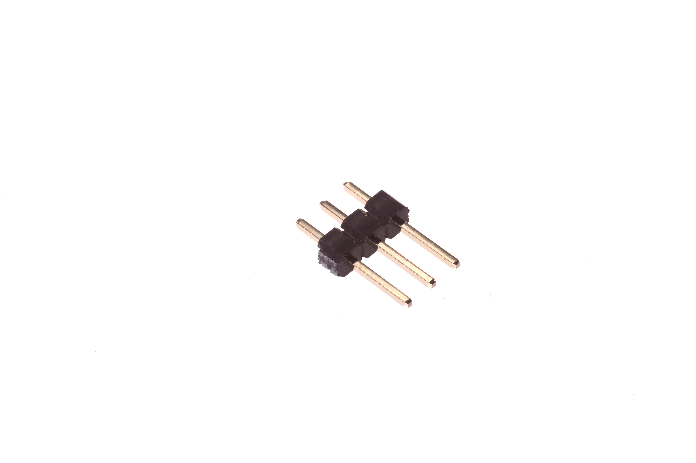
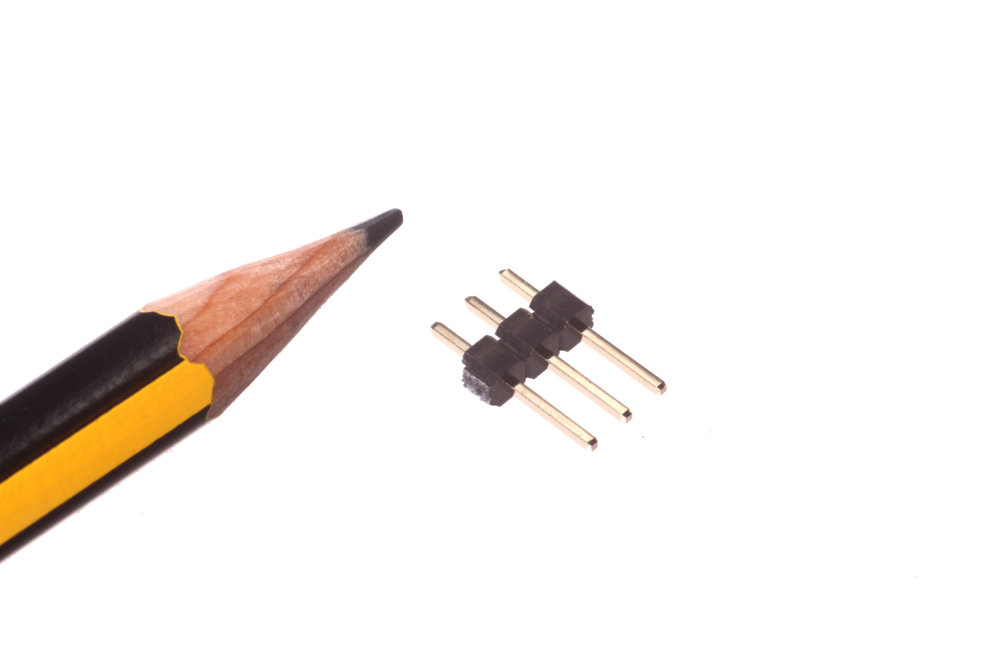
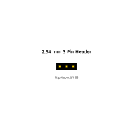
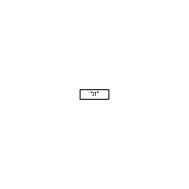
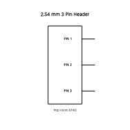
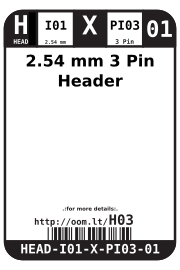
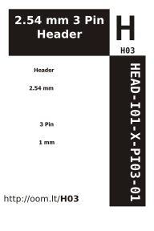

Contents
========

* [HEAD-I01-X-PI03-01>2.54 mm 3 Pin Header](#head-i01-x-pi03-01254-mm-3-pin-header)
	* [Images](#images)
	* [Diagrams](#diagrams)
	* [Datasheets](#datasheets)
	* [Labels](#labels)
	* [EDA](#eda)
		* [Footprints](#footprints)
	* [Footprints](#footprints)
		* [Symbols](#symbols)
	* [Footprints](#footprints)
	* [Tags](#tags)
  
![][im]
# HEAD-I01-X-PI03-01>2.54 mm 3 Pin Header

- ID: HEAD-I01-X-PI03-01
- Name: HEAD-I01-X-PI03-01

## Images
  
  

|Main|Reference|
| :---: | :---: |
|||

## Diagrams
  
  

|Breadboard Layout|Diagram|Identifier|Schematic|Simple|
| :---: | :---: | :---: | :---: | :---: |
||||||

## Datasheets

- Datasheet: [datasheet.pdf](datasheet.pdf)

## Labels
  
  

|Front|Inventory|Specifications|
| :---: | :---: | :---: |
||||

## EDA

### Footprints

## Footprints
  
  

|kicadFootprint Connector_PinHeader_2.54mm/PinHeader_1x03_P2.54mm_Vertical|sparkfunFootprint Sparkfun-Connectors/1X03_LOCK|sparkfunFootprint Sparkfun-Connectors/1X03_LOCK_LONGPADS|sparkfunFootprint Sparkfun-Connectors/1X03_NO_SILK|sparkfunFootprint Sparkfun-Connectors/1X03_PP_HOLES_ONLY|
| :---: | :---: | :---: | :---: | :---: |
||||||

### Symbols

## Footprints
  
  

|kicadSymbol Connector/Conn_01x03_Male|
| :---: |
||

## Tags

- index: 4
- oompType: HEAD
- oompSize: I01
- oompColor: X
- oompDesc: PI03
- oompIndex: 01
- hexID: H03
- oompSort: 
- oompClass: Through Hole
- oompClassCode: THTH
- ooPitch: 2.54
- ooPinHeight: 11.60
- ooPinWidth: 0.64
- ooPinOffset: 1.53
- oompBbls: variable;pins;3
- oompBbls: template;XXXX-I01-X-XX-01-bbls
- oompDiag: variable;pins;3
- oompDiag: template;HEAD-I01-X-XX-01-diag
- oompIden: variable;pins;3
- oompIden: template;XXXX-I01-X-XX-01-iden
- oompSchem: variable;pins;3
- oompSchem: template;XXXX-XX-X-XX-01-PINS-ODD-schem
- oompSimp: variable;pins;3
- oompSimp: template;XXXX-I01-X-XX-01-simp
- ooNumPins: 3
- ooFootprint: OOMP-HEAD-I01-X-PI03-01
- ooDesignator: J1
- schematicSymbol: HEAD-XX-X-PI03-XX
- pcbFootprint: HEAD-I01-X-PI03-01
- kicadSymbol: Connector/Conn_01x03_Male
- kicadFootprint: Connector_PinHeader_2.54mm/PinHeader_1x03_P2.54mm_Vertical
- sparkfunFootprint: Sparkfun-Connectors/1X03_LOCK
- sparkfunFootprint: Sparkfun-Connectors/1X03_LOCK_LONGPADS
- sparkfunFootprint: Sparkfun-Connectors/1X03_NO_SILK
- sparkfunFootprint: Sparkfun-Connectors/1X03_PP_HOLES_ONLY

[im]: image_600.jpg
