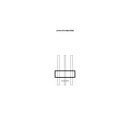
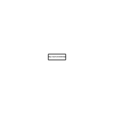
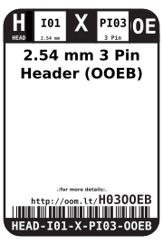
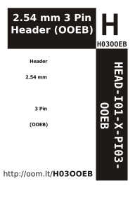

Contents
========

* [HEAD-I01-X-PI03-OOEB>2.54 mm 3 Pin Header (OOEB)](#head-i01-x-pi03-ooeb254-mm-3-pin-header-ooeb)
	* [Diagrams](#diagrams)
	* [Labels](#labels)
	* [EDA](#eda)
		* [Symbols](#symbols)
	* [Tags](#tags)

# HEAD-I01-X-PI03-OOEB>2.54 mm 3 Pin Header (OOEB)

- ID: HEAD-I01-X-PI03-OOEB
- Name: HEAD-I01-X-PI03-OOEB

## Diagrams
  
  

|Breadboard Layout|Diagram|Identifier|Schematic|Simple|
| :---: | :---: | :---: | :---: | :---: |
||||||

## Labels
  
  

|label-front|label-inventory|label-spec|
| :---: | :---: | :---: |
||||

## EDA

### Symbols

## Tags

- oompType: HEAD
- oompSize: I01
- oompColor: X
- oompDesc: PI03
- oompIndex: OOEB
- hexID: H03OOEB
- oompSort: 
- oompClass: Through Hole
- oompClassCode: THTH
- ooPitch: 2.54
- ooPinHeight: 11.60
- ooPinWidth: 0.64
- ooPinOffset: 1.53
- ooNumPins: 3
- oompBbls: variable;clear
- oompBbls: variable;pins;3
- oompBbls: template;XXXX-I01-X-XX-OOEB-bbls
- oompDiag: variable;clear
- oompDiag: variable;pins;3
- oompDiag: template;HEAD-I01-X-XX-01-diag
- oompIden: variable;clear
- oompIden: variable;pins;3
- drawItem: template;XXXX-I01-X-XX-01-iden
- oompSchem: variable;clear
- oompSchem: variable;pins;3
- oompSchem: template;XXXX-XX-X-XX-01-PINS-ODD-schem
- oompSimp: variable;clear
- oompSimp: variable;pins;3
- oompSimp: template;XXXX-I01-X-XX-01-simp
- ooDesignator: J1
- schematicSymbol: HEAD-XX-X-PI03-XX
- pcbFootprint: HEAD-I01-X-PI03-01
- kicadSymbol: Connector>Conn_01x03_Male
- kicadFootprint: Connector_PinHeader_2.54mm:PinHeader_1x03_P2.54mm_Vertical
- oompID: HEAD-I01-X-PI03-OOEB
