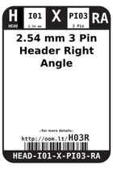
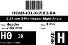
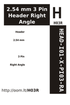
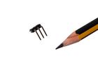

Contents
========

* [HR03 > 2.54 mm 3 Pin Header Right Angle](#hr03--254-mm-3-pin-header-right-angle)
	* [Diagrams](#diagrams)
	* [Datasheets](#datasheets)
	* [Labels](#labels)
	* [EDA](#eda)
	* [Images](#images)
	* [Tags](#tags)
  
![][im]
# HR03 > 2.54 mm 3 Pin Header Right Angle

- ID: HEAD-I01-X-PI03-RA
- Hex ID: HR03
- Name: 2.54 mm 3 Pin Header Right Angle
- Description: 2.54 mm 3 Pin Header Right Angle
- Long Link: [http://oom.lt/HEAD-I01-X-PI03-RA](http://oom.lt/HEAD-I01-X-PI03-RA)
- Short Link: [http://oom.lt/HR03](http://oom.lt/HR03)

## Diagrams
  
  

|diagBBLS|diagDIAG|diagIDEN|diagSCHEM|diagSIMP|
| :---: | :---: | :---: | :---: | :---: |
||||||

## Datasheets

- Datasheet: [datasheet.pdf](datasheet.pdf)

## Labels
  
  

|label-front|label-inventory|label-spec|
| :---: | :---: | :---: |
||||

## EDA

### Footprints
  

|  [kicad/kicad-footprints/Connector_PinHeader_2.54mm/PinHeader_1x03_P2.54mm_Vertical](https://github.com/oomlout/oomlout_OOMP_eda/tree/main/footprints/kicad/kicad-footprints/Connector_PinHeader_2.54mm/PinHeader_1x03_P2.54mm_Vertical/)|  [eagle/SparkFun-Eagle-Libraries-Sparkfun-Connectors-1X03](https://github.com/oomlout/oomlout_OOMP_eda/tree/main/footprints/eagle/SparkFun-Eagle-Libraries-Sparkfun-Connectors-1X03/)|  [eagle/SparkFun-Eagle-Libraries-Sparkfun-Connectors-1X03_LOCK](https://github.com/oomlout/oomlout_OOMP_eda/tree/main/footprints/eagle/SparkFun-Eagle-Libraries-Sparkfun-Connectors-1X03_LOCK/)|  [eagle/SparkFun-Eagle-Libraries-Sparkfun-Connectors-1X03_LOCK_LONGPADS](https://github.com/oomlout/oomlout_OOMP_eda/tree/main/footprints/eagle/SparkFun-Eagle-Libraries-Sparkfun-Connectors-1X03_LOCK_LONGPADS/)|
| :---: | :---: | :---: | :---: |
|  [eagle/SparkFun-Eagle-Libraries-Sparkfun-Connectors-1X03_NO_SILK](https://github.com/oomlout/oomlout_OOMP_eda/tree/main/footprints/eagle/SparkFun-Eagle-Libraries-Sparkfun-Connectors-1X03_NO_SILK/)|  [eagle/SparkFun-Eagle-Libraries-Sparkfun-Connectors-1X03_PP_HOLES_ONLY](https://github.com/oomlout/oomlout_OOMP_eda/tree/main/footprints/eagle/SparkFun-Eagle-Libraries-Sparkfun-Connectors-1X03_PP_HOLES_ONLY/)|  [eagle/FOOTPRINT-eagle-Adafruit-Eagle-Library-adafruit-1X03](https://github.com/oomlout/oomlout_OOMP_eda/tree/main/footprints/eagle/FOOTPRINT-eagle-Adafruit-Eagle-Library-adafruit-1X03/)|  [eagle/FOOTPRINT-eagle-Adafruit-Eagle-Library-adafruit-1X03-CLEANBIG](https://github.com/oomlout/oomlout_OOMP_eda/tree/main/footprints/eagle/FOOTPRINT-eagle-Adafruit-Eagle-Library-adafruit-1X03-CLEANBIG/)|
|||||

### Symbols

## Images
  
  

|image|image_RE|diagBBLS|diagDIAG|diagIDEN|diagSCHEM|diagSIMP|label-front|label-inventory|label-spec|
| :---: | :---: | :---: | :---: | :---: | :---: | :---: | :---: | :---: | :---: |
|||||||||||

## Tags

- oompID: HEAD-I01-X-PI03-RA
- name: 2.54 mm 3 Pin Header Right Angle
- hexID: HR03
- oompSort: HEADI0103PI
- oompType: HEAD
- oompSize: I01
- oompColor: X
- oompDesc: PI03
- oompIndex: RA
- oompVersion: 98
- ooPitch: 2.54
- ooPinHeight: 11.60
- ooPinWidth: 0.64
- ooPinOffset: 1.53
- ooNumPins: 3
- ooFootprint: OOMP-HEAD-I01-X-PI03-RA
- ooDesignator: J1
- footprintEagle: SparkFun-Eagle-Libraries-Sparkfun-Connectors-1X03
- footprintEagle: SparkFun-Eagle-Libraries-Sparkfun-Connectors-1X03_LOCK
- footprintEagle: SparkFun-Eagle-Libraries-Sparkfun-Connectors-1X03_LOCK_LONGPADS
- footprintEagle: SparkFun-Eagle-Libraries-Sparkfun-Connectors-1X03_NO_SILK
- footprintEagle: SparkFun-Eagle-Libraries-Sparkfun-Connectors-1X03_PP_HOLES_ONLY
- footprintEagle: FOOTPRINT-eagle-Adafruit-Eagle-Library-adafruit-1X03
- footprintEagle: FOOTPRINT-eagle-Adafruit-Eagle-Library-adafruit-1X03-CLEANBIG
- footprintKicad: kicad-footprints/Connector_PinHeader_2.54mm/PinHeader_1x03_P2.54mm_Vertical

[im]: image_450.jpg
