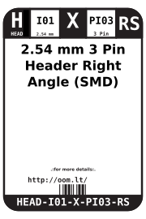
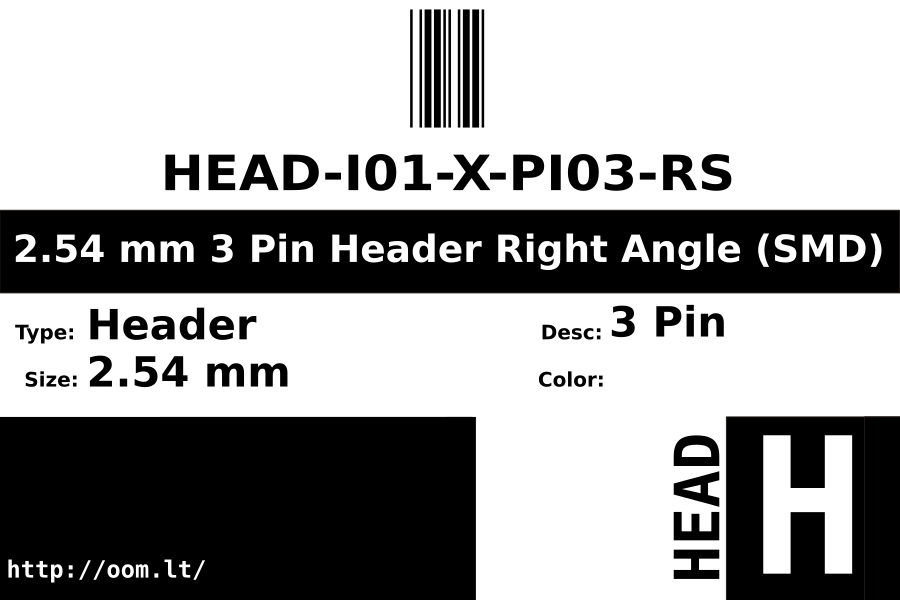
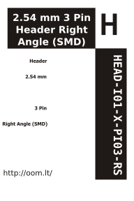

Contents
========

* [HEAD-I01-X-PI03-RS>2.54 mm 3 Pin Header Right Angle (SMD)](#head-i01-x-pi03-rs254-mm-3-pin-header-right-angle-smd)
	* [Datasheets](#datasheets)
	* [Labels](#labels)
	* [EDA](#eda)
		* [Symbols](#symbols)
	* [Tags](#tags)

# HEAD-I01-X-PI03-RS>2.54 mm 3 Pin Header Right Angle (SMD)

- ID: HEAD-I01-X-PI03-RS
- Name: HEAD-I01-X-PI03-RS

## Datasheets

- Datasheet: [datasheet.pdf](datasheet.pdf)

## Labels
  
  

|Front|Inventory|Specifications|
| :---: | :---: | :---: |
||||

## EDA

### Symbols

## Tags

- index: 203
- oompID: HEAD-I01-X-PI03-RS
- name: 2.54 mm 3 Pin Header Right Angle (SMD)
- oompType: HEAD
- oompSize: I01
- oompColor: X
- oompDesc: PI03
- oompIndex: RS
- oompVersion: 999
- ooNumPins: 3
- oompBbls: variable;clear
- oompBbls: variable;pins;3
- oompBbls: template;HEAD-I01-X-XX-RS-bbls
- oompDiag: variable;clear
- oompDiag: variable;pins;3
- oompDiag: template;HEAD-I01-X-XX-RS-diag
- oompIden: variable;clear
- oompIden: variable;pins;3
- oompIden: template;HEAD-I01-X-XX-RS-iden
- oompSimp: variable;clear
- oompSimp: variable;pins;3
- oompSimp: template;HEAD-I01-X-XX-RS-simp
- oompSchem: variable;clear
- oompSchem: variable;pins;3
- oompSchem: template;XXXX-XX-X-XX-01-PINS-EVEN-schem
- ooDesignator: J1
- schematicSymbol: HEAD-XX-X-PI03-XX
- pcbFootprint: HEAD-I01-X-PI03-RS
