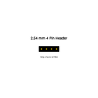
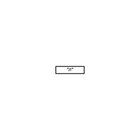
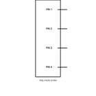
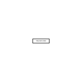
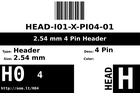
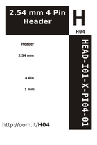
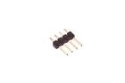
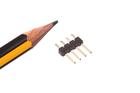

Contents
========

* [H04 > 2.54 mm 4 Pin Header](#h04--254-mm-4-pin-header)
	* [Diagrams](#diagrams)
	* [Datasheets](#datasheets)
	* [Labels](#labels)
	* [EDA](#eda)
	* [Images](#images)
	* [Tags](#tags)
  
![][im]
# H04 > 2.54 mm 4 Pin Header

- ID: HEAD-I01-X-PI04-01
- Hex ID: H04
- Name: 2.54 mm 4 Pin Header
- Description: 2.54 mm 4 Pin Header
- Long Link: [http://oom.lt/HEAD-I01-X-PI04-01](http://oom.lt/HEAD-I01-X-PI04-01)
- Long Link: [http://oom.lt/H04](http://oom.lt/H04)

## Diagrams
  
  

|diagBBLS|diagDIAG|diagIDEN|diagSCHEM|diagSIMP|
| :---: | :---: | :---: | :---: | :---: |
||||||

## Datasheets

- Datasheet: [datasheet.pdf](datasheet.pdf)

## Labels
  
  

|label-front|label-inventory|label-spec|
| :---: | :---: | :---: |
||||

## EDA

### Footprints
  

|  [eagle/SparkFun-Eagle-Libraries/Sparkfun-Connectors/1X04](https://github.com/oomlout/oomlout_OOMP_eda/tree/main/footprints/eagle/SparkFun-Eagle-Libraries/Sparkfun-Connectors/1X04/)|  [eagle/SparkFun-Eagle-Libraries/Sparkfun-Connectors/1X04_LOCK](https://github.com/oomlout/oomlout_OOMP_eda/tree/main/footprints/eagle/SparkFun-Eagle-Libraries/Sparkfun-Connectors/1X04_LOCK/)|  [eagle/SparkFun-Eagle-Libraries/Sparkfun-Connectors/1X04_LOCK_LONGPADS](https://github.com/oomlout/oomlout_OOMP_eda/tree/main/footprints/eagle/SparkFun-Eagle-Libraries/Sparkfun-Connectors/1X04_LOCK_LONGPADS/)|  [eagle/SparkFun-Eagle-Libraries/Sparkfun-Connectors/1X04_NO_SILK](https://github.com/oomlout/oomlout_OOMP_eda/tree/main/footprints/eagle/SparkFun-Eagle-Libraries/Sparkfun-Connectors/1X04_NO_SILK/)|
| :---: | :---: | :---: | :---: |
|||||

### Symbols

## Images
  
  

|image|image_RE|diagBBLS|diagDIAG|diagIDEN|diagSCHEM|diagSIMP|label-front|label-inventory|label-spec|
| :---: | :---: | :---: | :---: | :---: | :---: | :---: | :---: | :---: | :---: |
|||||||||||

## Tags

- oompType: HEAD
- oompSize: I01
- oompColor: X
- oompDesc: PI04
- oompIndex: 01
- hexID: H04
- oompSort: 
- oompClass: Through Hole
- oompClassCode: THTH
- ooPitch: 2.54
- ooPinHeight: 11.60
- ooPinWidth: 0.64
- ooPinOffset: 1.53
- oompBbls: variable;pins;4
- oompBbls: template;XXXX-I01-X-XX-01-bbls
- oompDiag: variable;pins;4
- oompDiag: template;HEAD-I01-X-XX-01-diag
- oompIden: variable;pins;4
- oompIden: template;XXXX-I01-X-XX-01-iden
- oompSchem: variable;pins;4
- oompSchem: template;XXXX-XX-X-XX-01-PINS-EVEN-schem
- oompSimp: variable;pins;4
- oompSimp: template;XXXX-I01-X-XX-01-simp
- ooNumPins: 4
- ooFootprint: OOMP-HEAD-I01-X-PI04-01
- ooDesignator: J1
- schematicSymbol: HEAD-XX-X-PI04-XX
- pcbFootprint: HEAD-I01-X-PI04-01
- kicadSymbol: Connector/Conn_01x04_Male
- footprintEagle: SparkFun-Eagle-Libraries/Sparkfun-Connectors/1X04
- footprintEagle: SparkFun-Eagle-Libraries/Sparkfun-Connectors/1X04_LOCK
- footprintEagle: SparkFun-Eagle-Libraries/Sparkfun-Connectors/1X04_LOCK_LONGPADS
- footprintEagle: SparkFun-Eagle-Libraries/Sparkfun-Connectors/1X04_NO_SILK
- footprintKicad: kicad-footprints/Connector_PinHeader_2.54mm/PinHeader_1x04_P2.54mm_Vertical
- oompID: HEAD-I01-X-PI04-01

[im]: image_450.jpg
