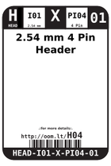

Contents
========

* [H04 > 2.54 mm 4 Pin Header](#h04--254-mm-4-pin-header)
	* [Diagrams](#diagrams)
	* [Datasheets](#datasheets)
	* [Labels](#labels)
	* [EDA](#eda)
	* [Images](#images)
	* [Tags](#tags)
  
![][im]
# H04 > 2.54 mm 4 Pin Header

- ID: HEAD-I01-X-PI04-01
- Hex ID: H04
- Name: 2.54 mm 4 Pin Header
- Description: 2.54 mm 4 Pin Header
- Long Link: [http://oom.lt/HEAD-I01-X-PI04-01](http://oom.lt/HEAD-I01-X-PI04-01)
- Short Link: [http://oom.lt/H04](http://oom.lt/H04)

## Diagrams
  
  

|diagBBLS|diagDIAG|diagIDEN|diagSCHEM|diagSIMP|
| :---: | :---: | :---: | :---: | :---: |
||||||

## Datasheets

- Datasheet: [datasheet.pdf](datasheet.pdf)

## Labels
  
  

|label-front|label-inventory|label-spec|
| :---: | :---: | :---: |
||||

## EDA

### Footprints
  

|  [kicad/kicad-footprints/Connector_PinHeader_2.54mm/PinHeader_1x04_P2.54mm_Vertical](https://github.com/oomlout/oomlout_OOMP_eda/tree/main/footprints/kicad/kicad-footprints/Connector_PinHeader_2.54mm/PinHeader_1x04_P2.54mm_Vertical/)|  [eagle/SparkFun-Eagle-Libraries/Sparkfun-Connectors/1X04](https://github.com/oomlout/oomlout_OOMP_eda/tree/main/footprints/eagle/SparkFun-Eagle-Libraries/Sparkfun-Connectors/1X04/)|  [eagle/SparkFun-Eagle-Libraries/Sparkfun-Connectors/1X04_LOCK](https://github.com/oomlout/oomlout_OOMP_eda/tree/main/footprints/eagle/SparkFun-Eagle-Libraries/Sparkfun-Connectors/1X04_LOCK/)|  [eagle/SparkFun-Eagle-Libraries/Sparkfun-Connectors/1X04_LOCK_LONGPADS](https://github.com/oomlout/oomlout_OOMP_eda/tree/main/footprints/eagle/SparkFun-Eagle-Libraries/Sparkfun-Connectors/1X04_LOCK_LONGPADS/)|
| :---: | :---: | :---: | :---: |
|  [eagle/SparkFun-Eagle-Libraries/Sparkfun-Connectors/1X04_NO_SILK](https://github.com/oomlout/oomlout_OOMP_eda/tree/main/footprints/eagle/SparkFun-Eagle-Libraries/Sparkfun-Connectors/1X04_NO_SILK/)||||

### Instances
  
  
Used 152 times.  
Prevalance: (152\9905) 1.5346%  

|OOMP Instances|
| :---: |
|[PROJ-ADAF-1231-STAN-01  Adafruit_ADXL345_PCB  Used 1 times. JP2](https://github.com/oomlout/oomlout_OOMP_projects/tree/main/PROJ-ADAF-1231-STAN-01/)|
|[PROJ-ADAF-1438-STAN-01  Adafruit Motor Shield V2 PCB  Used 1 times. JP1](https://github.com/oomlout/oomlout_OOMP_projects/tree/main/PROJ-ADAF-1438-STAN-01/)|
|[PROJ-ADAF-1778-STAN-01  Adafruit AD8495 Breakout PCB  Used 1 times. JP1](https://github.com/oomlout/oomlout_OOMP_projects/tree/main/PROJ-ADAF-1778-STAN-01/)|
|[PROJ-ADAF-2218-STAN-01  Adafruit TFP401 HDMI To 40Pin TFT PCB  Used 1 times. JP7](https://github.com/oomlout/oomlout_OOMP_projects/tree/main/PROJ-ADAF-2218-STAN-01/)|
|[PROJ-ADAF-2348-STAN-01  Adafruit DC Stepper Motor HAT PCB  Used 1 times. JP1](https://github.com/oomlout/oomlout_OOMP_projects/tree/main/PROJ-ADAF-2348-STAN-01/)|
|[PROJ-ADAF-2472-STAN-01  Adafruit BNO055 Breakout PCB  Used 1 times. JP2](https://github.com/oomlout/oomlout_OOMP_projects/tree/main/PROJ-ADAF-2472-STAN-01/)|
|[PROJ-ADAF-2745-STAN-01  Adafruit LM3671 Buck Converter PCB  Used 1 times. JP1](https://github.com/oomlout/oomlout_OOMP_projects/tree/main/PROJ-ADAF-2745-STAN-01/)|
|[PROJ-ADAF-3133-STAN-01  Adafruit Ultimate GPS FeatherWing PCB  Used 1 times. JP1](https://github.com/oomlout/oomlout_OOMP_projects/tree/main/PROJ-ADAF-3133-STAN-01/)|
|[PROJ-ADAF-3190-STAN-01  Adafruit DRV8871 Breakout PCB  Used 1 times. JP2](https://github.com/oomlout/oomlout_OOMP_projects/tree/main/PROJ-ADAF-3190-STAN-01/)|
|[PROJ-ADAF-3199-STAN-01  Adafruit MiCS 5524 Gas Sensor Breakout PCB  Used 1 times. JP2](https://github.com/oomlout/oomlout_OOMP_projects/tree/main/PROJ-ADAF-3199-STAN-01/)|
|[PROJ-ADAF-3246-STAN-01  Adafruit Mini Analog Thumbstick Breakout PCB  Used 2 times. JP1, JP2](https://github.com/oomlout/oomlout_OOMP_projects/tree/main/PROJ-ADAF-3246-STAN-01/)|
|[PROJ-ADAF-3356-STAN-01  Adafruit Animated Eyes Bonnet PCB  Used 3 times. JP8, JP9, JP10](https://github.com/oomlout/oomlout_OOMP_projects/tree/main/PROJ-ADAF-3356-STAN-01/)|
|[PROJ-ADAF-3422-STAN-01  Adafruit Arcade Bonnet PCB  Used 1 times. JP1](https://github.com/oomlout/oomlout_OOMP_projects/tree/main/PROJ-ADAF-3422-STAN-01/)|
|[PROJ-ADAF-3463-STAN-01  Adafruit FXOS8700 FXAS21002 9 DoF Breakout PCB  Used 1 times. JP2](https://github.com/oomlout/oomlout_OOMP_projects/tree/main/PROJ-ADAF-3463-STAN-01/)|
|[PROJ-ADAF-3661-STAN-01  Adafruit AP3602A PCB  Used 1 times. JP1](https://github.com/oomlout/oomlout_OOMP_projects/tree/main/PROJ-ADAF-3661-STAN-01/)|
|[PROJ-ADAF-3988-STAN-01  Adafruit Prop Maker FeatherWing PCB  Used 1 times. JP5](https://github.com/oomlout/oomlout_OOMP_projects/tree/main/PROJ-ADAF-3988-STAN-01/)|
|[PROJ-ADAF-4022-STAN-01  Adafruit MLX90393 PCB  Used 1 times. JP2](https://github.com/oomlout/oomlout_OOMP_projects/tree/main/PROJ-ADAF-4022-STAN-01/)|
|[PROJ-ADAF-4286-STAN-01  Adafruit DS3502 PCB  Used 1 times. JP1](https://github.com/oomlout/oomlout_OOMP_projects/tree/main/PROJ-ADAF-4286-STAN-01/)|
|[PROJ-ADAF-4314-STAN-01  Adafruit ATECC608 PCB  Used 1 times. JP2](https://github.com/oomlout/oomlout_OOMP_projects/tree/main/PROJ-ADAF-4314-STAN-01/)|
|[PROJ-ADAF-4413-STAN-01  Adafruit LSM303AGR PCB  Used 1 times. JP3](https://github.com/oomlout/oomlout_OOMP_projects/tree/main/PROJ-ADAF-4413-STAN-01/)|
|[PROJ-ADAF-4479-STAN-01  Adafruit LIS3MDL PCB  Used 1 times. JP1](https://github.com/oomlout/oomlout_OOMP_projects/tree/main/PROJ-ADAF-4479-STAN-01/)|
|[PROJ-ADAF-4480-STAN-01  Adafruit LSM6DS33 PCB  Used 1 times. JP1](https://github.com/oomlout/oomlout_OOMP_projects/tree/main/PROJ-ADAF-4480-STAN-01/)|
|[PROJ-ADAF-4485-STAN-01  Adafruit LSM6DS33 LIS3MDL PCB  Used 1 times. JP1](https://github.com/oomlout/oomlout_OOMP_projects/tree/main/PROJ-ADAF-4485-STAN-01/)|
|[PROJ-ADAF-4566-STAN-01  Adafruit AHT20 PCB  Used 1 times. JP2](https://github.com/oomlout/oomlout_OOMP_projects/tree/main/PROJ-ADAF-4566-STAN-01/)|
|[PROJ-ADAF-4569-STAN-01  Adafruit ISM330DHCX LIS3MDL FeatherWing PCB  Used 3 times. JP1, JP4, MAG_HDR](https://github.com/oomlout/oomlout_OOMP_projects/tree/main/PROJ-ADAF-4569-STAN-01/)|
|[PROJ-ADAF-4570-STAN-01  Adafruit DS1841 PCB  Used 1 times. JP1](https://github.com/oomlout/oomlout_OOMP_projects/tree/main/PROJ-ADAF-4570-STAN-01/)|
|[PROJ-ADAF-4654-STAN-01  Adafruit TPS61023 PCB  Used 1 times. JP1](https://github.com/oomlout/oomlout_OOMP_projects/tree/main/PROJ-ADAF-4654-STAN-01/)|
|[PROJ-ADAF-4683-STAN-01  Adafruit MPM3610 PCB  Used 1 times. JP1](https://github.com/oomlout/oomlout_OOMP_projects/tree/main/PROJ-ADAF-4683-STAN-01/)|
|[PROJ-ADAF-4711-STAN-01  Adafruit AP3429A PCB  Used 1 times. JP1](https://github.com/oomlout/oomlout_OOMP_projects/tree/main/PROJ-ADAF-4711-STAN-01/)|
|[PROJ-ADAF-4808-STAN-01  Adafruit EMC2101 PCB  Used 1 times. JP2](https://github.com/oomlout/oomlout_OOMP_projects/tree/main/PROJ-ADAF-4808-STAN-01/)|
|[PROJ-ADAF-4903-STAN-01  Adafruit ISO1540 PCB  Used 2 times. JP1, JP2](https://github.com/oomlout/oomlout_OOMP_projects/tree/main/PROJ-ADAF-4903-STAN-01/)|
|[PROJ-ADAF-4920-STAN-01  Adafruit TPS62827 PCB  Used 1 times. JP1](https://github.com/oomlout/oomlout_OOMP_projects/tree/main/PROJ-ADAF-4920-STAN-01/)|
|[PROJ-ADAF-4979-STAN-01  Adafruit NeoKey FeatherWing PCB  Used 1 times. JP1](https://github.com/oomlout/oomlout_OOMP_projects/tree/main/PROJ-ADAF-4979-STAN-01/)|
|[PROJ-ADAF-5146-STAN-01  Adafruit 24LC32 PCB  Used 1 times. JP3](https://github.com/oomlout/oomlout_OOMP_projects/tree/main/PROJ-ADAF-5146-STAN-01/)|
|[PROJ-ADAF-5159-STAN-01  Adafruit TCA4307 PCB  Used 1 times. JP2](https://github.com/oomlout/oomlout_OOMP_projects/tree/main/PROJ-ADAF-5159-STAN-01/)|
|[PROJ-ADAF-5374-STAN-01  Adafruit_ADXL375_PCB  Used 1 times. JP2](https://github.com/oomlout/oomlout_OOMP_projects/tree/main/PROJ-ADAF-5374-STAN-01/)|
|[PROJ-ADAF-572-STAN-01  Adafruit BeagleBone ProtoBoard PCB  Used 2 times. JP9, JP10](https://github.com/oomlout/oomlout_OOMP_projects/tree/main/PROJ-ADAF-572-STAN-01/)|
|[PROJ-ADAF-91-STAN-01  Adafruit_USB_Boarduino_PCB  Used 1 times. JP4](https://github.com/oomlout/oomlout_OOMP_projects/tree/main/PROJ-ADAF-91-STAN-01/)|
|[PROJ-SPAR-10124-STAN-01  RS-485 Breakout  Used 1 times. JP1](https://github.com/oomlout/oomlout_OOMP_projects/tree/main/PROJ-SPAR-10124-STAN-01/)|
|[PROJ-SPAR-10467-STAN-01  LED Tactile Button Breakout  Used 1 times. JP1](https://github.com/oomlout/oomlout_OOMP_projects/tree/main/PROJ-SPAR-10467-STAN-01/)|
|[PROJ-SPAR-10530-STAN-01  Triple Axis Magnetometer-HMC5883L  Used 1 times. JP1](https://github.com/oomlout/oomlout_OOMP_projects/tree/main/PROJ-SPAR-10530-STAN-01/)|
|[PROJ-SPAR-10864-STAN-01  PoEthernet Shield  Used 1 times. JP1](https://github.com/oomlout/oomlout_OOMP_projects/tree/main/PROJ-SPAR-10864-STAN-01/)|
|[PROJ-SPAR-10888-STAN-01  LSM303 Breakout  Used 2 times. JP2, JP5](https://github.com/oomlout/oomlout_OOMP_projects/tree/main/PROJ-SPAR-10888-STAN-01/)|
|[PROJ-SPAR-10889-STAN-01  ProtoSnap-Pro Mini  Used 1 times. JP8](https://github.com/oomlout/oomlout_OOMP_projects/tree/main/PROJ-SPAR-10889-STAN-01/)|
|[PROJ-SPAR-10920-STAN-01  Venus GPS Logger SMA  Used 1 times. JP1](https://github.com/oomlout/oomlout_OOMP_projects/tree/main/PROJ-SPAR-10920-STAN-01/)|
|[PROJ-SPAR-11058-STAN-01  Venus GPS SMA Connector  Used 4 times. JP1, JP2, JP3, JP4](https://github.com/oomlout/oomlout_OOMP_projects/tree/main/PROJ-SPAR-11058-STAN-01/)|
|[PROJ-SPAR-11197-STAN-01  ATmega128RFA1 Dev  Used 1 times. JP2](https://github.com/oomlout/oomlout_OOMP_projects/tree/main/PROJ-SPAR-11197-STAN-01/)|
|[PROJ-SPAR-11446-STAN-01  ADXL362 Breakout  Used 2 times. JP1, JP2](https://github.com/oomlout/oomlout_OOMP_projects/tree/main/PROJ-SPAR-11446-STAN-01/)|
|[PROJ-SPAR-11509-STAN-01  Papilio Button LED Wing  Used 1 times. JP1](https://github.com/oomlout/oomlout_OOMP_projects/tree/main/PROJ-SPAR-11509-STAN-01/)|
|[PROJ-SPAR-11525-STAN-01  P8X32A Breakout  Used 1 times. JP1](https://github.com/oomlout/oomlout_OOMP_projects/tree/main/PROJ-SPAR-11525-STAN-01/)|
|[PROJ-SPAR-11561-STAN-01  RaspiRobot  Used 2 times. JP7, JP8](https://github.com/oomlout/oomlout_OOMP_projects/tree/main/PROJ-SPAR-11561-STAN-01/)|
|[PROJ-SPAR-11568-STAN-01  Papilio Audio Wing  Used 1 times. JP1](https://github.com/oomlout/oomlout_OOMP_projects/tree/main/PROJ-SPAR-11568-STAN-01/)|
|[PROJ-SPAR-11569-STAN-01  Papilio VGA Wing  Used 1 times. JP1](https://github.com/oomlout/oomlout_OOMP_projects/tree/main/PROJ-SPAR-11569-STAN-01/)|
|[PROJ-SPAR-11570-STAN-01  TRRS 3.5mm Jack Breakout  Used 1 times. JP1](https://github.com/oomlout/oomlout_OOMP_projects/tree/main/PROJ-SPAR-11570-STAN-01/)|
|[PROJ-SPAR-11703-STAN-01  UDB5  Used 3 times. JP6, JP11, JP16](https://github.com/oomlout/oomlout_OOMP_projects/tree/main/PROJ-SPAR-11703-STAN-01/)|
|[PROJ-SPAR-11801-STAN-01  Tiny-AVR-Programmer  Used 4 times. JP1, JP2, JP3, JP4](https://github.com/oomlout/oomlout_OOMP_projects/tree/main/PROJ-SPAR-11801-STAN-01/)|
|[PROJ-SPAR-11924-STAN-01  Purpletooth Jamboree  Used 2 times. JP10, JP15](https://github.com/oomlout/oomlout_OOMP_projects/tree/main/PROJ-SPAR-11924-STAN-01/)|
|[PROJ-SPAR-12000-STAN-01  WAV Trigger  Used 1 times. J8](https://github.com/oomlout/oomlout_OOMP_projects/tree/main/PROJ-SPAR-12000-STAN-01/)|
|[PROJ-SPAR-12011-STAN-01  Tilt-a-Whirl Breakout  Used 1 times. JP1](https://github.com/oomlout/oomlout_OOMP_projects/tree/main/PROJ-SPAR-12011-STAN-01/)|
|[PROJ-SPAR-12041-STAN-01  AT42QT1010 Capacitive Touch Breakout  Used 2 times. J1, JP6](https://github.com/oomlout/oomlout_OOMP_projects/tree/main/PROJ-SPAR-12041-STAN-01/)|
|[PROJ-SPAR-12071-STAN-01  CC3000 WiFi Shield  Used 1 times. JP5](https://github.com/oomlout/oomlout_OOMP_projects/tree/main/PROJ-SPAR-12071-STAN-01/)|
|[PROJ-SPAR-12651-STAN-01  Digital Sandbox  Used 1 times. JP3](https://github.com/oomlout/oomlout_OOMP_projects/tree/main/PROJ-SPAR-12651-STAN-01/)|
|[PROJ-SPAR-12700-STAN-01  USB Type A Female Breakout  Used 1 times. JP2](https://github.com/oomlout/oomlout_OOMP_projects/tree/main/PROJ-SPAR-12700-STAN-01/)|
|[PROJ-SPAR-12705-STAN-01  ML8511 Breakout  Used 1 times. JP2](https://github.com/oomlout/oomlout_OOMP_projects/tree/main/PROJ-SPAR-12705-STAN-01/)|
|[PROJ-SPAR-12731-STAN-01  FT232RL USB Breakout  Used 1 times. JP3](https://github.com/oomlout/oomlout_OOMP_projects/tree/main/PROJ-SPAR-12731-STAN-01/)|
|[PROJ-SPAR-12772-STAN-01  Logomatic  Used 1 times. JP4](https://github.com/oomlout/oomlout_OOMP_projects/tree/main/PROJ-SPAR-12772-STAN-01/)|
|[PROJ-SPAR-12773-STAN-01  CryptoCape  Used 1 times. JP6](https://github.com/oomlout/oomlout_OOMP_projects/tree/main/PROJ-SPAR-12773-STAN-01/)|
|[PROJ-SPAR-12779-STAN-01  Easy Driver  Used 1 times. JP3](https://github.com/oomlout/oomlout_OOMP_projects/tree/main/PROJ-SPAR-12779-STAN-01/)|
|[PROJ-SPAR-12859-STAN-01  Big Easy Driver  Used 3 times. JP3, JP10, JP14](https://github.com/oomlout/oomlout_OOMP_projects/tree/main/PROJ-SPAR-12859-STAN-01/)|
|[PROJ-SPAR-12885-STAN-01  SunnyBuddy  Used 1 times. J4](https://github.com/oomlout/oomlout_OOMP_projects/tree/main/PROJ-SPAR-12885-STAN-01/)|
|[PROJ-SPAR-12916-STAN-01  HMC6343 Breakout  Used 1 times. JP1](https://github.com/oomlout/oomlout_OOMP_projects/tree/main/PROJ-SPAR-12916-STAN-01/)|
|[PROJ-SPAR-12918-STAN-01  MCP4725 Breakout  Used 1 times. JP5](https://github.com/oomlout/oomlout_OOMP_projects/tree/main/PROJ-SPAR-12918-STAN-01/)|
|[PROJ-SPAR-13034-STAN-01  Edison I2C Breakout Block  Used 1 times. JP2](https://github.com/oomlout/oomlout_OOMP_projects/tree/main/PROJ-SPAR-13034-STAN-01/)|
|[PROJ-SPAR-13067-STAN-01  MiP Proto-Pack  Used 1 times. JP1](https://github.com/oomlout/oomlout_OOMP_projects/tree/main/PROJ-SPAR-13067-STAN-01/)|
|[PROJ-SPAR-13284-STAN-01  LSM9DS1 Breakout  Used 1 times. JP1](https://github.com/oomlout/oomlout_OOMP_projects/tree/main/PROJ-SPAR-13284-STAN-01/)|
|[PROJ-SPAR-13288-STAN-01  Teensy Arduino Shield Adapter  Used 1 times. JP8](https://github.com/oomlout/oomlout_OOMP_projects/tree/main/PROJ-SPAR-13288-STAN-01/)|
|[PROJ-SPAR-13310-STAN-01  Ludus ProtoShield  Used 4 times. JP20, JP21, JP22, JP23](https://github.com/oomlout/oomlout_OOMP_projects/tree/main/PROJ-SPAR-13310-STAN-01/)|
|[PROJ-SPAR-13598-STAN-01  Photon Proto Shield  Used 1 times. JP2](https://github.com/oomlout/oomlout_OOMP_projects/tree/main/PROJ-SPAR-13598-STAN-01/)|
|[PROJ-SPAR-13630-STAN-01  Photon Weather Shield  Used 2 times. JP1, JP4](https://github.com/oomlout/oomlout_OOMP_projects/tree/main/PROJ-SPAR-13630-STAN-01/)|
|[PROJ-SPAR-13676-STAN-01  SparkFun BME280 Breakout Board  Used 1 times. JP1](https://github.com/oomlout/oomlout_OOMP_projects/tree/main/PROJ-SPAR-13676-STAN-01/)|
|[PROJ-SPAR-13683-STAN-01  SHT15 Breakout  Used 1 times. JP1](https://github.com/oomlout/oomlout_OOMP_projects/tree/main/PROJ-SPAR-13683-STAN-01/)|
|[PROJ-SPAR-13716-STAN-01  FemtoBuck  Used 1 times. JP1](https://github.com/oomlout/oomlout_OOMP_projects/tree/main/PROJ-SPAR-13716-STAN-01/)|
|[PROJ-SPAR-13762-STAN-01  MPU-9250 Breakout  Used 2 times. J1, J3](https://github.com/oomlout/oomlout_OOMP_projects/tree/main/PROJ-SPAR-13762-STAN-01/)|
|[PROJ-SPAR-13763-STAN-01  Si7021 Breakout  Used 1 times. JP1](https://github.com/oomlout/oomlout_OOMP_projects/tree/main/PROJ-SPAR-13763-STAN-01/)|
|[PROJ-SPAR-13777-STAN-01  Battery Babysitter  Used 1 times. JP10](https://github.com/oomlout/oomlout_OOMP_projects/tree/main/PROJ-SPAR-13777-STAN-01/)|
|[PROJ-SPAR-13819-STAN-01  Arduino ProtoShield Bare PCB  Used 1 times. VDD_RAIL](https://github.com/oomlout/oomlout_OOMP_projects/tree/main/PROJ-SPAR-13819-STAN-01/)|
|[PROJ-SPAR-13884-STAN-01  LP55231 Breakout  Used 3 times. J2, J3, J4](https://github.com/oomlout/oomlout_OOMP_projects/tree/main/PROJ-SPAR-13884-STAN-01/)|
|[PROJ-SPAR-13944-STAN-01  9DOF Sensor Stick  Used 1 times. J2](https://github.com/oomlout/oomlout_OOMP_projects/tree/main/PROJ-SPAR-13944-STAN-01/)|
|[PROJ-SPAR-13968-STAN-01  OpenPIR  Used 1 times. J8](https://github.com/oomlout/oomlout_OOMP_projects/tree/main/PROJ-SPAR-13968-STAN-01/)|
|[PROJ-SPAR-14002-STAN-01  THAT 1206 Breakout  Used 1 times. J6](https://github.com/oomlout/oomlout_OOMP_projects/tree/main/PROJ-SPAR-14002-STAN-01/)|
|[PROJ-SPAR-14003-STAN-01  THAT 1646 Breakout  Used 1 times. J1](https://github.com/oomlout/oomlout_OOMP_projects/tree/main/PROJ-SPAR-14003-STAN-01/)|
|[PROJ-SPAR-14129-STAN-01  Ardumoto-Motor Driver Shield  Used 1 times. J8](https://github.com/oomlout/oomlout_OOMP_projects/tree/main/PROJ-SPAR-14129-STAN-01/)|
|[PROJ-SPAR-14153-STAN-01  ESP32 Environment Sensor Shield  Used 1 times. J8](https://github.com/oomlout/oomlout_OOMP_projects/tree/main/PROJ-SPAR-14153-STAN-01/)|
|[PROJ-SPAR-14193-STAN-01  CCS811 Air Quality Breakout  Used 1 times. J8](https://github.com/oomlout/oomlout_OOMP_projects/tree/main/PROJ-SPAR-14193-STAN-01/)|
|[PROJ-SPAR-14285-STAN-01  Wireless Motor Driver Shield  Used 3 times. J2, JP21, JP22](https://github.com/oomlout/oomlout_OOMP_projects/tree/main/PROJ-SPAR-14285-STAN-01/)|
|[PROJ-SPAR-14347-STAN-01  Qwiic Spectral Sensor AS726X  Used 1 times. J8](https://github.com/oomlout/oomlout_OOMP_projects/tree/main/PROJ-SPAR-14347-STAN-01/)|
|[PROJ-SPAR-14348-STAN-01  Qwiic BME280 CCS811 Combo  Used 1 times. J4](https://github.com/oomlout/oomlout_OOMP_projects/tree/main/PROJ-SPAR-14348-STAN-01/)|
|[PROJ-SPAR-14349-STAN-01  Qwiic Human Presence Sensor Breakout AK9753  Used 1 times. J3](https://github.com/oomlout/oomlout_OOMP_projects/tree/main/PROJ-SPAR-14349-STAN-01/)|
|[PROJ-SPAR-14350-STAN-01  APDS-9301 Breakout  Used 1 times. J1](https://github.com/oomlout/oomlout_OOMP_projects/tree/main/PROJ-SPAR-14350-STAN-01/)|
|[PROJ-SPAR-14414-STAN-01  SparkFun GPS Breakout XA1110 Qwiic  Used 1 times. J3](https://github.com/oomlout/oomlout_OOMP_projects/tree/main/PROJ-SPAR-14414-STAN-01/)|
|[PROJ-SPAR-14430-STAN-01  ESP32 Motion Shield  Used 1 times. J4](https://github.com/oomlout/oomlout_OOMP_projects/tree/main/PROJ-SPAR-14430-STAN-01/)|
|[PROJ-SPAR-14449-STAN-01  Variable Load  Used 1 times. J7](https://github.com/oomlout/oomlout_OOMP_projects/tree/main/PROJ-SPAR-14449-STAN-01/)|
|[PROJ-SPAR-14459-STAN-01  Qwiic Hat for Raspberry Pi  Used 2 times. J3, J5](https://github.com/oomlout/oomlout_OOMP_projects/tree/main/PROJ-SPAR-14459-STAN-01/)|
|[PROJ-SPAR-14477-STAN-01  Qwiic Shield for Photon  Used 1 times. JP2](https://github.com/oomlout/oomlout_OOMP_projects/tree/main/PROJ-SPAR-14477-STAN-01/)|
|[PROJ-SPAR-14480-STAN-01  Triple Axis Accelerometer Breakout-H3LIS331DL  Used 2 times. J1, J2](https://github.com/oomlout/oomlout_OOMP_projects/tree/main/PROJ-SPAR-14480-STAN-01/)|
|[PROJ-SPAR-14495-STAN-01  Qwiic Adapter  Used 1 times. J4](https://github.com/oomlout/oomlout_OOMP_projects/tree/main/PROJ-SPAR-14495-STAN-01/)|
|[PROJ-SPAR-14532-STAN-01  Qwiic Micro OLED  Used 1 times. J3](https://github.com/oomlout/oomlout_OOMP_projects/tree/main/PROJ-SPAR-14532-STAN-01/)|
|[PROJ-SPAR-14554-STAN-01  Papa Soundie Audio Player  Used 1 times. J7](https://github.com/oomlout/oomlout_OOMP_projects/tree/main/PROJ-SPAR-14554-STAN-01/)|
|[PROJ-SPAR-14587-STAN-01  Qwiic Accelerometer MMA8452Q  Used 1 times. J5](https://github.com/oomlout/oomlout_OOMP_projects/tree/main/PROJ-SPAR-14587-STAN-01/)|
|[PROJ-SPAR-14589-STAN-01  SparkFun Differential I2C Breakout PCA9615 Qwiic  Used 1 times. J6](https://github.com/oomlout/oomlout_OOMP_projects/tree/main/PROJ-SPAR-14589-STAN-01/)|
|[PROJ-SPAR-14607-STAN-01  Qwiic GRIDEye  Used 1 times. J3](https://github.com/oomlout/oomlout_OOMP_projects/tree/main/PROJ-SPAR-14607-STAN-01/)|
|[PROJ-SPAR-14686-STAN-01  Qwiic IMU BNO080  Used 1 times. J3](https://github.com/oomlout/oomlout_OOMP_projects/tree/main/PROJ-SPAR-14686-STAN-01/)|
|[PROJ-SPAR-14691-STAN-01  Qwiic Transparent OLED HUD  Used 1 times. J2](https://github.com/oomlout/oomlout_OOMP_projects/tree/main/PROJ-SPAR-14691-STAN-01/)|
|[PROJ-SPAR-14722-STAN-01  Qwiic Distance VL53L1X  Used 1 times. J3](https://github.com/oomlout/oomlout_OOMP_projects/tree/main/PROJ-SPAR-14722-STAN-01/)|
|[PROJ-SPAR-14765-STAN-01  Single Supply Logic Level Converter  Used 3 times. J1, J2, JP3](https://github.com/oomlout/oomlout_OOMP_projects/tree/main/PROJ-SPAR-14765-STAN-01/)|
|[PROJ-SPAR-14843-STAN-01  Qwiic IR Array MLX90640  Used 1 times. J3](https://github.com/oomlout/oomlout_OOMP_projects/tree/main/PROJ-SPAR-14843-STAN-01/)|
|[PROJ-SPAR-15005-STAN-01  Qwiic GPS-RTK  Used 1 times. J3](https://github.com/oomlout/oomlout_OOMP_projects/tree/main/PROJ-SPAR-15005-STAN-01/)|

### Symbols

## Images
  
  

|image|image_RE|diagBBLS|diagDIAG|diagIDEN|diagSCHEM|diagSIMP|label-front|label-inventory|label-spec|
| :---: | :---: | :---: | :---: | :---: | :---: | :---: | :---: | :---: | :---: |
|||||||||||

## Tags

- oompType: HEAD
- oompSize: I01
- oompColor: X
- oompDesc: PI04
- oompIndex: 01
- hexID: H04
- oompSort: 
- oompClass: Through Hole
- oompClassCode: THTH
- ooPitch: 2.54
- ooPinHeight: 11.60
- ooPinWidth: 0.64
- ooPinOffset: 1.53
- oompBbls: variable;pins;4
- oompBbls: template;XXXX-I01-X-XX-01-bbls
- oompDiag: variable;pins;4
- oompDiag: template;HEAD-I01-X-XX-01-diag
- oompIden: variable;pins;4
- oompIden: template;XXXX-I01-X-XX-01-iden
- oompSchem: variable;pins;4
- oompSchem: template;XXXX-XX-X-XX-01-PINS-EVEN-schem
- oompSimp: variable;pins;4
- oompSimp: template;XXXX-I01-X-XX-01-simp
- ooNumPins: 4
- ooFootprint: OOMP-HEAD-I01-X-PI04-01
- ooDesignator: J1
- schematicSymbol: HEAD-XX-X-PI04-XX
- pcbFootprint: HEAD-I01-X-PI04-01
- kicadSymbol: Connector/Conn_01x04_Male
- footprintEagle: SparkFun-Eagle-Libraries/Sparkfun-Connectors/1X04
- footprintEagle: SparkFun-Eagle-Libraries/Sparkfun-Connectors/1X04_LOCK
- footprintEagle: SparkFun-Eagle-Libraries/Sparkfun-Connectors/1X04_LOCK_LONGPADS
- footprintEagle: SparkFun-Eagle-Libraries/Sparkfun-Connectors/1X04_NO_SILK
- footprintKicad: kicad-footprints/Connector_PinHeader_2.54mm/PinHeader_1x04_P2.54mm_Vertical
- oompID: HEAD-I01-X-PI04-01
- oompInstances: {'PROJECT': 'PROJ-ADAF-1231-STAN-01', 'ID': 'JP2'}
- oompInstances: {'PROJECT': 'PROJ-ADAF-1438-STAN-01', 'ID': 'JP1'}
- oompInstances: {'PROJECT': 'PROJ-ADAF-1778-STAN-01', 'ID': 'JP1'}
- oompInstances: {'PROJECT': 'PROJ-ADAF-2218-STAN-01', 'ID': 'JP7'}
- oompInstances: {'PROJECT': 'PROJ-ADAF-2348-STAN-01', 'ID': 'JP1'}
- oompInstances: {'PROJECT': 'PROJ-ADAF-2472-STAN-01', 'ID': 'JP2'}
- oompInstances: {'PROJECT': 'PROJ-ADAF-2745-STAN-01', 'ID': 'JP1'}
- oompInstances: {'PROJECT': 'PROJ-ADAF-3133-STAN-01', 'ID': 'JP1'}
- oompInstances: {'PROJECT': 'PROJ-ADAF-3190-STAN-01', 'ID': 'JP2'}
- oompInstances: {'PROJECT': 'PROJ-ADAF-3199-STAN-01', 'ID': 'JP2'}
- oompInstances: {'PROJECT': 'PROJ-ADAF-3246-STAN-01', 'ID': 'JP1'}
- oompInstances: {'PROJECT': 'PROJ-ADAF-3246-STAN-01', 'ID': 'JP2'}
- oompInstances: {'PROJECT': 'PROJ-ADAF-3356-STAN-01', 'ID': 'JP8'}
- oompInstances: {'PROJECT': 'PROJ-ADAF-3356-STAN-01', 'ID': 'JP9'}
- oompInstances: {'PROJECT': 'PROJ-ADAF-3356-STAN-01', 'ID': 'JP10'}
- oompInstances: {'PROJECT': 'PROJ-ADAF-3422-STAN-01', 'ID': 'JP1'}
- oompInstances: {'PROJECT': 'PROJ-ADAF-3463-STAN-01', 'ID': 'JP2'}
- oompInstances: {'PROJECT': 'PROJ-ADAF-3661-STAN-01', 'ID': 'JP1'}
- oompInstances: {'PROJECT': 'PROJ-ADAF-3988-STAN-01', 'ID': 'JP5'}
- oompInstances: {'PROJECT': 'PROJ-ADAF-4022-STAN-01', 'ID': 'JP2'}
- oompInstances: {'PROJECT': 'PROJ-ADAF-4286-STAN-01', 'ID': 'JP1'}
- oompInstances: {'PROJECT': 'PROJ-ADAF-4314-STAN-01', 'ID': 'JP2'}
- oompInstances: {'PROJECT': 'PROJ-ADAF-4413-STAN-01', 'ID': 'JP3'}
- oompInstances: {'PROJECT': 'PROJ-ADAF-4479-STAN-01', 'ID': 'JP1'}
- oompInstances: {'PROJECT': 'PROJ-ADAF-4480-STAN-01', 'ID': 'JP1'}
- oompInstances: {'PROJECT': 'PROJ-ADAF-4485-STAN-01', 'ID': 'JP1'}
- oompInstances: {'PROJECT': 'PROJ-ADAF-4566-STAN-01', 'ID': 'JP2'}
- oompInstances: {'PROJECT': 'PROJ-ADAF-4569-STAN-01', 'ID': 'JP1'}
- oompInstances: {'PROJECT': 'PROJ-ADAF-4569-STAN-01', 'ID': 'JP4'}
- oompInstances: {'PROJECT': 'PROJ-ADAF-4569-STAN-01', 'ID': 'MAG_HDR'}
- oompInstances: {'PROJECT': 'PROJ-ADAF-4570-STAN-01', 'ID': 'JP1'}
- oompInstances: {'PROJECT': 'PROJ-ADAF-4654-STAN-01', 'ID': 'JP1'}
- oompInstances: {'PROJECT': 'PROJ-ADAF-4683-STAN-01', 'ID': 'JP1'}
- oompInstances: {'PROJECT': 'PROJ-ADAF-4711-STAN-01', 'ID': 'JP1'}
- oompInstances: {'PROJECT': 'PROJ-ADAF-4808-STAN-01', 'ID': 'JP2'}
- oompInstances: {'PROJECT': 'PROJ-ADAF-4903-STAN-01', 'ID': 'JP1'}
- oompInstances: {'PROJECT': 'PROJ-ADAF-4903-STAN-01', 'ID': 'JP2'}
- oompInstances: {'PROJECT': 'PROJ-ADAF-4920-STAN-01', 'ID': 'JP1'}
- oompInstances: {'PROJECT': 'PROJ-ADAF-4979-STAN-01', 'ID': 'JP1'}
- oompInstances: {'PROJECT': 'PROJ-ADAF-5146-STAN-01', 'ID': 'JP3'}
- oompInstances: {'PROJECT': 'PROJ-ADAF-5159-STAN-01', 'ID': 'JP2'}
- oompInstances: {'PROJECT': 'PROJ-ADAF-5374-STAN-01', 'ID': 'JP2'}
- oompInstances: {'PROJECT': 'PROJ-ADAF-572-STAN-01', 'ID': 'JP9'}
- oompInstances: {'PROJECT': 'PROJ-ADAF-572-STAN-01', 'ID': 'JP10'}
- oompInstances: {'PROJECT': 'PROJ-ADAF-91-STAN-01', 'ID': 'JP4'}
- oompInstances: {'PROJECT': 'PROJ-SPAR-10124-STAN-01', 'ID': 'JP1'}
- oompInstances: {'PROJECT': 'PROJ-SPAR-10467-STAN-01', 'ID': 'JP1'}
- oompInstances: {'PROJECT': 'PROJ-SPAR-10530-STAN-01', 'ID': 'JP1'}
- oompInstances: {'PROJECT': 'PROJ-SPAR-10864-STAN-01', 'ID': 'JP1'}
- oompInstances: {'PROJECT': 'PROJ-SPAR-10888-STAN-01', 'ID': 'JP2'}
- oompInstances: {'PROJECT': 'PROJ-SPAR-10888-STAN-01', 'ID': 'JP5'}
- oompInstances: {'PROJECT': 'PROJ-SPAR-10889-STAN-01', 'ID': 'JP8'}
- oompInstances: {'PROJECT': 'PROJ-SPAR-10920-STAN-01', 'ID': 'JP1'}
- oompInstances: {'PROJECT': 'PROJ-SPAR-11058-STAN-01', 'ID': 'JP1'}
- oompInstances: {'PROJECT': 'PROJ-SPAR-11058-STAN-01', 'ID': 'JP2'}
- oompInstances: {'PROJECT': 'PROJ-SPAR-11058-STAN-01', 'ID': 'JP3'}
- oompInstances: {'PROJECT': 'PROJ-SPAR-11058-STAN-01', 'ID': 'JP4'}
- oompInstances: {'PROJECT': 'PROJ-SPAR-11197-STAN-01', 'ID': 'JP2'}
- oompInstances: {'PROJECT': 'PROJ-SPAR-11446-STAN-01', 'ID': 'JP1'}
- oompInstances: {'PROJECT': 'PROJ-SPAR-11446-STAN-01', 'ID': 'JP2'}
- oompInstances: {'PROJECT': 'PROJ-SPAR-11509-STAN-01', 'ID': 'JP1'}
- oompInstances: {'PROJECT': 'PROJ-SPAR-11525-STAN-01', 'ID': 'JP1'}
- oompInstances: {'PROJECT': 'PROJ-SPAR-11561-STAN-01', 'ID': 'JP7'}
- oompInstances: {'PROJECT': 'PROJ-SPAR-11561-STAN-01', 'ID': 'JP8'}
- oompInstances: {'PROJECT': 'PROJ-SPAR-11568-STAN-01', 'ID': 'JP1'}
- oompInstances: {'PROJECT': 'PROJ-SPAR-11569-STAN-01', 'ID': 'JP1'}
- oompInstances: {'PROJECT': 'PROJ-SPAR-11570-STAN-01', 'ID': 'JP1'}
- oompInstances: {'PROJECT': 'PROJ-SPAR-11703-STAN-01', 'ID': 'JP6'}
- oompInstances: {'PROJECT': 'PROJ-SPAR-11703-STAN-01', 'ID': 'JP11'}
- oompInstances: {'PROJECT': 'PROJ-SPAR-11703-STAN-01', 'ID': 'JP16'}
- oompInstances: {'PROJECT': 'PROJ-SPAR-11801-STAN-01', 'ID': 'JP1'}
- oompInstances: {'PROJECT': 'PROJ-SPAR-11801-STAN-01', 'ID': 'JP2'}
- oompInstances: {'PROJECT': 'PROJ-SPAR-11801-STAN-01', 'ID': 'JP3'}
- oompInstances: {'PROJECT': 'PROJ-SPAR-11801-STAN-01', 'ID': 'JP4'}
- oompInstances: {'PROJECT': 'PROJ-SPAR-11924-STAN-01', 'ID': 'JP10'}
- oompInstances: {'PROJECT': 'PROJ-SPAR-11924-STAN-01', 'ID': 'JP15'}
- oompInstances: {'PROJECT': 'PROJ-SPAR-12000-STAN-01', 'ID': 'J8'}
- oompInstances: {'PROJECT': 'PROJ-SPAR-12011-STAN-01', 'ID': 'JP1'}
- oompInstances: {'PROJECT': 'PROJ-SPAR-12041-STAN-01', 'ID': 'J1'}
- oompInstances: {'PROJECT': 'PROJ-SPAR-12041-STAN-01', 'ID': 'JP6'}
- oompInstances: {'PROJECT': 'PROJ-SPAR-12071-STAN-01', 'ID': 'JP5'}
- oompInstances: {'PROJECT': 'PROJ-SPAR-12651-STAN-01', 'ID': 'JP3'}
- oompInstances: {'PROJECT': 'PROJ-SPAR-12700-STAN-01', 'ID': 'JP2'}
- oompInstances: {'PROJECT': 'PROJ-SPAR-12705-STAN-01', 'ID': 'JP2'}
- oompInstances: {'PROJECT': 'PROJ-SPAR-12731-STAN-01', 'ID': 'JP3'}
- oompInstances: {'PROJECT': 'PROJ-SPAR-12772-STAN-01', 'ID': 'JP4'}
- oompInstances: {'PROJECT': 'PROJ-SPAR-12773-STAN-01', 'ID': 'JP6'}
- oompInstances: {'PROJECT': 'PROJ-SPAR-12779-STAN-01', 'ID': 'JP3'}
- oompInstances: {'PROJECT': 'PROJ-SPAR-12859-STAN-01', 'ID': 'JP3'}
- oompInstances: {'PROJECT': 'PROJ-SPAR-12859-STAN-01', 'ID': 'JP10'}
- oompInstances: {'PROJECT': 'PROJ-SPAR-12859-STAN-01', 'ID': 'JP14'}
- oompInstances: {'PROJECT': 'PROJ-SPAR-12885-STAN-01', 'ID': 'J4'}
- oompInstances: {'PROJECT': 'PROJ-SPAR-12916-STAN-01', 'ID': 'JP1'}
- oompInstances: {'PROJECT': 'PROJ-SPAR-12918-STAN-01', 'ID': 'JP5'}
- oompInstances: {'PROJECT': 'PROJ-SPAR-13034-STAN-01', 'ID': 'JP2'}
- oompInstances: {'PROJECT': 'PROJ-SPAR-13067-STAN-01', 'ID': 'JP1'}
- oompInstances: {'PROJECT': 'PROJ-SPAR-13284-STAN-01', 'ID': 'JP1'}
- oompInstances: {'PROJECT': 'PROJ-SPAR-13288-STAN-01', 'ID': 'JP8'}
- oompInstances: {'PROJECT': 'PROJ-SPAR-13310-STAN-01', 'ID': 'JP20'}
- oompInstances: {'PROJECT': 'PROJ-SPAR-13310-STAN-01', 'ID': 'JP21'}
- oompInstances: {'PROJECT': 'PROJ-SPAR-13310-STAN-01', 'ID': 'JP22'}
- oompInstances: {'PROJECT': 'PROJ-SPAR-13310-STAN-01', 'ID': 'JP23'}
- oompInstances: {'PROJECT': 'PROJ-SPAR-13598-STAN-01', 'ID': 'JP2'}
- oompInstances: {'PROJECT': 'PROJ-SPAR-13630-STAN-01', 'ID': 'JP1'}
- oompInstances: {'PROJECT': 'PROJ-SPAR-13630-STAN-01', 'ID': 'JP4'}
- oompInstances: {'PROJECT': 'PROJ-SPAR-13676-STAN-01', 'ID': 'JP1'}
- oompInstances: {'PROJECT': 'PROJ-SPAR-13683-STAN-01', 'ID': 'JP1'}
- oompInstances: {'PROJECT': 'PROJ-SPAR-13716-STAN-01', 'ID': 'JP1'}
- oompInstances: {'PROJECT': 'PROJ-SPAR-13762-STAN-01', 'ID': 'J1'}
- oompInstances: {'PROJECT': 'PROJ-SPAR-13762-STAN-01', 'ID': 'J3'}
- oompInstances: {'PROJECT': 'PROJ-SPAR-13763-STAN-01', 'ID': 'JP1'}
- oompInstances: {'PROJECT': 'PROJ-SPAR-13777-STAN-01', 'ID': 'JP10'}
- oompInstances: {'PROJECT': 'PROJ-SPAR-13819-STAN-01', 'ID': 'VDD_RAIL'}
- oompInstances: {'PROJECT': 'PROJ-SPAR-13884-STAN-01', 'ID': 'J2'}
- oompInstances: {'PROJECT': 'PROJ-SPAR-13884-STAN-01', 'ID': 'J3'}
- oompInstances: {'PROJECT': 'PROJ-SPAR-13884-STAN-01', 'ID': 'J4'}
- oompInstances: {'PROJECT': 'PROJ-SPAR-13944-STAN-01', 'ID': 'J2'}
- oompInstances: {'PROJECT': 'PROJ-SPAR-13968-STAN-01', 'ID': 'J8'}
- oompInstances: {'PROJECT': 'PROJ-SPAR-14002-STAN-01', 'ID': 'J6'}
- oompInstances: {'PROJECT': 'PROJ-SPAR-14003-STAN-01', 'ID': 'J1'}
- oompInstances: {'PROJECT': 'PROJ-SPAR-14129-STAN-01', 'ID': 'J8'}
- oompInstances: {'PROJECT': 'PROJ-SPAR-14153-STAN-01', 'ID': 'J8'}
- oompInstances: {'PROJECT': 'PROJ-SPAR-14193-STAN-01', 'ID': 'J8'}
- oompInstances: {'PROJECT': 'PROJ-SPAR-14285-STAN-01', 'ID': 'J2'}
- oompInstances: {'PROJECT': 'PROJ-SPAR-14285-STAN-01', 'ID': 'JP21'}
- oompInstances: {'PROJECT': 'PROJ-SPAR-14285-STAN-01', 'ID': 'JP22'}
- oompInstances: {'PROJECT': 'PROJ-SPAR-14347-STAN-01', 'ID': 'J8'}
- oompInstances: {'PROJECT': 'PROJ-SPAR-14348-STAN-01', 'ID': 'J4'}
- oompInstances: {'PROJECT': 'PROJ-SPAR-14349-STAN-01', 'ID': 'J3'}
- oompInstances: {'PROJECT': 'PROJ-SPAR-14350-STAN-01', 'ID': 'J1'}
- oompInstances: {'PROJECT': 'PROJ-SPAR-14414-STAN-01', 'ID': 'J3'}
- oompInstances: {'PROJECT': 'PROJ-SPAR-14430-STAN-01', 'ID': 'J4'}
- oompInstances: {'PROJECT': 'PROJ-SPAR-14449-STAN-01', 'ID': 'J7'}
- oompInstances: {'PROJECT': 'PROJ-SPAR-14459-STAN-01', 'ID': 'J3'}
- oompInstances: {'PROJECT': 'PROJ-SPAR-14459-STAN-01', 'ID': 'J5'}
- oompInstances: {'PROJECT': 'PROJ-SPAR-14477-STAN-01', 'ID': 'JP2'}
- oompInstances: {'PROJECT': 'PROJ-SPAR-14480-STAN-01', 'ID': 'J1'}
- oompInstances: {'PROJECT': 'PROJ-SPAR-14480-STAN-01', 'ID': 'J2'}
- oompInstances: {'PROJECT': 'PROJ-SPAR-14495-STAN-01', 'ID': 'J4'}
- oompInstances: {'PROJECT': 'PROJ-SPAR-14532-STAN-01', 'ID': 'J3'}
- oompInstances: {'PROJECT': 'PROJ-SPAR-14554-STAN-01', 'ID': 'J7'}
- oompInstances: {'PROJECT': 'PROJ-SPAR-14587-STAN-01', 'ID': 'J5'}
- oompInstances: {'PROJECT': 'PROJ-SPAR-14589-STAN-01', 'ID': 'J6'}
- oompInstances: {'PROJECT': 'PROJ-SPAR-14607-STAN-01', 'ID': 'J3'}
- oompInstances: {'PROJECT': 'PROJ-SPAR-14686-STAN-01', 'ID': 'J3'}
- oompInstances: {'PROJECT': 'PROJ-SPAR-14691-STAN-01', 'ID': 'J2'}
- oompInstances: {'PROJECT': 'PROJ-SPAR-14722-STAN-01', 'ID': 'J3'}
- oompInstances: {'PROJECT': 'PROJ-SPAR-14765-STAN-01', 'ID': 'J1'}
- oompInstances: {'PROJECT': 'PROJ-SPAR-14765-STAN-01', 'ID': 'J2'}
- oompInstances: {'PROJECT': 'PROJ-SPAR-14765-STAN-01', 'ID': 'JP3'}
- oompInstances: {'PROJECT': 'PROJ-SPAR-14843-STAN-01', 'ID': 'J3'}
- oompInstances: {'PROJECT': 'PROJ-SPAR-15005-STAN-01', 'ID': 'J3'}

[im]: image_450.jpg
