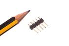
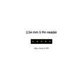
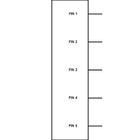
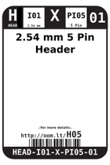

Contents
========

* [H05 > 2.54 mm 5 Pin Header](#h05--254-mm-5-pin-header)
	* [Images](#images)
	* [Diagrams](#diagrams)
	* [Datasheets](#datasheets)
	* [Labels](#labels)
	* [EDA](#eda)
	* [Tags](#tags)
  
![][im]
# H05 > 2.54 mm 5 Pin Header

- ID: HEAD-I01-X-PI05-01
- Hex ID: H05
- Name: 2.54 mm 5 Pin Header
- Description: 2.54 mm 5 Pin Header

## Images
  
  

|image|image_RE|diagBBLS|diagDIAG|diagIDEN|diagSCHEM|diagSIMP|label-front|label-spec|
| :---: | :---: | :---: | :---: | :---: | :---: | :---: | :---: | :---: |
||||||||||

## Diagrams
  
  

|diagBBLS|diagDIAG|diagIDEN|diagSCHEM|diagSIMP|
| :---: | :---: | :---: | :---: | :---: |
||||||

## Datasheets

- Datasheet: [datasheet.pdf](datasheet.pdf)

## Labels
  
  

|label-front|label-spec|
| :---: | :---: |
|||

## EDA

### Symbols

## Tags

- oompID: HEAD-I01-X-PI05-01
- name: 2.54 mm 5 Pin Header
- hexID: H05
- oompSort: 010105
- oompType: HEAD
- oompSize: I01
- oompColor: X
- oompDesc: PI05
- oompIndex: 01
- oompVersion: 99
- ooPitch: 2.54
- ooPinHeight: 11.60
- ooPinWidth: 0.64
- ooPinOffset: 1.53
- ooNumPins: 5
- ooFootprint: OOMP-HEAD-I01-X-PI05-01
- oompClass: Through Hole Component
- oompClassCode: THTH
- oompBbls: variable;clear
- oompBbls: variable;pins;5
- oompBbls: template;XXXX-I01-X-XX-01-bbls
- oompDiag: variable;clear
- oompDiag: variable;pins;5
- oompDiag: template;HEAD-I01-X-XX-01-diag
- oompIden: variable;clear
- oompIden: variable;pins;5
- oompIden: template;XXXX-I01-X-XX-01-iden
- oompSchem: variable;clear
- oompSchem: variable;pins;5
- oompSchem: template;XXXX-XX-X-XX-01-PINS-ODD-schem
- oompSimp: variable;clear
- oompSimp: variable;pins;5
- oompSimp: template;XXXX-I01-X-XX-01-simp
- ooDesignator: J1
- schematicSymbol: HEAD-XX-X-PI05-XX
- pcbFootprint: HEAD-I01-X-PI05-01

[im]: image_450.jpg
