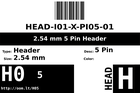

Contents
========

* [H05 > 2.54 mm 5 Pin Header](#h05--254-mm-5-pin-header)
	* [Diagrams](#diagrams)
	* [Datasheets](#datasheets)
	* [Labels](#labels)
	* [EDA](#eda)
	* [Images](#images)
	* [Tags](#tags)
  
![][im]
# H05 > 2.54 mm 5 Pin Header

- ID: HEAD-I01-X-PI05-01
- Hex ID: H05
- Name: 2.54 mm 5 Pin Header
- Description: 2.54 mm 5 Pin Header
- Long Link: [http://oom.lt/HEAD-I01-X-PI05-01](http://oom.lt/HEAD-I01-X-PI05-01)
- Short Link: [http://oom.lt/H05](http://oom.lt/H05)

## Diagrams
  
  

|diagBBLS|diagDIAG|diagIDEN|diagSCHEM|diagSIMP|
| :---: | :---: | :---: | :---: | :---: |
||||||

## Datasheets

- Datasheet: [datasheet.pdf](datasheet.pdf)

## Labels
  
  

|label-front|label-inventory|label-spec|
| :---: | :---: | :---: |
||||

## EDA

### Footprints
  

|[  FOOTPRINT-eagle-SparkFun-Eagle-Libraries-Sparkfun-Connectors-1X05](https://github.com/oomlout/oomlout_OOMP_eda/tree/main/FOOTPRINT/eagle/SparkFun-Eagle-Libraries/Sparkfun-Connectors/1X05/)|[  FOOTPRINT-eagle-SparkFun-Eagle-Libraries-Sparkfun-Connectors-1X05_LOCK](https://github.com/oomlout/oomlout_OOMP_eda/tree/main/FOOTPRINT/eagle/SparkFun-Eagle-Libraries/Sparkfun-Connectors/1X05_LOCK/)|[  FOOTPRINT-eagle-SparkFun-Eagle-Libraries-Sparkfun-Connectors-1X05_LOCK_LONGPADS](https://github.com/oomlout/oomlout_OOMP_eda/tree/main/FOOTPRINT/eagle/SparkFun-Eagle-Libraries/Sparkfun-Connectors/1X05_LOCK_LONGPADS/)|[  FOOTPRINT-eagle-SparkFun-Eagle-Libraries-Sparkfun-Connectors-1X05_NO_SILK](https://github.com/oomlout/oomlout_OOMP_eda/tree/main/FOOTPRINT/eagle/SparkFun-Eagle-Libraries/Sparkfun-Connectors/1X05_NO_SILK/)|
| :---: | :---: | :---: | :---: |
|[  ----](https://github.com/oomlout/oomlout_OOMP_parts/tree/main/----/)|[  FOOTPRINT-kicad-kicad-footprints-Connector_PinHeader_2.54mm-PinHeader_1x05_P2.54mm_Vertical](https://github.com/oomlout/oomlout_OOMP_eda/tree/main/FOOTPRINT/kicad/kicad-footprints/Connector_PinHeader_2.54mm/PinHeader_1x05_P2.54mm_Vertical/)|||

### Symbols
  

|[  SYMBOL-kicad-kicad-symbols-Connector-Conn_01x05_Male](https://github.com/oomlout/oomlout_OOMP_eda/tree/main/SYMBOL/kicad/kicad-symbols/Connector/Conn_01x05_Male/)|[  SYMBOL-kicad-kicad-symbols-Connector_Generic-Conn_01x05](https://github.com/oomlout/oomlout_OOMP_eda/tree/main/SYMBOL/kicad/kicad-symbols/Connector_Generic/Conn_01x05/)|||
| :---: | :---: | :---: | :---: |
  

### Instances
  
Used 387 times.  
Prevalance: (387\10986) 3.5227%  

|Project|Occur- rences|Identifiers|
| :---: | :---: | :---: |
|[PROJ-ADAF-1164-STAN-01 Adafruit INA169 Breakout PCB](https://github.com/oomlout/oomlout_OOMP_projects/tree/main/PROJ-ADAF-1164-STAN-01/)|[1](https://github.com/oomlout/oomlout_OOMP_projects/tree/main/PROJ-ADAF-1164-STAN-01/)|[JP1](https://github.com/oomlout/oomlout_OOMP_projects/tree/main/PROJ-ADAF-1164-STAN-01/)|
|[PROJ-ADAF-1455-STAN-01 Adafruit TLC59711 Breakout PCB](https://github.com/oomlout/oomlout_OOMP_projects/tree/main/PROJ-ADAF-1455-STAN-01/)|[2](https://github.com/oomlout/oomlout_OOMP_projects/tree/main/PROJ-ADAF-1455-STAN-01/)|[JP1, JP4](https://github.com/oomlout/oomlout_OOMP_projects/tree/main/PROJ-ADAF-1455-STAN-01/)|
|[PROJ-ADAF-1465-STAN-01 Adafruit ISP SWD and JTAG Breakout PCBs](https://github.com/oomlout/oomlout_OOMP_projects/tree/main/PROJ-ADAF-1465-STAN-01/)|[2](https://github.com/oomlout/oomlout_OOMP_projects/tree/main/PROJ-ADAF-1465-STAN-01/)|[JP1, JP2](https://github.com/oomlout/oomlout_OOMP_projects/tree/main/PROJ-ADAF-1465-STAN-01/)|
|[PROJ-ADAF-1603-STAN-01 Adafruit BMP180 PCB](https://github.com/oomlout/oomlout_OOMP_projects/tree/main/PROJ-ADAF-1603-STAN-01/)|[1](https://github.com/oomlout/oomlout_OOMP_projects/tree/main/PROJ-ADAF-1603-STAN-01/)|[JP1](https://github.com/oomlout/oomlout_OOMP_projects/tree/main/PROJ-ADAF-1603-STAN-01/)|
|[PROJ-ADAF-1628-STAN-01 Adafruit Bluefruit EZ Link Shield PCB](https://github.com/oomlout/oomlout_OOMP_projects/tree/main/PROJ-ADAF-1628-STAN-01/)|[1](https://github.com/oomlout/oomlout_OOMP_projects/tree/main/PROJ-ADAF-1628-STAN-01/)|[JP1](https://github.com/oomlout/oomlout_OOMP_projects/tree/main/PROJ-ADAF-1628-STAN-01/)|
|[PROJ-ADAF-1713-STAN-01 Adafruit MAX9814 AGC Microphone PCB](https://github.com/oomlout/oomlout_OOMP_projects/tree/main/PROJ-ADAF-1713-STAN-01/)|[1](https://github.com/oomlout/oomlout_OOMP_projects/tree/main/PROJ-ADAF-1713-STAN-01/)|[J2](https://github.com/oomlout/oomlout_OOMP_projects/tree/main/PROJ-ADAF-1713-STAN-01/)|
|[PROJ-ADAF-1899-STAN-01 Adafruit HTU21D Breakout PCB](https://github.com/oomlout/oomlout_OOMP_projects/tree/main/PROJ-ADAF-1899-STAN-01/)|[1](https://github.com/oomlout/oomlout_OOMP_projects/tree/main/PROJ-ADAF-1899-STAN-01/)|[JP1](https://github.com/oomlout/oomlout_OOMP_projects/tree/main/PROJ-ADAF-1899-STAN-01/)|
|[PROJ-ADAF-1904-STAN-01 Adafruit MicroLipo PCB](https://github.com/oomlout/oomlout_OOMP_projects/tree/main/PROJ-ADAF-1904-STAN-01/)|[1](https://github.com/oomlout/oomlout_OOMP_projects/tree/main/PROJ-ADAF-1904-STAN-01/)|[JP4](https://github.com/oomlout/oomlout_OOMP_projects/tree/main/PROJ-ADAF-1904-STAN-01/)|
|[PROJ-ADAF-1916-STAN-01 Adafruit Cupcade Adapter PCB](https://github.com/oomlout/oomlout_OOMP_projects/tree/main/PROJ-ADAF-1916-STAN-01/)|[1](https://github.com/oomlout/oomlout_OOMP_projects/tree/main/PROJ-ADAF-1916-STAN-01/)|[JOYSTICK](https://github.com/oomlout/oomlout_OOMP_projects/tree/main/PROJ-ADAF-1916-STAN-01/)|
|[PROJ-ADAF-2021-STAN-01 Adafruit LSM9DS0 PCB](https://github.com/oomlout/oomlout_OOMP_projects/tree/main/PROJ-ADAF-2021-STAN-01/)|[1](https://github.com/oomlout/oomlout_OOMP_projects/tree/main/PROJ-ADAF-2021-STAN-01/)|[JP2](https://github.com/oomlout/oomlout_OOMP_projects/tree/main/PROJ-ADAF-2021-STAN-01/)|
|[PROJ-ADAF-2130-STAN-01 Adafruit PAM8302 Mono Amplifier PCB](https://github.com/oomlout/oomlout_OOMP_projects/tree/main/PROJ-ADAF-2130-STAN-01/)|[1](https://github.com/oomlout/oomlout_OOMP_projects/tree/main/PROJ-ADAF-2130-STAN-01/)|[JP1](https://github.com/oomlout/oomlout_OOMP_projects/tree/main/PROJ-ADAF-2130-STAN-01/)|
|[PROJ-ADAF-2305-STAN-01 Adafruit DRV2605 PCB](https://github.com/oomlout/oomlout_OOMP_projects/tree/main/PROJ-ADAF-2305-STAN-01/)|[1](https://github.com/oomlout/oomlout_OOMP_projects/tree/main/PROJ-ADAF-2305-STAN-01/)|[JP1](https://github.com/oomlout/oomlout_OOMP_projects/tree/main/PROJ-ADAF-2305-STAN-01/)|
|[PROJ-ADAF-2716-STAN-01 Adafruit SPW2430 PCB](https://github.com/oomlout/oomlout_OOMP_projects/tree/main/PROJ-ADAF-2716-STAN-01/)|[1](https://github.com/oomlout/oomlout_OOMP_projects/tree/main/PROJ-ADAF-2716-STAN-01/)|[JP1](https://github.com/oomlout/oomlout_OOMP_projects/tree/main/PROJ-ADAF-2716-STAN-01/)|
|[PROJ-ADAF-2899-STAN-01 Adafruit VEML6070 PCB](https://github.com/oomlout/oomlout_OOMP_projects/tree/main/PROJ-ADAF-2899-STAN-01/)|[1](https://github.com/oomlout/oomlout_OOMP_projects/tree/main/PROJ-ADAF-2899-STAN-01/)|[JP1](https://github.com/oomlout/oomlout_OOMP_projects/tree/main/PROJ-ADAF-2899-STAN-01/)|
|[PROJ-ADAF-3070-STAN-01 Adafruit RFM LoRa Radio Breakout PCB](https://github.com/oomlout/oomlout_OOMP_projects/tree/main/PROJ-ADAF-3070-STAN-01/)|[1](https://github.com/oomlout/oomlout_OOMP_projects/tree/main/PROJ-ADAF-3070-STAN-01/)|[JP1](https://github.com/oomlout/oomlout_OOMP_projects/tree/main/PROJ-ADAF-3070-STAN-01/)|
|[PROJ-ADAF-3133-STAN-01 Adafruit Ultimate GPS FeatherWing PCB](https://github.com/oomlout/oomlout_OOMP_projects/tree/main/PROJ-ADAF-3133-STAN-01/)|[1](https://github.com/oomlout/oomlout_OOMP_projects/tree/main/PROJ-ADAF-3133-STAN-01/)|[JP2](https://github.com/oomlout/oomlout_OOMP_projects/tree/main/PROJ-ADAF-3133-STAN-01/)|
|[PROJ-ADAF-3229-STAN-01 Adafruit Radio FeatherWing PCB](https://github.com/oomlout/oomlout_OOMP_projects/tree/main/PROJ-ADAF-3229-STAN-01/)|[3](https://github.com/oomlout/oomlout_OOMP_projects/tree/main/PROJ-ADAF-3229-STAN-01/)|[JP2, JP3, JP7](https://github.com/oomlout/oomlout_OOMP_projects/tree/main/PROJ-ADAF-3229-STAN-01/)|
|[PROJ-ADAF-3251-STAN-01 Adafruit Si7021 PCB](https://github.com/oomlout/oomlout_OOMP_projects/tree/main/PROJ-ADAF-3251-STAN-01/)|[1](https://github.com/oomlout/oomlout_OOMP_projects/tree/main/PROJ-ADAF-3251-STAN-01/)|[JP1](https://github.com/oomlout/oomlout_OOMP_projects/tree/main/PROJ-ADAF-3251-STAN-01/)|
|[PROJ-ADAF-3296-STAN-01 DS1307 breakout board](https://github.com/oomlout/oomlout_OOMP_projects/tree/main/PROJ-ADAF-3296-STAN-01/)|[1](https://github.com/oomlout/oomlout_OOMP_projects/tree/main/PROJ-ADAF-3296-STAN-01/)|[JP2](https://github.com/oomlout/oomlout_OOMP_projects/tree/main/PROJ-ADAF-3296-STAN-01/)|
|[PROJ-ADAF-3387-STAN-01 Adafruit LSM9DS1 Breakout PCB](https://github.com/oomlout/oomlout_OOMP_projects/tree/main/PROJ-ADAF-3387-STAN-01/)|[1](https://github.com/oomlout/oomlout_OOMP_projects/tree/main/PROJ-ADAF-3387-STAN-01/)|[JP2](https://github.com/oomlout/oomlout_OOMP_projects/tree/main/PROJ-ADAF-3387-STAN-01/)|
|[PROJ-ADAF-3422-STAN-01 Adafruit Arcade Bonnet PCB](https://github.com/oomlout/oomlout_OOMP_projects/tree/main/PROJ-ADAF-3422-STAN-01/)|[1](https://github.com/oomlout/oomlout_OOMP_projects/tree/main/PROJ-ADAF-3422-STAN-01/)|[JOY1](https://github.com/oomlout/oomlout_OOMP_projects/tree/main/PROJ-ADAF-3422-STAN-01/)|
|[PROJ-ADAF-3435-STAN-01 Adafruit TPL5110 Power Timer Breakout PCB](https://github.com/oomlout/oomlout_OOMP_projects/tree/main/PROJ-ADAF-3435-STAN-01/)|[1](https://github.com/oomlout/oomlout_OOMP_projects/tree/main/PROJ-ADAF-3435-STAN-01/)|[JP1](https://github.com/oomlout/oomlout_OOMP_projects/tree/main/PROJ-ADAF-3435-STAN-01/)|
|[PROJ-ADAF-3500-STAN-01 Adafruit Trinket M0 PCB](https://github.com/oomlout/oomlout_OOMP_projects/tree/main/PROJ-ADAF-3500-STAN-01/)|[2](https://github.com/oomlout/oomlout_OOMP_projects/tree/main/PROJ-ADAF-3500-STAN-01/)|[JP3, JP4](https://github.com/oomlout/oomlout_OOMP_projects/tree/main/PROJ-ADAF-3500-STAN-01/)|
|[PROJ-ADAF-3573-STAN-01 Adafruit TPL5111 Reset Enable Timer PCB](https://github.com/oomlout/oomlout_OOMP_projects/tree/main/PROJ-ADAF-3573-STAN-01/)|[1](https://github.com/oomlout/oomlout_OOMP_projects/tree/main/PROJ-ADAF-3573-STAN-01/)|[JP1](https://github.com/oomlout/oomlout_OOMP_projects/tree/main/PROJ-ADAF-3573-STAN-01/)|
|[PROJ-ADAF-3677-STAN-01 Adafruit ItsyBitsy 32u4 PCB](https://github.com/oomlout/oomlout_OOMP_projects/tree/main/PROJ-ADAF-3677-STAN-01/)|[1](https://github.com/oomlout/oomlout_OOMP_projects/tree/main/PROJ-ADAF-3677-STAN-01/)|[JP1](https://github.com/oomlout/oomlout_OOMP_projects/tree/main/PROJ-ADAF-3677-STAN-01/)|
|[PROJ-ADAF-3709-STAN-01 Adafruit SGP30 PCB](https://github.com/oomlout/oomlout_OOMP_projects/tree/main/PROJ-ADAF-3709-STAN-01/)|[1](https://github.com/oomlout/oomlout_OOMP_projects/tree/main/PROJ-ADAF-3709-STAN-01/)|[JP3](https://github.com/oomlout/oomlout_OOMP_projects/tree/main/PROJ-ADAF-3709-STAN-01/)|
|[PROJ-ADAF-3727-STAN-01 Adafruit ItsyBitsy M0 PCB](https://github.com/oomlout/oomlout_OOMP_projects/tree/main/PROJ-ADAF-3727-STAN-01/)|[1](https://github.com/oomlout/oomlout_OOMP_projects/tree/main/PROJ-ADAF-3727-STAN-01/)|[JP1](https://github.com/oomlout/oomlout_OOMP_projects/tree/main/PROJ-ADAF-3727-STAN-01/)|
|[PROJ-ADAF-3800-STAN-01 Adafruit ItsyBitsy M4 Express PCB](https://github.com/oomlout/oomlout_OOMP_projects/tree/main/PROJ-ADAF-3800-STAN-01/)|[1](https://github.com/oomlout/oomlout_OOMP_projects/tree/main/PROJ-ADAF-3800-STAN-01/)|[JP1](https://github.com/oomlout/oomlout_OOMP_projects/tree/main/PROJ-ADAF-3800-STAN-01/)|
|[PROJ-ADAF-3964-STAN-01 Adafruit VEML6075 UV Sensor PCB](https://github.com/oomlout/oomlout_OOMP_projects/tree/main/PROJ-ADAF-3964-STAN-01/)|[1](https://github.com/oomlout/oomlout_OOMP_projects/tree/main/PROJ-ADAF-3964-STAN-01/)|[JP2](https://github.com/oomlout/oomlout_OOMP_projects/tree/main/PROJ-ADAF-3964-STAN-01/)|
|[PROJ-ADAF-4074-STAN-01 Adafruit Radio Bonnet PCB](https://github.com/oomlout/oomlout_OOMP_projects/tree/main/PROJ-ADAF-4074-STAN-01/)|[2](https://github.com/oomlout/oomlout_OOMP_projects/tree/main/PROJ-ADAF-4074-STAN-01/)|[JP1, JP3](https://github.com/oomlout/oomlout_OOMP_projects/tree/main/PROJ-ADAF-4074-STAN-01/)|
|[PROJ-ADAF-4319-STAN-01 Adafruit PyRuler PCB](https://github.com/oomlout/oomlout_OOMP_projects/tree/main/PROJ-ADAF-4319-STAN-01/)|[2](https://github.com/oomlout/oomlout_OOMP_projects/tree/main/PROJ-ADAF-4319-STAN-01/)|[JP3, JP4](https://github.com/oomlout/oomlout_OOMP_projects/tree/main/PROJ-ADAF-4319-STAN-01/)|
|[PROJ-ADAF-4366-STAN-01 Adafruit TLV493D PCB](https://github.com/oomlout/oomlout_OOMP_projects/tree/main/PROJ-ADAF-4366-STAN-01/)|[1](https://github.com/oomlout/oomlout_OOMP_projects/tree/main/PROJ-ADAF-4366-STAN-01/)|[JP2](https://github.com/oomlout/oomlout_OOMP_projects/tree/main/PROJ-ADAF-4366-STAN-01/)|
|[PROJ-ADAF-4369-STAN-01 Adafruit PCT2075 PCB](https://github.com/oomlout/oomlout_OOMP_projects/tree/main/PROJ-ADAF-4369-STAN-01/)|[1](https://github.com/oomlout/oomlout_OOMP_projects/tree/main/PROJ-ADAF-4369-STAN-01/)|[JP3](https://github.com/oomlout/oomlout_OOMP_projects/tree/main/PROJ-ADAF-4369-STAN-01/)|
|[PROJ-ADAF-4407-STAN-01 Adafruit MLX90640 PCB](https://github.com/oomlout/oomlout_OOMP_projects/tree/main/PROJ-ADAF-4407-STAN-01/)|[1](https://github.com/oomlout/oomlout_OOMP_projects/tree/main/PROJ-ADAF-4407-STAN-01/)|[JP2](https://github.com/oomlout/oomlout_OOMP_projects/tree/main/PROJ-ADAF-4407-STAN-01/)|
|[PROJ-ADAF-4438-STAN-01 Adafruit LSM6DSOX PCB](https://github.com/oomlout/oomlout_OOMP_projects/tree/main/PROJ-ADAF-4438-STAN-01/)|[1](https://github.com/oomlout/oomlout_OOMP_projects/tree/main/PROJ-ADAF-4438-STAN-01/)|[JP2](https://github.com/oomlout/oomlout_OOMP_projects/tree/main/PROJ-ADAF-4438-STAN-01/)|
|[PROJ-ADAF-4517-STAN-01 Adafruit LSM6DSOX LIS3MDL PCB](https://github.com/oomlout/oomlout_OOMP_projects/tree/main/PROJ-ADAF-4517-STAN-01/)|[1](https://github.com/oomlout/oomlout_OOMP_projects/tree/main/PROJ-ADAF-4517-STAN-01/)|[JP1](https://github.com/oomlout/oomlout_OOMP_projects/tree/main/PROJ-ADAF-4517-STAN-01/)|
|[PROJ-ADAF-4636-STAN-01 Adafruit SHTC3 PCB](https://github.com/oomlout/oomlout_OOMP_projects/tree/main/PROJ-ADAF-4636-STAN-01/)|[1](https://github.com/oomlout/oomlout_OOMP_projects/tree/main/PROJ-ADAF-4636-STAN-01/)|[JP2](https://github.com/oomlout/oomlout_OOMP_projects/tree/main/PROJ-ADAF-4636-STAN-01/)|
|[PROJ-ADAF-466-STAN-01 Adafruit VCNL40X0 PCB](https://github.com/oomlout/oomlout_OOMP_projects/tree/main/PROJ-ADAF-466-STAN-01/)|[1](https://github.com/oomlout/oomlout_OOMP_projects/tree/main/PROJ-ADAF-466-STAN-01/)|[JP1](https://github.com/oomlout/oomlout_OOMP_projects/tree/main/PROJ-ADAF-466-STAN-01/)|
|[PROJ-ADAF-4716-STAN-01 Adafruit MS8607 PCB](https://github.com/oomlout/oomlout_OOMP_projects/tree/main/PROJ-ADAF-4716-STAN-01/)|[1](https://github.com/oomlout/oomlout_OOMP_projects/tree/main/PROJ-ADAF-4716-STAN-01/)|[JP2](https://github.com/oomlout/oomlout_OOMP_projects/tree/main/PROJ-ADAF-4716-STAN-01/)|
|[PROJ-ADAF-4756-STAN-01 Adafruit LTC4311 PCB](https://github.com/oomlout/oomlout_OOMP_projects/tree/main/PROJ-ADAF-4756-STAN-01/)|[1](https://github.com/oomlout/oomlout_OOMP_projects/tree/main/PROJ-ADAF-4756-STAN-01/)|[JP2](https://github.com/oomlout/oomlout_OOMP_projects/tree/main/PROJ-ADAF-4756-STAN-01/)|
|[PROJ-ADAF-4829-STAN-01 Adafruit SGP40 PCB](https://github.com/oomlout/oomlout_OOMP_projects/tree/main/PROJ-ADAF-4829-STAN-01/)|[1](https://github.com/oomlout/oomlout_OOMP_projects/tree/main/PROJ-ADAF-4829-STAN-01/)|[JP3](https://github.com/oomlout/oomlout_OOMP_projects/tree/main/PROJ-ADAF-4829-STAN-01/)|
|[PROJ-ADAF-4836-STAN-01 Adafruit Wii Nunchuck Breakout Adapter PCB](https://github.com/oomlout/oomlout_OOMP_projects/tree/main/PROJ-ADAF-4836-STAN-01/)|[1](https://github.com/oomlout/oomlout_OOMP_projects/tree/main/PROJ-ADAF-4836-STAN-01/)|[JP2](https://github.com/oomlout/oomlout_OOMP_projects/tree/main/PROJ-ADAF-4836-STAN-01/)|
|[PROJ-ADAF-4885-STAN-01 Adafruit SHT40 PCB](https://github.com/oomlout/oomlout_OOMP_projects/tree/main/PROJ-ADAF-4885-STAN-01/)|[1](https://github.com/oomlout/oomlout_OOMP_projects/tree/main/PROJ-ADAF-4885-STAN-01/)|[JP2](https://github.com/oomlout/oomlout_OOMP_projects/tree/main/PROJ-ADAF-4885-STAN-01/)|
|[PROJ-ADAF-4886-STAN-01 Adafruit AW9523 PCB](https://github.com/oomlout/oomlout_OOMP_projects/tree/main/PROJ-ADAF-4886-STAN-01/)|[1](https://github.com/oomlout/oomlout_OOMP_projects/tree/main/PROJ-ADAF-4886-STAN-01/)|[JP3](https://github.com/oomlout/oomlout_OOMP_projects/tree/main/PROJ-ADAF-4886-STAN-01/)|
|[PROJ-ADAF-4888-STAN-01 Adafruit ItsyBitsy RP2040 PCB](https://github.com/oomlout/oomlout_OOMP_projects/tree/main/PROJ-ADAF-4888-STAN-01/)|[1](https://github.com/oomlout/oomlout_OOMP_projects/tree/main/PROJ-ADAF-4888-STAN-01/)|[JP1](https://github.com/oomlout/oomlout_OOMP_projects/tree/main/PROJ-ADAF-4888-STAN-01/)|
|[PROJ-ADAF-4978-STAN-01 Adafruit NeoKey Breakout PCB](https://github.com/oomlout/oomlout_OOMP_projects/tree/main/PROJ-ADAF-4978-STAN-01/)|[2](https://github.com/oomlout/oomlout_OOMP_projects/tree/main/PROJ-ADAF-4978-STAN-01/)|[JP1, JP3](https://github.com/oomlout/oomlout_OOMP_projects/tree/main/PROJ-ADAF-4978-STAN-01/)|
|[PROJ-ADAF-5189-STAN-01 Adafruit PCF8523 RTC Breakout PCB](https://github.com/oomlout/oomlout_OOMP_projects/tree/main/PROJ-ADAF-5189-STAN-01/)|[1](https://github.com/oomlout/oomlout_OOMP_projects/tree/main/PROJ-ADAF-5189-STAN-01/)|[JP2](https://github.com/oomlout/oomlout_OOMP_projects/tree/main/PROJ-ADAF-5189-STAN-01/)|
|[PROJ-ADAF-5190-STAN-01 Adafruit SCD 4x PCB](https://github.com/oomlout/oomlout_OOMP_projects/tree/main/PROJ-ADAF-5190-STAN-01/)|[1](https://github.com/oomlout/oomlout_OOMP_projects/tree/main/PROJ-ADAF-5190-STAN-01/)|[JP2](https://github.com/oomlout/oomlout_OOMP_projects/tree/main/PROJ-ADAF-5190-STAN-01/)|
|[PROJ-ADAF-5378-STAN-01 Adafruit VEML7700 PCB](https://github.com/oomlout/oomlout_OOMP_projects/tree/main/PROJ-ADAF-5378-STAN-01/)|[1](https://github.com/oomlout/oomlout_OOMP_projects/tree/main/PROJ-ADAF-5378-STAN-01/)|[JP2](https://github.com/oomlout/oomlout_OOMP_projects/tree/main/PROJ-ADAF-5378-STAN-01/)|
|[PROJ-ADAF-782-STAN-01 Adafruit USB Serial RGB Character Backpack PCB](https://github.com/oomlout/oomlout_OOMP_projects/tree/main/PROJ-ADAF-782-STAN-01/)|[1](https://github.com/oomlout/oomlout_OOMP_projects/tree/main/PROJ-ADAF-782-STAN-01/)|[USB](https://github.com/oomlout/oomlout_OOMP_projects/tree/main/PROJ-ADAF-782-STAN-01/)|
|[PROJ-SPAR-10025-STAN-01 EiBotBoard](https://github.com/oomlout/oomlout_OOMP_projects/tree/main/PROJ-SPAR-10025-STAN-01/)|[1](https://github.com/oomlout/oomlout_OOMP_projects/tree/main/PROJ-SPAR-10025-STAN-01/)|[J8](https://github.com/oomlout/oomlout_OOMP_projects/tree/main/PROJ-SPAR-10025-STAN-01/)|
|[PROJ-SPAR-10031-STAN-01 USB microB Plug Breakout](https://github.com/oomlout/oomlout_OOMP_projects/tree/main/PROJ-SPAR-10031-STAN-01/)|[1](https://github.com/oomlout/oomlout_OOMP_projects/tree/main/PROJ-SPAR-10031-STAN-01/)|[JP1](https://github.com/oomlout/oomlout_OOMP_projects/tree/main/PROJ-SPAR-10031-STAN-01/)|
|[PROJ-SPAR-10111-STAN-01 Tri-Color Breakout](https://github.com/oomlout/oomlout_OOMP_projects/tree/main/PROJ-SPAR-10111-STAN-01/)|[1](https://github.com/oomlout/oomlout_OOMP_projects/tree/main/PROJ-SPAR-10111-STAN-01/)|[JP6](https://github.com/oomlout/oomlout_OOMP_projects/tree/main/PROJ-SPAR-10111-STAN-01/)|
|[PROJ-SPAR-10124-STAN-01 RS-485 Breakout](https://github.com/oomlout/oomlout_OOMP_projects/tree/main/PROJ-SPAR-10124-STAN-01/)|[1](https://github.com/oomlout/oomlout_OOMP_projects/tree/main/PROJ-SPAR-10124-STAN-01/)|[JP9](https://github.com/oomlout/oomlout_OOMP_projects/tree/main/PROJ-SPAR-10124-STAN-01/)|
|[PROJ-SPAR-10154-STAN-01 RF Transceiver Breakout-RFM22B](https://github.com/oomlout/oomlout_OOMP_projects/tree/main/PROJ-SPAR-10154-STAN-01/)|[1](https://github.com/oomlout/oomlout_OOMP_projects/tree/main/PROJ-SPAR-10154-STAN-01/)|[JP4](https://github.com/oomlout/oomlout_OOMP_projects/tree/main/PROJ-SPAR-10154-STAN-01/)|
|[PROJ-SPAR-10406-STAN-01 RFID Evaluation Shield](https://github.com/oomlout/oomlout_OOMP_projects/tree/main/PROJ-SPAR-10406-STAN-01/)|[1](https://github.com/oomlout/oomlout_OOMP_projects/tree/main/PROJ-SPAR-10406-STAN-01/)|[JP6](https://github.com/oomlout/oomlout_OOMP_projects/tree/main/PROJ-SPAR-10406-STAN-01/)|
|[PROJ-SPAR-10570-STAN-01 DangerShield](https://github.com/oomlout/oomlout_OOMP_projects/tree/main/PROJ-SPAR-10570-STAN-01/)|[1](https://github.com/oomlout/oomlout_OOMP_projects/tree/main/PROJ-SPAR-10570-STAN-01/)|[JP1](https://github.com/oomlout/oomlout_OOMP_projects/tree/main/PROJ-SPAR-10570-STAN-01/)|
|[PROJ-SPAR-10588-STAN-01 Audio Jack Breakout](https://github.com/oomlout/oomlout_OOMP_projects/tree/main/PROJ-SPAR-10588-STAN-01/)|[1](https://github.com/oomlout/oomlout_OOMP_projects/tree/main/PROJ-SPAR-10588-STAN-01/)|[JP1](https://github.com/oomlout/oomlout_OOMP_projects/tree/main/PROJ-SPAR-10588-STAN-01/)|
|[PROJ-SPAR-10701-STAN-01 Color Light Sensor Evaluation Board](https://github.com/oomlout/oomlout_OOMP_projects/tree/main/PROJ-SPAR-10701-STAN-01/)|[1](https://github.com/oomlout/oomlout_OOMP_projects/tree/main/PROJ-SPAR-10701-STAN-01/)|[JP4](https://github.com/oomlout/oomlout_OOMP_projects/tree/main/PROJ-SPAR-10701-STAN-01/)|
|[PROJ-SPAR-10901-STAN-01 Infrared Proximity Breakout-VCNL4000](https://github.com/oomlout/oomlout_OOMP_projects/tree/main/PROJ-SPAR-10901-STAN-01/)|[1](https://github.com/oomlout/oomlout_OOMP_projects/tree/main/PROJ-SPAR-10901-STAN-01/)|[JP1](https://github.com/oomlout/oomlout_OOMP_projects/tree/main/PROJ-SPAR-10901-STAN-01/)|
|[PROJ-SPAR-10920-STAN-01 Venus GPS Logger SMA](https://github.com/oomlout/oomlout_OOMP_projects/tree/main/PROJ-SPAR-10920-STAN-01/)|[1](https://github.com/oomlout/oomlout_OOMP_projects/tree/main/PROJ-SPAR-10920-STAN-01/)|[JP3](https://github.com/oomlout/oomlout_OOMP_projects/tree/main/PROJ-SPAR-10920-STAN-01/)|
|[PROJ-SPAR-11088-STAN-01 Run-SPOT-Run](https://github.com/oomlout/oomlout_OOMP_projects/tree/main/PROJ-SPAR-11088-STAN-01/)|[1](https://github.com/oomlout/oomlout_OOMP_projects/tree/main/PROJ-SPAR-11088-STAN-01/)|[JP2](https://github.com/oomlout/oomlout_OOMP_projects/tree/main/PROJ-SPAR-11088-STAN-01/)|
|[PROJ-SPAR-11341-STAN-01 Gyro Breakout-LPY503AL](https://github.com/oomlout/oomlout_OOMP_projects/tree/main/PROJ-SPAR-11341-STAN-01/)|[2](https://github.com/oomlout/oomlout_OOMP_projects/tree/main/PROJ-SPAR-11341-STAN-01/)|[JP1, JP2](https://github.com/oomlout/oomlout_OOMP_projects/tree/main/PROJ-SPAR-11341-STAN-01/)|
|[PROJ-SPAR-11447-STAN-01 Wake on shake](https://github.com/oomlout/oomlout_OOMP_projects/tree/main/PROJ-SPAR-11447-STAN-01/)|[1](https://github.com/oomlout/oomlout_OOMP_projects/tree/main/PROJ-SPAR-11447-STAN-01/)|[JP7](https://github.com/oomlout/oomlout_OOMP_projects/tree/main/PROJ-SPAR-11447-STAN-01/)|
|[PROJ-SPAR-11629-STAN-01 Serial7SegmentDisplay](https://github.com/oomlout/oomlout_OOMP_projects/tree/main/PROJ-SPAR-11629-STAN-01/)|[1](https://github.com/oomlout/oomlout_OOMP_projects/tree/main/PROJ-SPAR-11629-STAN-01/)|[JP11](https://github.com/oomlout/oomlout_OOMP_projects/tree/main/PROJ-SPAR-11629-STAN-01/)|
|[PROJ-SPAR-11703-STAN-01 UDB5](https://github.com/oomlout/oomlout_OOMP_projects/tree/main/PROJ-SPAR-11703-STAN-01/)|[1](https://github.com/oomlout/oomlout_OOMP_projects/tree/main/PROJ-SPAR-11703-STAN-01/)|[JP12](https://github.com/oomlout/oomlout_OOMP_projects/tree/main/PROJ-SPAR-11703-STAN-01/)|
|[PROJ-SPAR-11722-STAN-01 Rotary Encoder Breakout-Illuminated](https://github.com/oomlout/oomlout_OOMP_projects/tree/main/PROJ-SPAR-11722-STAN-01/)|[1](https://github.com/oomlout/oomlout_OOMP_projects/tree/main/PROJ-SPAR-11722-STAN-01/)|[JP2](https://github.com/oomlout/oomlout_OOMP_projects/tree/main/PROJ-SPAR-11722-STAN-01/)|
|[PROJ-SPAR-11824-STAN-01 BMP180 Breakout](https://github.com/oomlout/oomlout_OOMP_projects/tree/main/PROJ-SPAR-11824-STAN-01/)|[1](https://github.com/oomlout/oomlout_OOMP_projects/tree/main/PROJ-SPAR-11824-STAN-01/)|[JP1](https://github.com/oomlout/oomlout_OOMP_projects/tree/main/PROJ-SPAR-11824-STAN-01/)|
|[PROJ-SPAR-12017-STAN-01 MPR121 Capacitive Touch Keypad](https://github.com/oomlout/oomlout_OOMP_projects/tree/main/PROJ-SPAR-12017-STAN-01/)|[1](https://github.com/oomlout/oomlout_OOMP_projects/tree/main/PROJ-SPAR-12017-STAN-01/)|[JP9](https://github.com/oomlout/oomlout_OOMP_projects/tree/main/PROJ-SPAR-12017-STAN-01/)|
|[PROJ-SPAR-12055-STAN-01 TSL2561 Luminosity Sensor BOB](https://github.com/oomlout/oomlout_OOMP_projects/tree/main/PROJ-SPAR-12055-STAN-01/)|[1](https://github.com/oomlout/oomlout_OOMP_projects/tree/main/PROJ-SPAR-12055-STAN-01/)|[JP1](https://github.com/oomlout/oomlout_OOMP_projects/tree/main/PROJ-SPAR-12055-STAN-01/)|
|[PROJ-SPAR-12070-STAN-01 Solder-able Breadboard](https://github.com/oomlout/oomlout_OOMP_projects/tree/main/PROJ-SPAR-12070-STAN-01/)|[60](https://github.com/oomlout/oomlout_OOMP_projects/tree/main/PROJ-SPAR-12070-STAN-01/)|[JP5, JP6, JP7, JP8, JP9, JP10, JP11, JP12, JP13, JP14, JP15, JP16, JP17, JP18, JP19, JP20, JP21, JP22, JP23, JP24, JP25, JP26, JP27, JP28, JP29, JP30, JP31, JP32, JP33, JP34, JP35, JP36, JP37, JP38, JP39, JP40, JP41, JP42, JP43, JP44, JP45, JP46, JP47, JP48, JP49, JP50, JP51, JP52, JP53, JP54, JP55, JP56, JP57, JP58, JP59, JP60, JP61, JP62, JP63, JP64](https://github.com/oomlout/oomlout_OOMP_projects/tree/main/PROJ-SPAR-12070-STAN-01/)|
|[PROJ-SPAR-12642-STAN-01 Sound Detector](https://github.com/oomlout/oomlout_OOMP_projects/tree/main/PROJ-SPAR-12642-STAN-01/)|[1](https://github.com/oomlout/oomlout_OOMP_projects/tree/main/PROJ-SPAR-12642-STAN-01/)|[JP1](https://github.com/oomlout/oomlout_OOMP_projects/tree/main/PROJ-SPAR-12642-STAN-01/)|
|[PROJ-SPAR-12670-STAN-01 MAG3110 Breakout Board](https://github.com/oomlout/oomlout_OOMP_projects/tree/main/PROJ-SPAR-12670-STAN-01/)|[1](https://github.com/oomlout/oomlout_OOMP_projects/tree/main/PROJ-SPAR-12670-STAN-01/)|[JP1](https://github.com/oomlout/oomlout_OOMP_projects/tree/main/PROJ-SPAR-12670-STAN-01/)|
|[PROJ-SPAR-12699-STAN-01 Solderable Breadboard Large](https://github.com/oomlout/oomlout_OOMP_projects/tree/main/PROJ-SPAR-12699-STAN-01/)|[131](https://github.com/oomlout/oomlout_OOMP_projects/tree/main/PROJ-SPAR-12699-STAN-01/)|[JP5, JP6, JP7, JP8, JP9, JP10, JP11, JP12, JP13, JP14, JP15, JP16, JP17, JP18, JP19, JP20, JP21, JP22, JP23, JP24, JP25, JP26, JP27, JP28, JP29, JP30, JP31, JP32, JP33, JP34, JP35, JP36, JP37, JP38, JP39, JP40, JP41, JP42, JP43, JP44, JP45, JP46, JP47, JP48, JP49, JP50, JP51, JP52, JP53, JP54, JP55, JP56, JP57, JP58, JP59, JP60, JP61, JP62, JP63, JP64, JP69, JP70, JP71, JP72, JP73, JP74, JP75, JP76, JP77, JP78, JP79, JP80, JP81, JP82, JP83, JP84, JP85, JP86, JP87, JP88, JP89, JP90, JP91, JP92, JP93, JP94, JP95, JP96, JP97, JP98, JP99, JP100, JP101, JP102, JP103, JP104, JP105, JP106, JP107, JP108, JP109, JP110, JP111, JP112, JP113, JP114, JP115, JP116, JP117, JP118, JP119, JP120, JP121, JP122, JP123, JP124, JP125, JP126, JP127, JP128, JP131, JP132, JP135, JP136, JP139, JP140, JP141, JP142, JP143, JP144, JP145](https://github.com/oomlout/oomlout_OOMP_projects/tree/main/PROJ-SPAR-12699-STAN-01/)|
|[PROJ-SPAR-12702-STAN-01 Solderable Breadboard Mini](https://github.com/oomlout/oomlout_OOMP_projects/tree/main/PROJ-SPAR-12702-STAN-01/)|[34](https://github.com/oomlout/oomlout_OOMP_projects/tree/main/PROJ-SPAR-12702-STAN-01/)|[JP1, JP2, JP3, JP4, JP5, JP6, JP7, JP8, JP9, JP10, JP11, JP12, JP13, JP14, JP15, JP16, JP17, JP18, JP19, JP20, JP21, JP22, JP23, JP24, JP25, JP26, JP27, JP28, JP29, JP30, JP31, JP32, JP33, JP34](https://github.com/oomlout/oomlout_OOMP_projects/tree/main/PROJ-SPAR-12702-STAN-01/)|
|[PROJ-SPAR-12708-STAN-01 RTC-Module](https://github.com/oomlout/oomlout_OOMP_projects/tree/main/PROJ-SPAR-12708-STAN-01/)|[1](https://github.com/oomlout/oomlout_OOMP_projects/tree/main/PROJ-SPAR-12708-STAN-01/)|[JP1](https://github.com/oomlout/oomlout_OOMP_projects/tree/main/PROJ-SPAR-12708-STAN-01/)|
|[PROJ-SPAR-12775-STAN-01 RFM69HCW Breakout](https://github.com/oomlout/oomlout_OOMP_projects/tree/main/PROJ-SPAR-12775-STAN-01/)|[2](https://github.com/oomlout/oomlout_OOMP_projects/tree/main/PROJ-SPAR-12775-STAN-01/)|[JP2, JP4](https://github.com/oomlout/oomlout_OOMP_projects/tree/main/PROJ-SPAR-12775-STAN-01/)|
|[PROJ-SPAR-12829-STAN-01 ISL29125 Breakout](https://github.com/oomlout/oomlout_OOMP_projects/tree/main/PROJ-SPAR-12829-STAN-01/)|[1](https://github.com/oomlout/oomlout_OOMP_projects/tree/main/PROJ-SPAR-12829-STAN-01/)|[JP1](https://github.com/oomlout/oomlout_OOMP_projects/tree/main/PROJ-SPAR-12829-STAN-01/)|
|[PROJ-SPAR-12942-STAN-01 Bus Pirate](https://github.com/oomlout/oomlout_OOMP_projects/tree/main/PROJ-SPAR-12942-STAN-01/)|[1](https://github.com/oomlout/oomlout_OOMP_projects/tree/main/PROJ-SPAR-12942-STAN-01/)|[JP2](https://github.com/oomlout/oomlout_OOMP_projects/tree/main/PROJ-SPAR-12942-STAN-01/)|
|[PROJ-SPAR-13030-STAN-01 RFID Reader Breakout](https://github.com/oomlout/oomlout_OOMP_projects/tree/main/PROJ-SPAR-13030-STAN-01/)|[1](https://github.com/oomlout/oomlout_OOMP_projects/tree/main/PROJ-SPAR-13030-STAN-01/)|[JP5](https://github.com/oomlout/oomlout_OOMP_projects/tree/main/PROJ-SPAR-13030-STAN-01/)|
|[PROJ-SPAR-13120-STAN-01 MG2639 Cellular Shield](https://github.com/oomlout/oomlout_OOMP_projects/tree/main/PROJ-SPAR-13120-STAN-01/)|[2](https://github.com/oomlout/oomlout_OOMP_projects/tree/main/PROJ-SPAR-13120-STAN-01/)|[JP6, JP9](https://github.com/oomlout/oomlout_OOMP_projects/tree/main/PROJ-SPAR-13120-STAN-01/)|
|[PROJ-SPAR-13124-STAN-01 Proto Pedal](https://github.com/oomlout/oomlout_OOMP_projects/tree/main/PROJ-SPAR-13124-STAN-01/)|[60](https://github.com/oomlout/oomlout_OOMP_projects/tree/main/PROJ-SPAR-13124-STAN-01/)|[JP28, JP29, JP30, JP31, JP32, JP33, JP36, JP37, JP38, JP39, JP40, JP41, JP42, JP43, JP44, JP45, JP46, JP47, JP48, JP49, JP50, JP51, JP52, JP53, JP54, JP55, JP56, JP57, JP58, JP59, JP60, JP61, JP62, JP63, JP64, JP65, JP66, JP67, JP68, JP69, JP70, JP71, JP72, JP73, JP74, JP75, JP76, JP77, JP78, JP79, JP80, JP81, JP82, JP83, JP84, JP85, JP86, JP87, JP88, JP89](https://github.com/oomlout/oomlout_OOMP_projects/tree/main/PROJ-SPAR-13124-STAN-01/)|
|[PROJ-SPAR-13162-STAN-01 ZX Gesture Sensor SMD](https://github.com/oomlout/oomlout_OOMP_projects/tree/main/PROJ-SPAR-13162-STAN-01/)|[1](https://github.com/oomlout/oomlout_OOMP_projects/tree/main/PROJ-SPAR-13162-STAN-01/)|[JP2](https://github.com/oomlout/oomlout_OOMP_projects/tree/main/PROJ-SPAR-13162-STAN-01/)|
|[PROJ-SPAR-13230-STAN-01 HX711-Load-Cell-Amplifier](https://github.com/oomlout/oomlout_OOMP_projects/tree/main/PROJ-SPAR-13230-STAN-01/)|[2](https://github.com/oomlout/oomlout_OOMP_projects/tree/main/PROJ-SPAR-13230-STAN-01/)|[J1, JP4](https://github.com/oomlout/oomlout_OOMP_projects/tree/main/PROJ-SPAR-13230-STAN-01/)|
|[PROJ-SPAR-13261-STAN-01 OpenScale](https://github.com/oomlout/oomlout_OOMP_projects/tree/main/PROJ-SPAR-13261-STAN-01/)|[1](https://github.com/oomlout/oomlout_OOMP_projects/tree/main/PROJ-SPAR-13261-STAN-01/)|[JP3](https://github.com/oomlout/oomlout_OOMP_projects/tree/main/PROJ-SPAR-13261-STAN-01/)|
|[PROJ-SPAR-13281-STAN-01 Load Sensor Combinator](https://github.com/oomlout/oomlout_OOMP_projects/tree/main/PROJ-SPAR-13281-STAN-01/)|[1](https://github.com/oomlout/oomlout_OOMP_projects/tree/main/PROJ-SPAR-13281-STAN-01/)|[JP5](https://github.com/oomlout/oomlout_OOMP_projects/tree/main/PROJ-SPAR-13281-STAN-01/)|
|[PROJ-SPAR-13339-STAN-01 LSM6DS3 Breakout](https://github.com/oomlout/oomlout_OOMP_projects/tree/main/PROJ-SPAR-13339-STAN-01/)|[1](https://github.com/oomlout/oomlout_OOMP_projects/tree/main/PROJ-SPAR-13339-STAN-01/)|[JP3](https://github.com/oomlout/oomlout_OOMP_projects/tree/main/PROJ-SPAR-13339-STAN-01/)|
|[PROJ-SPAR-13629-STAN-01 Photon IMU Shield](https://github.com/oomlout/oomlout_OOMP_projects/tree/main/PROJ-SPAR-13629-STAN-01/)|[1](https://github.com/oomlout/oomlout_OOMP_projects/tree/main/PROJ-SPAR-13629-STAN-01/)|[JP2](https://github.com/oomlout/oomlout_OOMP_projects/tree/main/PROJ-SPAR-13629-STAN-01/)|
|[PROJ-SPAR-13672-STAN-01 SAMD21 Dev Breakout](https://github.com/oomlout/oomlout_OOMP_projects/tree/main/PROJ-SPAR-13672-STAN-01/)|[1](https://github.com/oomlout/oomlout_OOMP_projects/tree/main/PROJ-SPAR-13672-STAN-01/)|[JP5](https://github.com/oomlout/oomlout_OOMP_projects/tree/main/PROJ-SPAR-13672-STAN-01/)|
|[PROJ-SPAR-13720-STAN-01 MP3 Trigger](https://github.com/oomlout/oomlout_OOMP_projects/tree/main/PROJ-SPAR-13720-STAN-01/)|[1](https://github.com/oomlout/oomlout_OOMP_projects/tree/main/PROJ-SPAR-13720-STAN-01/)|[JP9](https://github.com/oomlout/oomlout_OOMP_projects/tree/main/PROJ-SPAR-13720-STAN-01/)|
|[PROJ-SPAR-13810-STAN-01 tsunami](https://github.com/oomlout/oomlout_OOMP_projects/tree/main/PROJ-SPAR-13810-STAN-01/)|[1](https://github.com/oomlout/oomlout_OOMP_projects/tree/main/PROJ-SPAR-13810-STAN-01/)|[J15](https://github.com/oomlout/oomlout_OOMP_projects/tree/main/PROJ-SPAR-13810-STAN-01/)|
|[PROJ-SPAR-14414-STAN-01 SparkFun GPS Breakout XA1110 Qwiic](https://github.com/oomlout/oomlout_OOMP_projects/tree/main/PROJ-SPAR-14414-STAN-01/)|[1](https://github.com/oomlout/oomlout_OOMP_projects/tree/main/PROJ-SPAR-14414-STAN-01/)|[J7](https://github.com/oomlout/oomlout_OOMP_projects/tree/main/PROJ-SPAR-14414-STAN-01/)|
|[PROJ-SPAR-14449-STAN-01 Variable Load](https://github.com/oomlout/oomlout_OOMP_projects/tree/main/PROJ-SPAR-14449-STAN-01/)|[1](https://github.com/oomlout/oomlout_OOMP_projects/tree/main/PROJ-SPAR-14449-STAN-01/)|[J5](https://github.com/oomlout/oomlout_OOMP_projects/tree/main/PROJ-SPAR-14449-STAN-01/)|
|[PROJ-SPAR-14554-STAN-01 Papa Soundie Audio Player](https://github.com/oomlout/oomlout_OOMP_projects/tree/main/PROJ-SPAR-14554-STAN-01/)|[1](https://github.com/oomlout/oomlout_OOMP_projects/tree/main/PROJ-SPAR-14554-STAN-01/)|[J6](https://github.com/oomlout/oomlout_OOMP_projects/tree/main/PROJ-SPAR-14554-STAN-01/)|

## Images
  
  

|image|image_RE|diagBBLS|diagDIAG|diagIDEN|diagSCHEM|diagSIMP|label-front|label-inventory|label-spec|
| :---: | :---: | :---: | :---: | :---: | :---: | :---: | :---: | :---: | :---: |
|||||||||||

## Tags

- oompID: HEAD-I01-X-PI05-01
- name: 2.54 mm 5 Pin Header
- hexID: H05
- oompSort: 010105
- oompType: HEAD
- oompSize: I01
- oompColor: X
- oompDesc: PI05
- oompIndex: 01
- oompVersion: 99
- ooPitch: 2.54
- ooPinHeight: 11.60
- ooPinWidth: 0.64
- ooPinOffset: 1.53
- ooNumPins: 5
- ooFootprint: OOMP-HEAD-I01-X-PI05-01
- oompClass: Through Hole Component
- oompClassCode: THTH
- oompBbls: variable;clear
- oompBbls: variable;pins;5
- oompBbls: template;XXXX-I01-X-XX-01-bbls
- oompDiag: variable;clear
- oompDiag: variable;pins;5
- oompDiag: template;HEAD-I01-X-XX-01-diag
- oompIden: variable;clear
- oompIden: variable;pins;5
- oompIden: template;XXXX-I01-X-XX-01-iden
- oompSchem: variable;clear
- oompSchem: variable;pins;5
- oompSchem: template;XXXX-XX-X-XX-01-PINS-ODD-schem
- oompSimp: variable;clear
- oompSimp: variable;pins;5
- oompSimp: template;XXXX-I01-X-XX-01-simp
- ooDesignator: J1
- schematicSymbol: HEAD-XX-X-PI05-XX
- pcbFootprint: HEAD-I01-X-PI05-01
- oompInstances: {'PROJECT': 'PROJ-ADAF-1164-STAN-01', 'ID': 'JP1'}
- oompInstances: {'PROJECT': 'PROJ-ADAF-1455-STAN-01', 'ID': 'JP1'}
- oompInstances: {'PROJECT': 'PROJ-ADAF-1455-STAN-01', 'ID': 'JP4'}
- oompInstances: {'PROJECT': 'PROJ-ADAF-1465-STAN-01', 'ID': 'JP1'}
- oompInstances: {'PROJECT': 'PROJ-ADAF-1465-STAN-01', 'ID': 'JP2'}
- oompInstances: {'PROJECT': 'PROJ-ADAF-1603-STAN-01', 'ID': 'JP1'}
- oompInstances: {'PROJECT': 'PROJ-ADAF-1628-STAN-01', 'ID': 'JP1'}
- oompInstances: {'PROJECT': 'PROJ-ADAF-1713-STAN-01', 'ID': 'J2'}
- oompInstances: {'PROJECT': 'PROJ-ADAF-1899-STAN-01', 'ID': 'JP1'}
- oompInstances: {'PROJECT': 'PROJ-ADAF-1904-STAN-01', 'ID': 'JP4'}
- oompInstances: {'PROJECT': 'PROJ-ADAF-1916-STAN-01', 'ID': 'JOYSTICK'}
- oompInstances: {'PROJECT': 'PROJ-ADAF-2021-STAN-01', 'ID': 'JP2'}
- oompInstances: {'PROJECT': 'PROJ-ADAF-2130-STAN-01', 'ID': 'JP1'}
- oompInstances: {'PROJECT': 'PROJ-ADAF-2305-STAN-01', 'ID': 'JP1'}
- oompInstances: {'PROJECT': 'PROJ-ADAF-2716-STAN-01', 'ID': 'JP1'}
- oompInstances: {'PROJECT': 'PROJ-ADAF-2899-STAN-01', 'ID': 'JP1'}
- oompInstances: {'PROJECT': 'PROJ-ADAF-3070-STAN-01', 'ID': 'JP1'}
- oompInstances: {'PROJECT': 'PROJ-ADAF-3133-STAN-01', 'ID': 'JP2'}
- oompInstances: {'PROJECT': 'PROJ-ADAF-3229-STAN-01', 'ID': 'JP2'}
- oompInstances: {'PROJECT': 'PROJ-ADAF-3229-STAN-01', 'ID': 'JP3'}
- oompInstances: {'PROJECT': 'PROJ-ADAF-3229-STAN-01', 'ID': 'JP7'}
- oompInstances: {'PROJECT': 'PROJ-ADAF-3251-STAN-01', 'ID': 'JP1'}
- oompInstances: {'PROJECT': 'PROJ-ADAF-3296-STAN-01', 'ID': 'JP2'}
- oompInstances: {'PROJECT': 'PROJ-ADAF-3387-STAN-01', 'ID': 'JP2'}
- oompInstances: {'PROJECT': 'PROJ-ADAF-3422-STAN-01', 'ID': 'JOY1'}
- oompInstances: {'PROJECT': 'PROJ-ADAF-3435-STAN-01', 'ID': 'JP1'}
- oompInstances: {'PROJECT': 'PROJ-ADAF-3500-STAN-01', 'ID': 'JP3'}
- oompInstances: {'PROJECT': 'PROJ-ADAF-3500-STAN-01', 'ID': 'JP4'}
- oompInstances: {'PROJECT': 'PROJ-ADAF-3573-STAN-01', 'ID': 'JP1'}
- oompInstances: {'PROJECT': 'PROJ-ADAF-3677-STAN-01', 'ID': 'JP1'}
- oompInstances: {'PROJECT': 'PROJ-ADAF-3709-STAN-01', 'ID': 'JP3'}
- oompInstances: {'PROJECT': 'PROJ-ADAF-3727-STAN-01', 'ID': 'JP1'}
- oompInstances: {'PROJECT': 'PROJ-ADAF-3800-STAN-01', 'ID': 'JP1'}
- oompInstances: {'PROJECT': 'PROJ-ADAF-3964-STAN-01', 'ID': 'JP2'}
- oompInstances: {'PROJECT': 'PROJ-ADAF-4074-STAN-01', 'ID': 'JP1'}
- oompInstances: {'PROJECT': 'PROJ-ADAF-4074-STAN-01', 'ID': 'JP3'}
- oompInstances: {'PROJECT': 'PROJ-ADAF-4319-STAN-01', 'ID': 'JP3'}
- oompInstances: {'PROJECT': 'PROJ-ADAF-4319-STAN-01', 'ID': 'JP4'}
- oompInstances: {'PROJECT': 'PROJ-ADAF-4366-STAN-01', 'ID': 'JP2'}
- oompInstances: {'PROJECT': 'PROJ-ADAF-4369-STAN-01', 'ID': 'JP3'}
- oompInstances: {'PROJECT': 'PROJ-ADAF-4407-STAN-01', 'ID': 'JP2'}
- oompInstances: {'PROJECT': 'PROJ-ADAF-4438-STAN-01', 'ID': 'JP2'}
- oompInstances: {'PROJECT': 'PROJ-ADAF-4517-STAN-01', 'ID': 'JP1'}
- oompInstances: {'PROJECT': 'PROJ-ADAF-4636-STAN-01', 'ID': 'JP2'}
- oompInstances: {'PROJECT': 'PROJ-ADAF-466-STAN-01', 'ID': 'JP1'}
- oompInstances: {'PROJECT': 'PROJ-ADAF-4716-STAN-01', 'ID': 'JP2'}
- oompInstances: {'PROJECT': 'PROJ-ADAF-4756-STAN-01', 'ID': 'JP2'}
- oompInstances: {'PROJECT': 'PROJ-ADAF-4829-STAN-01', 'ID': 'JP3'}
- oompInstances: {'PROJECT': 'PROJ-ADAF-4836-STAN-01', 'ID': 'JP2'}
- oompInstances: {'PROJECT': 'PROJ-ADAF-4885-STAN-01', 'ID': 'JP2'}
- oompInstances: {'PROJECT': 'PROJ-ADAF-4886-STAN-01', 'ID': 'JP3'}
- oompInstances: {'PROJECT': 'PROJ-ADAF-4888-STAN-01', 'ID': 'JP1'}
- oompInstances: {'PROJECT': 'PROJ-ADAF-4978-STAN-01', 'ID': 'JP1'}
- oompInstances: {'PROJECT': 'PROJ-ADAF-4978-STAN-01', 'ID': 'JP3'}
- oompInstances: {'PROJECT': 'PROJ-ADAF-5189-STAN-01', 'ID': 'JP2'}
- oompInstances: {'PROJECT': 'PROJ-ADAF-5190-STAN-01', 'ID': 'JP2'}
- oompInstances: {'PROJECT': 'PROJ-ADAF-5378-STAN-01', 'ID': 'JP2'}
- oompInstances: {'PROJECT': 'PROJ-ADAF-782-STAN-01', 'ID': 'USB'}
- oompInstances: {'PROJECT': 'PROJ-SPAR-10025-STAN-01', 'ID': 'J8'}
- oompInstances: {'PROJECT': 'PROJ-SPAR-10031-STAN-01', 'ID': 'JP1'}
- oompInstances: {'PROJECT': 'PROJ-SPAR-10111-STAN-01', 'ID': 'JP6'}
- oompInstances: {'PROJECT': 'PROJ-SPAR-10124-STAN-01', 'ID': 'JP9'}
- oompInstances: {'PROJECT': 'PROJ-SPAR-10154-STAN-01', 'ID': 'JP4'}
- oompInstances: {'PROJECT': 'PROJ-SPAR-10406-STAN-01', 'ID': 'JP6'}
- oompInstances: {'PROJECT': 'PROJ-SPAR-10570-STAN-01', 'ID': 'JP1'}
- oompInstances: {'PROJECT': 'PROJ-SPAR-10588-STAN-01', 'ID': 'JP1'}
- oompInstances: {'PROJECT': 'PROJ-SPAR-10701-STAN-01', 'ID': 'JP4'}
- oompInstances: {'PROJECT': 'PROJ-SPAR-10901-STAN-01', 'ID': 'JP1'}
- oompInstances: {'PROJECT': 'PROJ-SPAR-10920-STAN-01', 'ID': 'JP3'}
- oompInstances: {'PROJECT': 'PROJ-SPAR-11088-STAN-01', 'ID': 'JP2'}
- oompInstances: {'PROJECT': 'PROJ-SPAR-11341-STAN-01', 'ID': 'JP1'}
- oompInstances: {'PROJECT': 'PROJ-SPAR-11341-STAN-01', 'ID': 'JP2'}
- oompInstances: {'PROJECT': 'PROJ-SPAR-11447-STAN-01', 'ID': 'JP7'}
- oompInstances: {'PROJECT': 'PROJ-SPAR-11629-STAN-01', 'ID': 'JP11'}
- oompInstances: {'PROJECT': 'PROJ-SPAR-11703-STAN-01', 'ID': 'JP12'}
- oompInstances: {'PROJECT': 'PROJ-SPAR-11722-STAN-01', 'ID': 'JP2'}
- oompInstances: {'PROJECT': 'PROJ-SPAR-11824-STAN-01', 'ID': 'JP1'}
- oompInstances: {'PROJECT': 'PROJ-SPAR-12017-STAN-01', 'ID': 'JP9'}
- oompInstances: {'PROJECT': 'PROJ-SPAR-12055-STAN-01', 'ID': 'JP1'}
- oompInstances: {'PROJECT': 'PROJ-SPAR-12070-STAN-01', 'ID': 'JP5'}
- oompInstances: {'PROJECT': 'PROJ-SPAR-12070-STAN-01', 'ID': 'JP6'}
- oompInstances: {'PROJECT': 'PROJ-SPAR-12070-STAN-01', 'ID': 'JP7'}
- oompInstances: {'PROJECT': 'PROJ-SPAR-12070-STAN-01', 'ID': 'JP8'}
- oompInstances: {'PROJECT': 'PROJ-SPAR-12070-STAN-01', 'ID': 'JP9'}
- oompInstances: {'PROJECT': 'PROJ-SPAR-12070-STAN-01', 'ID': 'JP10'}
- oompInstances: {'PROJECT': 'PROJ-SPAR-12070-STAN-01', 'ID': 'JP11'}
- oompInstances: {'PROJECT': 'PROJ-SPAR-12070-STAN-01', 'ID': 'JP12'}
- oompInstances: {'PROJECT': 'PROJ-SPAR-12070-STAN-01', 'ID': 'JP13'}
- oompInstances: {'PROJECT': 'PROJ-SPAR-12070-STAN-01', 'ID': 'JP14'}
- oompInstances: {'PROJECT': 'PROJ-SPAR-12070-STAN-01', 'ID': 'JP15'}
- oompInstances: {'PROJECT': 'PROJ-SPAR-12070-STAN-01', 'ID': 'JP16'}
- oompInstances: {'PROJECT': 'PROJ-SPAR-12070-STAN-01', 'ID': 'JP17'}
- oompInstances: {'PROJECT': 'PROJ-SPAR-12070-STAN-01', 'ID': 'JP18'}
- oompInstances: {'PROJECT': 'PROJ-SPAR-12070-STAN-01', 'ID': 'JP19'}
- oompInstances: {'PROJECT': 'PROJ-SPAR-12070-STAN-01', 'ID': 'JP20'}
- oompInstances: {'PROJECT': 'PROJ-SPAR-12070-STAN-01', 'ID': 'JP21'}
- oompInstances: {'PROJECT': 'PROJ-SPAR-12070-STAN-01', 'ID': 'JP22'}
- oompInstances: {'PROJECT': 'PROJ-SPAR-12070-STAN-01', 'ID': 'JP23'}
- oompInstances: {'PROJECT': 'PROJ-SPAR-12070-STAN-01', 'ID': 'JP24'}
- oompInstances: {'PROJECT': 'PROJ-SPAR-12070-STAN-01', 'ID': 'JP25'}
- oompInstances: {'PROJECT': 'PROJ-SPAR-12070-STAN-01', 'ID': 'JP26'}
- oompInstances: {'PROJECT': 'PROJ-SPAR-12070-STAN-01', 'ID': 'JP27'}
- oompInstances: {'PROJECT': 'PROJ-SPAR-12070-STAN-01', 'ID': 'JP28'}
- oompInstances: {'PROJECT': 'PROJ-SPAR-12070-STAN-01', 'ID': 'JP29'}
- oompInstances: {'PROJECT': 'PROJ-SPAR-12070-STAN-01', 'ID': 'JP30'}
- oompInstances: {'PROJECT': 'PROJ-SPAR-12070-STAN-01', 'ID': 'JP31'}
- oompInstances: {'PROJECT': 'PROJ-SPAR-12070-STAN-01', 'ID': 'JP32'}
- oompInstances: {'PROJECT': 'PROJ-SPAR-12070-STAN-01', 'ID': 'JP33'}
- oompInstances: {'PROJECT': 'PROJ-SPAR-12070-STAN-01', 'ID': 'JP34'}
- oompInstances: {'PROJECT': 'PROJ-SPAR-12070-STAN-01', 'ID': 'JP35'}
- oompInstances: {'PROJECT': 'PROJ-SPAR-12070-STAN-01', 'ID': 'JP36'}
- oompInstances: {'PROJECT': 'PROJ-SPAR-12070-STAN-01', 'ID': 'JP37'}
- oompInstances: {'PROJECT': 'PROJ-SPAR-12070-STAN-01', 'ID': 'JP38'}
- oompInstances: {'PROJECT': 'PROJ-SPAR-12070-STAN-01', 'ID': 'JP39'}
- oompInstances: {'PROJECT': 'PROJ-SPAR-12070-STAN-01', 'ID': 'JP40'}
- oompInstances: {'PROJECT': 'PROJ-SPAR-12070-STAN-01', 'ID': 'JP41'}
- oompInstances: {'PROJECT': 'PROJ-SPAR-12070-STAN-01', 'ID': 'JP42'}
- oompInstances: {'PROJECT': 'PROJ-SPAR-12070-STAN-01', 'ID': 'JP43'}
- oompInstances: {'PROJECT': 'PROJ-SPAR-12070-STAN-01', 'ID': 'JP44'}
- oompInstances: {'PROJECT': 'PROJ-SPAR-12070-STAN-01', 'ID': 'JP45'}
- oompInstances: {'PROJECT': 'PROJ-SPAR-12070-STAN-01', 'ID': 'JP46'}
- oompInstances: {'PROJECT': 'PROJ-SPAR-12070-STAN-01', 'ID': 'JP47'}
- oompInstances: {'PROJECT': 'PROJ-SPAR-12070-STAN-01', 'ID': 'JP48'}
- oompInstances: {'PROJECT': 'PROJ-SPAR-12070-STAN-01', 'ID': 'JP49'}
- oompInstances: {'PROJECT': 'PROJ-SPAR-12070-STAN-01', 'ID': 'JP50'}
- oompInstances: {'PROJECT': 'PROJ-SPAR-12070-STAN-01', 'ID': 'JP51'}
- oompInstances: {'PROJECT': 'PROJ-SPAR-12070-STAN-01', 'ID': 'JP52'}
- oompInstances: {'PROJECT': 'PROJ-SPAR-12070-STAN-01', 'ID': 'JP53'}
- oompInstances: {'PROJECT': 'PROJ-SPAR-12070-STAN-01', 'ID': 'JP54'}
- oompInstances: {'PROJECT': 'PROJ-SPAR-12070-STAN-01', 'ID': 'JP55'}
- oompInstances: {'PROJECT': 'PROJ-SPAR-12070-STAN-01', 'ID': 'JP56'}
- oompInstances: {'PROJECT': 'PROJ-SPAR-12070-STAN-01', 'ID': 'JP57'}
- oompInstances: {'PROJECT': 'PROJ-SPAR-12070-STAN-01', 'ID': 'JP58'}
- oompInstances: {'PROJECT': 'PROJ-SPAR-12070-STAN-01', 'ID': 'JP59'}
- oompInstances: {'PROJECT': 'PROJ-SPAR-12070-STAN-01', 'ID': 'JP60'}
- oompInstances: {'PROJECT': 'PROJ-SPAR-12070-STAN-01', 'ID': 'JP61'}
- oompInstances: {'PROJECT': 'PROJ-SPAR-12070-STAN-01', 'ID': 'JP62'}
- oompInstances: {'PROJECT': 'PROJ-SPAR-12070-STAN-01', 'ID': 'JP63'}
- oompInstances: {'PROJECT': 'PROJ-SPAR-12070-STAN-01', 'ID': 'JP64'}
- oompInstances: {'PROJECT': 'PROJ-SPAR-12642-STAN-01', 'ID': 'JP1'}
- oompInstances: {'PROJECT': 'PROJ-SPAR-12670-STAN-01', 'ID': 'JP1'}
- oompInstances: {'PROJECT': 'PROJ-SPAR-12699-STAN-01', 'ID': 'JP5'}
- oompInstances: {'PROJECT': 'PROJ-SPAR-12699-STAN-01', 'ID': 'JP6'}
- oompInstances: {'PROJECT': 'PROJ-SPAR-12699-STAN-01', 'ID': 'JP7'}
- oompInstances: {'PROJECT': 'PROJ-SPAR-12699-STAN-01', 'ID': 'JP8'}
- oompInstances: {'PROJECT': 'PROJ-SPAR-12699-STAN-01', 'ID': 'JP9'}
- oompInstances: {'PROJECT': 'PROJ-SPAR-12699-STAN-01', 'ID': 'JP10'}
- oompInstances: {'PROJECT': 'PROJ-SPAR-12699-STAN-01', 'ID': 'JP11'}
- oompInstances: {'PROJECT': 'PROJ-SPAR-12699-STAN-01', 'ID': 'JP12'}
- oompInstances: {'PROJECT': 'PROJ-SPAR-12699-STAN-01', 'ID': 'JP13'}
- oompInstances: {'PROJECT': 'PROJ-SPAR-12699-STAN-01', 'ID': 'JP14'}
- oompInstances: {'PROJECT': 'PROJ-SPAR-12699-STAN-01', 'ID': 'JP15'}
- oompInstances: {'PROJECT': 'PROJ-SPAR-12699-STAN-01', 'ID': 'JP16'}
- oompInstances: {'PROJECT': 'PROJ-SPAR-12699-STAN-01', 'ID': 'JP17'}
- oompInstances: {'PROJECT': 'PROJ-SPAR-12699-STAN-01', 'ID': 'JP18'}
- oompInstances: {'PROJECT': 'PROJ-SPAR-12699-STAN-01', 'ID': 'JP19'}
- oompInstances: {'PROJECT': 'PROJ-SPAR-12699-STAN-01', 'ID': 'JP20'}
- oompInstances: {'PROJECT': 'PROJ-SPAR-12699-STAN-01', 'ID': 'JP21'}
- oompInstances: {'PROJECT': 'PROJ-SPAR-12699-STAN-01', 'ID': 'JP22'}
- oompInstances: {'PROJECT': 'PROJ-SPAR-12699-STAN-01', 'ID': 'JP23'}
- oompInstances: {'PROJECT': 'PROJ-SPAR-12699-STAN-01', 'ID': 'JP24'}
- oompInstances: {'PROJECT': 'PROJ-SPAR-12699-STAN-01', 'ID': 'JP25'}
- oompInstances: {'PROJECT': 'PROJ-SPAR-12699-STAN-01', 'ID': 'JP26'}
- oompInstances: {'PROJECT': 'PROJ-SPAR-12699-STAN-01', 'ID': 'JP27'}
- oompInstances: {'PROJECT': 'PROJ-SPAR-12699-STAN-01', 'ID': 'JP28'}
- oompInstances: {'PROJECT': 'PROJ-SPAR-12699-STAN-01', 'ID': 'JP29'}
- oompInstances: {'PROJECT': 'PROJ-SPAR-12699-STAN-01', 'ID': 'JP30'}
- oompInstances: {'PROJECT': 'PROJ-SPAR-12699-STAN-01', 'ID': 'JP31'}
- oompInstances: {'PROJECT': 'PROJ-SPAR-12699-STAN-01', 'ID': 'JP32'}
- oompInstances: {'PROJECT': 'PROJ-SPAR-12699-STAN-01', 'ID': 'JP33'}
- oompInstances: {'PROJECT': 'PROJ-SPAR-12699-STAN-01', 'ID': 'JP34'}
- oompInstances: {'PROJECT': 'PROJ-SPAR-12699-STAN-01', 'ID': 'JP35'}
- oompInstances: {'PROJECT': 'PROJ-SPAR-12699-STAN-01', 'ID': 'JP36'}
- oompInstances: {'PROJECT': 'PROJ-SPAR-12699-STAN-01', 'ID': 'JP37'}
- oompInstances: {'PROJECT': 'PROJ-SPAR-12699-STAN-01', 'ID': 'JP38'}
- oompInstances: {'PROJECT': 'PROJ-SPAR-12699-STAN-01', 'ID': 'JP39'}
- oompInstances: {'PROJECT': 'PROJ-SPAR-12699-STAN-01', 'ID': 'JP40'}
- oompInstances: {'PROJECT': 'PROJ-SPAR-12699-STAN-01', 'ID': 'JP41'}
- oompInstances: {'PROJECT': 'PROJ-SPAR-12699-STAN-01', 'ID': 'JP42'}
- oompInstances: {'PROJECT': 'PROJ-SPAR-12699-STAN-01', 'ID': 'JP43'}
- oompInstances: {'PROJECT': 'PROJ-SPAR-12699-STAN-01', 'ID': 'JP44'}
- oompInstances: {'PROJECT': 'PROJ-SPAR-12699-STAN-01', 'ID': 'JP45'}
- oompInstances: {'PROJECT': 'PROJ-SPAR-12699-STAN-01', 'ID': 'JP46'}
- oompInstances: {'PROJECT': 'PROJ-SPAR-12699-STAN-01', 'ID': 'JP47'}
- oompInstances: {'PROJECT': 'PROJ-SPAR-12699-STAN-01', 'ID': 'JP48'}
- oompInstances: {'PROJECT': 'PROJ-SPAR-12699-STAN-01', 'ID': 'JP49'}
- oompInstances: {'PROJECT': 'PROJ-SPAR-12699-STAN-01', 'ID': 'JP50'}
- oompInstances: {'PROJECT': 'PROJ-SPAR-12699-STAN-01', 'ID': 'JP51'}
- oompInstances: {'PROJECT': 'PROJ-SPAR-12699-STAN-01', 'ID': 'JP52'}
- oompInstances: {'PROJECT': 'PROJ-SPAR-12699-STAN-01', 'ID': 'JP53'}
- oompInstances: {'PROJECT': 'PROJ-SPAR-12699-STAN-01', 'ID': 'JP54'}
- oompInstances: {'PROJECT': 'PROJ-SPAR-12699-STAN-01', 'ID': 'JP55'}
- oompInstances: {'PROJECT': 'PROJ-SPAR-12699-STAN-01', 'ID': 'JP56'}
- oompInstances: {'PROJECT': 'PROJ-SPAR-12699-STAN-01', 'ID': 'JP57'}
- oompInstances: {'PROJECT': 'PROJ-SPAR-12699-STAN-01', 'ID': 'JP58'}
- oompInstances: {'PROJECT': 'PROJ-SPAR-12699-STAN-01', 'ID': 'JP59'}
- oompInstances: {'PROJECT': 'PROJ-SPAR-12699-STAN-01', 'ID': 'JP60'}
- oompInstances: {'PROJECT': 'PROJ-SPAR-12699-STAN-01', 'ID': 'JP61'}
- oompInstances: {'PROJECT': 'PROJ-SPAR-12699-STAN-01', 'ID': 'JP62'}
- oompInstances: {'PROJECT': 'PROJ-SPAR-12699-STAN-01', 'ID': 'JP63'}
- oompInstances: {'PROJECT': 'PROJ-SPAR-12699-STAN-01', 'ID': 'JP64'}
- oompInstances: {'PROJECT': 'PROJ-SPAR-12699-STAN-01', 'ID': 'JP69'}
- oompInstances: {'PROJECT': 'PROJ-SPAR-12699-STAN-01', 'ID': 'JP70'}
- oompInstances: {'PROJECT': 'PROJ-SPAR-12699-STAN-01', 'ID': 'JP71'}
- oompInstances: {'PROJECT': 'PROJ-SPAR-12699-STAN-01', 'ID': 'JP72'}
- oompInstances: {'PROJECT': 'PROJ-SPAR-12699-STAN-01', 'ID': 'JP73'}
- oompInstances: {'PROJECT': 'PROJ-SPAR-12699-STAN-01', 'ID': 'JP74'}
- oompInstances: {'PROJECT': 'PROJ-SPAR-12699-STAN-01', 'ID': 'JP75'}
- oompInstances: {'PROJECT': 'PROJ-SPAR-12699-STAN-01', 'ID': 'JP76'}
- oompInstances: {'PROJECT': 'PROJ-SPAR-12699-STAN-01', 'ID': 'JP77'}
- oompInstances: {'PROJECT': 'PROJ-SPAR-12699-STAN-01', 'ID': 'JP78'}
- oompInstances: {'PROJECT': 'PROJ-SPAR-12699-STAN-01', 'ID': 'JP79'}
- oompInstances: {'PROJECT': 'PROJ-SPAR-12699-STAN-01', 'ID': 'JP80'}
- oompInstances: {'PROJECT': 'PROJ-SPAR-12699-STAN-01', 'ID': 'JP81'}
- oompInstances: {'PROJECT': 'PROJ-SPAR-12699-STAN-01', 'ID': 'JP82'}
- oompInstances: {'PROJECT': 'PROJ-SPAR-12699-STAN-01', 'ID': 'JP83'}
- oompInstances: {'PROJECT': 'PROJ-SPAR-12699-STAN-01', 'ID': 'JP84'}
- oompInstances: {'PROJECT': 'PROJ-SPAR-12699-STAN-01', 'ID': 'JP85'}
- oompInstances: {'PROJECT': 'PROJ-SPAR-12699-STAN-01', 'ID': 'JP86'}
- oompInstances: {'PROJECT': 'PROJ-SPAR-12699-STAN-01', 'ID': 'JP87'}
- oompInstances: {'PROJECT': 'PROJ-SPAR-12699-STAN-01', 'ID': 'JP88'}
- oompInstances: {'PROJECT': 'PROJ-SPAR-12699-STAN-01', 'ID': 'JP89'}
- oompInstances: {'PROJECT': 'PROJ-SPAR-12699-STAN-01', 'ID': 'JP90'}
- oompInstances: {'PROJECT': 'PROJ-SPAR-12699-STAN-01', 'ID': 'JP91'}
- oompInstances: {'PROJECT': 'PROJ-SPAR-12699-STAN-01', 'ID': 'JP92'}
- oompInstances: {'PROJECT': 'PROJ-SPAR-12699-STAN-01', 'ID': 'JP93'}
- oompInstances: {'PROJECT': 'PROJ-SPAR-12699-STAN-01', 'ID': 'JP94'}
- oompInstances: {'PROJECT': 'PROJ-SPAR-12699-STAN-01', 'ID': 'JP95'}
- oompInstances: {'PROJECT': 'PROJ-SPAR-12699-STAN-01', 'ID': 'JP96'}
- oompInstances: {'PROJECT': 'PROJ-SPAR-12699-STAN-01', 'ID': 'JP97'}
- oompInstances: {'PROJECT': 'PROJ-SPAR-12699-STAN-01', 'ID': 'JP98'}
- oompInstances: {'PROJECT': 'PROJ-SPAR-12699-STAN-01', 'ID': 'JP99'}
- oompInstances: {'PROJECT': 'PROJ-SPAR-12699-STAN-01', 'ID': 'JP100'}
- oompInstances: {'PROJECT': 'PROJ-SPAR-12699-STAN-01', 'ID': 'JP101'}
- oompInstances: {'PROJECT': 'PROJ-SPAR-12699-STAN-01', 'ID': 'JP102'}
- oompInstances: {'PROJECT': 'PROJ-SPAR-12699-STAN-01', 'ID': 'JP103'}
- oompInstances: {'PROJECT': 'PROJ-SPAR-12699-STAN-01', 'ID': 'JP104'}
- oompInstances: {'PROJECT': 'PROJ-SPAR-12699-STAN-01', 'ID': 'JP105'}
- oompInstances: {'PROJECT': 'PROJ-SPAR-12699-STAN-01', 'ID': 'JP106'}
- oompInstances: {'PROJECT': 'PROJ-SPAR-12699-STAN-01', 'ID': 'JP107'}
- oompInstances: {'PROJECT': 'PROJ-SPAR-12699-STAN-01', 'ID': 'JP108'}
- oompInstances: {'PROJECT': 'PROJ-SPAR-12699-STAN-01', 'ID': 'JP109'}
- oompInstances: {'PROJECT': 'PROJ-SPAR-12699-STAN-01', 'ID': 'JP110'}
- oompInstances: {'PROJECT': 'PROJ-SPAR-12699-STAN-01', 'ID': 'JP111'}
- oompInstances: {'PROJECT': 'PROJ-SPAR-12699-STAN-01', 'ID': 'JP112'}
- oompInstances: {'PROJECT': 'PROJ-SPAR-12699-STAN-01', 'ID': 'JP113'}
- oompInstances: {'PROJECT': 'PROJ-SPAR-12699-STAN-01', 'ID': 'JP114'}
- oompInstances: {'PROJECT': 'PROJ-SPAR-12699-STAN-01', 'ID': 'JP115'}
- oompInstances: {'PROJECT': 'PROJ-SPAR-12699-STAN-01', 'ID': 'JP116'}
- oompInstances: {'PROJECT': 'PROJ-SPAR-12699-STAN-01', 'ID': 'JP117'}
- oompInstances: {'PROJECT': 'PROJ-SPAR-12699-STAN-01', 'ID': 'JP118'}
- oompInstances: {'PROJECT': 'PROJ-SPAR-12699-STAN-01', 'ID': 'JP119'}
- oompInstances: {'PROJECT': 'PROJ-SPAR-12699-STAN-01', 'ID': 'JP120'}
- oompInstances: {'PROJECT': 'PROJ-SPAR-12699-STAN-01', 'ID': 'JP121'}
- oompInstances: {'PROJECT': 'PROJ-SPAR-12699-STAN-01', 'ID': 'JP122'}
- oompInstances: {'PROJECT': 'PROJ-SPAR-12699-STAN-01', 'ID': 'JP123'}
- oompInstances: {'PROJECT': 'PROJ-SPAR-12699-STAN-01', 'ID': 'JP124'}
- oompInstances: {'PROJECT': 'PROJ-SPAR-12699-STAN-01', 'ID': 'JP125'}
- oompInstances: {'PROJECT': 'PROJ-SPAR-12699-STAN-01', 'ID': 'JP126'}
- oompInstances: {'PROJECT': 'PROJ-SPAR-12699-STAN-01', 'ID': 'JP127'}
- oompInstances: {'PROJECT': 'PROJ-SPAR-12699-STAN-01', 'ID': 'JP128'}
- oompInstances: {'PROJECT': 'PROJ-SPAR-12699-STAN-01', 'ID': 'JP131'}
- oompInstances: {'PROJECT': 'PROJ-SPAR-12699-STAN-01', 'ID': 'JP132'}
- oompInstances: {'PROJECT': 'PROJ-SPAR-12699-STAN-01', 'ID': 'JP135'}
- oompInstances: {'PROJECT': 'PROJ-SPAR-12699-STAN-01', 'ID': 'JP136'}
- oompInstances: {'PROJECT': 'PROJ-SPAR-12699-STAN-01', 'ID': 'JP139'}
- oompInstances: {'PROJECT': 'PROJ-SPAR-12699-STAN-01', 'ID': 'JP140'}
- oompInstances: {'PROJECT': 'PROJ-SPAR-12699-STAN-01', 'ID': 'JP141'}
- oompInstances: {'PROJECT': 'PROJ-SPAR-12699-STAN-01', 'ID': 'JP142'}
- oompInstances: {'PROJECT': 'PROJ-SPAR-12699-STAN-01', 'ID': 'JP143'}
- oompInstances: {'PROJECT': 'PROJ-SPAR-12699-STAN-01', 'ID': 'JP144'}
- oompInstances: {'PROJECT': 'PROJ-SPAR-12699-STAN-01', 'ID': 'JP145'}
- oompInstances: {'PROJECT': 'PROJ-SPAR-12702-STAN-01', 'ID': 'JP1'}
- oompInstances: {'PROJECT': 'PROJ-SPAR-12702-STAN-01', 'ID': 'JP2'}
- oompInstances: {'PROJECT': 'PROJ-SPAR-12702-STAN-01', 'ID': 'JP3'}
- oompInstances: {'PROJECT': 'PROJ-SPAR-12702-STAN-01', 'ID': 'JP4'}
- oompInstances: {'PROJECT': 'PROJ-SPAR-12702-STAN-01', 'ID': 'JP5'}
- oompInstances: {'PROJECT': 'PROJ-SPAR-12702-STAN-01', 'ID': 'JP6'}
- oompInstances: {'PROJECT': 'PROJ-SPAR-12702-STAN-01', 'ID': 'JP7'}
- oompInstances: {'PROJECT': 'PROJ-SPAR-12702-STAN-01', 'ID': 'JP8'}
- oompInstances: {'PROJECT': 'PROJ-SPAR-12702-STAN-01', 'ID': 'JP9'}
- oompInstances: {'PROJECT': 'PROJ-SPAR-12702-STAN-01', 'ID': 'JP10'}
- oompInstances: {'PROJECT': 'PROJ-SPAR-12702-STAN-01', 'ID': 'JP11'}
- oompInstances: {'PROJECT': 'PROJ-SPAR-12702-STAN-01', 'ID': 'JP12'}
- oompInstances: {'PROJECT': 'PROJ-SPAR-12702-STAN-01', 'ID': 'JP13'}
- oompInstances: {'PROJECT': 'PROJ-SPAR-12702-STAN-01', 'ID': 'JP14'}
- oompInstances: {'PROJECT': 'PROJ-SPAR-12702-STAN-01', 'ID': 'JP15'}
- oompInstances: {'PROJECT': 'PROJ-SPAR-12702-STAN-01', 'ID': 'JP16'}
- oompInstances: {'PROJECT': 'PROJ-SPAR-12702-STAN-01', 'ID': 'JP17'}
- oompInstances: {'PROJECT': 'PROJ-SPAR-12702-STAN-01', 'ID': 'JP18'}
- oompInstances: {'PROJECT': 'PROJ-SPAR-12702-STAN-01', 'ID': 'JP19'}
- oompInstances: {'PROJECT': 'PROJ-SPAR-12702-STAN-01', 'ID': 'JP20'}
- oompInstances: {'PROJECT': 'PROJ-SPAR-12702-STAN-01', 'ID': 'JP21'}
- oompInstances: {'PROJECT': 'PROJ-SPAR-12702-STAN-01', 'ID': 'JP22'}
- oompInstances: {'PROJECT': 'PROJ-SPAR-12702-STAN-01', 'ID': 'JP23'}
- oompInstances: {'PROJECT': 'PROJ-SPAR-12702-STAN-01', 'ID': 'JP24'}
- oompInstances: {'PROJECT': 'PROJ-SPAR-12702-STAN-01', 'ID': 'JP25'}
- oompInstances: {'PROJECT': 'PROJ-SPAR-12702-STAN-01', 'ID': 'JP26'}
- oompInstances: {'PROJECT': 'PROJ-SPAR-12702-STAN-01', 'ID': 'JP27'}
- oompInstances: {'PROJECT': 'PROJ-SPAR-12702-STAN-01', 'ID': 'JP28'}
- oompInstances: {'PROJECT': 'PROJ-SPAR-12702-STAN-01', 'ID': 'JP29'}
- oompInstances: {'PROJECT': 'PROJ-SPAR-12702-STAN-01', 'ID': 'JP30'}
- oompInstances: {'PROJECT': 'PROJ-SPAR-12702-STAN-01', 'ID': 'JP31'}
- oompInstances: {'PROJECT': 'PROJ-SPAR-12702-STAN-01', 'ID': 'JP32'}
- oompInstances: {'PROJECT': 'PROJ-SPAR-12702-STAN-01', 'ID': 'JP33'}
- oompInstances: {'PROJECT': 'PROJ-SPAR-12702-STAN-01', 'ID': 'JP34'}
- oompInstances: {'PROJECT': 'PROJ-SPAR-12708-STAN-01', 'ID': 'JP1'}
- oompInstances: {'PROJECT': 'PROJ-SPAR-12775-STAN-01', 'ID': 'JP2'}
- oompInstances: {'PROJECT': 'PROJ-SPAR-12775-STAN-01', 'ID': 'JP4'}
- oompInstances: {'PROJECT': 'PROJ-SPAR-12829-STAN-01', 'ID': 'JP1'}
- oompInstances: {'PROJECT': 'PROJ-SPAR-12942-STAN-01', 'ID': 'JP2'}
- oompInstances: {'PROJECT': 'PROJ-SPAR-13030-STAN-01', 'ID': 'JP5'}
- oompInstances: {'PROJECT': 'PROJ-SPAR-13120-STAN-01', 'ID': 'JP6'}
- oompInstances: {'PROJECT': 'PROJ-SPAR-13120-STAN-01', 'ID': 'JP9'}
- oompInstances: {'PROJECT': 'PROJ-SPAR-13124-STAN-01', 'ID': 'JP28'}
- oompInstances: {'PROJECT': 'PROJ-SPAR-13124-STAN-01', 'ID': 'JP29'}
- oompInstances: {'PROJECT': 'PROJ-SPAR-13124-STAN-01', 'ID': 'JP30'}
- oompInstances: {'PROJECT': 'PROJ-SPAR-13124-STAN-01', 'ID': 'JP31'}
- oompInstances: {'PROJECT': 'PROJ-SPAR-13124-STAN-01', 'ID': 'JP32'}
- oompInstances: {'PROJECT': 'PROJ-SPAR-13124-STAN-01', 'ID': 'JP33'}
- oompInstances: {'PROJECT': 'PROJ-SPAR-13124-STAN-01', 'ID': 'JP36'}
- oompInstances: {'PROJECT': 'PROJ-SPAR-13124-STAN-01', 'ID': 'JP37'}
- oompInstances: {'PROJECT': 'PROJ-SPAR-13124-STAN-01', 'ID': 'JP38'}
- oompInstances: {'PROJECT': 'PROJ-SPAR-13124-STAN-01', 'ID': 'JP39'}
- oompInstances: {'PROJECT': 'PROJ-SPAR-13124-STAN-01', 'ID': 'JP40'}
- oompInstances: {'PROJECT': 'PROJ-SPAR-13124-STAN-01', 'ID': 'JP41'}
- oompInstances: {'PROJECT': 'PROJ-SPAR-13124-STAN-01', 'ID': 'JP42'}
- oompInstances: {'PROJECT': 'PROJ-SPAR-13124-STAN-01', 'ID': 'JP43'}
- oompInstances: {'PROJECT': 'PROJ-SPAR-13124-STAN-01', 'ID': 'JP44'}
- oompInstances: {'PROJECT': 'PROJ-SPAR-13124-STAN-01', 'ID': 'JP45'}
- oompInstances: {'PROJECT': 'PROJ-SPAR-13124-STAN-01', 'ID': 'JP46'}
- oompInstances: {'PROJECT': 'PROJ-SPAR-13124-STAN-01', 'ID': 'JP47'}
- oompInstances: {'PROJECT': 'PROJ-SPAR-13124-STAN-01', 'ID': 'JP48'}
- oompInstances: {'PROJECT': 'PROJ-SPAR-13124-STAN-01', 'ID': 'JP49'}
- oompInstances: {'PROJECT': 'PROJ-SPAR-13124-STAN-01', 'ID': 'JP50'}
- oompInstances: {'PROJECT': 'PROJ-SPAR-13124-STAN-01', 'ID': 'JP51'}
- oompInstances: {'PROJECT': 'PROJ-SPAR-13124-STAN-01', 'ID': 'JP52'}
- oompInstances: {'PROJECT': 'PROJ-SPAR-13124-STAN-01', 'ID': 'JP53'}
- oompInstances: {'PROJECT': 'PROJ-SPAR-13124-STAN-01', 'ID': 'JP54'}
- oompInstances: {'PROJECT': 'PROJ-SPAR-13124-STAN-01', 'ID': 'JP55'}
- oompInstances: {'PROJECT': 'PROJ-SPAR-13124-STAN-01', 'ID': 'JP56'}
- oompInstances: {'PROJECT': 'PROJ-SPAR-13124-STAN-01', 'ID': 'JP57'}
- oompInstances: {'PROJECT': 'PROJ-SPAR-13124-STAN-01', 'ID': 'JP58'}
- oompInstances: {'PROJECT': 'PROJ-SPAR-13124-STAN-01', 'ID': 'JP59'}
- oompInstances: {'PROJECT': 'PROJ-SPAR-13124-STAN-01', 'ID': 'JP60'}
- oompInstances: {'PROJECT': 'PROJ-SPAR-13124-STAN-01', 'ID': 'JP61'}
- oompInstances: {'PROJECT': 'PROJ-SPAR-13124-STAN-01', 'ID': 'JP62'}
- oompInstances: {'PROJECT': 'PROJ-SPAR-13124-STAN-01', 'ID': 'JP63'}
- oompInstances: {'PROJECT': 'PROJ-SPAR-13124-STAN-01', 'ID': 'JP64'}
- oompInstances: {'PROJECT': 'PROJ-SPAR-13124-STAN-01', 'ID': 'JP65'}
- oompInstances: {'PROJECT': 'PROJ-SPAR-13124-STAN-01', 'ID': 'JP66'}
- oompInstances: {'PROJECT': 'PROJ-SPAR-13124-STAN-01', 'ID': 'JP67'}
- oompInstances: {'PROJECT': 'PROJ-SPAR-13124-STAN-01', 'ID': 'JP68'}
- oompInstances: {'PROJECT': 'PROJ-SPAR-13124-STAN-01', 'ID': 'JP69'}
- oompInstances: {'PROJECT': 'PROJ-SPAR-13124-STAN-01', 'ID': 'JP70'}
- oompInstances: {'PROJECT': 'PROJ-SPAR-13124-STAN-01', 'ID': 'JP71'}
- oompInstances: {'PROJECT': 'PROJ-SPAR-13124-STAN-01', 'ID': 'JP72'}
- oompInstances: {'PROJECT': 'PROJ-SPAR-13124-STAN-01', 'ID': 'JP73'}
- oompInstances: {'PROJECT': 'PROJ-SPAR-13124-STAN-01', 'ID': 'JP74'}
- oompInstances: {'PROJECT': 'PROJ-SPAR-13124-STAN-01', 'ID': 'JP75'}
- oompInstances: {'PROJECT': 'PROJ-SPAR-13124-STAN-01', 'ID': 'JP76'}
- oompInstances: {'PROJECT': 'PROJ-SPAR-13124-STAN-01', 'ID': 'JP77'}
- oompInstances: {'PROJECT': 'PROJ-SPAR-13124-STAN-01', 'ID': 'JP78'}
- oompInstances: {'PROJECT': 'PROJ-SPAR-13124-STAN-01', 'ID': 'JP79'}
- oompInstances: {'PROJECT': 'PROJ-SPAR-13124-STAN-01', 'ID': 'JP80'}
- oompInstances: {'PROJECT': 'PROJ-SPAR-13124-STAN-01', 'ID': 'JP81'}
- oompInstances: {'PROJECT': 'PROJ-SPAR-13124-STAN-01', 'ID': 'JP82'}
- oompInstances: {'PROJECT': 'PROJ-SPAR-13124-STAN-01', 'ID': 'JP83'}
- oompInstances: {'PROJECT': 'PROJ-SPAR-13124-STAN-01', 'ID': 'JP84'}
- oompInstances: {'PROJECT': 'PROJ-SPAR-13124-STAN-01', 'ID': 'JP85'}
- oompInstances: {'PROJECT': 'PROJ-SPAR-13124-STAN-01', 'ID': 'JP86'}
- oompInstances: {'PROJECT': 'PROJ-SPAR-13124-STAN-01', 'ID': 'JP87'}
- oompInstances: {'PROJECT': 'PROJ-SPAR-13124-STAN-01', 'ID': 'JP88'}
- oompInstances: {'PROJECT': 'PROJ-SPAR-13124-STAN-01', 'ID': 'JP89'}
- oompInstances: {'PROJECT': 'PROJ-SPAR-13162-STAN-01', 'ID': 'JP2'}
- oompInstances: {'PROJECT': 'PROJ-SPAR-13230-STAN-01', 'ID': 'J1'}
- oompInstances: {'PROJECT': 'PROJ-SPAR-13230-STAN-01', 'ID': 'JP4'}
- oompInstances: {'PROJECT': 'PROJ-SPAR-13261-STAN-01', 'ID': 'JP3'}
- oompInstances: {'PROJECT': 'PROJ-SPAR-13281-STAN-01', 'ID': 'JP5'}
- oompInstances: {'PROJECT': 'PROJ-SPAR-13339-STAN-01', 'ID': 'JP3'}
- oompInstances: {'PROJECT': 'PROJ-SPAR-13629-STAN-01', 'ID': 'JP2'}
- oompInstances: {'PROJECT': 'PROJ-SPAR-13672-STAN-01', 'ID': 'JP5'}
- oompInstances: {'PROJECT': 'PROJ-SPAR-13720-STAN-01', 'ID': 'JP9'}
- oompInstances: {'PROJECT': 'PROJ-SPAR-13810-STAN-01', 'ID': 'J15'}
- oompInstances: {'PROJECT': 'PROJ-SPAR-14414-STAN-01', 'ID': 'J7'}
- oompInstances: {'PROJECT': 'PROJ-SPAR-14449-STAN-01', 'ID': 'J5'}
- oompInstances: {'PROJECT': 'PROJ-SPAR-14554-STAN-01', 'ID': 'J6'}
- footprintEagle: FOOTPRINT-eagle-SparkFun-Eagle-Libraries-Sparkfun-Connectors-1X05
- footprintEagle: FOOTPRINT-eagle-SparkFun-Eagle-Libraries-Sparkfun-Connectors-1X05_LOCK
- footprintEagle: FOOTPRINT-eagle-SparkFun-Eagle-Libraries-Sparkfun-Connectors-1X05_LOCK_LONGPADS
- footprintEagle: FOOTPRINT-eagle-SparkFun-Eagle-Libraries-Sparkfun-Connectors-1X05_NO_SILK
- footprintEagle: FOOTPRINT-eagle-Pimoroni-Eagle-Library-pimoroni-headers-105
- footprintKicad: FOOTPRINT-kicad-kicad-footprints-Connector_PinHeader_2.54mm-PinHeader_1x05_P2.54mm_Vertical
- symbolKicad: SYMBOL-kicad-kicad-symbols-Connector-Conn_01x05_Male
- symbolKicad: SYMBOL-kicad-kicad-symbols-Connector_Generic-Conn_01x05

[im]: image_450.jpg
