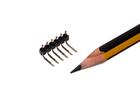
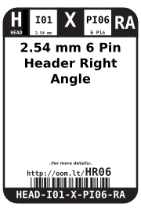
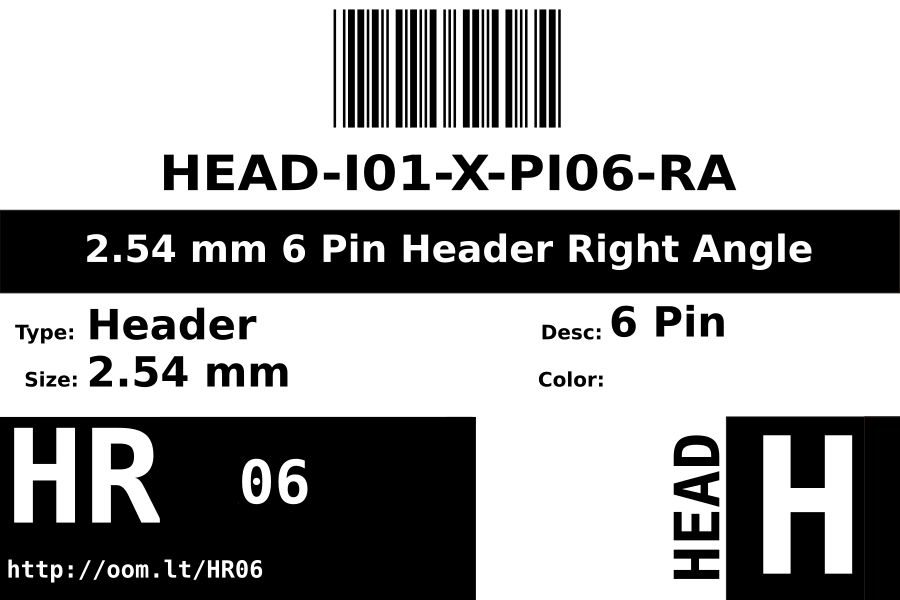
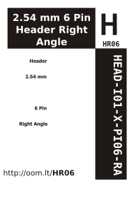

Contents
========

* [HEAD-I01-X-PI06-RA>2.54 mm 6 Pin Header Right Angle](#head-i01-x-pi06-ra254-mm-6-pin-header-right-angle)
	* [Images](#images)
	* [Datasheets](#datasheets)
	* [Labels](#labels)
	* [EDA](#eda)
		* [Symbols](#symbols)
	* [Tags](#tags)
  
![][im]
# HEAD-I01-X-PI06-RA>2.54 mm 6 Pin Header Right Angle

- ID: HEAD-I01-X-PI06-RA
- Name: HEAD-I01-X-PI06-RA

## Images
  
  

|image|image_RE|
| :---: | :---: |
|||

## Datasheets

- Datasheet: [datasheet.pdf](datasheet.pdf)

## Labels
  
  

|label-front|label-inventory|label-spec|
| :---: | :---: | :---: |
||||

## EDA

### Symbols

## Tags

- oompID: HEAD-I01-X-PI06-RA
- name: 2.54 mm 6 Pin Header Right Angle
- hexID: HR06
- oompSort: HEADI0106PI
- oompType: HEAD
- oompSize: I01
- oompColor: X
- oompDesc: PI06
- oompIndex: RA
- oompVersion: 98
- ooPitch: 2.54
- ooPinHeight: 11.60
- ooPinWidth: 0.64
- ooPinOffset: 1.53
- ooNumPins: 6
- ooFootprint: OOMP-HEAD-I01-X-PI06-01
- oompBbls: variable;clear
- oompBbls: variable;pins;6
- oompBbls: template;XXXX-I01-X-XX-RA-bbls
- oompDiag: variable;clear
- oompDiag: variable;pins;6
- oompDiag: template;HEAD-I01-X-XX-RA-diag
- oompIden: variable;clear
- oompIden: variable;pins;6
- oompIden: template;XXXX-I01-X-XX-RA-iden
- oompSchem: variable;clear
- oompSchem: variable;pins;6
- oompSchem: template;XXXX-XX-X-XX-01-PINS-EVEN-schem
- oompSimp: variable;clear
- oompSimp: variable;pins;6
- oompSimp: template;XXXX-I01-X-XX-RA-simp
- ooDesignator: J1

[im]: image_600.jpg
