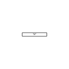
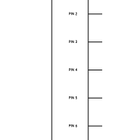
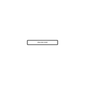
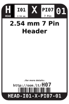
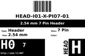

Contents
========

* [H07 > 2.54 mm 7 Pin Header](#h07--254-mm-7-pin-header)
	* [Diagrams](#diagrams)
	* [Datasheets](#datasheets)
	* [Labels](#labels)
	* [EDA](#eda)
	* [Images](#images)
	* [Tags](#tags)

# H07 > 2.54 mm 7 Pin Header

- ID: HEAD-I01-X-PI07-01
- Hex ID: H07
- Name: 2.54 mm 7 Pin Header
- Description: 2.54 mm 7 Pin Header
- Long Link: [http://oom.lt/HEAD-I01-X-PI07-01](http://oom.lt/HEAD-I01-X-PI07-01)
- Short Link: [http://oom.lt/H07](http://oom.lt/H07)

## Diagrams
  
  

|diagBBLS|diagDIAG|diagIDEN|diagSCHEM|diagSIMP|
| :---: | :---: | :---: | :---: | :---: |
||||||

## Datasheets

- Datasheet: [datasheet.pdf](datasheet.pdf)

## Labels
  
  

|label-front|label-inventory|label-spec|
| :---: | :---: | :---: |
||||

## EDA

### Footprints
  

|  [FOOTPRINT-eagle-SparkFun-Eagle-Libraries-Sparkfun-Connectors-1X07](https://github.com/oomlout/oomlout_OOMP_eda/tree/main/FOOTPRINT/eagle/SparkFun-Eagle-Libraries/Sparkfun-Connectors/1X07/)|  [FOOTPRINT-eagle-SparkFun-Eagle-Libraries-Sparkfun-Connectors-1X07_LOCK](https://github.com/oomlout/oomlout_OOMP_eda/tree/main/FOOTPRINT/eagle/SparkFun-Eagle-Libraries/Sparkfun-Connectors/1X07_LOCK/)|  [FOOTPRINT-eagle-SparkFun-Eagle-Libraries-Sparkfun-Connectors-1X07_LOCK_LONGPADS](https://github.com/oomlout/oomlout_OOMP_eda/tree/main/FOOTPRINT/eagle/SparkFun-Eagle-Libraries/Sparkfun-Connectors/1X07_LOCK_LONGPADS/)|  [FOOTPRINT-eagle-SparkFun-Eagle-Libraries-Sparkfun-Connectors-1X07_NO_SILK](https://github.com/oomlout/oomlout_OOMP_eda/tree/main/FOOTPRINT/eagle/SparkFun-Eagle-Libraries/Sparkfun-Connectors/1X07_NO_SILK/)|
| :---: | :---: | :---: | :---: |
|  [FOOTPRINT-kicad-kicad-footprints-Connector_PinHeader_2.54mm-PinHeader_1x07_P2.54mm_Vertical](https://github.com/oomlout/oomlout_OOMP_eda/tree/main/FOOTPRINT/kicad/kicad-footprints/Connector_PinHeader_2.54mm/PinHeader_1x07_P2.54mm_Vertical/)||||

### Symbols
  

|  [SYMBOL-kicad-kicad-symbols-Connector-Conn_01x07_Male](https://github.com/oomlout/oomlout_OOMP_parts/tree/main/SYMBOL-kicad-kicad-symbols-Connector-Conn_01x07_Male/)|  [----](https://github.com/oomlout/oomlout_OOMP_parts/tree/main/----/)|||
| :---: | :---: | :---: | :---: |
  

### Instances
  
Used 78 times.  
Prevalance: (78\10986) 0.71%  

|OOMP Instances|
| :---: |
|[PROJ-ADAF-1296-STAN-01  Adafruit TMP006 and TMP007 PCB  Used 1 times. JP1](https://github.com/oomlout/oomlout_OOMP_projects/tree/main/PROJ-ADAF-1296-STAN-01/)|
|[PROJ-ADAF-1334-STAN-01  Adafruit TCS34725 Color Sensor Breakout PCB  Used 1 times. JP1](https://github.com/oomlout/oomlout_OOMP_projects/tree/main/PROJ-ADAF-1334-STAN-01/)|
|[PROJ-ADAF-163-STAN-01  Adafruit Analog Accelerometers PCBs  Used 1 times. JP2](https://github.com/oomlout/oomlout_OOMP_projects/tree/main/PROJ-ADAF-163-STAN-01/)|
|[PROJ-ADAF-1777-STAN-01  Adafruit Si1145 Light Sensor PCB  Used 1 times. JP1](https://github.com/oomlout/oomlout_OOMP_projects/tree/main/PROJ-ADAF-1777-STAN-01/)|
|[PROJ-ADAF-1788-STAN-01  Adafruit Music Maker MP3 Shield PCB  Used 1 times. JP7](https://github.com/oomlout/oomlout_OOMP_projects/tree/main/PROJ-ADAF-1788-STAN-01/)|
|[PROJ-ADAF-1893-STAN-01  Adafruit MPL3115A2 PCB  Used 1 times. JP2](https://github.com/oomlout/oomlout_OOMP_projects/tree/main/PROJ-ADAF-1893-STAN-01/)|
|[PROJ-ADAF-1900-STAN-01  Adafruit BMP183 Breakout PCB  Used 1 times. JP2](https://github.com/oomlout/oomlout_OOMP_projects/tree/main/PROJ-ADAF-1900-STAN-01/)|
|[PROJ-ADAF-1982-STAN-01  Adafruit MPR121 PCB  Used 1 times. JP2](https://github.com/oomlout/oomlout_OOMP_projects/tree/main/PROJ-ADAF-1982-STAN-01/)|
|[PROJ-ADAF-2045-STAN-01  Adafruit Si5351A Clock Generator Breakout PCB  Used 1 times. JP1](https://github.com/oomlout/oomlout_OOMP_projects/tree/main/PROJ-ADAF-2045-STAN-01/)|
|[PROJ-ADAF-2190-STAN-01  Adafruit Verter PCB  Used 1 times. JP1](https://github.com/oomlout/oomlout_OOMP_projects/tree/main/PROJ-ADAF-2190-STAN-01/)|
|[PROJ-ADAF-2200-STAN-01  Adafruit LM4040 Voltage Reference PCB  Used 1 times. JP1](https://github.com/oomlout/oomlout_OOMP_projects/tree/main/PROJ-ADAF-2200-STAN-01/)|
|[PROJ-ADAF-2635-STAN-01  Adafruit HDC1008 Breakout PCB  Used 1 times. JP1](https://github.com/oomlout/oomlout_OOMP_projects/tree/main/PROJ-ADAF-2635-STAN-01/)|
|[PROJ-ADAF-2651-STAN-01  Adafruit BMP280 Breakout PCB  Used 1 times. JP2](https://github.com/oomlout/oomlout_OOMP_projects/tree/main/PROJ-ADAF-2651-STAN-01/)|
|[PROJ-ADAF-2652-STAN-01  Adafruit BME280 Breakout PCB  Used 1 times. JP2](https://github.com/oomlout/oomlout_OOMP_projects/tree/main/PROJ-ADAF-2652-STAN-01/)|
|[PROJ-ADAF-2857-STAN-01  Adafruit SHT31 Sensor Breakout PCB  Used 1 times. JP1](https://github.com/oomlout/oomlout_OOMP_projects/tree/main/PROJ-ADAF-2857-STAN-01/)|
|[PROJ-ADAF-3006-STAN-01  Adafruit MAX98357 I2S Amp Breakout  Used 1 times. JP1](https://github.com/oomlout/oomlout_OOMP_projects/tree/main/PROJ-ADAF-3006-STAN-01/)|
|[PROJ-ADAF-3088-STAN-01  Adafruit LED Backpack FeatherWing PCB  Used 3 times. JP1, JP4, JP5](https://github.com/oomlout/oomlout_OOMP_projects/tree/main/PROJ-ADAF-3088-STAN-01/)|
|[PROJ-ADAF-3316-STAN-01  Adafruit VL6180X ToF Distance Sensor PCB  Used 1 times. JP1](https://github.com/oomlout/oomlout_OOMP_projects/tree/main/PROJ-ADAF-3316-STAN-01/)|
|[PROJ-ADAF-3317-STAN-01  Adafruit VL53L0X ToF Distance Sensor PCB  Used 1 times. JP1](https://github.com/oomlout/oomlout_OOMP_projects/tree/main/PROJ-ADAF-3317-STAN-01/)|
|[PROJ-ADAF-3660-STAN-01  Adafruit BME680 PCB  Used 1 times. JP1](https://github.com/oomlout/oomlout_OOMP_projects/tree/main/PROJ-ADAF-3660-STAN-01/)|
|[PROJ-ADAF-3779-STAN-01  Adafruit AS7262 Breakout PCB  Used 2 times. FTDI1, JP2](https://github.com/oomlout/oomlout_OOMP_projects/tree/main/PROJ-ADAF-3779-STAN-01/)|
|[PROJ-ADAF-391-STAN-01  Adafruit BMP085 PCB  Used 1 times. JP2](https://github.com/oomlout/oomlout_OOMP_projects/tree/main/PROJ-ADAF-391-STAN-01/)|
|[PROJ-ADAF-3965-STAN-01  Adafruit MPRLS Pressure Sensor Breakout PCB  Used 1 times. JP1](https://github.com/oomlout/oomlout_OOMP_projects/tree/main/PROJ-ADAF-3965-STAN-01/)|
|[PROJ-ADAF-4488-STAN-01  Adafruit LIS2MDL PCB  Used 1 times. JP1](https://github.com/oomlout/oomlout_OOMP_projects/tree/main/PROJ-ADAF-4488-STAN-01/)|
|[PROJ-ADAF-4494-STAN-01  Adafruit DPS310 PCB  Used 1 times. JP1](https://github.com/oomlout/oomlout_OOMP_projects/tree/main/PROJ-ADAF-4494-STAN-01/)|
|[PROJ-ADAF-4535-STAN-01  Adafruit HTS221 PCB  Used 1 times. JP1](https://github.com/oomlout/oomlout_OOMP_projects/tree/main/PROJ-ADAF-4535-STAN-01/)|
|[PROJ-ADAF-4600-STAN-01  Adafruit QT Py PCB  Used 2 times. JP1, JP3](https://github.com/oomlout/oomlout_OOMP_projects/tree/main/PROJ-ADAF-4600-STAN-01/)|
|[PROJ-ADAF-4632-STAN-01  Adafruit PMSA003I PCB  Used 1 times. JP3](https://github.com/oomlout/oomlout_OOMP_projects/tree/main/PROJ-ADAF-4632-STAN-01/)|
|[PROJ-ADAF-4899-STAN-01  Adafruit SPI Flash SD Card PCB  Used 1 times. JP2](https://github.com/oomlout/oomlout_OOMP_projects/tree/main/PROJ-ADAF-4899-STAN-01/)|
|[PROJ-ADAF-4900-STAN-01  Adafruit QT Py RP2040 PCB  Used 2 times. JP1, JP3](https://github.com/oomlout/oomlout_OOMP_projects/tree/main/PROJ-ADAF-4900-STAN-01/)|
|[PROJ-ADAF-5201-STAN-01  Adafruit IS31FL3741 PCB  Used 1 times. JP5](https://github.com/oomlout/oomlout_OOMP_projects/tree/main/PROJ-ADAF-5201-STAN-01/)|
|[PROJ-ADAF-5325-STAN-01  Adafruit QT Py ESP32 S2 PCB  Used 2 times. JP1, JP3](https://github.com/oomlout/oomlout_OOMP_projects/tree/main/PROJ-ADAF-5325-STAN-01/)|
|[PROJ-ADAF-5395-STAN-01  Adafruit QT Py ESP32 Pico PCB  Used 2 times. JP1, JP3](https://github.com/oomlout/oomlout_OOMP_projects/tree/main/PROJ-ADAF-5395-STAN-01/)|
|[PROJ-ADAF-5397-STAN-01  Adafruit Charger BFF PCB  Used 2 times. JP1, JP3](https://github.com/oomlout/oomlout_OOMP_projects/tree/main/PROJ-ADAF-5397-STAN-01/)|
|[PROJ-ADAF-5405-STAN-01  Adafruit QT Py ESP32 C3 PCB  Used 2 times. JP1, JP3](https://github.com/oomlout/oomlout_OOMP_projects/tree/main/PROJ-ADAF-5405-STAN-01/)|
|[PROJ-ADAF-5426-STAN-01  Adafruit QT Py ESP32 S3 PCB  Used 2 times. JP1, JP3](https://github.com/oomlout/oomlout_OOMP_projects/tree/main/PROJ-ADAF-5426-STAN-01/)|
|[PROJ-SPAR-10160-STAN-01  DeadOn RTC  Used 1 times. JP1](https://github.com/oomlout/oomlout_OOMP_projects/tree/main/PROJ-SPAR-10160-STAN-01/)|
|[PROJ-SPAR-10252-STAN-01  IMU Fusion Board  Used 1 times. JP8](https://github.com/oomlout/oomlout_OOMP_projects/tree/main/PROJ-SPAR-10252-STAN-01/)|
|[PROJ-SPAR-10608-STAN-01  MP3 Breakout-VS1033D  Used 1 times. JP3](https://github.com/oomlout/oomlout_OOMP_projects/tree/main/PROJ-SPAR-10608-STAN-01/)|
|[PROJ-SPAR-10615-STAN-01  PWM Shield  Used 1 times. JP9](https://github.com/oomlout/oomlout_OOMP_projects/tree/main/PROJ-SPAR-10615-STAN-01/)|
|[PROJ-SPAR-10616-STAN-01  LED Driver Breakout-TLC5940  Used 2 times. JP22, JP23](https://github.com/oomlout/oomlout_OOMP_projects/tree/main/PROJ-SPAR-10616-STAN-01/)|
|[PROJ-SPAR-10680-STAN-01  Shift Register Breakout-74HC595  Used 2 times. JP2, JP3](https://github.com/oomlout/oomlout_OOMP_projects/tree/main/PROJ-SPAR-10680-STAN-01/)|
|[PROJ-SPAR-11040-STAN-01  LED RingCoder Breakout  Used 1 times. JP9](https://github.com/oomlout/oomlout_OOMP_projects/tree/main/PROJ-SPAR-11040-STAN-01/)|
|[PROJ-SPAR-11043-STAN-01  fabFM-Kit  Used 1 times. JP12](https://github.com/oomlout/oomlout_OOMP_projects/tree/main/PROJ-SPAR-11043-STAN-01/)|
|[PROJ-SPAR-11187-STAN-01  5-Way Tactile Switch Breakout  Used 1 times. JP1](https://github.com/oomlout/oomlout_OOMP_projects/tree/main/PROJ-SPAR-11187-STAN-01/)|
|[PROJ-SPAR-11684-STAN-01  MP3 Breakout-VS1063  Used 1 times. JP3](https://github.com/oomlout/oomlout_OOMP_projects/tree/main/PROJ-SPAR-11684-STAN-01/)|
|[PROJ-SPAR-11703-STAN-01  UDB5  Used 1 times. JP5](https://github.com/oomlout/oomlout_OOMP_projects/tree/main/PROJ-SPAR-11703-STAN-01/)|
|[PROJ-SPAR-11736-STAN-01  FT231X Breakout  Used 2 times. JP10, JP11](https://github.com/oomlout/oomlout_OOMP_projects/tree/main/PROJ-SPAR-11736-STAN-01/)|
|[PROJ-SPAR-11771-STAN-01  TXB0104 breakout  Used 2 times. JP1, JP2](https://github.com/oomlout/oomlout_OOMP_projects/tree/main/PROJ-SPAR-11771-STAN-01/)|
|[PROJ-SPAR-11859-STAN-01  TMP006-Temp Sensor Breakout  Used 1 times. JP1](https://github.com/oomlout/oomlout_OOMP_projects/tree/main/PROJ-SPAR-11859-STAN-01/)|
|[PROJ-SPAR-11977-STAN-01  ITG-3200 Breakout  Used 1 times. JP2](https://github.com/oomlout/oomlout_OOMP_projects/tree/main/PROJ-SPAR-11977-STAN-01/)|
|[PROJ-SPAR-12082-STAN-01  AD5330 Breakout  Used 1 times. JP7](https://github.com/oomlout/oomlout_OOMP_projects/tree/main/PROJ-SPAR-12082-STAN-01/)|
|[PROJ-SPAR-12909-STAN-01  MS5803-14BA Breakout  Used 1 times. JP1](https://github.com/oomlout/oomlout_OOMP_projects/tree/main/PROJ-SPAR-12909-STAN-01/)|
|[PROJ-SPAR-13120-STAN-01  MG2639 Cellular Shield  Used 1 times. JP5](https://github.com/oomlout/oomlout_OOMP_projects/tree/main/PROJ-SPAR-13120-STAN-01/)|
|[PROJ-SPAR-13743-STAN-01  Shifting microSD  Used 1 times. JP1](https://github.com/oomlout/oomlout_OOMP_projects/tree/main/PROJ-SPAR-13743-STAN-01/)|
|[PROJ-SPAR-13750-STAN-01  GPS Shield  Used 1 times. JP3](https://github.com/oomlout/oomlout_OOMP_projects/tree/main/PROJ-SPAR-13750-STAN-01/)|
|[PROJ-SPAR-13819-STAN-01  Arduino ProtoShield Bare PCB  Used 2 times. 5V_RAIL, GND_RAIL_1](https://github.com/oomlout/oomlout_OOMP_projects/tree/main/PROJ-SPAR-13819-STAN-01/)|
|[PROJ-SPAR-14001-STAN-01  9DOF Razor IMU  Used 1 times. J4](https://github.com/oomlout/oomlout_OOMP_projects/tree/main/PROJ-SPAR-14001-STAN-01/)|
|[PROJ-SPAR-14129-STAN-01  Ardumoto-Motor Driver Shield  Used 1 times. J4](https://github.com/oomlout/oomlout_OOMP_projects/tree/main/PROJ-SPAR-14129-STAN-01/)|
|[PROJ-SPAR-14130-STAN-01  Roshamglo  Used 1 times. J5](https://github.com/oomlout/oomlout_OOMP_projects/tree/main/PROJ-SPAR-14130-STAN-01/)|
|[PROJ-SPAR-14352-STAN-01  Qwiic Shield for Arduino  Used 1 times. J6](https://github.com/oomlout/oomlout_OOMP_projects/tree/main/PROJ-SPAR-14352-STAN-01/)|
|[PROJ-SPAR-14809-STAN-01  I2S Audio Breakout  Used 1 times. J2](https://github.com/oomlout/oomlout_OOMP_projects/tree/main/PROJ-SPAR-14809-STAN-01/)|
|[PROJ-SPAR-15005-STAN-01  Qwiic GPS-RTK  Used 1 times. J1](https://github.com/oomlout/oomlout_OOMP_projects/tree/main/PROJ-SPAR-15005-STAN-01/)|

## Images
  
  

|diagBBLS|diagDIAG|diagIDEN|diagSCHEM|diagSIMP|label-front|label-inventory|label-spec|
| :---: | :---: | :---: | :---: | :---: | :---: | :---: | :---: |
|||||||||

## Tags

- oompType: HEAD
- oompSize: I01
- oompColor: X
- oompDesc: PI07
- oompIndex: 01
- hexID: H07
- oompSort: 
- oompClass: Through Hole
- oompClassCode: THTH
- ooPitch: 2.54
- ooPinHeight: 11.60
- ooPinWidth: 0.64
- ooPinOffset: 1.53
- oompBbls: variable;pins;7
- oompBbls: template;XXXX-I01-X-XX-01-bbls
- oompDiag: variable;pins;7
- oompDiag: template;HEAD-I01-X-XX-01-diag
- oompIden: variable;pins;7
- oompIden: template;XXXX-I01-X-XX-01-iden
- oompSchem: variable;pins;7
- oompSchem: template;XXXX-XX-X-XX-01-PINS-ODD-schem
- oompSimp: variable;pins;7
- oompSimp: template;XXXX-I01-X-XX-01-simp
- ooNumPins: 7
- ooDesignator: J1
- schematicSymbol: HEAD-XX-X-PI07-XX
- oompID: HEAD-I01-X-PI07-01
- oompInstances: {'PROJECT': 'PROJ-ADAF-1296-STAN-01', 'ID': 'JP1'}
- oompInstances: {'PROJECT': 'PROJ-ADAF-1334-STAN-01', 'ID': 'JP1'}
- oompInstances: {'PROJECT': 'PROJ-ADAF-163-STAN-01', 'ID': 'JP2'}
- oompInstances: {'PROJECT': 'PROJ-ADAF-1777-STAN-01', 'ID': 'JP1'}
- oompInstances: {'PROJECT': 'PROJ-ADAF-1788-STAN-01', 'ID': 'JP7'}
- oompInstances: {'PROJECT': 'PROJ-ADAF-1893-STAN-01', 'ID': 'JP2'}
- oompInstances: {'PROJECT': 'PROJ-ADAF-1900-STAN-01', 'ID': 'JP2'}
- oompInstances: {'PROJECT': 'PROJ-ADAF-1982-STAN-01', 'ID': 'JP2'}
- oompInstances: {'PROJECT': 'PROJ-ADAF-2045-STAN-01', 'ID': 'JP1'}
- oompInstances: {'PROJECT': 'PROJ-ADAF-2190-STAN-01', 'ID': 'JP1'}
- oompInstances: {'PROJECT': 'PROJ-ADAF-2200-STAN-01', 'ID': 'JP1'}
- oompInstances: {'PROJECT': 'PROJ-ADAF-2635-STAN-01', 'ID': 'JP1'}
- oompInstances: {'PROJECT': 'PROJ-ADAF-2651-STAN-01', 'ID': 'JP2'}
- oompInstances: {'PROJECT': 'PROJ-ADAF-2652-STAN-01', 'ID': 'JP2'}
- oompInstances: {'PROJECT': 'PROJ-ADAF-2857-STAN-01', 'ID': 'JP1'}
- oompInstances: {'PROJECT': 'PROJ-ADAF-3006-STAN-01', 'ID': 'JP1'}
- oompInstances: {'PROJECT': 'PROJ-ADAF-3088-STAN-01', 'ID': 'JP1'}
- oompInstances: {'PROJECT': 'PROJ-ADAF-3088-STAN-01', 'ID': 'JP4'}
- oompInstances: {'PROJECT': 'PROJ-ADAF-3088-STAN-01', 'ID': 'JP5'}
- oompInstances: {'PROJECT': 'PROJ-ADAF-3316-STAN-01', 'ID': 'JP1'}
- oompInstances: {'PROJECT': 'PROJ-ADAF-3317-STAN-01', 'ID': 'JP1'}
- oompInstances: {'PROJECT': 'PROJ-ADAF-3660-STAN-01', 'ID': 'JP1'}
- oompInstances: {'PROJECT': 'PROJ-ADAF-3779-STAN-01', 'ID': 'FTDI1'}
- oompInstances: {'PROJECT': 'PROJ-ADAF-3779-STAN-01', 'ID': 'JP2'}
- oompInstances: {'PROJECT': 'PROJ-ADAF-391-STAN-01', 'ID': 'JP2'}
- oompInstances: {'PROJECT': 'PROJ-ADAF-3965-STAN-01', 'ID': 'JP1'}
- oompInstances: {'PROJECT': 'PROJ-ADAF-4488-STAN-01', 'ID': 'JP1'}
- oompInstances: {'PROJECT': 'PROJ-ADAF-4494-STAN-01', 'ID': 'JP1'}
- oompInstances: {'PROJECT': 'PROJ-ADAF-4535-STAN-01', 'ID': 'JP1'}
- oompInstances: {'PROJECT': 'PROJ-ADAF-4600-STAN-01', 'ID': 'JP1'}
- oompInstances: {'PROJECT': 'PROJ-ADAF-4600-STAN-01', 'ID': 'JP3'}
- oompInstances: {'PROJECT': 'PROJ-ADAF-4632-STAN-01', 'ID': 'JP3'}
- oompInstances: {'PROJECT': 'PROJ-ADAF-4899-STAN-01', 'ID': 'JP2'}
- oompInstances: {'PROJECT': 'PROJ-ADAF-4900-STAN-01', 'ID': 'JP1'}
- oompInstances: {'PROJECT': 'PROJ-ADAF-4900-STAN-01', 'ID': 'JP3'}
- oompInstances: {'PROJECT': 'PROJ-ADAF-5201-STAN-01', 'ID': 'JP5'}
- oompInstances: {'PROJECT': 'PROJ-ADAF-5325-STAN-01', 'ID': 'JP1'}
- oompInstances: {'PROJECT': 'PROJ-ADAF-5325-STAN-01', 'ID': 'JP3'}
- oompInstances: {'PROJECT': 'PROJ-ADAF-5395-STAN-01', 'ID': 'JP1'}
- oompInstances: {'PROJECT': 'PROJ-ADAF-5395-STAN-01', 'ID': 'JP3'}
- oompInstances: {'PROJECT': 'PROJ-ADAF-5397-STAN-01', 'ID': 'JP1'}
- oompInstances: {'PROJECT': 'PROJ-ADAF-5397-STAN-01', 'ID': 'JP3'}
- oompInstances: {'PROJECT': 'PROJ-ADAF-5405-STAN-01', 'ID': 'JP1'}
- oompInstances: {'PROJECT': 'PROJ-ADAF-5405-STAN-01', 'ID': 'JP3'}
- oompInstances: {'PROJECT': 'PROJ-ADAF-5426-STAN-01', 'ID': 'JP1'}
- oompInstances: {'PROJECT': 'PROJ-ADAF-5426-STAN-01', 'ID': 'JP3'}
- oompInstances: {'PROJECT': 'PROJ-SPAR-10160-STAN-01', 'ID': 'JP1'}
- oompInstances: {'PROJECT': 'PROJ-SPAR-10252-STAN-01', 'ID': 'JP8'}
- oompInstances: {'PROJECT': 'PROJ-SPAR-10608-STAN-01', 'ID': 'JP3'}
- oompInstances: {'PROJECT': 'PROJ-SPAR-10615-STAN-01', 'ID': 'JP9'}
- oompInstances: {'PROJECT': 'PROJ-SPAR-10616-STAN-01', 'ID': 'JP22'}
- oompInstances: {'PROJECT': 'PROJ-SPAR-10616-STAN-01', 'ID': 'JP23'}
- oompInstances: {'PROJECT': 'PROJ-SPAR-10680-STAN-01', 'ID': 'JP2'}
- oompInstances: {'PROJECT': 'PROJ-SPAR-10680-STAN-01', 'ID': 'JP3'}
- oompInstances: {'PROJECT': 'PROJ-SPAR-11040-STAN-01', 'ID': 'JP9'}
- oompInstances: {'PROJECT': 'PROJ-SPAR-11043-STAN-01', 'ID': 'JP12'}
- oompInstances: {'PROJECT': 'PROJ-SPAR-11187-STAN-01', 'ID': 'JP1'}
- oompInstances: {'PROJECT': 'PROJ-SPAR-11684-STAN-01', 'ID': 'JP3'}
- oompInstances: {'PROJECT': 'PROJ-SPAR-11703-STAN-01', 'ID': 'JP5'}
- oompInstances: {'PROJECT': 'PROJ-SPAR-11736-STAN-01', 'ID': 'JP10'}
- oompInstances: {'PROJECT': 'PROJ-SPAR-11736-STAN-01', 'ID': 'JP11'}
- oompInstances: {'PROJECT': 'PROJ-SPAR-11771-STAN-01', 'ID': 'JP1'}
- oompInstances: {'PROJECT': 'PROJ-SPAR-11771-STAN-01', 'ID': 'JP2'}
- oompInstances: {'PROJECT': 'PROJ-SPAR-11859-STAN-01', 'ID': 'JP1'}
- oompInstances: {'PROJECT': 'PROJ-SPAR-11977-STAN-01', 'ID': 'JP2'}
- oompInstances: {'PROJECT': 'PROJ-SPAR-12082-STAN-01', 'ID': 'JP7'}
- oompInstances: {'PROJECT': 'PROJ-SPAR-12909-STAN-01', 'ID': 'JP1'}
- oompInstances: {'PROJECT': 'PROJ-SPAR-13120-STAN-01', 'ID': 'JP5'}
- oompInstances: {'PROJECT': 'PROJ-SPAR-13743-STAN-01', 'ID': 'JP1'}
- oompInstances: {'PROJECT': 'PROJ-SPAR-13750-STAN-01', 'ID': 'JP3'}
- oompInstances: {'PROJECT': 'PROJ-SPAR-13819-STAN-01', 'ID': '5V_RAIL'}
- oompInstances: {'PROJECT': 'PROJ-SPAR-13819-STAN-01', 'ID': 'GND_RAIL_1'}
- oompInstances: {'PROJECT': 'PROJ-SPAR-14001-STAN-01', 'ID': 'J4'}
- oompInstances: {'PROJECT': 'PROJ-SPAR-14129-STAN-01', 'ID': 'J4'}
- oompInstances: {'PROJECT': 'PROJ-SPAR-14130-STAN-01', 'ID': 'J5'}
- oompInstances: {'PROJECT': 'PROJ-SPAR-14352-STAN-01', 'ID': 'J6'}
- oompInstances: {'PROJECT': 'PROJ-SPAR-14809-STAN-01', 'ID': 'J2'}
- oompInstances: {'PROJECT': 'PROJ-SPAR-15005-STAN-01', 'ID': 'J1'}
- footprintEagle: FOOTPRINT-eagle-SparkFun-Eagle-Libraries-Sparkfun-Connectors-1X07
- footprintEagle: FOOTPRINT-eagle-SparkFun-Eagle-Libraries-Sparkfun-Connectors-1X07_LOCK
- footprintEagle: FOOTPRINT-eagle-SparkFun-Eagle-Libraries-Sparkfun-Connectors-1X07_LOCK_LONGPADS
- footprintEagle: FOOTPRINT-eagle-SparkFun-Eagle-Libraries-Sparkfun-Connectors-1X07_NO_SILK
- footprintKicad: FOOTPRINT-kicad-kicad-footprints-Connector_PinHeader_2.54mm-PinHeader_1x07_P2.54mm_Vertical
- symbolKicad: SYMBOL-kicad-kicad-symbols-Connector-Conn_01x07_Male
- symbolKicad: SYMBOL-kicad-kicad-symbols-Connector_Generic-Conn_01x07_Male
