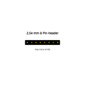
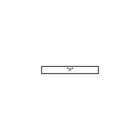
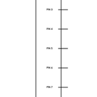
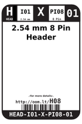
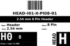
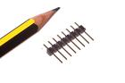

Contents
========

* [H08 > 2.54 mm 8 Pin Header](#h08--254-mm-8-pin-header)
	* [Diagrams](#diagrams)
	* [Datasheets](#datasheets)
	* [Labels](#labels)
	* [EDA](#eda)
	* [Images](#images)
	* [Tags](#tags)
  
![][im]
# H08 > 2.54 mm 8 Pin Header

- ID: HEAD-I01-X-PI08-01
- Hex ID: H08
- Name: 2.54 mm 8 Pin Header
- Description: 2.54 mm 8 Pin Header
- Long Link: [http://oom.lt/HEAD-I01-X-PI08-01](http://oom.lt/HEAD-I01-X-PI08-01)
- Short Link: [http://oom.lt/H08](http://oom.lt/H08)

## Diagrams
  
  

|diagBBLS|diagDIAG|diagIDEN|diagSCHEM|diagSIMP|
| :---: | :---: | :---: | :---: | :---: |
||||||

## Datasheets

- Datasheet: [datasheet.pdf](datasheet.pdf)

## Labels
  
  

|label-front|label-inventory|label-spec|
| :---: | :---: | :---: |
||||

## EDA

### Footprints
  

|  [FOOTPRINT-eagle-SparkFun-Eagle-Libraries-Sparkfun-Connectors-1X08](https://github.com/oomlout/oomlout_OOMP_eda/tree/main/FOOTPRINT/eagle/SparkFun-Eagle-Libraries/Sparkfun-Connectors/1X08/)|  [FOOTPRINT-eagle-SparkFun-Eagle-Libraries-Sparkfun-Connectors-1X08_LOCK](https://github.com/oomlout/oomlout_OOMP_eda/tree/main/FOOTPRINT/eagle/SparkFun-Eagle-Libraries/Sparkfun-Connectors/1X08_LOCK/)|  [FOOTPRINT-eagle-SparkFun-Eagle-Libraries-Sparkfun-Connectors-1X08_LOCK_LONGPADS](https://github.com/oomlout/oomlout_OOMP_eda/tree/main/FOOTPRINT/eagle/SparkFun-Eagle-Libraries/Sparkfun-Connectors/1X08_LOCK_LONGPADS/)|  [FOOTPRINT-eagle-SparkFun-Eagle-Libraries-Sparkfun-Connectors-1X08_NO_SILK](https://github.com/oomlout/oomlout_OOMP_eda/tree/main/FOOTPRINT/eagle/SparkFun-Eagle-Libraries/Sparkfun-Connectors/1X08_NO_SILK/)|
| :---: | :---: | :---: | :---: |
|  [FOOTPRINT-eagle-Adafruit-Eagle-Library-adafruit-1X08-CLEANBIG](https://github.com/oomlout/oomlout_OOMP_eda/tree/main/FOOTPRINT/eagle/Adafruit-Eagle-Library/adafruit/1X08-CLEANBIG/)|  [FOOTPRINT-eagle-Adafruit-Eagle-Library-adafruit-1X08-LOCK](https://github.com/oomlout/oomlout_OOMP_eda/tree/main/FOOTPRINT/eagle/Adafruit-Eagle-Library/adafruit/1X08-LOCK/)|  [----](https://github.com/oomlout/oomlout_OOMP_parts/tree/main/----/)|  [FOOTPRINT-kicad-kicad-footprints-Connector_PinHeader_2.54mm-PinHeader_1x08_P2.54mm_Vertical](https://github.com/oomlout/oomlout_OOMP_eda/tree/main/FOOTPRINT/kicad/kicad-footprints/Connector_PinHeader_2.54mm/PinHeader_1x08_P2.54mm_Vertical/)|
|||||

### Symbols
  

|  [SYMBOL-kicad-kicad-symbols-Connector-Conn_01x08_Male](https://github.com/oomlout/oomlout_OOMP_parts/tree/main/SYMBOL-kicad-kicad-symbols-Connector-Conn_01x08_Male/)|  [----](https://github.com/oomlout/oomlout_OOMP_parts/tree/main/----/)|||
| :---: | :---: | :---: | :---: |
  

### Instances
  
Used 173 times.  
Prevalance: (173\10986) 1.5747%  

|OOMP Instances|
| :---: |
|[PROJ-ADAF-1120-STAN-01  Adafruit LSM303 PCB  Used 1 times. JP1](https://github.com/oomlout/oomlout_OOMP_projects/tree/main/PROJ-ADAF-1120-STAN-01/)|
|[PROJ-ADAF-1272-STAN-01  Adafruit GPS Logger Shield PCB  Used 2 times. JP1, JP4](https://github.com/oomlout/oomlout_OOMP_projects/tree/main/PROJ-ADAF-1272-STAN-01/)|
|[PROJ-ADAF-1411-STAN-01  Adafruit 16 channel PWM Servo Shield  Used 2 times. JP3, JP4](https://github.com/oomlout/oomlout_OOMP_projects/tree/main/PROJ-ADAF-1411-STAN-01/)|
|[PROJ-ADAF-1438-STAN-01  Adafruit Motor Shield V2 PCB  Used 2 times. D0-7, JP2](https://github.com/oomlout/oomlout_OOMP_projects/tree/main/PROJ-ADAF-1438-STAN-01/)|
|[PROJ-ADAF-1628-STAN-01  Adafruit Bluefruit EZ Link Shield PCB  Used 2 times. JP3, JP4](https://github.com/oomlout/oomlout_OOMP_projects/tree/main/PROJ-ADAF-1628-STAN-01/)|
|[PROJ-ADAF-1727-STAN-01  Adafruit MAX31850 thermocouple breakout board  Used 1 times. JP1](https://github.com/oomlout/oomlout_OOMP_projects/tree/main/PROJ-ADAF-1727-STAN-01/)|
|[PROJ-ADAF-1788-STAN-01  Adafruit Music Maker MP3 Shield PCB  Used 2 times. JP1, JP4](https://github.com/oomlout/oomlout_OOMP_projects/tree/main/PROJ-ADAF-1788-STAN-01/)|
|[PROJ-ADAF-196-STAN-01  Adafruit Proto Screwshield PCB  Used 2 times. JP3, JP4](https://github.com/oomlout/oomlout_OOMP_projects/tree/main/PROJ-ADAF-196-STAN-01/)|
|[PROJ-ADAF-2019-STAN-01  Adafruit MMA8451 Breakout PCB  Used 1 times. JP1](https://github.com/oomlout/oomlout_OOMP_projects/tree/main/PROJ-ADAF-2019-STAN-01/)|
|[PROJ-ADAF-2024-STAN-01  Adafruit MPR121 Capacitive Touch Shield PCB  Used 2 times. JP1, JP4](https://github.com/oomlout/oomlout_OOMP_projects/tree/main/PROJ-ADAF-2024-STAN-01/)|
|[PROJ-ADAF-2077-STAN-01  Adafruit Proto Shield PCB  Used 2 times. JP1, JP4](https://github.com/oomlout/oomlout_OOMP_projects/tree/main/PROJ-ADAF-2077-STAN-01/)|
|[PROJ-ADAF-2465-STAN-01  Adafruit PowerBoost 1000C  Used 1 times. JP2](https://github.com/oomlout/oomlout_OOMP_projects/tree/main/PROJ-ADAF-2465-STAN-01/)|
|[PROJ-ADAF-2466-STAN-01  Adafruit METRO 328 PCB  Used 2 times. IOL, POWER](https://github.com/oomlout/oomlout_OOMP_projects/tree/main/PROJ-ADAF-2466-STAN-01/)|
|[PROJ-ADAF-2468-STAN-01  Adafruit FONA 800 Shield PCB  Used 3 times. JP5, JP6, JP10](https://github.com/oomlout/oomlout_OOMP_projects/tree/main/PROJ-ADAF-2468-STAN-01/)|
|[PROJ-ADAF-2479-STAN-01  Adafruit Bluefruit LE UART Friend PCB  Used 1 times. JP1](https://github.com/oomlout/oomlout_OOMP_projects/tree/main/PROJ-ADAF-2479-STAN-01/)|
|[PROJ-ADAF-254-STAN-01  MicroSD breakout board  Used 1 times. JP1](https://github.com/oomlout/oomlout_OOMP_projects/tree/main/PROJ-ADAF-254-STAN-01/)|
|[PROJ-ADAF-2601-STAN-01  Adafruit RGB Matrix Shield PCB  Used 4 times. JP1, JP2, JP3, JP4](https://github.com/oomlout/oomlout_OOMP_projects/tree/main/PROJ-ADAF-2601-STAN-01/)|
|[PROJ-ADAF-2636-STAN-01  Adafruit FONA808 Shield PCB  Used 3 times. JP5, JP6, JP10](https://github.com/oomlout/oomlout_OOMP_projects/tree/main/PROJ-ADAF-2636-STAN-01/)|
|[PROJ-ADAF-2746-STAN-01  Adafruit Bluefruit LE Shield PCB  Used 2 times. JP2, JP3](https://github.com/oomlout/oomlout_OOMP_projects/tree/main/PROJ-ADAF-2746-STAN-01/)|
|[PROJ-ADAF-3297-STAN-01  Adafruit DRV8833 Motor Driver Breakout PCB  Used 1 times. JP5](https://github.com/oomlout/oomlout_OOMP_projects/tree/main/PROJ-ADAF-3297-STAN-01/)|
|[PROJ-ADAF-3309-STAN-01  Adafruit CP2104 Friend PCB  Used 2 times. JP2, JP4](https://github.com/oomlout/oomlout_OOMP_projects/tree/main/PROJ-ADAF-3309-STAN-01/)|
|[PROJ-ADAF-3328-STAN-01  Adafruit MAX31865 PCB  Used 1 times. JP1](https://github.com/oomlout/oomlout_OOMP_projects/tree/main/PROJ-ADAF-3328-STAN-01/)|
|[PROJ-ADAF-3382-STAN-01  Adafruit Metro M4 Express PCB  Used 2 times. IOL, POWER](https://github.com/oomlout/oomlout_OOMP_projects/tree/main/PROJ-ADAF-3382-STAN-01/)|
|[PROJ-ADAF-3505-STAN-01  Adafruit Metro M0 Express PCB  Used 2 times. IOL, POWER](https://github.com/oomlout/oomlout_OOMP_projects/tree/main/PROJ-ADAF-3505-STAN-01/)|
|[PROJ-ADAF-3566-STAN-01  Adafruit CCS811 Breakout PCB  Used 1 times. JP3](https://github.com/oomlout/oomlout_OOMP_projects/tree/main/PROJ-ADAF-3566-STAN-01/)|
|[PROJ-ADAF-364-STAN-01  Adafruit PN532 RFID NFC Breakout  Used 1 times. JP4](https://github.com/oomlout/oomlout_OOMP_projects/tree/main/PROJ-ADAF-364-STAN-01/)|
|[PROJ-ADAF-3966-STAN-01  Adafruit BMP3xx PCB  Used 1 times. JP1](https://github.com/oomlout/oomlout_OOMP_projects/tree/main/PROJ-ADAF-3966-STAN-01/)|
|[PROJ-ADAF-4000-STAN-01  Adafruit Metro M4 Express AirLift PCB  Used 2 times. IOL, POWER](https://github.com/oomlout/oomlout_OOMP_projects/tree/main/PROJ-ADAF-4000-STAN-01/)|
|[PROJ-ADAF-4022-STAN-01  Adafruit MLX90393 PCB  Used 1 times. JP3](https://github.com/oomlout/oomlout_OOMP_projects/tree/main/PROJ-ADAF-4022-STAN-01/)|
|[PROJ-ADAF-4064-STAN-01  Adafruit Grand Central PCB  Used 5 times. ANALOGH, ANALOGL, IOL, POWER, UART](https://github.com/oomlout/oomlout_OOMP_projects/tree/main/PROJ-ADAF-4064-STAN-01/)|
|[PROJ-ADAF-4089-STAN-01  Adafruit ADT7410 PCB  Used 1 times. JP1](https://github.com/oomlout/oomlout_OOMP_projects/tree/main/PROJ-ADAF-4089-STAN-01/)|
|[PROJ-ADAF-4090-STAN-01  Adafruit USB C Downstream Breakout  Used 1 times. JP1](https://github.com/oomlout/oomlout_OOMP_projects/tree/main/PROJ-ADAF-4090-STAN-01/)|
|[PROJ-ADAF-4226-STAN-01  Adafruit INA260 PCB  Used 1 times. JP2](https://github.com/oomlout/oomlout_OOMP_projects/tree/main/PROJ-ADAF-4226-STAN-01/)|
|[PROJ-ADAF-4530-STAN-01  Adafruit LPS2X PCB  Used 1 times. JP3](https://github.com/oomlout/oomlout_OOMP_projects/tree/main/PROJ-ADAF-4530-STAN-01/)|
|[PROJ-ADAF-4702-STAN-01  Adafruit RGB Matrix FeatherWing PCB  Used 2 times. JP2, JP3](https://github.com/oomlout/oomlout_OOMP_projects/tree/main/PROJ-ADAF-4702-STAN-01/)|
|[PROJ-ADAF-4741-STAN-01  Adafruit Grayscale 1.5 inch 128x128 OLED PCB  Used 1 times. JP2](https://github.com/oomlout/oomlout_OOMP_projects/tree/main/PROJ-ADAF-4741-STAN-01/)|
|[PROJ-ADAF-4775-STAN-01  Adafruit Metro ESP32 S2 PCB  Used 2 times. IOL, POWER](https://github.com/oomlout/oomlout_OOMP_projects/tree/main/PROJ-ADAF-4775-STAN-01/)|
|[PROJ-ADAF-5188-STAN-01  Adafruit DS3231 Precision RTC Breakout PCB  Used 1 times. JP1](https://github.com/oomlout/oomlout_OOMP_projects/tree/main/PROJ-ADAF-5188-STAN-01/)|
|[PROJ-ADAF-5297-STAN-01  Adafruit 1.12in 128x128 OLED PCB  Used 1 times. JP2](https://github.com/oomlout/oomlout_OOMP_projects/tree/main/PROJ-ADAF-5297-STAN-01/)|
|[PROJ-ADAF-5335-STAN-01  Adafruit CP2102N Friend PCB  Used 2 times. JP2, JP4](https://github.com/oomlout/oomlout_OOMP_projects/tree/main/PROJ-ADAF-5335-STAN-01/)|
|[PROJ-ADAF-572-STAN-01  Adafruit BeagleBone ProtoBoard PCB  Used 3 times. JP7, JP8, JP24](https://github.com/oomlout/oomlout_OOMP_projects/tree/main/PROJ-ADAF-572-STAN-01/)|
|[PROJ-ADAF-661-STAN-01  Adafruit 128x32 SPI OLED breakout board PCB  Used 1 times. JP1](https://github.com/oomlout/oomlout_OOMP_projects/tree/main/PROJ-ADAF-661-STAN-01/)|
|[PROJ-ADAF-789-STAN-01  Adafruit PN532 RFID NFC Shield  Used 2 times. JP1, JP4](https://github.com/oomlout/oomlout_OOMP_projects/tree/main/PROJ-ADAF-789-STAN-01/)|
|[PROJ-ADAF-795-STAN-01  Adafruit Menta PCB  Used 2 times. JP4, JP5](https://github.com/oomlout/oomlout_OOMP_projects/tree/main/PROJ-ADAF-795-STAN-01/)|
|[PROJ-ADAF-801-STAN-01  Adafruit Prototyping Pi Plate PCB  Used 4 times. JP2, JP4, JP5, JP6](https://github.com/oomlout/oomlout_OOMP_projects/tree/main/PROJ-ADAF-801-STAN-01/)|
|[PROJ-ADAF-802-STAN-01  Adafruit 1.8 TFT Shield PCB  Used 2 times. DIGITALS, DIGITALS2](https://github.com/oomlout/oomlout_OOMP_projects/tree/main/PROJ-ADAF-802-STAN-01/)|
|[PROJ-ADAF-91-STAN-01  Adafruit_USB_Boarduino_PCB  Used 2 times. JD1, JD2](https://github.com/oomlout/oomlout_OOMP_projects/tree/main/PROJ-ADAF-91-STAN-01/)|
|[PROJ-ADAF-938-STAN-01  Adafruit 1.3inch 128x64 Mono OLED PCB  Used 1 times. JP1](https://github.com/oomlout/oomlout_OOMP_projects/tree/main/PROJ-ADAF-938-STAN-01/)|
|[PROJ-ARDU-LEO-STAN-01  Arduino Leonardo  Used 2 times. J2, J3](https://github.com/oomlout/oomlout_OOMP_projects/tree/main/PROJ-ARDU-LEO-STAN-01/)|
|[PROJ-ARDU-UNO-REV3-01  Arduino Rev3 Uno  Used 2 times. IOL, POWER](https://github.com/oomlout/oomlout_OOMP_projects/tree/main/PROJ-ARDU-UNO-REV3-01/)|
|[PROJ-SPAR-10345-STAN-01  Triple Axis Accelerometer Breakout-LIS331  Used 1 times. JP1](https://github.com/oomlout/oomlout_OOMP_projects/tree/main/PROJ-SPAR-10345-STAN-01/)|
|[PROJ-SPAR-10507-STAN-01  Quadstepper Motor Driver  Used 5 times. JP16, JP17, JP18, JP19, JP22](https://github.com/oomlout/oomlout_OOMP_projects/tree/main/PROJ-SPAR-10507-STAN-01/)|
|[PROJ-SPAR-10547-STAN-01  Simon-Says  Used 1 times. JP4](https://github.com/oomlout/oomlout_OOMP_projects/tree/main/PROJ-SPAR-10547-STAN-01/)|
|[PROJ-SPAR-10612-STAN-01  Tri-Axis Gyro Breakout-L3G4200D  Used 1 times. JP1](https://github.com/oomlout/oomlout_OOMP_projects/tree/main/PROJ-SPAR-10612-STAN-01/)|
|[PROJ-SPAR-10653-STAN-01  Voice Recorder Breakout-ISD1932  Used 1 times. JP7](https://github.com/oomlout/oomlout_OOMP_projects/tree/main/PROJ-SPAR-10653-STAN-01/)|
|[PROJ-SPAR-10680-STAN-01  Shift Register Breakout-74HC595  Used 1 times. JP1](https://github.com/oomlout/oomlout_OOMP_projects/tree/main/PROJ-SPAR-10680-STAN-01/)|
|[PROJ-SPAR-10740-STAN-01  IR Thermometer Evaluation Board-MLX90614  Used 1 times. JP2](https://github.com/oomlout/oomlout_OOMP_projects/tree/main/PROJ-SPAR-10740-STAN-01/)|
|[PROJ-SPAR-10878-STAN-01  EL Escudo Dos  Used 1 times. JP10](https://github.com/oomlout/oomlout_OOMP_projects/tree/main/PROJ-SPAR-10878-STAN-01/)|
|[PROJ-SPAR-10914-STAN-01  Arduino Pro 328  Used 2 times. J1, J3](https://github.com/oomlout/oomlout_OOMP_projects/tree/main/PROJ-SPAR-10914-STAN-01/)|
|[PROJ-SPAR-11129-STAN-01  Si4707 Breakout  Used 1 times. J3](https://github.com/oomlout/oomlout_OOMP_projects/tree/main/PROJ-SPAR-11129-STAN-01/)|
|[PROJ-SPAR-11323-STAN-01  EL Sequencer  Used 2 times. JP2, JP4](https://github.com/oomlout/oomlout_OOMP_projects/tree/main/PROJ-SPAR-11323-STAN-01/)|
|[PROJ-SPAR-11509-STAN-01  Papilio Button LED Wing  Used 1 times. JP2](https://github.com/oomlout/oomlout_OOMP_projects/tree/main/PROJ-SPAR-11509-STAN-01/)|
|[PROJ-SPAR-11512-STAN-01  SN74HC165-Shift-In-Breakout  Used 1 times. JP1](https://github.com/oomlout/oomlout_OOMP_projects/tree/main/PROJ-SPAR-11512-STAN-01/)|
|[PROJ-SPAR-11568-STAN-01  Papilio Audio Wing  Used 1 times. JP2](https://github.com/oomlout/oomlout_OOMP_projects/tree/main/PROJ-SPAR-11568-STAN-01/)|
|[PROJ-SPAR-11569-STAN-01  Papilio VGA Wing  Used 1 times. JP2](https://github.com/oomlout/oomlout_OOMP_projects/tree/main/PROJ-SPAR-11569-STAN-01/)|
|[PROJ-SPAR-12039-STAN-01  SparkFun T5403 Barometric Breakout  Used 1 times. JP1](https://github.com/oomlout/oomlout_OOMP_projects/tree/main/PROJ-SPAR-12039-STAN-01/)|
|[PROJ-SPAR-12071-STAN-01  CC3000 WiFi Shield  Used 1 times. JP2](https://github.com/oomlout/oomlout_OOMP_projects/tree/main/PROJ-SPAR-12071-STAN-01/)|
|[PROJ-SPAR-12082-STAN-01  AD5330 Breakout  Used 1 times. JP6](https://github.com/oomlout/oomlout_OOMP_projects/tree/main/PROJ-SPAR-12082-STAN-01/)|
|[PROJ-SPAR-12761-STAN-01  microSD Shield  Used 2 times. JP4, JP7](https://github.com/oomlout/oomlout_OOMP_projects/tree/main/PROJ-SPAR-12761-STAN-01/)|
|[PROJ-SPAR-12858-STAN-01  Vernier Interface Shield  Used 2 times. JP2, JP3](https://github.com/oomlout/oomlout_OOMP_projects/tree/main/PROJ-SPAR-12858-STAN-01/)|
|[PROJ-SPAR-12887-STAN-01  Electric Imp Shield  Used 2 times. JP3, JP4](https://github.com/oomlout/oomlout_OOMP_projects/tree/main/PROJ-SPAR-12887-STAN-01/)|
|[PROJ-SPAR-12938-STAN-01  Si4703 FM Tuner Evaluation Board  Used 1 times. JP1](https://github.com/oomlout/oomlout_OOMP_projects/tree/main/PROJ-SPAR-12938-STAN-01/)|
|[PROJ-SPAR-13058-STAN-01  MiP ProMini-Pack  Used 4 times. JP4, JP5, JP8, JP9](https://github.com/oomlout/oomlout_OOMP_projects/tree/main/PROJ-SPAR-13058-STAN-01/)|
|[PROJ-SPAR-13158-STAN-01  LiPower-Shield  Used 2 times. JP3, JP8](https://github.com/oomlout/oomlout_OOMP_projects/tree/main/PROJ-SPAR-13158-STAN-01/)|
|[PROJ-SPAR-13709-STAN-01  MyoWare Proto Shield  Used 15 times. JP3, JP4, JP5, JP6, JP7, JP8, JP9, JP10, JP11, JP12, JP13, JP14, JP15, JP16, JP17](https://github.com/oomlout/oomlout_OOMP_projects/tree/main/PROJ-SPAR-13709-STAN-01/)|
|[PROJ-SPAR-13714-STAN-01  FreeSoc2  Used 3 times. JP5, JP6, JP10](https://github.com/oomlout/oomlout_OOMP_projects/tree/main/PROJ-SPAR-13714-STAN-01/)|
|[PROJ-SPAR-13750-STAN-01  GPS Shield  Used 2 times. JP13, JP21](https://github.com/oomlout/oomlout_OOMP_projects/tree/main/PROJ-SPAR-13750-STAN-01/)|
|[PROJ-SPAR-13770-STAN-01  Edison ADC Block  Used 1 times. JP1](https://github.com/oomlout/oomlout_OOMP_projects/tree/main/PROJ-SPAR-13770-STAN-01/)|
|[PROJ-SPAR-13795-STAN-01  LED Array 8x7  Used 1 times. JP1](https://github.com/oomlout/oomlout_OOMP_projects/tree/main/PROJ-SPAR-13795-STAN-01/)|
|[PROJ-SPAR-13819-STAN-01  Arduino ProtoShield Bare PCB  Used 2 times. JP11, JP12](https://github.com/oomlout/oomlout_OOMP_projects/tree/main/PROJ-SPAR-13819-STAN-01/)|
|[PROJ-SPAR-13884-STAN-01  LP55231 Breakout  Used 1 times. J1](https://github.com/oomlout/oomlout_OOMP_projects/tree/main/PROJ-SPAR-13884-STAN-01/)|
|[PROJ-SPAR-13906-STAN-01  74HC4051 8-Channel Mux Breakout  Used 1 times. J2](https://github.com/oomlout/oomlout_OOMP_projects/tree/main/PROJ-SPAR-13906-STAN-01/)|
|[PROJ-SPAR-13975-STAN-01  RedBoard  Used 2 times. JP10, JP11](https://github.com/oomlout/oomlout_OOMP_projects/tree/main/PROJ-SPAR-13975-STAN-01/)|
|[PROJ-SPAR-13994-STAN-01  SSOP-DIP Adapter 16-Pin  Used 4 times. JP1, JP2, JP3, JP4](https://github.com/oomlout/oomlout_OOMP_projects/tree/main/PROJ-SPAR-13994-STAN-01/)|
|[PROJ-SPAR-14001-STAN-01  9DOF Razor IMU  Used 1 times. J5](https://github.com/oomlout/oomlout_OOMP_projects/tree/main/PROJ-SPAR-14001-STAN-01/)|
|[PROJ-SPAR-14006-STAN-01  Lil Soundie Audio Player  Used 1 times. J3](https://github.com/oomlout/oomlout_OOMP_projects/tree/main/PROJ-SPAR-14006-STAN-01/)|
|[PROJ-SPAR-14129-STAN-01  Ardumoto-Motor Driver Shield  Used 1 times. J1](https://github.com/oomlout/oomlout_OOMP_projects/tree/main/PROJ-SPAR-14129-STAN-01/)|
|[PROJ-SPAR-14352-STAN-01  Qwiic Shield for Arduino  Used 1 times. J2](https://github.com/oomlout/oomlout_OOMP_projects/tree/main/PROJ-SPAR-14352-STAN-01/)|
|[PROJ-SPAR-14450-STAN-01  Motor Driver-Dual TB6612FNG  Used 2 times. JP1, JP2](https://github.com/oomlout/oomlout_OOMP_projects/tree/main/PROJ-SPAR-14450-STAN-01/)|
|[PROJ-SPAR-14531-STAN-01  Pioneer IoT Kit Shield  Used 2 times. JP4, JP7](https://github.com/oomlout/oomlout_OOMP_projects/tree/main/PROJ-SPAR-14531-STAN-01/)|
|[PROJ-SPAR-14669-STAN-01  BlackBoard  Used 4 times. JP10, JP11, JP15, JP19](https://github.com/oomlout/oomlout_OOMP_projects/tree/main/PROJ-SPAR-14669-STAN-01/)|
|[PROJ-SPAR-14686-STAN-01  Qwiic IMU BNO080  Used 1 times. J6](https://github.com/oomlout/oomlout_OOMP_projects/tree/main/PROJ-SPAR-14686-STAN-01/)|
|[PROJ-SPAR-15006-STAN-01  ESP32 LoRa 1Ch Gateway  Used 1 times. J4](https://github.com/oomlout/oomlout_OOMP_projects/tree/main/PROJ-SPAR-15006-STAN-01/)|
|[PROJ-SPAR-15031-STAN-01  ESP8266 WiFi IR Blaster  Used 1 times. J2](https://github.com/oomlout/oomlout_OOMP_projects/tree/main/PROJ-SPAR-15031-STAN-01/)|

## Images
  
  

|image|image_RE|diagBBLS|diagDIAG|diagIDEN|diagSCHEM|diagSIMP|label-front|label-inventory|label-spec|
| :---: | :---: | :---: | :---: | :---: | :---: | :---: | :---: | :---: | :---: |
|||||||||||

## Tags

- oompType: HEAD
- oompSize: I01
- oompColor: X
- oompDesc: PI08
- oompIndex: 01
- hexID: H08
- oompSort: 
- oompClass: Through Hole
- oompClassCode: THTH
- ooPitch: 2.54
- ooPinHeight: 11.60
- ooPinWidth: 0.64
- ooPinOffset: 1.53
- oompBbls: variable;pins;8
- oompBbls: template;XXXX-I01-X-XX-01-bbls
- oompDiag: variable;pins;8
- oompDiag: template;HEAD-I01-X-XX-01-diag
- oompIden: variable;pins;8
- oompIden: template;XXXX-I01-X-XX-01-iden
- oompSchem: variable;pins;8
- oompSchem: template;XXXX-XX-X-XX-01-PINS-EVEN-schem
- oompSimp: variable;pins;8
- oompSimp: template;XXXX-I01-X-XX-01-simp
- ooNumPins: 8
- ooDesignator: J1
- schematicSymbol: HEAD-XX-X-PI08-XX
- oompID: HEAD-I01-X-PI08-01
- oompInstances: {'PROJECT': 'PROJ-ADAF-1120-STAN-01', 'ID': 'JP1'}
- oompInstances: {'PROJECT': 'PROJ-ADAF-1272-STAN-01', 'ID': 'JP1'}
- oompInstances: {'PROJECT': 'PROJ-ADAF-1272-STAN-01', 'ID': 'JP4'}
- oompInstances: {'PROJECT': 'PROJ-ADAF-1411-STAN-01', 'ID': 'JP3'}
- oompInstances: {'PROJECT': 'PROJ-ADAF-1411-STAN-01', 'ID': 'JP4'}
- oompInstances: {'PROJECT': 'PROJ-ADAF-1438-STAN-01', 'ID': 'D0-7'}
- oompInstances: {'PROJECT': 'PROJ-ADAF-1438-STAN-01', 'ID': 'JP2'}
- oompInstances: {'PROJECT': 'PROJ-ADAF-1628-STAN-01', 'ID': 'JP3'}
- oompInstances: {'PROJECT': 'PROJ-ADAF-1628-STAN-01', 'ID': 'JP4'}
- oompInstances: {'PROJECT': 'PROJ-ADAF-1727-STAN-01', 'ID': 'JP1'}
- oompInstances: {'PROJECT': 'PROJ-ADAF-1788-STAN-01', 'ID': 'JP1'}
- oompInstances: {'PROJECT': 'PROJ-ADAF-1788-STAN-01', 'ID': 'JP4'}
- oompInstances: {'PROJECT': 'PROJ-ADAF-196-STAN-01', 'ID': 'JP3'}
- oompInstances: {'PROJECT': 'PROJ-ADAF-196-STAN-01', 'ID': 'JP4'}
- oompInstances: {'PROJECT': 'PROJ-ADAF-2019-STAN-01', 'ID': 'JP1'}
- oompInstances: {'PROJECT': 'PROJ-ADAF-2024-STAN-01', 'ID': 'JP1'}
- oompInstances: {'PROJECT': 'PROJ-ADAF-2024-STAN-01', 'ID': 'JP4'}
- oompInstances: {'PROJECT': 'PROJ-ADAF-2077-STAN-01', 'ID': 'JP1'}
- oompInstances: {'PROJECT': 'PROJ-ADAF-2077-STAN-01', 'ID': 'JP4'}
- oompInstances: {'PROJECT': 'PROJ-ADAF-2465-STAN-01', 'ID': 'JP2'}
- oompInstances: {'PROJECT': 'PROJ-ADAF-2466-STAN-01', 'ID': 'IOL'}
- oompInstances: {'PROJECT': 'PROJ-ADAF-2466-STAN-01', 'ID': 'POWER'}
- oompInstances: {'PROJECT': 'PROJ-ADAF-2468-STAN-01', 'ID': 'JP5'}
- oompInstances: {'PROJECT': 'PROJ-ADAF-2468-STAN-01', 'ID': 'JP6'}
- oompInstances: {'PROJECT': 'PROJ-ADAF-2468-STAN-01', 'ID': 'JP10'}
- oompInstances: {'PROJECT': 'PROJ-ADAF-2479-STAN-01', 'ID': 'JP1'}
- oompInstances: {'PROJECT': 'PROJ-ADAF-254-STAN-01', 'ID': 'JP1'}
- oompInstances: {'PROJECT': 'PROJ-ADAF-2601-STAN-01', 'ID': 'JP1'}
- oompInstances: {'PROJECT': 'PROJ-ADAF-2601-STAN-01', 'ID': 'JP2'}
- oompInstances: {'PROJECT': 'PROJ-ADAF-2601-STAN-01', 'ID': 'JP3'}
- oompInstances: {'PROJECT': 'PROJ-ADAF-2601-STAN-01', 'ID': 'JP4'}
- oompInstances: {'PROJECT': 'PROJ-ADAF-2636-STAN-01', 'ID': 'JP5'}
- oompInstances: {'PROJECT': 'PROJ-ADAF-2636-STAN-01', 'ID': 'JP6'}
- oompInstances: {'PROJECT': 'PROJ-ADAF-2636-STAN-01', 'ID': 'JP10'}
- oompInstances: {'PROJECT': 'PROJ-ADAF-2746-STAN-01', 'ID': 'JP2'}
- oompInstances: {'PROJECT': 'PROJ-ADAF-2746-STAN-01', 'ID': 'JP3'}
- oompInstances: {'PROJECT': 'PROJ-ADAF-3297-STAN-01', 'ID': 'JP5'}
- oompInstances: {'PROJECT': 'PROJ-ADAF-3309-STAN-01', 'ID': 'JP2'}
- oompInstances: {'PROJECT': 'PROJ-ADAF-3309-STAN-01', 'ID': 'JP4'}
- oompInstances: {'PROJECT': 'PROJ-ADAF-3328-STAN-01', 'ID': 'JP1'}
- oompInstances: {'PROJECT': 'PROJ-ADAF-3382-STAN-01', 'ID': 'IOL'}
- oompInstances: {'PROJECT': 'PROJ-ADAF-3382-STAN-01', 'ID': 'POWER'}
- oompInstances: {'PROJECT': 'PROJ-ADAF-3505-STAN-01', 'ID': 'IOL'}
- oompInstances: {'PROJECT': 'PROJ-ADAF-3505-STAN-01', 'ID': 'POWER'}
- oompInstances: {'PROJECT': 'PROJ-ADAF-3566-STAN-01', 'ID': 'JP3'}
- oompInstances: {'PROJECT': 'PROJ-ADAF-364-STAN-01', 'ID': 'JP4'}
- oompInstances: {'PROJECT': 'PROJ-ADAF-3966-STAN-01', 'ID': 'JP1'}
- oompInstances: {'PROJECT': 'PROJ-ADAF-4000-STAN-01', 'ID': 'IOL'}
- oompInstances: {'PROJECT': 'PROJ-ADAF-4000-STAN-01', 'ID': 'POWER'}
- oompInstances: {'PROJECT': 'PROJ-ADAF-4022-STAN-01', 'ID': 'JP3'}
- oompInstances: {'PROJECT': 'PROJ-ADAF-4064-STAN-01', 'ID': 'ANALOGH'}
- oompInstances: {'PROJECT': 'PROJ-ADAF-4064-STAN-01', 'ID': 'ANALOGL'}
- oompInstances: {'PROJECT': 'PROJ-ADAF-4064-STAN-01', 'ID': 'IOL'}
- oompInstances: {'PROJECT': 'PROJ-ADAF-4064-STAN-01', 'ID': 'POWER'}
- oompInstances: {'PROJECT': 'PROJ-ADAF-4064-STAN-01', 'ID': 'UART'}
- oompInstances: {'PROJECT': 'PROJ-ADAF-4089-STAN-01', 'ID': 'JP1'}
- oompInstances: {'PROJECT': 'PROJ-ADAF-4090-STAN-01', 'ID': 'JP1'}
- oompInstances: {'PROJECT': 'PROJ-ADAF-4226-STAN-01', 'ID': 'JP2'}
- oompInstances: {'PROJECT': 'PROJ-ADAF-4530-STAN-01', 'ID': 'JP3'}
- oompInstances: {'PROJECT': 'PROJ-ADAF-4702-STAN-01', 'ID': 'JP2'}
- oompInstances: {'PROJECT': 'PROJ-ADAF-4702-STAN-01', 'ID': 'JP3'}
- oompInstances: {'PROJECT': 'PROJ-ADAF-4741-STAN-01', 'ID': 'JP2'}
- oompInstances: {'PROJECT': 'PROJ-ADAF-4775-STAN-01', 'ID': 'IOL'}
- oompInstances: {'PROJECT': 'PROJ-ADAF-4775-STAN-01', 'ID': 'POWER'}
- oompInstances: {'PROJECT': 'PROJ-ADAF-5188-STAN-01', 'ID': 'JP1'}
- oompInstances: {'PROJECT': 'PROJ-ADAF-5297-STAN-01', 'ID': 'JP2'}
- oompInstances: {'PROJECT': 'PROJ-ADAF-5335-STAN-01', 'ID': 'JP2'}
- oompInstances: {'PROJECT': 'PROJ-ADAF-5335-STAN-01', 'ID': 'JP4'}
- oompInstances: {'PROJECT': 'PROJ-ADAF-572-STAN-01', 'ID': 'JP7'}
- oompInstances: {'PROJECT': 'PROJ-ADAF-572-STAN-01', 'ID': 'JP8'}
- oompInstances: {'PROJECT': 'PROJ-ADAF-572-STAN-01', 'ID': 'JP24'}
- oompInstances: {'PROJECT': 'PROJ-ADAF-661-STAN-01', 'ID': 'JP1'}
- oompInstances: {'PROJECT': 'PROJ-ADAF-789-STAN-01', 'ID': 'JP1'}
- oompInstances: {'PROJECT': 'PROJ-ADAF-789-STAN-01', 'ID': 'JP4'}
- oompInstances: {'PROJECT': 'PROJ-ADAF-795-STAN-01', 'ID': 'JP4'}
- oompInstances: {'PROJECT': 'PROJ-ADAF-795-STAN-01', 'ID': 'JP5'}
- oompInstances: {'PROJECT': 'PROJ-ADAF-801-STAN-01', 'ID': 'JP2'}
- oompInstances: {'PROJECT': 'PROJ-ADAF-801-STAN-01', 'ID': 'JP4'}
- oompInstances: {'PROJECT': 'PROJ-ADAF-801-STAN-01', 'ID': 'JP5'}
- oompInstances: {'PROJECT': 'PROJ-ADAF-801-STAN-01', 'ID': 'JP6'}
- oompInstances: {'PROJECT': 'PROJ-ADAF-802-STAN-01', 'ID': 'DIGITALS'}
- oompInstances: {'PROJECT': 'PROJ-ADAF-802-STAN-01', 'ID': 'DIGITALS2'}
- oompInstances: {'PROJECT': 'PROJ-ADAF-91-STAN-01', 'ID': 'JD1'}
- oompInstances: {'PROJECT': 'PROJ-ADAF-91-STAN-01', 'ID': 'JD2'}
- oompInstances: {'PROJECT': 'PROJ-ADAF-938-STAN-01', 'ID': 'JP1'}
- oompInstances: {'PROJECT': 'PROJ-ARDU-LEO-STAN-01', 'ID': 'J2'}
- oompInstances: {'PROJECT': 'PROJ-ARDU-LEO-STAN-01', 'ID': 'J3'}
- oompInstances: {'PROJECT': 'PROJ-ARDU-UNO-REV3-01', 'ID': 'IOL'}
- oompInstances: {'PROJECT': 'PROJ-ARDU-UNO-REV3-01', 'ID': 'POWER'}
- oompInstances: {'PROJECT': 'PROJ-SPAR-10345-STAN-01', 'ID': 'JP1'}
- oompInstances: {'PROJECT': 'PROJ-SPAR-10507-STAN-01', 'ID': 'JP16'}
- oompInstances: {'PROJECT': 'PROJ-SPAR-10507-STAN-01', 'ID': 'JP17'}
- oompInstances: {'PROJECT': 'PROJ-SPAR-10507-STAN-01', 'ID': 'JP18'}
- oompInstances: {'PROJECT': 'PROJ-SPAR-10507-STAN-01', 'ID': 'JP19'}
- oompInstances: {'PROJECT': 'PROJ-SPAR-10507-STAN-01', 'ID': 'JP22'}
- oompInstances: {'PROJECT': 'PROJ-SPAR-10547-STAN-01', 'ID': 'JP4'}
- oompInstances: {'PROJECT': 'PROJ-SPAR-10612-STAN-01', 'ID': 'JP1'}
- oompInstances: {'PROJECT': 'PROJ-SPAR-10653-STAN-01', 'ID': 'JP7'}
- oompInstances: {'PROJECT': 'PROJ-SPAR-10680-STAN-01', 'ID': 'JP1'}
- oompInstances: {'PROJECT': 'PROJ-SPAR-10740-STAN-01', 'ID': 'JP2'}
- oompInstances: {'PROJECT': 'PROJ-SPAR-10878-STAN-01', 'ID': 'JP10'}
- oompInstances: {'PROJECT': 'PROJ-SPAR-10914-STAN-01', 'ID': 'J1'}
- oompInstances: {'PROJECT': 'PROJ-SPAR-10914-STAN-01', 'ID': 'J3'}
- oompInstances: {'PROJECT': 'PROJ-SPAR-11129-STAN-01', 'ID': 'J3'}
- oompInstances: {'PROJECT': 'PROJ-SPAR-11323-STAN-01', 'ID': 'JP2'}
- oompInstances: {'PROJECT': 'PROJ-SPAR-11323-STAN-01', 'ID': 'JP4'}
- oompInstances: {'PROJECT': 'PROJ-SPAR-11509-STAN-01', 'ID': 'JP2'}
- oompInstances: {'PROJECT': 'PROJ-SPAR-11512-STAN-01', 'ID': 'JP1'}
- oompInstances: {'PROJECT': 'PROJ-SPAR-11568-STAN-01', 'ID': 'JP2'}
- oompInstances: {'PROJECT': 'PROJ-SPAR-11569-STAN-01', 'ID': 'JP2'}
- oompInstances: {'PROJECT': 'PROJ-SPAR-12039-STAN-01', 'ID': 'JP1'}
- oompInstances: {'PROJECT': 'PROJ-SPAR-12071-STAN-01', 'ID': 'JP2'}
- oompInstances: {'PROJECT': 'PROJ-SPAR-12082-STAN-01', 'ID': 'JP6'}
- oompInstances: {'PROJECT': 'PROJ-SPAR-12761-STAN-01', 'ID': 'JP4'}
- oompInstances: {'PROJECT': 'PROJ-SPAR-12761-STAN-01', 'ID': 'JP7'}
- oompInstances: {'PROJECT': 'PROJ-SPAR-12858-STAN-01', 'ID': 'JP2'}
- oompInstances: {'PROJECT': 'PROJ-SPAR-12858-STAN-01', 'ID': 'JP3'}
- oompInstances: {'PROJECT': 'PROJ-SPAR-12887-STAN-01', 'ID': 'JP3'}
- oompInstances: {'PROJECT': 'PROJ-SPAR-12887-STAN-01', 'ID': 'JP4'}
- oompInstances: {'PROJECT': 'PROJ-SPAR-12938-STAN-01', 'ID': 'JP1'}
- oompInstances: {'PROJECT': 'PROJ-SPAR-13058-STAN-01', 'ID': 'JP4'}
- oompInstances: {'PROJECT': 'PROJ-SPAR-13058-STAN-01', 'ID': 'JP5'}
- oompInstances: {'PROJECT': 'PROJ-SPAR-13058-STAN-01', 'ID': 'JP8'}
- oompInstances: {'PROJECT': 'PROJ-SPAR-13058-STAN-01', 'ID': 'JP9'}
- oompInstances: {'PROJECT': 'PROJ-SPAR-13158-STAN-01', 'ID': 'JP3'}
- oompInstances: {'PROJECT': 'PROJ-SPAR-13158-STAN-01', 'ID': 'JP8'}
- oompInstances: {'PROJECT': 'PROJ-SPAR-13709-STAN-01', 'ID': 'JP3'}
- oompInstances: {'PROJECT': 'PROJ-SPAR-13709-STAN-01', 'ID': 'JP4'}
- oompInstances: {'PROJECT': 'PROJ-SPAR-13709-STAN-01', 'ID': 'JP5'}
- oompInstances: {'PROJECT': 'PROJ-SPAR-13709-STAN-01', 'ID': 'JP6'}
- oompInstances: {'PROJECT': 'PROJ-SPAR-13709-STAN-01', 'ID': 'JP7'}
- oompInstances: {'PROJECT': 'PROJ-SPAR-13709-STAN-01', 'ID': 'JP8'}
- oompInstances: {'PROJECT': 'PROJ-SPAR-13709-STAN-01', 'ID': 'JP9'}
- oompInstances: {'PROJECT': 'PROJ-SPAR-13709-STAN-01', 'ID': 'JP10'}
- oompInstances: {'PROJECT': 'PROJ-SPAR-13709-STAN-01', 'ID': 'JP11'}
- oompInstances: {'PROJECT': 'PROJ-SPAR-13709-STAN-01', 'ID': 'JP12'}
- oompInstances: {'PROJECT': 'PROJ-SPAR-13709-STAN-01', 'ID': 'JP13'}
- oompInstances: {'PROJECT': 'PROJ-SPAR-13709-STAN-01', 'ID': 'JP14'}
- oompInstances: {'PROJECT': 'PROJ-SPAR-13709-STAN-01', 'ID': 'JP15'}
- oompInstances: {'PROJECT': 'PROJ-SPAR-13709-STAN-01', 'ID': 'JP16'}
- oompInstances: {'PROJECT': 'PROJ-SPAR-13709-STAN-01', 'ID': 'JP17'}
- oompInstances: {'PROJECT': 'PROJ-SPAR-13714-STAN-01', 'ID': 'JP5'}
- oompInstances: {'PROJECT': 'PROJ-SPAR-13714-STAN-01', 'ID': 'JP6'}
- oompInstances: {'PROJECT': 'PROJ-SPAR-13714-STAN-01', 'ID': 'JP10'}
- oompInstances: {'PROJECT': 'PROJ-SPAR-13750-STAN-01', 'ID': 'JP13'}
- oompInstances: {'PROJECT': 'PROJ-SPAR-13750-STAN-01', 'ID': 'JP21'}
- oompInstances: {'PROJECT': 'PROJ-SPAR-13770-STAN-01', 'ID': 'JP1'}
- oompInstances: {'PROJECT': 'PROJ-SPAR-13795-STAN-01', 'ID': 'JP1'}
- oompInstances: {'PROJECT': 'PROJ-SPAR-13819-STAN-01', 'ID': 'JP11'}
- oompInstances: {'PROJECT': 'PROJ-SPAR-13819-STAN-01', 'ID': 'JP12'}
- oompInstances: {'PROJECT': 'PROJ-SPAR-13884-STAN-01', 'ID': 'J1'}
- oompInstances: {'PROJECT': 'PROJ-SPAR-13906-STAN-01', 'ID': 'J2'}
- oompInstances: {'PROJECT': 'PROJ-SPAR-13975-STAN-01', 'ID': 'JP10'}
- oompInstances: {'PROJECT': 'PROJ-SPAR-13975-STAN-01', 'ID': 'JP11'}
- oompInstances: {'PROJECT': 'PROJ-SPAR-13994-STAN-01', 'ID': 'JP1'}
- oompInstances: {'PROJECT': 'PROJ-SPAR-13994-STAN-01', 'ID': 'JP2'}
- oompInstances: {'PROJECT': 'PROJ-SPAR-13994-STAN-01', 'ID': 'JP3'}
- oompInstances: {'PROJECT': 'PROJ-SPAR-13994-STAN-01', 'ID': 'JP4'}
- oompInstances: {'PROJECT': 'PROJ-SPAR-14001-STAN-01', 'ID': 'J5'}
- oompInstances: {'PROJECT': 'PROJ-SPAR-14006-STAN-01', 'ID': 'J3'}
- oompInstances: {'PROJECT': 'PROJ-SPAR-14129-STAN-01', 'ID': 'J1'}
- oompInstances: {'PROJECT': 'PROJ-SPAR-14352-STAN-01', 'ID': 'J2'}
- oompInstances: {'PROJECT': 'PROJ-SPAR-14450-STAN-01', 'ID': 'JP1'}
- oompInstances: {'PROJECT': 'PROJ-SPAR-14450-STAN-01', 'ID': 'JP2'}
- oompInstances: {'PROJECT': 'PROJ-SPAR-14531-STAN-01', 'ID': 'JP4'}
- oompInstances: {'PROJECT': 'PROJ-SPAR-14531-STAN-01', 'ID': 'JP7'}
- oompInstances: {'PROJECT': 'PROJ-SPAR-14669-STAN-01', 'ID': 'JP10'}
- oompInstances: {'PROJECT': 'PROJ-SPAR-14669-STAN-01', 'ID': 'JP11'}
- oompInstances: {'PROJECT': 'PROJ-SPAR-14669-STAN-01', 'ID': 'JP15'}
- oompInstances: {'PROJECT': 'PROJ-SPAR-14669-STAN-01', 'ID': 'JP19'}
- oompInstances: {'PROJECT': 'PROJ-SPAR-14686-STAN-01', 'ID': 'J6'}
- oompInstances: {'PROJECT': 'PROJ-SPAR-15006-STAN-01', 'ID': 'J4'}
- oompInstances: {'PROJECT': 'PROJ-SPAR-15031-STAN-01', 'ID': 'J2'}
- footprintEagle: FOOTPRINT-eagle-SparkFun-Eagle-Libraries-Sparkfun-Connectors-1X08
- footprintEagle: FOOTPRINT-eagle-SparkFun-Eagle-Libraries-Sparkfun-Connectors-1X08_LOCK
- footprintEagle: FOOTPRINT-eagle-SparkFun-Eagle-Libraries-Sparkfun-Connectors-1X08_LOCK_LONGPADS
- footprintEagle: FOOTPRINT-eagle-SparkFun-Eagle-Libraries-Sparkfun-Connectors-1X08_NO_SILK
- footprintEagle: FOOTPRINT-eagle-Adafruit-Eagle-Library-adafruit-1X08-CLEANBIG
- footprintEagle: FOOTPRINT-eagle-Adafruit-Eagle-Library-adafruit-1X08-LOCK
- footprintEagle: FOOTPRINT-eagle-Pimoroni-Eagle-Library-pimoroni-headers-108
- footprintKicad: FOOTPRINT-kicad-kicad-footprints-Connector_PinHeader_2.54mm-PinHeader_1x08_P2.54mm_Vertical
- symbolKicad: SYMBOL-kicad-kicad-symbols-Connector-Conn_01x08_Male
- symbolKicad: SYMBOL-kicad-kicad-symbols-Connector_Generic-Conn_01x08_Male

[im]: image_450.jpg
