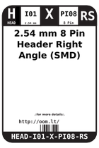

Contents
========

* [ > 2.54 mm 8 Pin Header Right Angle (SMD)](#--254-mm-8-pin-header-right-angle-smd)
	* [Datasheets](#datasheets)
	* [Labels](#labels)
	* [EDA](#eda)
	* [Images](#images)
	* [Tags](#tags)

#  > 2.54 mm 8 Pin Header Right Angle (SMD)

- ID: HEAD-I01-X-PI08-RS
- Hex ID: 
- Name: 2.54 mm 8 Pin Header Right Angle (SMD)
- Description: 2.54 mm 8 Pin Header Right Angle (SMD)
- Long Link: [http://oom.lt/HEAD-I01-X-PI08-RS](http://oom.lt/HEAD-I01-X-PI08-RS)
- Short Link: [http://oom.lt/](http://oom.lt/)

## Datasheets

- Datasheet: [datasheet.pdf](datasheet.pdf)

## Labels
  
  

|label-front|label-inventory|label-spec|
| :---: | :---: | :---: |
||||

## EDA

### Symbols

## Images
  
  

|label-front|label-inventory|label-spec|
| :---: | :---: | :---: |
||||

## Tags

- oompID: HEAD-I01-X-PI08-RS
- name: 2.54 mm 8 Pin Header Right Angle (SMD)
- oompType: HEAD
- oompSize: I01
- oompColor: X
- oompDesc: PI08
- oompIndex: RS
- oompVersion: 999
- ooNumPins: 8
- oompBbls: variable;clear
- oompBbls: variable;pins;8
- oompBbls: template;HEAD-I01-X-XX-RS-bbls
- oompDiag: variable;clear
- oompDiag: variable;pins;8
- oompDiag: template;HEAD-I01-X-XX-RS-diag
- oompIden: variable;clear
- oompIden: variable;pins;8
- oompIden: template;HEAD-I01-X-XX-RS-iden
- oompSimp: variable;clear
- oompSimp: variable;pins;8
- oompSimp: template;HEAD-I01-X-XX-RS-simp
- oompSchem: variable;clear
- oompSchem: variable;pins;8
- oompSchem: template;XXXX-XX-X-XX-01-PINS-EVEN-schem
- ooDesignator: J1
- schematicSymbol: HEAD-XX-X-PI08-XX
- pcbFootprint: HEAD-I01-X-PI08-RS
