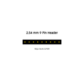
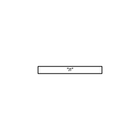
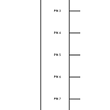
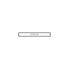
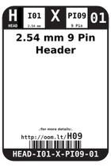
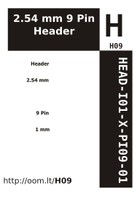

Contents
========

* [H09 > 2.54 mm 9 Pin Header](#h09--254-mm-9-pin-header)
	* [Diagrams](#diagrams)
	* [Datasheets](#datasheets)
	* [Labels](#labels)
	* [EDA](#eda)
	* [Images](#images)
	* [Tags](#tags)

# H09 > 2.54 mm 9 Pin Header

- ID: HEAD-I01-X-PI09-01
- Hex ID: H09
- Name: 2.54 mm 9 Pin Header
- Description: 2.54 mm 9 Pin Header
- Long Link: [http://oom.lt/HEAD-I01-X-PI09-01](http://oom.lt/HEAD-I01-X-PI09-01)
- Short Link: [http://oom.lt/H09](http://oom.lt/H09)

## Diagrams
  
  

|diagBBLS|diagDIAG|diagIDEN|diagSCHEM|diagSIMP|
| :---: | :---: | :---: | :---: | :---: |
||||||

## Datasheets

- Datasheet: [datasheet.pdf](datasheet.pdf)

## Labels
  
  

|label-front|label-inventory|label-spec|
| :---: | :---: | :---: |
||||

## EDA

### Footprints
  

|[  FOOTPRINT-eagle-SparkFun-Eagle-Libraries-Sparkfun-Connectors-1X09](https://github.com/oomlout/oomlout_OOMP_eda/tree/main/FOOTPRINT/eagle/SparkFun-Eagle-Libraries/Sparkfun-Connectors/1X09/)|[  FOOTPRINT-eagle-SparkFun-Eagle-Libraries-Sparkfun-Connectors-1X09_LOCK](https://github.com/oomlout/oomlout_OOMP_eda/tree/main/FOOTPRINT/eagle/SparkFun-Eagle-Libraries/Sparkfun-Connectors/1X09_LOCK/)|[  FOOTPRINT-eagle-SparkFun-Eagle-Libraries-Sparkfun-Connectors-1X09_LOCK_LONGPADS](https://github.com/oomlout/oomlout_OOMP_eda/tree/main/FOOTPRINT/eagle/SparkFun-Eagle-Libraries/Sparkfun-Connectors/1X09_LOCK_LONGPADS/)|[  FOOTPRINT-eagle-SparkFun-Eagle-Libraries-Sparkfun-Connectors-1X09_NO_SILK](https://github.com/oomlout/oomlout_OOMP_eda/tree/main/FOOTPRINT/eagle/SparkFun-Eagle-Libraries/Sparkfun-Connectors/1X09_NO_SILK/)|
| :---: | :---: | :---: | :---: |
|[  FOOTPRINT-kicad-kicad-footprints-Connector_PinHeader_2.54mm-PinHeader_1x09_P2.54mm_Vertical](https://github.com/oomlout/oomlout_OOMP_eda/tree/main/FOOTPRINT/kicad/kicad-footprints/Connector_PinHeader_2.54mm/PinHeader_1x09_P2.54mm_Vertical/)||||

### Symbols
  

|[  SYMBOL-kicad-kicad-symbols-Connector-Conn_01x09_Male](https://github.com/oomlout/oomlout_OOMP_eda/tree/main/SYMBOL/kicad/kicad-symbols/Connector/Conn_01x09_Male/)|[  SYMBOL-kicad-kicad-symbols-Connector_Generic-Conn_01x09](https://github.com/oomlout/oomlout_OOMP_eda/tree/main/SYMBOL/kicad/kicad-symbols/Connector_Generic/Conn_01x09/)|||
| :---: | :---: | :---: | :---: |
  

### Instances
  
Used 46 times.  
Prevalance: (46\10986) 0.4187%  

|Project|Occur- rences|Identifiers|
| :---: | :---: | :---: |
|[PROJ-ADAF-1032-STAN-01 Adafruit L3GD20 Breakout PCB](https://github.com/oomlout/oomlout_OOMP_projects/tree/main/PROJ-ADAF-1032-STAN-01/)|[1](https://github.com/oomlout/oomlout_OOMP_projects/tree/main/PROJ-ADAF-1032-STAN-01/)|[JP1](https://github.com/oomlout/oomlout_OOMP_projects/tree/main/PROJ-ADAF-1032-STAN-01/)|
|[PROJ-ADAF-1393-STAN-01 Adafruit Sharp Memory Display PCBs](https://github.com/oomlout/oomlout_OOMP_projects/tree/main/PROJ-ADAF-1393-STAN-01/)|[1](https://github.com/oomlout/oomlout_OOMP_projects/tree/main/PROJ-ADAF-1393-STAN-01/)|[JP1](https://github.com/oomlout/oomlout_OOMP_projects/tree/main/PROJ-ADAF-1393-STAN-01/)|
|[PROJ-ADAF-1510-STAN-01 Adafruit CC3000 Breakout PCB](https://github.com/oomlout/oomlout_OOMP_projects/tree/main/PROJ-ADAF-1510-STAN-01/)|[1](https://github.com/oomlout/oomlout_OOMP_projects/tree/main/PROJ-ADAF-1510-STAN-01/)|[JP3](https://github.com/oomlout/oomlout_OOMP_projects/tree/main/PROJ-ADAF-1510-STAN-01/)|
|[PROJ-ADAF-2021-STAN-01 Adafruit LSM9DS0 PCB](https://github.com/oomlout/oomlout_OOMP_projects/tree/main/PROJ-ADAF-2021-STAN-01/)|[1](https://github.com/oomlout/oomlout_OOMP_projects/tree/main/PROJ-ADAF-2021-STAN-01/)|[JP4](https://github.com/oomlout/oomlout_OOMP_projects/tree/main/PROJ-ADAF-2021-STAN-01/)|
|[PROJ-ADAF-2633-STAN-01 Adafruit Bluefruit LE SPI Friend PCB](https://github.com/oomlout/oomlout_OOMP_projects/tree/main/PROJ-ADAF-2633-STAN-01/)|[1](https://github.com/oomlout/oomlout_OOMP_projects/tree/main/PROJ-ADAF-2633-STAN-01/)|[JP2](https://github.com/oomlout/oomlout_OOMP_projects/tree/main/PROJ-ADAF-2633-STAN-01/)|
|[PROJ-ADAF-3070-STAN-01 Adafruit RFM LoRa Radio Breakout PCB](https://github.com/oomlout/oomlout_OOMP_projects/tree/main/PROJ-ADAF-3070-STAN-01/)|[1](https://github.com/oomlout/oomlout_OOMP_projects/tree/main/PROJ-ADAF-3070-STAN-01/)|[JP3](https://github.com/oomlout/oomlout_OOMP_projects/tree/main/PROJ-ADAF-3070-STAN-01/)|
|[PROJ-ADAF-3201-STAN-01 Adafruit Ethernet FeatherWing PCB](https://github.com/oomlout/oomlout_OOMP_projects/tree/main/PROJ-ADAF-3201-STAN-01/)|[1](https://github.com/oomlout/oomlout_OOMP_projects/tree/main/PROJ-ADAF-3201-STAN-01/)|[JP4](https://github.com/oomlout/oomlout_OOMP_projects/tree/main/PROJ-ADAF-3201-STAN-01/)|
|[PROJ-ADAF-3229-STAN-01 Adafruit Radio FeatherWing PCB](https://github.com/oomlout/oomlout_OOMP_projects/tree/main/PROJ-ADAF-3229-STAN-01/)|[1](https://github.com/oomlout/oomlout_OOMP_projects/tree/main/PROJ-ADAF-3229-STAN-01/)|[JP1](https://github.com/oomlout/oomlout_OOMP_projects/tree/main/PROJ-ADAF-3229-STAN-01/)|
|[PROJ-ADAF-3249-STAN-01 Adafruit NeoPXL8 PCBs](https://github.com/oomlout/oomlout_OOMP_projects/tree/main/PROJ-ADAF-3249-STAN-01/)|[1](https://github.com/oomlout/oomlout_OOMP_projects/tree/main/PROJ-ADAF-3249-STAN-01/)|[JP9](https://github.com/oomlout/oomlout_OOMP_projects/tree/main/PROJ-ADAF-3249-STAN-01/)|
|[PROJ-ADAF-3263-STAN-01 Adafruit MAX31856 PCB](https://github.com/oomlout/oomlout_OOMP_projects/tree/main/PROJ-ADAF-3263-STAN-01/)|[1](https://github.com/oomlout/oomlout_OOMP_projects/tree/main/PROJ-ADAF-3263-STAN-01/)|[JP1](https://github.com/oomlout/oomlout_OOMP_projects/tree/main/PROJ-ADAF-3263-STAN-01/)|
|[PROJ-ADAF-3387-STAN-01 Adafruit LSM9DS1 Breakout PCB](https://github.com/oomlout/oomlout_OOMP_projects/tree/main/PROJ-ADAF-3387-STAN-01/)|[1](https://github.com/oomlout/oomlout_OOMP_projects/tree/main/PROJ-ADAF-3387-STAN-01/)|[JP4](https://github.com/oomlout/oomlout_OOMP_projects/tree/main/PROJ-ADAF-3387-STAN-01/)|
|[PROJ-ADAF-3678-STAN-01 Adafruit UDA1334A I2S Stereo DAC PCB](https://github.com/oomlout/oomlout_OOMP_projects/tree/main/PROJ-ADAF-3678-STAN-01/)|[1](https://github.com/oomlout/oomlout_OOMP_projects/tree/main/PROJ-ADAF-3678-STAN-01/)|[JP3](https://github.com/oomlout/oomlout_OOMP_projects/tree/main/PROJ-ADAF-3678-STAN-01/)|
|[PROJ-ADAF-4097-STAN-01 Adafruit_ADXL343_PCB](https://github.com/oomlout/oomlout_OOMP_projects/tree/main/PROJ-ADAF-4097-STAN-01/)|[1](https://github.com/oomlout/oomlout_OOMP_projects/tree/main/PROJ-ADAF-4097-STAN-01/)|[JP1](https://github.com/oomlout/oomlout_OOMP_projects/tree/main/PROJ-ADAF-4097-STAN-01/)|
|[PROJ-ADAF-4279-STAN-01 Adafruit Ultimate GPS](https://github.com/oomlout/oomlout_OOMP_projects/tree/main/PROJ-ADAF-4279-STAN-01/)|[1](https://github.com/oomlout/oomlout_OOMP_projects/tree/main/PROJ-ADAF-4279-STAN-01/)|[JP1](https://github.com/oomlout/oomlout_OOMP_projects/tree/main/PROJ-ADAF-4279-STAN-01/)|
|[PROJ-ADAF-4438-STAN-01 Adafruit LSM6DSOX PCB](https://github.com/oomlout/oomlout_OOMP_projects/tree/main/PROJ-ADAF-4438-STAN-01/)|[1](https://github.com/oomlout/oomlout_OOMP_projects/tree/main/PROJ-ADAF-4438-STAN-01/)|[JP1](https://github.com/oomlout/oomlout_OOMP_projects/tree/main/PROJ-ADAF-4438-STAN-01/)|
|[PROJ-ADAF-4682-STAN-01 Adafruit MicroSD SPI or SDIO card breakout PCB](https://github.com/oomlout/oomlout_OOMP_projects/tree/main/PROJ-ADAF-4682-STAN-01/)|[1](https://github.com/oomlout/oomlout_OOMP_projects/tree/main/PROJ-ADAF-4682-STAN-01/)|[JP1](https://github.com/oomlout/oomlout_OOMP_projects/tree/main/PROJ-ADAF-4682-STAN-01/)|
|[PROJ-ADAF-5165-STAN-01 Adafruit MCP9601 PCB](https://github.com/oomlout/oomlout_OOMP_projects/tree/main/PROJ-ADAF-5165-STAN-01/)|[1](https://github.com/oomlout/oomlout_OOMP_projects/tree/main/PROJ-ADAF-5165-STAN-01/)|[JP3](https://github.com/oomlout/oomlout_OOMP_projects/tree/main/PROJ-ADAF-5165-STAN-01/)|
|[PROJ-ADAF-5221-STAN-01 Adafruit ANO Rotary Navigation Encoder Breakout PCB](https://github.com/oomlout/oomlout_OOMP_projects/tree/main/PROJ-ADAF-5221-STAN-01/)|[1](https://github.com/oomlout/oomlout_OOMP_projects/tree/main/PROJ-ADAF-5221-STAN-01/)|[JP3](https://github.com/oomlout/oomlout_OOMP_projects/tree/main/PROJ-ADAF-5221-STAN-01/)|
|[PROJ-ADAF-987-STAN-01 Adafruit MAX98306 Class D Amp PCB](https://github.com/oomlout/oomlout_OOMP_projects/tree/main/PROJ-ADAF-987-STAN-01/)|[1](https://github.com/oomlout/oomlout_OOMP_projects/tree/main/PROJ-ADAF-987-STAN-01/)|[JP3](https://github.com/oomlout/oomlout_OOMP_projects/tree/main/PROJ-ADAF-987-STAN-01/)|
|[PROJ-SPAR-12081-STAN-01 USB Weather Board](https://github.com/oomlout/oomlout_OOMP_projects/tree/main/PROJ-SPAR-12081-STAN-01/)|[1](https://github.com/oomlout/oomlout_OOMP_projects/tree/main/PROJ-SPAR-12081-STAN-01/)|[JP7](https://github.com/oomlout/oomlout_OOMP_projects/tree/main/PROJ-SPAR-12081-STAN-01/)|
|[PROJ-SPAR-12634-STAN-01 Simon Tilts](https://github.com/oomlout/oomlout_OOMP_projects/tree/main/PROJ-SPAR-12634-STAN-01/)|[1](https://github.com/oomlout/oomlout_OOMP_projects/tree/main/PROJ-SPAR-12634-STAN-01/)|[JP4](https://github.com/oomlout/oomlout_OOMP_projects/tree/main/PROJ-SPAR-12634-STAN-01/)|
|[PROJ-SPAR-12731-STAN-01 FT232RL USB Breakout](https://github.com/oomlout/oomlout_OOMP_projects/tree/main/PROJ-SPAR-12731-STAN-01/)|[2](https://github.com/oomlout/oomlout_OOMP_projects/tree/main/PROJ-SPAR-12731-STAN-01/)|[JP1, JP2](https://github.com/oomlout/oomlout_OOMP_projects/tree/main/PROJ-SPAR-12731-STAN-01/)|
|[PROJ-SPAR-12886-STAN-01 Electric Imp Breakout](https://github.com/oomlout/oomlout_OOMP_projects/tree/main/PROJ-SPAR-12886-STAN-01/)|[1](https://github.com/oomlout/oomlout_OOMP_projects/tree/main/PROJ-SPAR-12886-STAN-01/)|[JP1](https://github.com/oomlout/oomlout_OOMP_projects/tree/main/PROJ-SPAR-12886-STAN-01/)|
|[PROJ-SPAR-12887-STAN-01 Electric Imp Shield](https://github.com/oomlout/oomlout_OOMP_projects/tree/main/PROJ-SPAR-12887-STAN-01/)|[1](https://github.com/oomlout/oomlout_OOMP_projects/tree/main/PROJ-SPAR-12887-STAN-01/)|[JP7](https://github.com/oomlout/oomlout_OOMP_projects/tree/main/PROJ-SPAR-12887-STAN-01/)|
|[PROJ-SPAR-13019-STAN-01 BLE Mate2](https://github.com/oomlout/oomlout_OOMP_projects/tree/main/PROJ-SPAR-13019-STAN-01/)|[2](https://github.com/oomlout/oomlout_OOMP_projects/tree/main/PROJ-SPAR-13019-STAN-01/)|[JP2, JP3](https://github.com/oomlout/oomlout_OOMP_projects/tree/main/PROJ-SPAR-13019-STAN-01/)|
|[PROJ-SPAR-13124-STAN-01 Proto Pedal](https://github.com/oomlout/oomlout_OOMP_projects/tree/main/PROJ-SPAR-13124-STAN-01/)|[7](https://github.com/oomlout/oomlout_OOMP_projects/tree/main/PROJ-SPAR-13124-STAN-01/)|[JP1, JP5, JP7, JP8, JP10, JP11, JP12](https://github.com/oomlout/oomlout_OOMP_projects/tree/main/PROJ-SPAR-13124-STAN-01/)|
|[PROJ-SPAR-13284-STAN-01 LSM9DS1 Breakout](https://github.com/oomlout/oomlout_OOMP_projects/tree/main/PROJ-SPAR-13284-STAN-01/)|[1](https://github.com/oomlout/oomlout_OOMP_projects/tree/main/PROJ-SPAR-13284-STAN-01/)|[JP2](https://github.com/oomlout/oomlout_OOMP_projects/tree/main/PROJ-SPAR-13284-STAN-01/)|
|[PROJ-SPAR-13598-STAN-01 Photon Proto Shield](https://github.com/oomlout/oomlout_OOMP_projects/tree/main/PROJ-SPAR-13598-STAN-01/)|[4](https://github.com/oomlout/oomlout_OOMP_projects/tree/main/PROJ-SPAR-13598-STAN-01/)|[JP7, JP8, JP9, JP10](https://github.com/oomlout/oomlout_OOMP_projects/tree/main/PROJ-SPAR-13598-STAN-01/)|
|[PROJ-SPAR-14477-STAN-01 Qwiic Shield for Photon](https://github.com/oomlout/oomlout_OOMP_projects/tree/main/PROJ-SPAR-14477-STAN-01/)|[4](https://github.com/oomlout/oomlout_OOMP_projects/tree/main/PROJ-SPAR-14477-STAN-01/)|[JP7, JP8, JP9, JP10](https://github.com/oomlout/oomlout_OOMP_projects/tree/main/PROJ-SPAR-14477-STAN-01/)|
|[PROJ-SPAR-14874-STAN-01 TSH82 Configurable Op Amp Board](https://github.com/oomlout/oomlout_OOMP_projects/tree/main/PROJ-SPAR-14874-STAN-01/)|[1](https://github.com/oomlout/oomlout_OOMP_projects/tree/main/PROJ-SPAR-14874-STAN-01/)|[J1](https://github.com/oomlout/oomlout_OOMP_projects/tree/main/PROJ-SPAR-14874-STAN-01/)|
|[PROJ-SPAR-14916-STAN-01 SAMD21 Pro RF](https://github.com/oomlout/oomlout_OOMP_projects/tree/main/PROJ-SPAR-14916-STAN-01/)|[2](https://github.com/oomlout/oomlout_OOMP_projects/tree/main/PROJ-SPAR-14916-STAN-01/)|[J5, J11](https://github.com/oomlout/oomlout_OOMP_projects/tree/main/PROJ-SPAR-14916-STAN-01/)|

## Images
  
  

|diagBBLS|diagDIAG|diagIDEN|diagSCHEM|diagSIMP|label-front|label-inventory|label-spec|
| :---: | :---: | :---: | :---: | :---: | :---: | :---: | :---: |
|||||||||

## Tags

- oompType: HEAD
- oompSize: I01
- oompColor: X
- oompDesc: PI09
- oompIndex: 01
- hexID: H09
- oompSort: 
- oompClass: Through Hole
- oompClassCode: THTH
- ooPitch: 2.54
- ooPinHeight: 11.60
- ooPinWidth: 0.64
- ooPinOffset: 1.53
- oompBbls: variable;pins;9
- oompBbls: template;XXXX-I01-X-XX-01-bbls
- oompDiag: variable;pins;9
- oompDiag: template;HEAD-I01-X-XX-01-diag
- oompIden: variable;pins;9
- oompIden: template;XXXX-I01-X-XX-01-iden
- oompSchem: variable;pins;9
- oompSchem: template;XXXX-XX-X-XX-01-PINS-ODD-schem
- oompSimp: variable;pins;9
- oompSimp: template;XXXX-I01-X-XX-01-simp
- ooNumPins: 9
- ooDesignator: J1
- schematicSymbol: HEAD-XX-X-PI09-XX
- oompID: HEAD-I01-X-PI09-01
- oompInstances: {'PROJECT': 'PROJ-ADAF-1032-STAN-01', 'ID': 'JP1'}
- oompInstances: {'PROJECT': 'PROJ-ADAF-1393-STAN-01', 'ID': 'JP1'}
- oompInstances: {'PROJECT': 'PROJ-ADAF-1510-STAN-01', 'ID': 'JP3'}
- oompInstances: {'PROJECT': 'PROJ-ADAF-2021-STAN-01', 'ID': 'JP4'}
- oompInstances: {'PROJECT': 'PROJ-ADAF-2633-STAN-01', 'ID': 'JP2'}
- oompInstances: {'PROJECT': 'PROJ-ADAF-3070-STAN-01', 'ID': 'JP3'}
- oompInstances: {'PROJECT': 'PROJ-ADAF-3201-STAN-01', 'ID': 'JP4'}
- oompInstances: {'PROJECT': 'PROJ-ADAF-3229-STAN-01', 'ID': 'JP1'}
- oompInstances: {'PROJECT': 'PROJ-ADAF-3249-STAN-01', 'ID': 'JP9'}
- oompInstances: {'PROJECT': 'PROJ-ADAF-3263-STAN-01', 'ID': 'JP1'}
- oompInstances: {'PROJECT': 'PROJ-ADAF-3387-STAN-01', 'ID': 'JP4'}
- oompInstances: {'PROJECT': 'PROJ-ADAF-3678-STAN-01', 'ID': 'JP3'}
- oompInstances: {'PROJECT': 'PROJ-ADAF-4097-STAN-01', 'ID': 'JP1'}
- oompInstances: {'PROJECT': 'PROJ-ADAF-4279-STAN-01', 'ID': 'JP1'}
- oompInstances: {'PROJECT': 'PROJ-ADAF-4438-STAN-01', 'ID': 'JP1'}
- oompInstances: {'PROJECT': 'PROJ-ADAF-4682-STAN-01', 'ID': 'JP1'}
- oompInstances: {'PROJECT': 'PROJ-ADAF-5165-STAN-01', 'ID': 'JP3'}
- oompInstances: {'PROJECT': 'PROJ-ADAF-5221-STAN-01', 'ID': 'JP3'}
- oompInstances: {'PROJECT': 'PROJ-ADAF-987-STAN-01', 'ID': 'JP3'}
- oompInstances: {'PROJECT': 'PROJ-SPAR-12081-STAN-01', 'ID': 'JP7'}
- oompInstances: {'PROJECT': 'PROJ-SPAR-12634-STAN-01', 'ID': 'JP4'}
- oompInstances: {'PROJECT': 'PROJ-SPAR-12731-STAN-01', 'ID': 'JP1'}
- oompInstances: {'PROJECT': 'PROJ-SPAR-12731-STAN-01', 'ID': 'JP2'}
- oompInstances: {'PROJECT': 'PROJ-SPAR-12886-STAN-01', 'ID': 'JP1'}
- oompInstances: {'PROJECT': 'PROJ-SPAR-12887-STAN-01', 'ID': 'JP7'}
- oompInstances: {'PROJECT': 'PROJ-SPAR-13019-STAN-01', 'ID': 'JP2'}
- oompInstances: {'PROJECT': 'PROJ-SPAR-13019-STAN-01', 'ID': 'JP3'}
- oompInstances: {'PROJECT': 'PROJ-SPAR-13124-STAN-01', 'ID': 'JP1'}
- oompInstances: {'PROJECT': 'PROJ-SPAR-13124-STAN-01', 'ID': 'JP5'}
- oompInstances: {'PROJECT': 'PROJ-SPAR-13124-STAN-01', 'ID': 'JP7'}
- oompInstances: {'PROJECT': 'PROJ-SPAR-13124-STAN-01', 'ID': 'JP8'}
- oompInstances: {'PROJECT': 'PROJ-SPAR-13124-STAN-01', 'ID': 'JP10'}
- oompInstances: {'PROJECT': 'PROJ-SPAR-13124-STAN-01', 'ID': 'JP11'}
- oompInstances: {'PROJECT': 'PROJ-SPAR-13124-STAN-01', 'ID': 'JP12'}
- oompInstances: {'PROJECT': 'PROJ-SPAR-13284-STAN-01', 'ID': 'JP2'}
- oompInstances: {'PROJECT': 'PROJ-SPAR-13598-STAN-01', 'ID': 'JP7'}
- oompInstances: {'PROJECT': 'PROJ-SPAR-13598-STAN-01', 'ID': 'JP8'}
- oompInstances: {'PROJECT': 'PROJ-SPAR-13598-STAN-01', 'ID': 'JP9'}
- oompInstances: {'PROJECT': 'PROJ-SPAR-13598-STAN-01', 'ID': 'JP10'}
- oompInstances: {'PROJECT': 'PROJ-SPAR-14477-STAN-01', 'ID': 'JP7'}
- oompInstances: {'PROJECT': 'PROJ-SPAR-14477-STAN-01', 'ID': 'JP8'}
- oompInstances: {'PROJECT': 'PROJ-SPAR-14477-STAN-01', 'ID': 'JP9'}
- oompInstances: {'PROJECT': 'PROJ-SPAR-14477-STAN-01', 'ID': 'JP10'}
- oompInstances: {'PROJECT': 'PROJ-SPAR-14874-STAN-01', 'ID': 'J1'}
- oompInstances: {'PROJECT': 'PROJ-SPAR-14916-STAN-01', 'ID': 'J5'}
- oompInstances: {'PROJECT': 'PROJ-SPAR-14916-STAN-01', 'ID': 'J11'}
- footprintEagle: FOOTPRINT-eagle-SparkFun-Eagle-Libraries-Sparkfun-Connectors-1X09
- footprintEagle: FOOTPRINT-eagle-SparkFun-Eagle-Libraries-Sparkfun-Connectors-1X09_LOCK
- footprintEagle: FOOTPRINT-eagle-SparkFun-Eagle-Libraries-Sparkfun-Connectors-1X09_LOCK_LONGPADS
- footprintEagle: FOOTPRINT-eagle-SparkFun-Eagle-Libraries-Sparkfun-Connectors-1X09_NO_SILK
- footprintKicad: FOOTPRINT-kicad-kicad-footprints-Connector_PinHeader_2.54mm-PinHeader_1x09_P2.54mm_Vertical
- symbolKicad: SYMBOL-kicad-kicad-symbols-Connector-Conn_01x09_Male
- symbolKicad: SYMBOL-kicad-kicad-symbols-Connector_Generic-Conn_01x09
