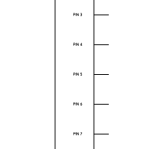
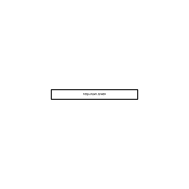
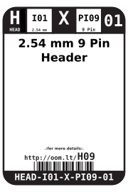
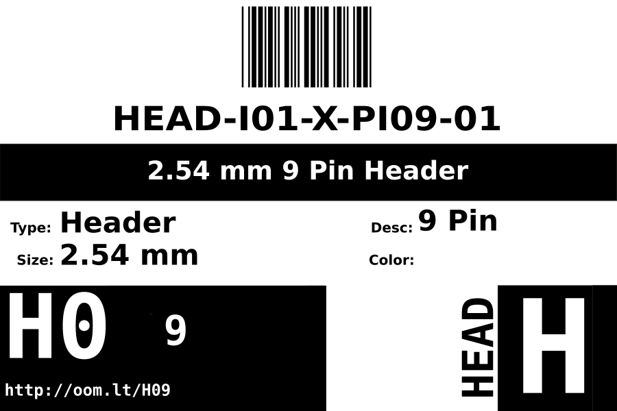

Contents
========

* [HEAD-I01-X-PI09-01>2.54 mm 9 Pin Header](#head-i01-x-pi09-01254-mm-9-pin-header)
	* [Diagrams](#diagrams)
	* [Datasheets](#datasheets)
	* [Labels](#labels)
	* [EDA](#eda)
		* [Footprints](#footprints)
		* [Symbols](#symbols)
	* [Tags](#tags)

# HEAD-I01-X-PI09-01>2.54 mm 9 Pin Header

- ID: HEAD-I01-X-PI09-01
- Name: HEAD-I01-X-PI09-01

## Diagrams
  
  

|Breadboard Layout|Diagram|Identifier|Schematic|Simple|
| :---: | :---: | :---: | :---: | :---: |
||||||

## Datasheets

- Datasheet: [datasheet.pdf](datasheet.pdf)

## Labels
  
  

|Front|Inventory|Specifications|
| :---: | :---: | :---: |
||||

## EDA

### Footprints
  

|  [eagle/SparkFun-Eagle-Libraries/Sparkfun-Connectors/1X09](https://github.com/oomlout/oomlout_OOMP_eda/tree/main/footprints/eagle/SparkFun-Eagle-Libraries/Sparkfun-Connectors/1X09/)|  [eagle/SparkFun-Eagle-Libraries/Sparkfun-Connectors/1X09_LOCK](https://github.com/oomlout/oomlout_OOMP_eda/tree/main/footprints/eagle/SparkFun-Eagle-Libraries/Sparkfun-Connectors/1X09_LOCK/)|  [eagle/SparkFun-Eagle-Libraries/Sparkfun-Connectors/1X09_LOCK_LONGPADS](https://github.com/oomlout/oomlout_OOMP_eda/tree/main/footprints/eagle/SparkFun-Eagle-Libraries/Sparkfun-Connectors/1X09_LOCK_LONGPADS/)|  [eagle/SparkFun-Eagle-Libraries/Sparkfun-Connectors/1X09_NO_SILK](https://github.com/oomlout/oomlout_OOMP_eda/tree/main/footprints/eagle/SparkFun-Eagle-Libraries/Sparkfun-Connectors/1X09_NO_SILK/)|
| :---: | :---: | :---: | :---: |
|||||

### Symbols

## Tags

- index: 12514
- oompType: HEAD
- oompSize: I01
- oompColor: X
- oompDesc: PI09
- oompIndex: 01
- hexID: H09
- oompSort: 
- oompClass: Through Hole
- oompClassCode: THTH
- ooPitch: 2.54
- ooPinHeight: 11.60
- ooPinWidth: 0.64
- ooPinOffset: 1.53
- oompBbls: variable;pins;9
- oompBbls: template;XXXX-I01-X-XX-01-bbls
- oompDiag: variable;pins;9
- oompDiag: template;HEAD-I01-X-XX-01-diag
- oompIden: variable;pins;9
- oompIden: template;XXXX-I01-X-XX-01-iden
- oompSchem: variable;pins;9
- oompSchem: template;XXXX-XX-X-XX-01-PINS-ODD-schem
- oompSimp: variable;pins;9
- oompSimp: template;XXXX-I01-X-XX-01-simp
- ooNumPins: 9
- ooFootprint: OOMP-HEAD-I01-X-PI09-01
- ooDesignator: J1
- schematicSymbol: HEAD-XX-X-PI09-XX
- pcbFootprint: HEAD-I01-X-PI09-01
- kicadSymbol: Connector/Conn_01x09_Male
- footprintEagle: SparkFun-Eagle-Libraries/Sparkfun-Connectors/1X09
- footprintEagle: SparkFun-Eagle-Libraries/Sparkfun-Connectors/1X09_LOCK
- footprintEagle: SparkFun-Eagle-Libraries/Sparkfun-Connectors/1X09_LOCK_LONGPADS
- footprintEagle: SparkFun-Eagle-Libraries/Sparkfun-Connectors/1X09_NO_SILK
- footprintKicad: kicad-footprints/Connector_PinHeader_2.54mm/PinHeader_1x09_P2.54mm_Vertical
