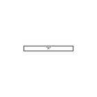
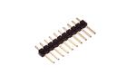

Contents
========

* [H10 > 2.54 mm 10 Pin Header](#h10--254-mm-10-pin-header)
	* [Diagrams](#diagrams)
	* [Datasheets](#datasheets)
	* [Labels](#labels)
	* [EDA](#eda)
	* [Images](#images)
	* [Tags](#tags)
  
![][im]
# H10 > 2.54 mm 10 Pin Header

- ID: HEAD-I01-X-PI10-01
- Hex ID: H10
- Name: 2.54 mm 10 Pin Header
- Description: 2.54 mm 10 Pin Header
- Long Link: [http://oom.lt/HEAD-I01-X-PI10-01](http://oom.lt/HEAD-I01-X-PI10-01)
- Short Link: [http://oom.lt/H10](http://oom.lt/H10)

## Diagrams
  
  

|diagBBLS|diagDIAG|diagIDEN|diagSCHEM|diagSIMP|
| :---: | :---: | :---: | :---: | :---: |
||||||

## Datasheets

- Datasheet: [datasheet.pdf](datasheet.pdf)

## Labels
  
  

|label-front|label-inventory|label-spec|
| :---: | :---: | :---: |
||||

## EDA

### Footprints
  

|[  FOOTPRINT-eagle-SparkFun-Eagle-Libraries-Sparkfun-Connectors-1X10](https://github.com/oomlout/oomlout_OOMP_eda/tree/main/FOOTPRINT/eagle/SparkFun-Eagle-Libraries/Sparkfun-Connectors/1X10/)|[  FOOTPRINT-eagle-SparkFun-Eagle-Libraries-Sparkfun-Connectors-1X10_LOCK](https://github.com/oomlout/oomlout_OOMP_eda/tree/main/FOOTPRINT/eagle/SparkFun-Eagle-Libraries/Sparkfun-Connectors/1X10_LOCK/)|[  FOOTPRINT-eagle-SparkFun-Eagle-Libraries-Sparkfun-Connectors-1X10_LOCK_LONGPADS](https://github.com/oomlout/oomlout_OOMP_eda/tree/main/FOOTPRINT/eagle/SparkFun-Eagle-Libraries/Sparkfun-Connectors/1X10_LOCK_LONGPADS/)|[  FOOTPRINT-eagle-SparkFun-Eagle-Libraries-Sparkfun-Connectors-1X10_NO_SILK](https://github.com/oomlout/oomlout_OOMP_eda/tree/main/FOOTPRINT/eagle/SparkFun-Eagle-Libraries/Sparkfun-Connectors/1X10_NO_SILK/)|
| :---: | :---: | :---: | :---: |
|[  ----](https://github.com/oomlout/oomlout_OOMP_parts/tree/main/----/)|[  ----](https://github.com/oomlout/oomlout_OOMP_parts/tree/main/----/)|[  ----](https://github.com/oomlout/oomlout_OOMP_parts/tree/main/----/)|[  ----](https://github.com/oomlout/oomlout_OOMP_parts/tree/main/----/)|
|[  FOOTPRINT-kicad-kicad-footprints-Connector_PinHeader_2.54mm-PinHeader_1x10_P2.54mm_Vertical](https://github.com/oomlout/oomlout_OOMP_eda/tree/main/FOOTPRINT/kicad/kicad-footprints/Connector_PinHeader_2.54mm/PinHeader_1x10_P2.54mm_Vertical/)||||

### Symbols
  

|[  SYMBOL-kicad-kicad-symbols-Connector-Conn_01x10_Male](https://github.com/oomlout/oomlout_OOMP_eda/tree/main/SYMBOL/kicad/kicad-symbols/Connector/Conn_01x10_Male/)|[  SYMBOL-kicad-kicad-symbols-Connector_Generic-Conn_01x10](https://github.com/oomlout/oomlout_OOMP_eda/tree/main/SYMBOL/kicad/kicad-symbols/Connector_Generic/Conn_01x10/)|||
| :---: | :---: | :---: | :---: |
  

### Instances
  
Used 91 times.  
Prevalance: (91\10986) 0.8283%  

|OOMP Instances|
| :---: |
|[PROJ-ADAF-1083-STAN-01  ADS1X15 Breakout Board PCBs  Used 1 times. JP1](https://github.com/oomlout/oomlout_OOMP_projects/tree/main/PROJ-ADAF-1083-STAN-01/)|
|[PROJ-ADAF-1272-STAN-01  Adafruit GPS Logger Shield PCB  Used 1 times. U$9](https://github.com/oomlout/oomlout_OOMP_projects/tree/main/PROJ-ADAF-1272-STAN-01/)|
|[PROJ-ADAF-1411-STAN-01  Adafruit 16 channel PWM Servo Shield  Used 1 times. JP7](https://github.com/oomlout/oomlout_OOMP_projects/tree/main/PROJ-ADAF-1411-STAN-01/)|
|[PROJ-ADAF-1438-STAN-01  Adafruit Motor Shield V2 PCB  Used 1 times. JP3](https://github.com/oomlout/oomlout_OOMP_projects/tree/main/PROJ-ADAF-1438-STAN-01/)|
|[PROJ-ADAF-1480-STAN-01  Adafruit 2.2 SPI TFT  Used 1 times. JP1](https://github.com/oomlout/oomlout_OOMP_projects/tree/main/PROJ-ADAF-1480-STAN-01/)|
|[PROJ-ADAF-1552-STAN-01  Adafruit TPA2012 or TS2012 Breakout PCB  Used 1 times. JP1](https://github.com/oomlout/oomlout_OOMP_projects/tree/main/PROJ-ADAF-1552-STAN-01/)|
|[PROJ-ADAF-1628-STAN-01  Adafruit Bluefruit EZ Link Shield PCB  Used 1 times. U$6](https://github.com/oomlout/oomlout_OOMP_projects/tree/main/PROJ-ADAF-1628-STAN-01/)|
|[PROJ-ADAF-1697-STAN-01  Adafruit Bluefruit LE nRF8001 PCB  Used 1 times. JP1](https://github.com/oomlout/oomlout_OOMP_projects/tree/main/PROJ-ADAF-1697-STAN-01/)|
|[PROJ-ADAF-1712-STAN-01  Adafruit TPA2016 PCB  Used 1 times. JP1](https://github.com/oomlout/oomlout_OOMP_projects/tree/main/PROJ-ADAF-1712-STAN-01/)|
|[PROJ-ADAF-1788-STAN-01  Adafruit Music Maker MP3 Shield PCB  Used 1 times. JP6](https://github.com/oomlout/oomlout_OOMP_projects/tree/main/PROJ-ADAF-1788-STAN-01/)|
|[PROJ-ADAF-2024-STAN-01  Adafruit MPR121 Capacitive Touch Shield PCB  Used 1 times. JP6](https://github.com/oomlout/oomlout_OOMP_projects/tree/main/PROJ-ADAF-2024-STAN-01/)|
|[PROJ-ADAF-2077-STAN-01  Adafruit Proto Shield PCB  Used 1 times. U$1](https://github.com/oomlout/oomlout_OOMP_projects/tree/main/PROJ-ADAF-2077-STAN-01/)|
|[PROJ-ADAF-2448-STAN-01  Adafruit TB6612 Motor Driver Breakout PCB  Used 1 times. JP1](https://github.com/oomlout/oomlout_OOMP_projects/tree/main/PROJ-ADAF-2448-STAN-01/)|
|[PROJ-ADAF-2466-STAN-01  Adafruit METRO 328 PCB  Used 1 times. IOH](https://github.com/oomlout/oomlout_OOMP_projects/tree/main/PROJ-ADAF-2466-STAN-01/)|
|[PROJ-ADAF-2468-STAN-01  Adafruit FONA 800 Shield PCB  Used 1 times. JP4](https://github.com/oomlout/oomlout_OOMP_projects/tree/main/PROJ-ADAF-2468-STAN-01/)|
|[PROJ-ADAF-2471-STAN-01  Adafruit Huzzah ESP8266 Basic Breakout PCB  Used 2 times. JP4, JP5](https://github.com/oomlout/oomlout_OOMP_projects/tree/main/PROJ-ADAF-2471-STAN-01/)|
|[PROJ-ADAF-2601-STAN-01  Adafruit RGB Matrix Shield PCB  Used 1 times. JP6](https://github.com/oomlout/oomlout_OOMP_projects/tree/main/PROJ-ADAF-2601-STAN-01/)|
|[PROJ-ADAF-2636-STAN-01  Adafruit FONA808 Shield PCB  Used 1 times. JP4](https://github.com/oomlout/oomlout_OOMP_projects/tree/main/PROJ-ADAF-2636-STAN-01/)|
|[PROJ-ADAF-2746-STAN-01  Adafruit Bluefruit LE Shield PCB  Used 1 times. JP5](https://github.com/oomlout/oomlout_OOMP_projects/tree/main/PROJ-ADAF-2746-STAN-01/)|
|[PROJ-ADAF-3133-STAN-01  Adafruit Ultimate GPS FeatherWing PCB  Used 1 times. JP4](https://github.com/oomlout/oomlout_OOMP_projects/tree/main/PROJ-ADAF-3133-STAN-01/)|
|[PROJ-ADAF-3249-STAN-01  Adafruit NeoPXL8 PCBs  Used 1 times. JP12](https://github.com/oomlout/oomlout_OOMP_projects/tree/main/PROJ-ADAF-3249-STAN-01/)|
|[PROJ-ADAF-326-STAN-01  Adafruit 128x64 Monochrome OLED PCB  Used 2 times. B1, P0\\](https://github.com/oomlout/oomlout_OOMP_projects/tree/main/PROJ-ADAF-326-STAN-01/)|
|[PROJ-ADAF-3382-STAN-01  Adafruit Metro M4 Express PCB  Used 1 times. IOH](https://github.com/oomlout/oomlout_OOMP_projects/tree/main/PROJ-ADAF-3382-STAN-01/)|
|[PROJ-ADAF-3505-STAN-01  Adafruit Metro M0 Express PCB  Used 1 times. IOH](https://github.com/oomlout/oomlout_OOMP_projects/tree/main/PROJ-ADAF-3505-STAN-01/)|
|[PROJ-ADAF-358-STAN-01  Adafruit_1.8_Inch_TFT_Breakout_PCB  Used 1 times. U$2](https://github.com/oomlout/oomlout_OOMP_projects/tree/main/PROJ-ADAF-358-STAN-01/)|
|[PROJ-ADAF-395-STAN-01  Adafruit TXB0108 PCB  Used 2 times. JP1, JP2](https://github.com/oomlout/oomlout_OOMP_projects/tree/main/PROJ-ADAF-395-STAN-01/)|
|[PROJ-ADAF-4000-STAN-01  Adafruit Metro M4 Express AirLift PCB  Used 1 times. IOH](https://github.com/oomlout/oomlout_OOMP_projects/tree/main/PROJ-ADAF-4000-STAN-01/)|
|[PROJ-ADAF-4064-STAN-01  Adafruit Grand Central PCB  Used 1 times. IOH](https://github.com/oomlout/oomlout_OOMP_projects/tree/main/PROJ-ADAF-4064-STAN-01/)|
|[PROJ-ADAF-4775-STAN-01  Adafruit Metro ESP32 S2 PCB  Used 1 times. IOH](https://github.com/oomlout/oomlout_OOMP_projects/tree/main/PROJ-ADAF-4775-STAN-01/)|
|[PROJ-ADAF-512-STAN-01  Adafruit 9 DOF and 10 DOF PCBs  Used 1 times. JP1](https://github.com/oomlout/oomlout_OOMP_projects/tree/main/PROJ-ADAF-512-STAN-01/)|
|[PROJ-ADAF-684-STAN-01  Adafruit 96x64 RGB OLED Breakout PCB  Used 2 times. JP1, JP2](https://github.com/oomlout/oomlout_OOMP_projects/tree/main/PROJ-ADAF-684-STAN-01/)|
|[PROJ-ADAF-782-STAN-01  Adafruit USB Serial RGB Character Backpack PCB  Used 1 times. U$1](https://github.com/oomlout/oomlout_OOMP_projects/tree/main/PROJ-ADAF-782-STAN-01/)|
|[PROJ-ADAF-789-STAN-01  Adafruit PN532 RFID NFC Shield  Used 1 times. JP3](https://github.com/oomlout/oomlout_OOMP_projects/tree/main/PROJ-ADAF-789-STAN-01/)|
|[PROJ-ARDU-LEO-STAN-01  Arduino Leonardo  Used 1 times. JP1](https://github.com/oomlout/oomlout_OOMP_projects/tree/main/PROJ-ARDU-LEO-STAN-01/)|
|[PROJ-ARDU-MEGA-2560-01  Arduino 2560 Mega  Used 1 times. JP6](https://github.com/oomlout/oomlout_OOMP_projects/tree/main/PROJ-ARDU-MEGA-2560-01/)|
|[PROJ-ARDU-UNO-REV3-01  Arduino Rev3 Uno  Used 1 times. IOH](https://github.com/oomlout/oomlout_OOMP_projects/tree/main/PROJ-ARDU-UNO-REV3-01/)|
|[PROJ-SPAR-10608-STAN-01  MP3 Breakout-VS1033D  Used 2 times. JP1, JP2](https://github.com/oomlout/oomlout_OOMP_projects/tree/main/PROJ-SPAR-10608-STAN-01/)|
|[PROJ-SPAR-11028-STAN-01  MPU-6050 Breakout  Used 1 times. JP6](https://github.com/oomlout/oomlout_OOMP_projects/tree/main/PROJ-SPAR-11028-STAN-01/)|
|[PROJ-SPAR-11043-STAN-01  fabFM-Kit  Used 1 times. JP2](https://github.com/oomlout/oomlout_OOMP_projects/tree/main/PROJ-SPAR-11043-STAN-01/)|
|[PROJ-SPAR-11083-STAN-01  FM Tuner Basic Breakout-Si4703  Used 1 times. JP1](https://github.com/oomlout/oomlout_OOMP_projects/tree/main/PROJ-SPAR-11083-STAN-01/)|
|[PROJ-SPAR-11189-STAN-01  MAX3232 Breakout  Used 1 times. JP2](https://github.com/oomlout/oomlout_OOMP_projects/tree/main/PROJ-SPAR-11189-STAN-01/)|
|[PROJ-SPAR-11629-STAN-01  Serial7SegmentDisplay  Used 1 times. JP12](https://github.com/oomlout/oomlout_OOMP_projects/tree/main/PROJ-SPAR-11629-STAN-01/)|
|[PROJ-SPAR-11645-STAN-01  OpenSegment  Used 1 times. JP2](https://github.com/oomlout/oomlout_OOMP_projects/tree/main/PROJ-SPAR-11645-STAN-01/)|
|[PROJ-SPAR-11684-STAN-01  MP3 Breakout-VS1063  Used 2 times. JP1, JP2](https://github.com/oomlout/oomlout_OOMP_projects/tree/main/PROJ-SPAR-11684-STAN-01/)|
|[PROJ-SPAR-11858-STAN-01  Copernicus II DIP Module  Used 2 times. JP1, JP2](https://github.com/oomlout/oomlout_OOMP_projects/tree/main/PROJ-SPAR-11858-STAN-01/)|
|[PROJ-SPAR-12071-STAN-01  CC3000 WiFi Shield  Used 1 times. JP3](https://github.com/oomlout/oomlout_OOMP_projects/tree/main/PROJ-SPAR-12071-STAN-01/)|
|[PROJ-SPAR-12579-STAN-01  Bluetooth Module Breakout  Used 2 times. JP1, JP2](https://github.com/oomlout/oomlout_OOMP_projects/tree/main/PROJ-SPAR-12579-STAN-01/)|
|[PROJ-SPAR-12761-STAN-01  microSD Shield  Used 1 times. JP5](https://github.com/oomlout/oomlout_OOMP_projects/tree/main/PROJ-SPAR-12761-STAN-01/)|
|[PROJ-SPAR-12772-STAN-01  Logomatic  Used 1 times. JP6](https://github.com/oomlout/oomlout_OOMP_projects/tree/main/PROJ-SPAR-12772-STAN-01/)|
|[PROJ-SPAR-12847-STAN-01  XBee Shield  Used 1 times. JP4](https://github.com/oomlout/oomlout_OOMP_projects/tree/main/PROJ-SPAR-12847-STAN-01/)|
|[PROJ-SPAR-12858-STAN-01  Vernier Interface Shield  Used 1 times. JP1](https://github.com/oomlout/oomlout_OOMP_projects/tree/main/PROJ-SPAR-12858-STAN-01/)|
|[PROJ-SPAR-12887-STAN-01  Electric Imp Shield  Used 1 times. JP6](https://github.com/oomlout/oomlout_OOMP_projects/tree/main/PROJ-SPAR-12887-STAN-01/)|
|[PROJ-SPAR-12941-STAN-01  SD-MMC Breakout  Used 1 times. JP5](https://github.com/oomlout/oomlout_OOMP_projects/tree/main/PROJ-SPAR-12941-STAN-01/)|
|[PROJ-SPAR-13038-STAN-01  Edison GPIO Block  Used 2 times. JP1, JP2](https://github.com/oomlout/oomlout_OOMP_projects/tree/main/PROJ-SPAR-13038-STAN-01/)|
|[PROJ-SPAR-13598-STAN-01  Photon Proto Shield  Used 2 times. JP5, JP6](https://github.com/oomlout/oomlout_OOMP_projects/tree/main/PROJ-SPAR-13598-STAN-01/)|
|[PROJ-SPAR-13711-STAN-01  ESP8266 Thing Dev 4H  Used 2 times. JP2, JP3](https://github.com/oomlout/oomlout_OOMP_projects/tree/main/PROJ-SPAR-13711-STAN-01/)|
|[PROJ-SPAR-13714-STAN-01  FreeSoc2  Used 1 times. JP7](https://github.com/oomlout/oomlout_OOMP_projects/tree/main/PROJ-SPAR-13714-STAN-01/)|
|[PROJ-SPAR-13750-STAN-01  GPS Shield  Used 11 times. JP1, JP2, JP4, JP6, JP7, JP8, JP9, JP10, JP11, JP12, JP14](https://github.com/oomlout/oomlout_OOMP_projects/tree/main/PROJ-SPAR-13750-STAN-01/)|
|[PROJ-SPAR-13819-STAN-01  Arduino ProtoShield Bare PCB  Used 1 times. JP1](https://github.com/oomlout/oomlout_OOMP_projects/tree/main/PROJ-SPAR-13819-STAN-01/)|
|[PROJ-SPAR-13975-STAN-01  RedBoard  Used 1 times. JP2](https://github.com/oomlout/oomlout_OOMP_projects/tree/main/PROJ-SPAR-13975-STAN-01/)|
|[PROJ-SPAR-14352-STAN-01  Qwiic Shield for Arduino  Used 1 times. J3](https://github.com/oomlout/oomlout_OOMP_projects/tree/main/PROJ-SPAR-14352-STAN-01/)|
|[PROJ-SPAR-14475-STAN-01  Noisy Cricket-1.5W Stereo Amplifier Breakout  Used 1 times. J1](https://github.com/oomlout/oomlout_OOMP_projects/tree/main/PROJ-SPAR-14475-STAN-01/)|
|[PROJ-SPAR-14477-STAN-01  Qwiic Shield for Photon  Used 2 times. JP5, JP6](https://github.com/oomlout/oomlout_OOMP_projects/tree/main/PROJ-SPAR-14477-STAN-01/)|
|[PROJ-SPAR-14531-STAN-01  Pioneer IoT Kit Shield  Used 1 times. JP5](https://github.com/oomlout/oomlout_OOMP_projects/tree/main/PROJ-SPAR-14531-STAN-01/)|
|[PROJ-SPAR-14669-STAN-01  BlackBoard  Used 2 times. JP2, JP12](https://github.com/oomlout/oomlout_OOMP_projects/tree/main/PROJ-SPAR-14669-STAN-01/)|
|[PROJ-SPAR-14916-STAN-01  SAMD21 Pro RF  Used 2 times. J3, J6](https://github.com/oomlout/oomlout_OOMP_projects/tree/main/PROJ-SPAR-14916-STAN-01/)|
|[PROJ-SPAR-15006-STAN-01  ESP32 LoRa 1Ch Gateway  Used 1 times. J5](https://github.com/oomlout/oomlout_OOMP_projects/tree/main/PROJ-SPAR-15006-STAN-01/)|

## Images
  
  

|image|image_RE|diagBBLS|diagDIAG|diagIDEN|diagSCHEM|diagSIMP|label-front|label-inventory|label-spec|
| :---: | :---: | :---: | :---: | :---: | :---: | :---: | :---: | :---: | :---: |
|||||||||||

## Tags

- oompType: HEAD
- oompSize: I01
- oompColor: X
- oompDesc: PI10
- oompIndex: 01
- hexID: H10
- oompSort: 
- oompClass: Through Hole
- oompClassCode: THTH
- ooPitch: 2.54
- ooPinHeight: 11.60
- ooPinWidth: 0.64
- ooPinOffset: 1.53
- oompBbls: variable;pins;10
- oompBbls: template;XXXX-I01-X-XX-01-bbls
- oompDiag: variable;pins;10
- oompDiag: template;HEAD-I01-X-XX-01-diag
- oompIden: variable;pins;10
- oompIden: template;XXXX-I01-X-XX-01-iden
- oompSchem: variable;pins;10
- oompSchem: template;XXXX-XX-X-XX-01-PINS-EVEN-schem
- oompSimp: variable;pins;10
- oompSimp: template;XXXX-I01-X-XX-01-simp
- ooNumPins: 10
- ooDesignator: J1
- schematicSymbol: HEAD-XX-X-PI10-XX
- oompID: HEAD-I01-X-PI10-01
- oompInstances: {'PROJECT': 'PROJ-ADAF-1083-STAN-01', 'ID': 'JP1'}
- oompInstances: {'PROJECT': 'PROJ-ADAF-1272-STAN-01', 'ID': 'U$9'}
- oompInstances: {'PROJECT': 'PROJ-ADAF-1411-STAN-01', 'ID': 'JP7'}
- oompInstances: {'PROJECT': 'PROJ-ADAF-1438-STAN-01', 'ID': 'JP3'}
- oompInstances: {'PROJECT': 'PROJ-ADAF-1480-STAN-01', 'ID': 'JP1'}
- oompInstances: {'PROJECT': 'PROJ-ADAF-1552-STAN-01', 'ID': 'JP1'}
- oompInstances: {'PROJECT': 'PROJ-ADAF-1628-STAN-01', 'ID': 'U$6'}
- oompInstances: {'PROJECT': 'PROJ-ADAF-1697-STAN-01', 'ID': 'JP1'}
- oompInstances: {'PROJECT': 'PROJ-ADAF-1712-STAN-01', 'ID': 'JP1'}
- oompInstances: {'PROJECT': 'PROJ-ADAF-1788-STAN-01', 'ID': 'JP6'}
- oompInstances: {'PROJECT': 'PROJ-ADAF-2024-STAN-01', 'ID': 'JP6'}
- oompInstances: {'PROJECT': 'PROJ-ADAF-2077-STAN-01', 'ID': 'U$1'}
- oompInstances: {'PROJECT': 'PROJ-ADAF-2448-STAN-01', 'ID': 'JP1'}
- oompInstances: {'PROJECT': 'PROJ-ADAF-2466-STAN-01', 'ID': 'IOH'}
- oompInstances: {'PROJECT': 'PROJ-ADAF-2468-STAN-01', 'ID': 'JP4'}
- oompInstances: {'PROJECT': 'PROJ-ADAF-2471-STAN-01', 'ID': 'JP4'}
- oompInstances: {'PROJECT': 'PROJ-ADAF-2471-STAN-01', 'ID': 'JP5'}
- oompInstances: {'PROJECT': 'PROJ-ADAF-2601-STAN-01', 'ID': 'JP6'}
- oompInstances: {'PROJECT': 'PROJ-ADAF-2636-STAN-01', 'ID': 'JP4'}
- oompInstances: {'PROJECT': 'PROJ-ADAF-2746-STAN-01', 'ID': 'JP5'}
- oompInstances: {'PROJECT': 'PROJ-ADAF-3133-STAN-01', 'ID': 'JP4'}
- oompInstances: {'PROJECT': 'PROJ-ADAF-3249-STAN-01', 'ID': 'JP12'}
- oompInstances: {'PROJECT': 'PROJ-ADAF-326-STAN-01', 'ID': 'B1'}
- oompInstances: {'PROJECT': 'PROJ-ADAF-326-STAN-01', 'ID': 'P0\\\\'}
- oompInstances: {'PROJECT': 'PROJ-ADAF-3382-STAN-01', 'ID': 'IOH'}
- oompInstances: {'PROJECT': 'PROJ-ADAF-3505-STAN-01', 'ID': 'IOH'}
- oompInstances: {'PROJECT': 'PROJ-ADAF-358-STAN-01', 'ID': 'U$2'}
- oompInstances: {'PROJECT': 'PROJ-ADAF-395-STAN-01', 'ID': 'JP1'}
- oompInstances: {'PROJECT': 'PROJ-ADAF-395-STAN-01', 'ID': 'JP2'}
- oompInstances: {'PROJECT': 'PROJ-ADAF-4000-STAN-01', 'ID': 'IOH'}
- oompInstances: {'PROJECT': 'PROJ-ADAF-4064-STAN-01', 'ID': 'IOH'}
- oompInstances: {'PROJECT': 'PROJ-ADAF-4775-STAN-01', 'ID': 'IOH'}
- oompInstances: {'PROJECT': 'PROJ-ADAF-512-STAN-01', 'ID': 'JP1'}
- oompInstances: {'PROJECT': 'PROJ-ADAF-684-STAN-01', 'ID': 'JP1'}
- oompInstances: {'PROJECT': 'PROJ-ADAF-684-STAN-01', 'ID': 'JP2'}
- oompInstances: {'PROJECT': 'PROJ-ADAF-782-STAN-01', 'ID': 'U$1'}
- oompInstances: {'PROJECT': 'PROJ-ADAF-789-STAN-01', 'ID': 'JP3'}
- oompInstances: {'PROJECT': 'PROJ-ARDU-LEO-STAN-01', 'ID': 'JP1'}
- oompInstances: {'PROJECT': 'PROJ-ARDU-MEGA-2560-01', 'ID': 'JP6'}
- oompInstances: {'PROJECT': 'PROJ-ARDU-UNO-REV3-01', 'ID': 'IOH'}
- oompInstances: {'PROJECT': 'PROJ-SPAR-10608-STAN-01', 'ID': 'JP1'}
- oompInstances: {'PROJECT': 'PROJ-SPAR-10608-STAN-01', 'ID': 'JP2'}
- oompInstances: {'PROJECT': 'PROJ-SPAR-11028-STAN-01', 'ID': 'JP6'}
- oompInstances: {'PROJECT': 'PROJ-SPAR-11043-STAN-01', 'ID': 'JP2'}
- oompInstances: {'PROJECT': 'PROJ-SPAR-11083-STAN-01', 'ID': 'JP1'}
- oompInstances: {'PROJECT': 'PROJ-SPAR-11189-STAN-01', 'ID': 'JP2'}
- oompInstances: {'PROJECT': 'PROJ-SPAR-11629-STAN-01', 'ID': 'JP12'}
- oompInstances: {'PROJECT': 'PROJ-SPAR-11645-STAN-01', 'ID': 'JP2'}
- oompInstances: {'PROJECT': 'PROJ-SPAR-11684-STAN-01', 'ID': 'JP1'}
- oompInstances: {'PROJECT': 'PROJ-SPAR-11684-STAN-01', 'ID': 'JP2'}
- oompInstances: {'PROJECT': 'PROJ-SPAR-11858-STAN-01', 'ID': 'JP1'}
- oompInstances: {'PROJECT': 'PROJ-SPAR-11858-STAN-01', 'ID': 'JP2'}
- oompInstances: {'PROJECT': 'PROJ-SPAR-12071-STAN-01', 'ID': 'JP3'}
- oompInstances: {'PROJECT': 'PROJ-SPAR-12579-STAN-01', 'ID': 'JP1'}
- oompInstances: {'PROJECT': 'PROJ-SPAR-12579-STAN-01', 'ID': 'JP2'}
- oompInstances: {'PROJECT': 'PROJ-SPAR-12761-STAN-01', 'ID': 'JP5'}
- oompInstances: {'PROJECT': 'PROJ-SPAR-12772-STAN-01', 'ID': 'JP6'}
- oompInstances: {'PROJECT': 'PROJ-SPAR-12847-STAN-01', 'ID': 'JP4'}
- oompInstances: {'PROJECT': 'PROJ-SPAR-12858-STAN-01', 'ID': 'JP1'}
- oompInstances: {'PROJECT': 'PROJ-SPAR-12887-STAN-01', 'ID': 'JP6'}
- oompInstances: {'PROJECT': 'PROJ-SPAR-12941-STAN-01', 'ID': 'JP5'}
- oompInstances: {'PROJECT': 'PROJ-SPAR-13038-STAN-01', 'ID': 'JP1'}
- oompInstances: {'PROJECT': 'PROJ-SPAR-13038-STAN-01', 'ID': 'JP2'}
- oompInstances: {'PROJECT': 'PROJ-SPAR-13598-STAN-01', 'ID': 'JP5'}
- oompInstances: {'PROJECT': 'PROJ-SPAR-13598-STAN-01', 'ID': 'JP6'}
- oompInstances: {'PROJECT': 'PROJ-SPAR-13711-STAN-01', 'ID': 'JP2'}
- oompInstances: {'PROJECT': 'PROJ-SPAR-13711-STAN-01', 'ID': 'JP3'}
- oompInstances: {'PROJECT': 'PROJ-SPAR-13714-STAN-01', 'ID': 'JP7'}
- oompInstances: {'PROJECT': 'PROJ-SPAR-13750-STAN-01', 'ID': 'JP1'}
- oompInstances: {'PROJECT': 'PROJ-SPAR-13750-STAN-01', 'ID': 'JP2'}
- oompInstances: {'PROJECT': 'PROJ-SPAR-13750-STAN-01', 'ID': 'JP4'}
- oompInstances: {'PROJECT': 'PROJ-SPAR-13750-STAN-01', 'ID': 'JP6'}
- oompInstances: {'PROJECT': 'PROJ-SPAR-13750-STAN-01', 'ID': 'JP7'}
- oompInstances: {'PROJECT': 'PROJ-SPAR-13750-STAN-01', 'ID': 'JP8'}
- oompInstances: {'PROJECT': 'PROJ-SPAR-13750-STAN-01', 'ID': 'JP9'}
- oompInstances: {'PROJECT': 'PROJ-SPAR-13750-STAN-01', 'ID': 'JP10'}
- oompInstances: {'PROJECT': 'PROJ-SPAR-13750-STAN-01', 'ID': 'JP11'}
- oompInstances: {'PROJECT': 'PROJ-SPAR-13750-STAN-01', 'ID': 'JP12'}
- oompInstances: {'PROJECT': 'PROJ-SPAR-13750-STAN-01', 'ID': 'JP14'}
- oompInstances: {'PROJECT': 'PROJ-SPAR-13819-STAN-01', 'ID': 'JP1'}
- oompInstances: {'PROJECT': 'PROJ-SPAR-13975-STAN-01', 'ID': 'JP2'}
- oompInstances: {'PROJECT': 'PROJ-SPAR-14352-STAN-01', 'ID': 'J3'}
- oompInstances: {'PROJECT': 'PROJ-SPAR-14475-STAN-01', 'ID': 'J1'}
- oompInstances: {'PROJECT': 'PROJ-SPAR-14477-STAN-01', 'ID': 'JP5'}
- oompInstances: {'PROJECT': 'PROJ-SPAR-14477-STAN-01', 'ID': 'JP6'}
- oompInstances: {'PROJECT': 'PROJ-SPAR-14531-STAN-01', 'ID': 'JP5'}
- oompInstances: {'PROJECT': 'PROJ-SPAR-14669-STAN-01', 'ID': 'JP2'}
- oompInstances: {'PROJECT': 'PROJ-SPAR-14669-STAN-01', 'ID': 'JP12'}
- oompInstances: {'PROJECT': 'PROJ-SPAR-14916-STAN-01', 'ID': 'J3'}
- oompInstances: {'PROJECT': 'PROJ-SPAR-14916-STAN-01', 'ID': 'J6'}
- oompInstances: {'PROJECT': 'PROJ-SPAR-15006-STAN-01', 'ID': 'J5'}
- footprintEagle: FOOTPRINT-eagle-SparkFun-Eagle-Libraries-Sparkfun-Connectors-1X10
- footprintEagle: FOOTPRINT-eagle-SparkFun-Eagle-Libraries-Sparkfun-Connectors-1X10_LOCK
- footprintEagle: FOOTPRINT-eagle-SparkFun-Eagle-Libraries-Sparkfun-Connectors-1X10_LOCK_LONGPADS
- footprintEagle: FOOTPRINT-eagle-SparkFun-Eagle-Libraries-Sparkfun-Connectors-1X10_NO_SILK
- footprintEagle: FOOTPRINT-eagle-Pimoroni-Eagle-Library-pimoroni-headers-110-0.1&quot;-CASTELLATED-BCREAM
- footprintEagle: FOOTPRINT-eagle-Pimoroni-Eagle-Library-pimoroni-headers-110-0.1&quot;-CASTELLATED-BIGGER-ROUNDED
- footprintEagle: FOOTPRINT-eagle-Pimoroni-Eagle-Library-pimoroni-headers-110-0.1&quot;-CASTELLATED-BIGGER
- footprintEagle: FOOTPRINT-eagle-Pimoroni-Eagle-Library-pimoroni-headers-110-0.1&quot;-CASTELLATED
- footprintKicad: FOOTPRINT-kicad-kicad-footprints-Connector_PinHeader_2.54mm-PinHeader_1x10_P2.54mm_Vertical
- symbolKicad: SYMBOL-kicad-kicad-symbols-Connector-Conn_01x10_Male
- symbolKicad: SYMBOL-kicad-kicad-symbols-Connector_Generic-Conn_01x10

[im]: image_450.jpg
