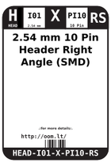
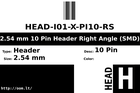
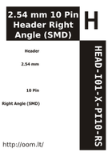

Contents
========

* [ > 2.54 mm 10 Pin Header Right Angle (SMD)](#--254-mm-10-pin-header-right-angle-smd)
	* [Datasheets](#datasheets)
	* [Labels](#labels)
	* [EDA](#eda)
	* [Images](#images)
	* [Tags](#tags)

#  > 2.54 mm 10 Pin Header Right Angle (SMD)

- ID: HEAD-I01-X-PI10-RS
- Hex ID: 
- Name: 2.54 mm 10 Pin Header Right Angle (SMD)
- Description: 2.54 mm 10 Pin Header Right Angle (SMD)
- Long Link: [http://oom.lt/HEAD-I01-X-PI10-RS](http://oom.lt/HEAD-I01-X-PI10-RS)
- Short Link: [http://oom.lt/](http://oom.lt/)

## Datasheets

- Datasheet: [datasheet.pdf](datasheet.pdf)

## Labels
  
  

|label-front|label-inventory|label-spec|
| :---: | :---: | :---: |
||||

## EDA

### Footprints
  

|  [kicad/kicad-footprints/Connector_PinHeader_2.54mm/PinHeader_1x10_P2.54mm_Vertical](https://github.com/oomlout/oomlout_OOMP_eda/tree/main/footprints/kicad/kicad-footprints/Connector_PinHeader_2.54mm/PinHeader_1x10_P2.54mm_Vertical/)|  [eagle/SparkFun-Eagle-Libraries-Sparkfun-Connectors-1X10](https://github.com/oomlout/oomlout_OOMP_eda/tree/main/footprints/eagle/SparkFun-Eagle-Libraries-Sparkfun-Connectors-1X10/)|  [eagle/SparkFun-Eagle-Libraries-Sparkfun-Connectors-1X10_LOCK](https://github.com/oomlout/oomlout_OOMP_eda/tree/main/footprints/eagle/SparkFun-Eagle-Libraries-Sparkfun-Connectors-1X10_LOCK/)|  [eagle/SparkFun-Eagle-Libraries-Sparkfun-Connectors-1X10_LOCK_LONGPADS](https://github.com/oomlout/oomlout_OOMP_eda/tree/main/footprints/eagle/SparkFun-Eagle-Libraries-Sparkfun-Connectors-1X10_LOCK_LONGPADS/)|
| :---: | :---: | :---: | :---: |
|  [eagle/SparkFun-Eagle-Libraries-Sparkfun-Connectors-1X10_NO_SILK](https://github.com/oomlout/oomlout_OOMP_eda/tree/main/footprints/eagle/SparkFun-Eagle-Libraries-Sparkfun-Connectors-1X10_NO_SILK/)|  [eagle/FOOTPRINT-eagle-Pimoroni-Eagle-Library-pimoroni-headers-110-0.1&quot;-CASTELLATED-BCREAM](https://github.com/oomlout/oomlout_OOMP_eda/tree/main/footprints/eagle/FOOTPRINT-eagle-Pimoroni-Eagle-Library-pimoroni-headers-110-0.1&quot;-CASTELLATED-BCREAM/)|  [eagle/FOOTPRINT-eagle-Pimoroni-Eagle-Library-pimoroni-headers-110-0.1&quot;-CASTELLATED-BIGGER-ROUNDED](https://github.com/oomlout/oomlout_OOMP_eda/tree/main/footprints/eagle/FOOTPRINT-eagle-Pimoroni-Eagle-Library-pimoroni-headers-110-0.1&quot;-CASTELLATED-BIGGER-ROUNDED/)|  [eagle/FOOTPRINT-eagle-Pimoroni-Eagle-Library-pimoroni-headers-110-0.1&quot;-CASTELLATED-BIGGER](https://github.com/oomlout/oomlout_OOMP_eda/tree/main/footprints/eagle/FOOTPRINT-eagle-Pimoroni-Eagle-Library-pimoroni-headers-110-0.1&quot;-CASTELLATED-BIGGER/)|
|  [eagle/FOOTPRINT-eagle-Pimoroni-Eagle-Library-pimoroni-headers-110-0.1&quot;-CASTELLATED](https://github.com/oomlout/oomlout_OOMP_eda/tree/main/footprints/eagle/FOOTPRINT-eagle-Pimoroni-Eagle-Library-pimoroni-headers-110-0.1&quot;-CASTELLATED/)||||

### Symbols

## Images
  
  

|label-front|label-inventory|label-spec|
| :---: | :---: | :---: |
||||

## Tags

- oompID: HEAD-I01-X-PI10-RS
- name: 2.54 mm 10 Pin Header Right Angle (SMD)
- oompType: HEAD
- oompSize: I01
- oompColor: X
- oompDesc: PI10
- oompIndex: RS
- oompVersion: 999
- ooNumPins: 2
- oompBbls: variable;clear
- oompBbls: variable;pins;10
- oompBbls: template;HEAD-I01-X-XX-RS-bbls
- oompDiag: variable;clear
- oompDiag: variable;pins;10
- oompDiag: template;HEAD-I01-X-XX-RS-diag
- oompIden: variable;clear
- oompIden: variable;pins;10
- oompIden: template;HEAD-I01-X-XX-RS-iden
- oompSimp: variable;clear
- oompSimp: variable;pins;10
- oompSimp: template;HEAD-I01-X-XX-RS-simp
- oompSchem: variable;clear
- oompSchem: variable;pins;10
- oompSchem: template;XXXX-XX-X-XX-01-PINS-EVEN-schem
- ooDesignator: J1
- schematicSymbol: HEAD-XX-X-PI10-XX
- pcbFootprint: HEAD-I01-X-PI10-RS
- footprintEagle: SparkFun-Eagle-Libraries-Sparkfun-Connectors-1X10
- footprintEagle: SparkFun-Eagle-Libraries-Sparkfun-Connectors-1X10_LOCK
- footprintEagle: SparkFun-Eagle-Libraries-Sparkfun-Connectors-1X10_LOCK_LONGPADS
- footprintEagle: SparkFun-Eagle-Libraries-Sparkfun-Connectors-1X10_NO_SILK
- footprintEagle: FOOTPRINT-eagle-Pimoroni-Eagle-Library-pimoroni-headers-110-0.1&quot;-CASTELLATED-BCREAM
- footprintEagle: FOOTPRINT-eagle-Pimoroni-Eagle-Library-pimoroni-headers-110-0.1&quot;-CASTELLATED-BIGGER-ROUNDED
- footprintEagle: FOOTPRINT-eagle-Pimoroni-Eagle-Library-pimoroni-headers-110-0.1&quot;-CASTELLATED-BIGGER
- footprintEagle: FOOTPRINT-eagle-Pimoroni-Eagle-Library-pimoroni-headers-110-0.1&quot;-CASTELLATED
- footprintKicad: kicad-footprints/Connector_PinHeader_2.54mm/PinHeader_1x10_P2.54mm_Vertical
