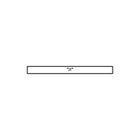
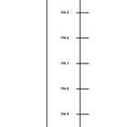
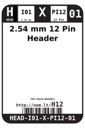
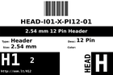
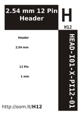
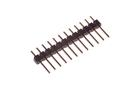
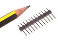

Contents
========

* [H12 > 2.54 mm 12 Pin Header](#h12--254-mm-12-pin-header)
	* [Diagrams](#diagrams)
	* [Datasheets](#datasheets)
	* [Labels](#labels)
	* [EDA](#eda)
	* [Images](#images)
	* [Tags](#tags)
  
![][im]
# H12 > 2.54 mm 12 Pin Header

- ID: HEAD-I01-X-PI12-01
- Hex ID: H12
- Name: 2.54 mm 12 Pin Header
- Description: 2.54 mm 12 Pin Header
- Long Link: [http://oom.lt/HEAD-I01-X-PI12-01](http://oom.lt/HEAD-I01-X-PI12-01)
- Short Link: [http://oom.lt/H12](http://oom.lt/H12)

## Diagrams
  
  

|diagBBLS|diagDIAG|diagIDEN|diagSCHEM|diagSIMP|
| :---: | :---: | :---: | :---: | :---: |
||||||

## Datasheets

- Datasheet: [datasheet.pdf](datasheet.pdf)

## Labels
  
  

|label-front|label-inventory|label-spec|
| :---: | :---: | :---: |
||||

## EDA

### Footprints
  

|  [kicad/kicad-footprints/Connector_PinHeader_2.54mm/PinHeader_1x12_P2.54mm_Vertical](https://github.com/oomlout/oomlout_OOMP_eda/tree/main/footprints/kicad/kicad-footprints/Connector_PinHeader_2.54mm/PinHeader_1x12_P2.54mm_Vertical/)|  [eagle/SparkFun-Eagle-Libraries/Sparkfun-Connectors/1X12](https://github.com/oomlout/oomlout_OOMP_eda/tree/main/footprints/eagle/SparkFun-Eagle-Libraries/Sparkfun-Connectors/1X12/)|  [eagle/SparkFun-Eagle-Libraries/Sparkfun-Connectors/1X12_LOCK](https://github.com/oomlout/oomlout_OOMP_eda/tree/main/footprints/eagle/SparkFun-Eagle-Libraries/Sparkfun-Connectors/1X12_LOCK/)|  [eagle/SparkFun-Eagle-Libraries/Sparkfun-Connectors/1X12_LOCK_LONGPADS](https://github.com/oomlout/oomlout_OOMP_eda/tree/main/footprints/eagle/SparkFun-Eagle-Libraries/Sparkfun-Connectors/1X12_LOCK_LONGPADS/)|
| :---: | :---: | :---: | :---: |
|  [eagle/SparkFun-Eagle-Libraries/Sparkfun-Connectors/1X12_NO_SILK](https://github.com/oomlout/oomlout_OOMP_eda/tree/main/footprints/eagle/SparkFun-Eagle-Libraries/Sparkfun-Connectors/1X12_NO_SILK/)||||

### Instances
  
  
Used 74 times.  
Prevalance: (74\9905) 0.7471%  

|OOMP Instances|
| :---: |
|[PROJ-ADAF-1535-STAN-01  Adafruit Bluefruit EZ Key PCB  Used 2 times. JP1, JP2](https://github.com/oomlout/oomlout_OOMP_projects/tree/main/PROJ-ADAF-1535-STAN-01/)|
|[PROJ-ADAF-1963-STAN-01  Adafruit FONA 800 GSM Breakout PCB  Used 1 times. JP1](https://github.com/oomlout/oomlout_OOMP_projects/tree/main/PROJ-ADAF-1963-STAN-01/)|
|[PROJ-ADAF-2000-STAN-01  Adafruit Pro Trinket PCBs  Used 2 times. JP1, JP4](https://github.com/oomlout/oomlout_OOMP_projects/tree/main/PROJ-ADAF-2000-STAN-01/)|
|[PROJ-ADAF-2717-STAN-01  Adafruit TCA9548A I2C Multiplexer PCB  Used 2 times. JP1, JP3](https://github.com/oomlout/oomlout_OOMP_projects/tree/main/PROJ-ADAF-2717-STAN-01/)|
|[PROJ-ADAF-2771-STAN-01  Adafruit Feather 32u4 Basic Proto PCB  Used 1 times. JP3](https://github.com/oomlout/oomlout_OOMP_projects/tree/main/PROJ-ADAF-2771-STAN-01/)|
|[PROJ-ADAF-2772-STAN-01  Adafruit Feather M0 Basic Proto PCB  Used 1 times. JP3](https://github.com/oomlout/oomlout_OOMP_projects/tree/main/PROJ-ADAF-2772-STAN-01/)|
|[PROJ-ADAF-2795-STAN-01  Adafruit Feather 32u4 Adalogger PCB  Used 1 times. JP3](https://github.com/oomlout/oomlout_OOMP_projects/tree/main/PROJ-ADAF-2795-STAN-01/)|
|[PROJ-ADAF-2796-STAN-01  Adafruit Feather M0 Adalogger PCB  Used 1 times. JP3](https://github.com/oomlout/oomlout_OOMP_projects/tree/main/PROJ-ADAF-2796-STAN-01/)|
|[PROJ-ADAF-2821-STAN-01  Adafruit Feather ESP8266 HUZZAH PCB  Used 1 times. JP3](https://github.com/oomlout/oomlout_OOMP_projects/tree/main/PROJ-ADAF-2821-STAN-01/)|
|[PROJ-ADAF-2829-STAN-01  Adafruit Feather 32u4 Bluefruit LE PCB  Used 1 times. JP3](https://github.com/oomlout/oomlout_OOMP_projects/tree/main/PROJ-ADAF-2829-STAN-01/)|
|[PROJ-ADAF-2884-STAN-01  Adafruit FeatherWing Proto Doubler Tripler and Quad  Used 3 times. JP1, JP4, JP5](https://github.com/oomlout/oomlout_OOMP_projects/tree/main/PROJ-ADAF-2884-STAN-01/)|
|[PROJ-ADAF-2900-STAN-01  Adafruit OLED FeatherWing PCB  Used 1 times. JP2](https://github.com/oomlout/oomlout_OOMP_projects/tree/main/PROJ-ADAF-2900-STAN-01/)|
|[PROJ-ADAF-2926-STAN-01  Adafruit Terminal Block FeatherWing PCB  Used 1 times. JP1](https://github.com/oomlout/oomlout_OOMP_projects/tree/main/PROJ-ADAF-2926-STAN-01/)|
|[PROJ-ADAF-2927-STAN-01  Adafruit DC Stepper Motor FeatherWing PCB  Used 1 times. JP1](https://github.com/oomlout/oomlout_OOMP_projects/tree/main/PROJ-ADAF-2927-STAN-01/)|
|[PROJ-ADAF-2928-STAN-01  Adafruit PWM Servo FeatherWing PCB  Used 1 times. JP4](https://github.com/oomlout/oomlout_OOMP_projects/tree/main/PROJ-ADAF-2928-STAN-01/)|
|[PROJ-ADAF-2995-STAN-01  Adafruit Feather M0 Bluefruit LE PCB  Used 1 times. JP3](https://github.com/oomlout/oomlout_OOMP_projects/tree/main/PROJ-ADAF-2995-STAN-01/)|
|[PROJ-ADAF-3027-STAN-01  Adafruit Feather 32u4 FONA PCB  Used 1 times. JP3](https://github.com/oomlout/oomlout_OOMP_projects/tree/main/PROJ-ADAF-3027-STAN-01/)|
|[PROJ-ADAF-3056-STAN-01  Adafruit WICED WiFi Feather PCB  Used 1 times. JP3](https://github.com/oomlout/oomlout_OOMP_projects/tree/main/PROJ-ADAF-3056-STAN-01/)|
|[PROJ-ADAF-3178-STAN-01  Adafruit Feather M0 RFM LoRa PCB  Used 1 times. JP3](https://github.com/oomlout/oomlout_OOMP_projects/tree/main/PROJ-ADAF-3178-STAN-01/)|
|[PROJ-ADAF-3200-STAN-01  Adafruit Teensy 3.x Feather Adapter PCB  Used 1 times. JP3](https://github.com/oomlout/oomlout_OOMP_projects/tree/main/PROJ-ADAF-3200-STAN-01/)|
|[PROJ-ADAF-3357-STAN-01  Adafruit Music Maker FeatherWing PCB  Used 1 times. JP1](https://github.com/oomlout/oomlout_OOMP_projects/tree/main/PROJ-ADAF-3357-STAN-01/)|
|[PROJ-ADAF-3403-STAN-01  Adafruit Feather M0 Express PCB  Used 1 times. JP3](https://github.com/oomlout/oomlout_OOMP_projects/tree/main/PROJ-ADAF-3403-STAN-01/)|
|[PROJ-ADAF-3405-STAN-01  Adafruit HUZZAH32 ESP32 Feather PCB  Used 1 times. JP3](https://github.com/oomlout/oomlout_OOMP_projects/tree/main/PROJ-ADAF-3405-STAN-01/)|
|[PROJ-ADAF-3458-STAN-01  Adafruit Feather 328P PCB  Used 1 times. JP3](https://github.com/oomlout/oomlout_OOMP_projects/tree/main/PROJ-ADAF-3458-STAN-01/)|
|[PROJ-ADAF-364-STAN-01  Adafruit PN532 RFID NFC Breakout  Used 1 times. JP3](https://github.com/oomlout/oomlout_OOMP_projects/tree/main/PROJ-ADAF-364-STAN-01/)|
|[PROJ-ADAF-3657-STAN-01  Adafruit SAMD09 Breakout PCB  Used 2 times. JP1, JP3](https://github.com/oomlout/oomlout_OOMP_projects/tree/main/PROJ-ADAF-3657-STAN-01/)|
|[PROJ-ADAF-3787-STAN-01  Adafruit 1.54 inch 240x240 TFT PCB  Used 1 times. JP2](https://github.com/oomlout/oomlout_OOMP_projects/tree/main/PROJ-ADAF-3787-STAN-01/)|
|[PROJ-ADAF-3857-STAN-01  Adafruit Feather M4 Express PCB  Used 1 times. JP3](https://github.com/oomlout/oomlout_OOMP_projects/tree/main/PROJ-ADAF-3857-STAN-01/)|
|[PROJ-ADAF-3988-STAN-01  Adafruit Prop Maker FeatherWing PCB  Used 1 times. JP1](https://github.com/oomlout/oomlout_OOMP_projects/tree/main/PROJ-ADAF-3988-STAN-01/)|
|[PROJ-ADAF-4201-STAN-01  Adafruit AirLift Breakout PCB  Used 1 times. JP1](https://github.com/oomlout/oomlout_OOMP_projects/tree/main/PROJ-ADAF-4201-STAN-01/)|
|[PROJ-ADAF-4382-STAN-01  Adafruit Feather STM32F405 Express PCB  Used 1 times. JP3](https://github.com/oomlout/oomlout_OOMP_projects/tree/main/PROJ-ADAF-4382-STAN-01/)|
|[PROJ-ADAF-4569-STAN-01  Adafruit ISM330DHCX LIS3MDL FeatherWing PCB  Used 1 times. JP2](https://github.com/oomlout/oomlout_OOMP_projects/tree/main/PROJ-ADAF-4569-STAN-01/)|
|[PROJ-ADAF-4702-STAN-01  Adafruit RGB Matrix FeatherWing PCB  Used 1 times. JP1](https://github.com/oomlout/oomlout_OOMP_projects/tree/main/PROJ-ADAF-4702-STAN-01/)|
|[PROJ-ADAF-4759-STAN-01  Adafruit Feather M4 CAN PCB  Used 1 times. JP3](https://github.com/oomlout/oomlout_OOMP_projects/tree/main/PROJ-ADAF-4759-STAN-01/)|
|[PROJ-ADAF-4979-STAN-01  Adafruit NeoKey FeatherWing PCB  Used 1 times. JP5](https://github.com/oomlout/oomlout_OOMP_projects/tree/main/PROJ-ADAF-4979-STAN-01/)|
|[PROJ-ADAF-5000-STAN-01  Adafruit Feather ESP32 S2 PCB  Used 1 times. JP3](https://github.com/oomlout/oomlout_OOMP_projects/tree/main/PROJ-ADAF-5000-STAN-01/)|
|[PROJ-ADAF-5233-STAN-01  Adafruit ATtiny8x7 Breakout PCB  Used 2 times. JP1, JP3](https://github.com/oomlout/oomlout_OOMP_projects/tree/main/PROJ-ADAF-5233-STAN-01/)|
|[PROJ-ADAF-5300-STAN-01  Adafruit ESP32 S2 TFT Feather PCB  Used 1 times. JP3](https://github.com/oomlout/oomlout_OOMP_projects/tree/main/PROJ-ADAF-5300-STAN-01/)|
|[PROJ-ADAF-5323-STAN-01  Adafruit Feather ESP32 S3 PCB  Used 1 times. JP3](https://github.com/oomlout/oomlout_OOMP_projects/tree/main/PROJ-ADAF-5323-STAN-01/)|
|[PROJ-ADAF-5400-STAN-01  Adafruit ESP32 Feather V2 PCB  Used 1 times. JP3](https://github.com/oomlout/oomlout_OOMP_projects/tree/main/PROJ-ADAF-5400-STAN-01/)|
|[PROJ-ADAF-904-STAN-01  Adafruit INA219 Current Sensor PCB  Used 1 times. JP1](https://github.com/oomlout/oomlout_OOMP_projects/tree/main/PROJ-ADAF-904-STAN-01/)|
|[PROJ-SPAR-10025-STAN-01  EiBotBoard  Used 2 times. J4, J5](https://github.com/oomlout/oomlout_OOMP_projects/tree/main/PROJ-SPAR-10025-STAN-01/)|
|[PROJ-SPAR-10889-STAN-01  ProtoSnap-Pro Mini  Used 2 times. JP6, JP7](https://github.com/oomlout/oomlout_OOMP_projects/tree/main/PROJ-SPAR-10889-STAN-01/)|
|[PROJ-SPAR-11113-STAN-01  Pro Mini Candy  Used 2 times. JP6, JP7](https://github.com/oomlout/oomlout_OOMP_projects/tree/main/PROJ-SPAR-11113-STAN-01/)|
|[PROJ-SPAR-11117-STAN-01  32U4 Breakout Board  Used 2 times. JP1, JP2](https://github.com/oomlout/oomlout_OOMP_projects/tree/main/PROJ-SPAR-11117-STAN-01/)|
|[PROJ-SPAR-11420-STAN-01  MiniGen  Used 2 times. JP1, JP3](https://github.com/oomlout/oomlout_OOMP_projects/tree/main/PROJ-SPAR-11420-STAN-01/)|
|[PROJ-SPAR-13036-STAN-01  Edison Arduino Block  Used 2 times. JP2, JP3](https://github.com/oomlout/oomlout_OOMP_projects/tree/main/PROJ-SPAR-13036-STAN-01/)|
|[PROJ-SPAR-13058-STAN-01  MiP ProMini-Pack  Used 2 times. JP6, JP7](https://github.com/oomlout/oomlout_OOMP_projects/tree/main/PROJ-SPAR-13058-STAN-01/)|
|[PROJ-SPAR-13155-STAN-01  SparkFun Stepoko  Used 1 times. JP19](https://github.com/oomlout/oomlout_OOMP_projects/tree/main/PROJ-SPAR-13155-STAN-01/)|
|[PROJ-SPAR-13328-STAN-01  Photon Wearable Shield  Used 2 times. JP25, JP26](https://github.com/oomlout/oomlout_OOMP_projects/tree/main/PROJ-SPAR-13328-STAN-01/)|
|[PROJ-SPAR-13614-STAN-01  Qduino Mini SFE  Used 2 times. JP3, JP4](https://github.com/oomlout/oomlout_OOMP_projects/tree/main/PROJ-SPAR-13614-STAN-01/)|
|[PROJ-SPAR-13664-STAN-01  SAMD21 Mini Breakout  Used 2 times. JP1, JP2](https://github.com/oomlout/oomlout_OOMP_projects/tree/main/PROJ-SPAR-13664-STAN-01/)|
|[PROJ-SPAR-13830-STAN-01  USB UART Serial Breakout-CY7C65213  Used 2 times. J4, J5](https://github.com/oomlout/oomlout_OOMP_projects/tree/main/PROJ-SPAR-13830-STAN-01/)|
|[PROJ-SPAR-14030-STAN-01  Mini GPS Shield  Used 2 times. J2, J3](https://github.com/oomlout/oomlout_OOMP_projects/tree/main/PROJ-SPAR-14030-STAN-01/)|
|[PROJ-SPAR-14713-STAN-01  SAMD51 Thing Plus  Used 1 times. J1](https://github.com/oomlout/oomlout_OOMP_projects/tree/main/PROJ-SPAR-14713-STAN-01/)|

### Symbols

## Images
  
  

|image|image_RE|diagBBLS|diagDIAG|diagIDEN|diagSCHEM|diagSIMP|label-front|label-inventory|label-spec|
| :---: | :---: | :---: | :---: | :---: | :---: | :---: | :---: | :---: | :---: |
|||||||||||

## Tags

- oompType: HEAD
- oompSize: I01
- oompColor: X
- oompDesc: PI12
- oompIndex: 01
- hexID: H12
- oompSort: 
- oompClass: Through Hole
- oompClassCode: THTH
- ooPitch: 2.54
- ooPinHeight: 11.60
- ooPinWidth: 0.64
- ooPinOffset: 1.53
- oompBbls: variable;pins;12
- oompBbls: template;XXXX-I01-X-XX-01-bbls
- oompDiag: variable;pins;12
- oompDiag: template;HEAD-I01-X-XX-01-diag
- oompIden: variable;pins;12
- oompIden: template;XXXX-I01-X-XX-01-iden
- oompSchem: variable;pins;12
- oompSchem: template;XXXX-XX-X-XX-01-PINS-EVEN-schem
- oompSimp: variable;pins;12
- oompSimp: template;XXXX-I01-X-XX-01-simp
- ooNumPins: 12
- ooFootprint: OOMP-HEAD-I01-X-PI12-01
- ooDesignator: J1
- schematicSymbol: HEAD-XX-X-PI12-XX
- pcbFootprint: HEAD-I01-X-PI12-01
- kicadSymbol: Connector/Conn_01x12_Male
- footprintEagle: SparkFun-Eagle-Libraries/Sparkfun-Connectors/1X12
- footprintEagle: SparkFun-Eagle-Libraries/Sparkfun-Connectors/1X12_LOCK
- footprintEagle: SparkFun-Eagle-Libraries/Sparkfun-Connectors/1X12_LOCK_LONGPADS
- footprintEagle: SparkFun-Eagle-Libraries/Sparkfun-Connectors/1X12_NO_SILK
- footprintKicad: kicad-footprints/Connector_PinHeader_2.54mm/PinHeader_1x12_P2.54mm_Vertical
- oompID: HEAD-I01-X-PI12-01
- oompInstances: {'PROJECT': 'PROJ-ADAF-1535-STAN-01', 'ID': 'JP1'}
- oompInstances: {'PROJECT': 'PROJ-ADAF-1535-STAN-01', 'ID': 'JP2'}
- oompInstances: {'PROJECT': 'PROJ-ADAF-1963-STAN-01', 'ID': 'JP1'}
- oompInstances: {'PROJECT': 'PROJ-ADAF-2000-STAN-01', 'ID': 'JP1'}
- oompInstances: {'PROJECT': 'PROJ-ADAF-2000-STAN-01', 'ID': 'JP4'}
- oompInstances: {'PROJECT': 'PROJ-ADAF-2717-STAN-01', 'ID': 'JP1'}
- oompInstances: {'PROJECT': 'PROJ-ADAF-2717-STAN-01', 'ID': 'JP3'}
- oompInstances: {'PROJECT': 'PROJ-ADAF-2771-STAN-01', 'ID': 'JP3'}
- oompInstances: {'PROJECT': 'PROJ-ADAF-2772-STAN-01', 'ID': 'JP3'}
- oompInstances: {'PROJECT': 'PROJ-ADAF-2795-STAN-01', 'ID': 'JP3'}
- oompInstances: {'PROJECT': 'PROJ-ADAF-2796-STAN-01', 'ID': 'JP3'}
- oompInstances: {'PROJECT': 'PROJ-ADAF-2821-STAN-01', 'ID': 'JP3'}
- oompInstances: {'PROJECT': 'PROJ-ADAF-2829-STAN-01', 'ID': 'JP3'}
- oompInstances: {'PROJECT': 'PROJ-ADAF-2884-STAN-01', 'ID': 'JP1'}
- oompInstances: {'PROJECT': 'PROJ-ADAF-2884-STAN-01', 'ID': 'JP4'}
- oompInstances: {'PROJECT': 'PROJ-ADAF-2884-STAN-01', 'ID': 'JP5'}
- oompInstances: {'PROJECT': 'PROJ-ADAF-2900-STAN-01', 'ID': 'JP2'}
- oompInstances: {'PROJECT': 'PROJ-ADAF-2926-STAN-01', 'ID': 'JP1'}
- oompInstances: {'PROJECT': 'PROJ-ADAF-2927-STAN-01', 'ID': 'JP1'}
- oompInstances: {'PROJECT': 'PROJ-ADAF-2928-STAN-01', 'ID': 'JP4'}
- oompInstances: {'PROJECT': 'PROJ-ADAF-2995-STAN-01', 'ID': 'JP3'}
- oompInstances: {'PROJECT': 'PROJ-ADAF-3027-STAN-01', 'ID': 'JP3'}
- oompInstances: {'PROJECT': 'PROJ-ADAF-3056-STAN-01', 'ID': 'JP3'}
- oompInstances: {'PROJECT': 'PROJ-ADAF-3178-STAN-01', 'ID': 'JP3'}
- oompInstances: {'PROJECT': 'PROJ-ADAF-3200-STAN-01', 'ID': 'JP3'}
- oompInstances: {'PROJECT': 'PROJ-ADAF-3357-STAN-01', 'ID': 'JP1'}
- oompInstances: {'PROJECT': 'PROJ-ADAF-3403-STAN-01', 'ID': 'JP3'}
- oompInstances: {'PROJECT': 'PROJ-ADAF-3405-STAN-01', 'ID': 'JP3'}
- oompInstances: {'PROJECT': 'PROJ-ADAF-3458-STAN-01', 'ID': 'JP3'}
- oompInstances: {'PROJECT': 'PROJ-ADAF-364-STAN-01', 'ID': 'JP3'}
- oompInstances: {'PROJECT': 'PROJ-ADAF-3657-STAN-01', 'ID': 'JP1'}
- oompInstances: {'PROJECT': 'PROJ-ADAF-3657-STAN-01', 'ID': 'JP3'}
- oompInstances: {'PROJECT': 'PROJ-ADAF-3787-STAN-01', 'ID': 'JP2'}
- oompInstances: {'PROJECT': 'PROJ-ADAF-3857-STAN-01', 'ID': 'JP3'}
- oompInstances: {'PROJECT': 'PROJ-ADAF-3988-STAN-01', 'ID': 'JP1'}
- oompInstances: {'PROJECT': 'PROJ-ADAF-4201-STAN-01', 'ID': 'JP1'}
- oompInstances: {'PROJECT': 'PROJ-ADAF-4382-STAN-01', 'ID': 'JP3'}
- oompInstances: {'PROJECT': 'PROJ-ADAF-4569-STAN-01', 'ID': 'JP2'}
- oompInstances: {'PROJECT': 'PROJ-ADAF-4702-STAN-01', 'ID': 'JP1'}
- oompInstances: {'PROJECT': 'PROJ-ADAF-4759-STAN-01', 'ID': 'JP3'}
- oompInstances: {'PROJECT': 'PROJ-ADAF-4979-STAN-01', 'ID': 'JP5'}
- oompInstances: {'PROJECT': 'PROJ-ADAF-5000-STAN-01', 'ID': 'JP3'}
- oompInstances: {'PROJECT': 'PROJ-ADAF-5233-STAN-01', 'ID': 'JP1'}
- oompInstances: {'PROJECT': 'PROJ-ADAF-5233-STAN-01', 'ID': 'JP3'}
- oompInstances: {'PROJECT': 'PROJ-ADAF-5300-STAN-01', 'ID': 'JP3'}
- oompInstances: {'PROJECT': 'PROJ-ADAF-5323-STAN-01', 'ID': 'JP3'}
- oompInstances: {'PROJECT': 'PROJ-ADAF-5400-STAN-01', 'ID': 'JP3'}
- oompInstances: {'PROJECT': 'PROJ-ADAF-904-STAN-01', 'ID': 'JP1'}
- oompInstances: {'PROJECT': 'PROJ-SPAR-10025-STAN-01', 'ID': 'J4'}
- oompInstances: {'PROJECT': 'PROJ-SPAR-10025-STAN-01', 'ID': 'J5'}
- oompInstances: {'PROJECT': 'PROJ-SPAR-10889-STAN-01', 'ID': 'JP6'}
- oompInstances: {'PROJECT': 'PROJ-SPAR-10889-STAN-01', 'ID': 'JP7'}
- oompInstances: {'PROJECT': 'PROJ-SPAR-11113-STAN-01', 'ID': 'JP6'}
- oompInstances: {'PROJECT': 'PROJ-SPAR-11113-STAN-01', 'ID': 'JP7'}
- oompInstances: {'PROJECT': 'PROJ-SPAR-11117-STAN-01', 'ID': 'JP1'}
- oompInstances: {'PROJECT': 'PROJ-SPAR-11117-STAN-01', 'ID': 'JP2'}
- oompInstances: {'PROJECT': 'PROJ-SPAR-11420-STAN-01', 'ID': 'JP1'}
- oompInstances: {'PROJECT': 'PROJ-SPAR-11420-STAN-01', 'ID': 'JP3'}
- oompInstances: {'PROJECT': 'PROJ-SPAR-13036-STAN-01', 'ID': 'JP2'}
- oompInstances: {'PROJECT': 'PROJ-SPAR-13036-STAN-01', 'ID': 'JP3'}
- oompInstances: {'PROJECT': 'PROJ-SPAR-13058-STAN-01', 'ID': 'JP6'}
- oompInstances: {'PROJECT': 'PROJ-SPAR-13058-STAN-01', 'ID': 'JP7'}
- oompInstances: {'PROJECT': 'PROJ-SPAR-13155-STAN-01', 'ID': 'JP19'}
- oompInstances: {'PROJECT': 'PROJ-SPAR-13328-STAN-01', 'ID': 'JP25'}
- oompInstances: {'PROJECT': 'PROJ-SPAR-13328-STAN-01', 'ID': 'JP26'}
- oompInstances: {'PROJECT': 'PROJ-SPAR-13614-STAN-01', 'ID': 'JP3'}
- oompInstances: {'PROJECT': 'PROJ-SPAR-13614-STAN-01', 'ID': 'JP4'}
- oompInstances: {'PROJECT': 'PROJ-SPAR-13664-STAN-01', 'ID': 'JP1'}
- oompInstances: {'PROJECT': 'PROJ-SPAR-13664-STAN-01', 'ID': 'JP2'}
- oompInstances: {'PROJECT': 'PROJ-SPAR-13830-STAN-01', 'ID': 'J4'}
- oompInstances: {'PROJECT': 'PROJ-SPAR-13830-STAN-01', 'ID': 'J5'}
- oompInstances: {'PROJECT': 'PROJ-SPAR-14030-STAN-01', 'ID': 'J2'}
- oompInstances: {'PROJECT': 'PROJ-SPAR-14030-STAN-01', 'ID': 'J3'}
- oompInstances: {'PROJECT': 'PROJ-SPAR-14713-STAN-01', 'ID': 'J1'}

[im]: image_450.jpg
