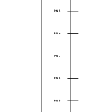
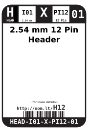

Contents
========

* [HEAD-I01-X-PI12-01>2.54 mm 12 Pin Header](#head-i01-x-pi12-01254-mm-12-pin-header)
	* [Images](#images)
	* [Diagrams](#diagrams)
	* [Datasheets](#datasheets)
	* [Labels](#labels)
	* [EDA](#eda)
		* [Footprints](#footprints)
		* [Symbols](#symbols)
	* [Tags](#tags)
  
![][im]
# HEAD-I01-X-PI12-01>2.54 mm 12 Pin Header

- ID: HEAD-I01-X-PI12-01
- Name: HEAD-I01-X-PI12-01

## Images
  
  

|Main|Reference|
| :---: | :---: |
|||

## Diagrams
  
  

|Breadboard Layout|Diagram|Identifier|Schematic|Simple|
| :---: | :---: | :---: | :---: | :---: |
||||||

## Datasheets

- Datasheet: [datasheet.pdf](datasheet.pdf)

## Labels
  
  

|Front|Inventory|Specifications|
| :---: | :---: | :---: |
||||

## EDA

### Footprints
  
[kicad-footprints/Connector_PinHeader_2.54mm/PinHeader_1x12_P2.54mm_Vertical](https://github.com/oomlout/oomlout_OOMP_eda/tree/main/footprints/kicad/kicad-footprints/Connector_PinHeader_2.54mm/PinHeader_1x12_P2.54mm_Vertical/)  
  
[SparkFun-Eagle-Libraries/Sparkfun-Connectors/1X12](https://github.com/oomlout/oomlout_OOMP_eda/tree/main/footprints/eagle/SparkFun-Eagle-Libraries/Sparkfun-Connectors/1X12/)  
  
[SparkFun-Eagle-Libraries/Sparkfun-Connectors/1X12_LOCK](https://github.com/oomlout/oomlout_OOMP_eda/tree/main/footprints/eagle/SparkFun-Eagle-Libraries/Sparkfun-Connectors/1X12_LOCK/)  
  
[SparkFun-Eagle-Libraries/Sparkfun-Connectors/1X12_LOCK_LONGPADS](https://github.com/oomlout/oomlout_OOMP_eda/tree/main/footprints/eagle/SparkFun-Eagle-Libraries/Sparkfun-Connectors/1X12_LOCK_LONGPADS/)  
  
[SparkFun-Eagle-Libraries/Sparkfun-Connectors/1X12_NO_SILK](https://github.com/oomlout/oomlout_OOMP_eda/tree/main/footprints/eagle/SparkFun-Eagle-Libraries/Sparkfun-Connectors/1X12_NO_SILK/)  

### Symbols

## Tags

- index: 12410
- oompType: HEAD
- oompSize: I01
- oompColor: X
- oompDesc: PI12
- oompIndex: 01
- hexID: H12
- oompSort: 
- oompClass: Through Hole
- oompClassCode: THTH
- ooPitch: 2.54
- ooPinHeight: 11.60
- ooPinWidth: 0.64
- ooPinOffset: 1.53
- oompBbls: variable;pins;12
- oompBbls: template;XXXX-I01-X-XX-01-bbls
- oompDiag: variable;pins;12
- oompDiag: template;HEAD-I01-X-XX-01-diag
- oompIden: variable;pins;12
- oompIden: template;XXXX-I01-X-XX-01-iden
- oompSchem: variable;pins;12
- oompSchem: template;XXXX-XX-X-XX-01-PINS-EVEN-schem
- oompSimp: variable;pins;12
- oompSimp: template;XXXX-I01-X-XX-01-simp
- ooNumPins: 12
- ooFootprint: OOMP-HEAD-I01-X-PI12-01
- ooDesignator: J1
- schematicSymbol: HEAD-XX-X-PI12-XX
- pcbFootprint: HEAD-I01-X-PI12-01
- kicadSymbol: Connector/Conn_01x12_Male
- footprintEagle: SparkFun-Eagle-Libraries/Sparkfun-Connectors/1X12
- footprintEagle: SparkFun-Eagle-Libraries/Sparkfun-Connectors/1X12_LOCK
- footprintEagle: SparkFun-Eagle-Libraries/Sparkfun-Connectors/1X12_LOCK_LONGPADS
- footprintEagle: SparkFun-Eagle-Libraries/Sparkfun-Connectors/1X12_NO_SILK
- footprintKicad: kicad-footprints/Connector_PinHeader_2.54mm/PinHeader_1x12_P2.54mm_Vertical

[im]: image_600.jpg
