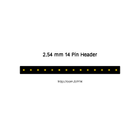
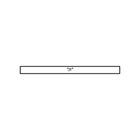
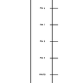
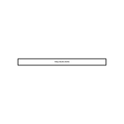
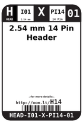
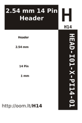
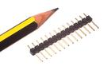

Contents
========

* [H14 > 2.54 mm 14 Pin Header](#h14--254-mm-14-pin-header)
	* [Diagrams](#diagrams)
	* [Datasheets](#datasheets)
	* [Labels](#labels)
	* [EDA](#eda)
	* [Images](#images)
	* [Tags](#tags)
  
![][im]
# H14 > 2.54 mm 14 Pin Header

- ID: HEAD-I01-X-PI14-01
- Hex ID: H14
- Name: 2.54 mm 14 Pin Header
- Description: 2.54 mm 14 Pin Header
- Long Link: [http://oom.lt/HEAD-I01-X-PI14-01](http://oom.lt/HEAD-I01-X-PI14-01)
- Short Link: [http://oom.lt/H14](http://oom.lt/H14)

## Diagrams
  
  

|diagBBLS|diagDIAG|diagIDEN|diagSCHEM|diagSIMP|
| :---: | :---: | :---: | :---: | :---: |
||||||

## Datasheets

- Datasheet: [datasheet.pdf](datasheet.pdf)

## Labels
  
  

|label-front|label-inventory|label-spec|
| :---: | :---: | :---: |
||||

## EDA

### Footprints
  

|  [kicad/FOOTPRINT-kicad-kicad-footprints-Connector_PinHeader_2.54mm-PinHeader_1x14_P2.54mm_Vertical](https://github.com/oomlout/oomlout_OOMP_eda/tree/main/footprints/kicad/FOOTPRINT-kicad-kicad-footprints-Connector_PinHeader_2.54mm-PinHeader_1x14_P2.54mm_Vertical/)|  [eagle/FOOTPRINT-eagle-SparkFun-Eagle-Libraries-Sparkfun-Connectors-1X14](https://github.com/oomlout/oomlout_OOMP_eda/tree/main/footprints/eagle/FOOTPRINT-eagle-SparkFun-Eagle-Libraries-Sparkfun-Connectors-1X14/)|  [eagle/FOOTPRINT-eagle-SparkFun-Eagle-Libraries-Sparkfun-Connectors-1X14_LOCK](https://github.com/oomlout/oomlout_OOMP_eda/tree/main/footprints/eagle/FOOTPRINT-eagle-SparkFun-Eagle-Libraries-Sparkfun-Connectors-1X14_LOCK/)|  [eagle/FOOTPRINT-eagle-SparkFun-Eagle-Libraries-Sparkfun-Connectors-1X14_LOCK_LONGPADS](https://github.com/oomlout/oomlout_OOMP_eda/tree/main/footprints/eagle/FOOTPRINT-eagle-SparkFun-Eagle-Libraries-Sparkfun-Connectors-1X14_LOCK_LONGPADS/)|
| :---: | :---: | :---: | :---: |
|  [eagle/FOOTPRINT-eagle-SparkFun-Eagle-Libraries-Sparkfun-Connectors-1X14_NO_SILK](https://github.com/oomlout/oomlout_OOMP_eda/tree/main/footprints/eagle/FOOTPRINT-eagle-SparkFun-Eagle-Libraries-Sparkfun-Connectors-1X14_NO_SILK/)|  [eagle/FOOTPRINT-eagle-Adafruit-Eagle-Library-adafruit-1X14](https://github.com/oomlout/oomlout_OOMP_eda/tree/main/footprints/eagle/FOOTPRINT-eagle-Adafruit-Eagle-Library-adafruit-1X14/)|  [eagle/FOOTPRINT-eagle-Adafruit-Eagle-Library-adafruit-1X14-CB](https://github.com/oomlout/oomlout_OOMP_eda/tree/main/footprints/eagle/FOOTPRINT-eagle-Adafruit-Eagle-Library-adafruit-1X14-CB/)|  [eagle/FOOTPRINT-eagle-Pimoroni-Eagle-Library-pimoroni-headers-114](https://github.com/oomlout/oomlout_OOMP_eda/tree/main/footprints/eagle/FOOTPRINT-eagle-Pimoroni-Eagle-Library-pimoroni-headers-114/)|
|||||

### Instances
  
  
Used 20 times.  
Prevalance: (20\10986) 0.182%  

|OOMP Instances|
| :---: |
|[PROJ-ADAF-1752-STAN-01  Adafruit MAX9744 Amplifier PCB  Used 1 times. JP2](https://github.com/oomlout/oomlout_OOMP_projects/tree/main/PROJ-ADAF-1752-STAN-01/)|
|[PROJ-ADAF-2133-STAN-01  Adafruit Audio FX Sound Board PCBs  Used 2 times. CONTROL, GPIO1](https://github.com/oomlout/oomlout_OOMP_projects/tree/main/PROJ-ADAF-2133-STAN-01/)|
|[PROJ-ADAF-3677-STAN-01  Adafruit ItsyBitsy 32u4 PCB  Used 2 times. JP2, JP4](https://github.com/oomlout/oomlout_OOMP_projects/tree/main/PROJ-ADAF-3677-STAN-01/)|
|[PROJ-ADAF-3727-STAN-01  Adafruit ItsyBitsy M0 PCB  Used 2 times. JP2, JP4](https://github.com/oomlout/oomlout_OOMP_projects/tree/main/PROJ-ADAF-3727-STAN-01/)|
|[PROJ-ADAF-3800-STAN-01  Adafruit ItsyBitsy M4 Express PCB  Used 2 times. JP2, JP4](https://github.com/oomlout/oomlout_OOMP_projects/tree/main/PROJ-ADAF-3800-STAN-01/)|
|[PROJ-ADAF-4363-STAN-01  Adafruit Airlift Bitsy Add On PCB  Used 2 times. JP2, JP4](https://github.com/oomlout/oomlout_OOMP_projects/tree/main/PROJ-ADAF-4363-STAN-01/)|
|[PROJ-ADAF-4481-STAN-01  Adafruit ItsyBitsy nRF52840 Express PCB  Used 2 times. JP2, JP4](https://github.com/oomlout/oomlout_OOMP_projects/tree/main/PROJ-ADAF-4481-STAN-01/)|
|[PROJ-ADAF-4888-STAN-01  Adafruit ItsyBitsy RP2040 PCB  Used 2 times. JP2, JP4](https://github.com/oomlout/oomlout_OOMP_projects/tree/main/PROJ-ADAF-4888-STAN-01/)|
|[PROJ-ARDU-UNO-REV3-SM  Arduino Rev3 Uno (SMD)  Used 1 times. J1](https://github.com/oomlout/oomlout_OOMP_projects/tree/main/PROJ-ARDU-UNO-REV3-SM/)|
|[PROJ-SPAR-10116-STAN-01  Arduino Fio  Used 2 times. JP1, JP5](https://github.com/oomlout/oomlout_OOMP_projects/tree/main/PROJ-SPAR-10116-STAN-01/)|
|[PROJ-SPAR-11520-STAN-01  Fio v3  Used 2 times. JP1, JP2](https://github.com/oomlout/oomlout_OOMP_projects/tree/main/PROJ-SPAR-11520-STAN-01/)|

### Symbols

## Images
  
  

|image|image_RE|diagBBLS|diagDIAG|diagIDEN|diagSCHEM|diagSIMP|label-front|label-inventory|label-spec|
| :---: | :---: | :---: | :---: | :---: | :---: | :---: | :---: | :---: | :---: |
|||||||||||

## Tags

- oompType: HEAD
- oompSize: I01
- oompColor: X
- oompDesc: PI14
- oompIndex: 01
- hexID: H14
- oompSort: 
- oompClass: Through Hole
- oompClassCode: THTH
- ooPitch: 2.54
- ooPinHeight: 11.60
- ooPinWidth: 0.64
- ooPinOffset: 1.53
- oompBbls: variable;pins;14
- oompBbls: template;XXXX-I01-X-XX-01-bbls
- oompDiag: variable;pins;14
- oompDiag: template;HEAD-I01-X-XX-01-diag
- oompIden: variable;pins;14
- oompIden: template;XXXX-I01-X-XX-01-iden
- oompSchem: variable;pins;14
- oompSchem: template;XXXX-XX-X-XX-01-PINS-EVEN-schem
- oompSimp: variable;pins;14
- oompSimp: template;XXXX-I01-X-XX-01-simp
- ooNumPins: 14
- ooDesignator: J1
- schematicSymbol: HEAD-XX-X-PI14-XX
- oompID: HEAD-I01-X-PI14-01
- oompInstances: {'PROJECT': 'PROJ-ADAF-1752-STAN-01', 'ID': 'JP2'}
- oompInstances: {'PROJECT': 'PROJ-ADAF-2133-STAN-01', 'ID': 'CONTROL'}
- oompInstances: {'PROJECT': 'PROJ-ADAF-2133-STAN-01', 'ID': 'GPIO1'}
- oompInstances: {'PROJECT': 'PROJ-ADAF-3677-STAN-01', 'ID': 'JP2'}
- oompInstances: {'PROJECT': 'PROJ-ADAF-3677-STAN-01', 'ID': 'JP4'}
- oompInstances: {'PROJECT': 'PROJ-ADAF-3727-STAN-01', 'ID': 'JP2'}
- oompInstances: {'PROJECT': 'PROJ-ADAF-3727-STAN-01', 'ID': 'JP4'}
- oompInstances: {'PROJECT': 'PROJ-ADAF-3800-STAN-01', 'ID': 'JP2'}
- oompInstances: {'PROJECT': 'PROJ-ADAF-3800-STAN-01', 'ID': 'JP4'}
- oompInstances: {'PROJECT': 'PROJ-ADAF-4363-STAN-01', 'ID': 'JP2'}
- oompInstances: {'PROJECT': 'PROJ-ADAF-4363-STAN-01', 'ID': 'JP4'}
- oompInstances: {'PROJECT': 'PROJ-ADAF-4481-STAN-01', 'ID': 'JP2'}
- oompInstances: {'PROJECT': 'PROJ-ADAF-4481-STAN-01', 'ID': 'JP4'}
- oompInstances: {'PROJECT': 'PROJ-ADAF-4888-STAN-01', 'ID': 'JP2'}
- oompInstances: {'PROJECT': 'PROJ-ADAF-4888-STAN-01', 'ID': 'JP4'}
- oompInstances: {'PROJECT': 'PROJ-ARDU-UNO-REV3-SM', 'ID': 'J1'}
- oompInstances: {'PROJECT': 'PROJ-SPAR-10116-STAN-01', 'ID': 'JP1'}
- oompInstances: {'PROJECT': 'PROJ-SPAR-10116-STAN-01', 'ID': 'JP5'}
- oompInstances: {'PROJECT': 'PROJ-SPAR-11520-STAN-01', 'ID': 'JP1'}
- oompInstances: {'PROJECT': 'PROJ-SPAR-11520-STAN-01', 'ID': 'JP2'}
- footprintEagle: FOOTPRINT-eagle-SparkFun-Eagle-Libraries-Sparkfun-Connectors-1X14
- footprintEagle: FOOTPRINT-eagle-SparkFun-Eagle-Libraries-Sparkfun-Connectors-1X14_LOCK
- footprintEagle: FOOTPRINT-eagle-SparkFun-Eagle-Libraries-Sparkfun-Connectors-1X14_LOCK_LONGPADS
- footprintEagle: FOOTPRINT-eagle-SparkFun-Eagle-Libraries-Sparkfun-Connectors-1X14_NO_SILK
- footprintEagle: FOOTPRINT-eagle-Adafruit-Eagle-Library-adafruit-1X14
- footprintEagle: FOOTPRINT-eagle-Adafruit-Eagle-Library-adafruit-1X14-CB
- footprintEagle: FOOTPRINT-eagle-Pimoroni-Eagle-Library-pimoroni-headers-114
- footprintKicad: FOOTPRINT-kicad-kicad-footprints-Connector_PinHeader_2.54mm-PinHeader_1x14_P2.54mm_Vertical
- symbolKicad: SYMBOL-kicad-kicad-symbols-Connector-Conn_01x14_Male
- symbolKicad: SYMBOL-kicad-kicad-symbols-Connector_Generic-Conn_01x14_Male

[im]: image_450.jpg
