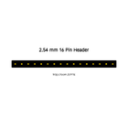
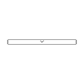
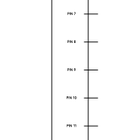
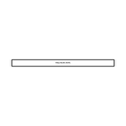
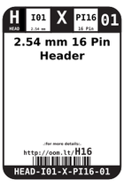
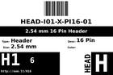
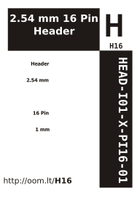
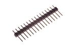
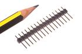

Contents
========

* [H16 > 2.54 mm 16 Pin Header](#h16--254-mm-16-pin-header)
	* [Diagrams](#diagrams)
	* [Datasheets](#datasheets)
	* [Labels](#labels)
	* [EDA](#eda)
	* [Images](#images)
	* [Tags](#tags)
  
![][im]
# H16 > 2.54 mm 16 Pin Header

- ID: HEAD-I01-X-PI16-01
- Hex ID: H16
- Name: 2.54 mm 16 Pin Header
- Description: 2.54 mm 16 Pin Header
- Long Link: [http://oom.lt/HEAD-I01-X-PI16-01](http://oom.lt/HEAD-I01-X-PI16-01)
- Short Link: [http://oom.lt/H16](http://oom.lt/H16)

## Diagrams
  
  

|diagBBLS|diagDIAG|diagIDEN|diagSCHEM|diagSIMP|
| :---: | :---: | :---: | :---: | :---: |
||||||

## Datasheets

- Datasheet: [datasheet.pdf](datasheet.pdf)

## Labels
  
  

|label-front|label-inventory|label-spec|
| :---: | :---: | :---: |
||||

## EDA

### Footprints
  

|  [kicad/FOOTPRINT-kicad-kicad-footprints-Connector_PinHeader_2.54mm-PinHeader_1x16_P2.54mm_Vertical](https://github.com/oomlout/oomlout_OOMP_eda/tree/main/footprints/kicad/FOOTPRINT-kicad-kicad-footprints-Connector_PinHeader_2.54mm-PinHeader_1x16_P2.54mm_Vertical/)|  [eagle/FOOTPRINT-eagle-SparkFun-Eagle-Libraries-Sparkfun-Connectors-1X16](https://github.com/oomlout/oomlout_OOMP_eda/tree/main/footprints/eagle/FOOTPRINT-eagle-SparkFun-Eagle-Libraries-Sparkfun-Connectors-1X16/)|  [eagle/FOOTPRINT-eagle-SparkFun-Eagle-Libraries-Sparkfun-Connectors-1X16_LOCK](https://github.com/oomlout/oomlout_OOMP_eda/tree/main/footprints/eagle/FOOTPRINT-eagle-SparkFun-Eagle-Libraries-Sparkfun-Connectors-1X16_LOCK/)|  [eagle/FOOTPRINT-eagle-SparkFun-Eagle-Libraries-Sparkfun-Connectors-1X16_LOCK_LONGPADS](https://github.com/oomlout/oomlout_OOMP_eda/tree/main/footprints/eagle/FOOTPRINT-eagle-SparkFun-Eagle-Libraries-Sparkfun-Connectors-1X16_LOCK_LONGPADS/)|
| :---: | :---: | :---: | :---: |
|  [eagle/FOOTPRINT-eagle-SparkFun-Eagle-Libraries-Sparkfun-Connectors-1X16_NO_SILK](https://github.com/oomlout/oomlout_OOMP_eda/tree/main/footprints/eagle/FOOTPRINT-eagle-SparkFun-Eagle-Libraries-Sparkfun-Connectors-1X16_NO_SILK/)||||

### Instances
  
  
Used 47 times.  
Prevalance: (47\10986) 0.4278%  

|OOMP Instances|
| :---: |
|[PROJ-ADAF-1381-STAN-01  Adafruit VS1053 Breakout PCB  Used 2 times. JP2, JP3](https://github.com/oomlout/oomlout_OOMP_projects/tree/main/PROJ-ADAF-1381-STAN-01/)|
|[PROJ-ADAF-2542-STAN-01  Adafruit FONA 808 Breakout PCB  Used 1 times. JP10](https://github.com/oomlout/oomlout_OOMP_projects/tree/main/PROJ-ADAF-2542-STAN-01/)|
|[PROJ-ADAF-2661-STAN-01  Adafruit Bluefruit LE Micro PCB  Used 2 times. JP1, JP3](https://github.com/oomlout/oomlout_OOMP_projects/tree/main/PROJ-ADAF-2661-STAN-01/)|
|[PROJ-ADAF-2771-STAN-01  Adafruit Feather 32u4 Basic Proto PCB  Used 1 times. JP1](https://github.com/oomlout/oomlout_OOMP_projects/tree/main/PROJ-ADAF-2771-STAN-01/)|
|[PROJ-ADAF-2772-STAN-01  Adafruit Feather M0 Basic Proto PCB  Used 1 times. JP1](https://github.com/oomlout/oomlout_OOMP_projects/tree/main/PROJ-ADAF-2772-STAN-01/)|
|[PROJ-ADAF-2795-STAN-01  Adafruit Feather 32u4 Adalogger PCB  Used 1 times. JP1](https://github.com/oomlout/oomlout_OOMP_projects/tree/main/PROJ-ADAF-2795-STAN-01/)|
|[PROJ-ADAF-2796-STAN-01  Adafruit Feather M0 Adalogger PCB  Used 1 times. JP1](https://github.com/oomlout/oomlout_OOMP_projects/tree/main/PROJ-ADAF-2796-STAN-01/)|
|[PROJ-ADAF-2821-STAN-01  Adafruit Feather ESP8266 HUZZAH PCB  Used 1 times. JP1](https://github.com/oomlout/oomlout_OOMP_projects/tree/main/PROJ-ADAF-2821-STAN-01/)|
|[PROJ-ADAF-2829-STAN-01  Adafruit Feather 32u4 Bluefruit LE PCB  Used 1 times. JP1](https://github.com/oomlout/oomlout_OOMP_projects/tree/main/PROJ-ADAF-2829-STAN-01/)|
|[PROJ-ADAF-2884-STAN-01  Adafruit FeatherWing Proto Doubler Tripler and Quad  Used 3 times. JP2, JP3, JP6](https://github.com/oomlout/oomlout_OOMP_projects/tree/main/PROJ-ADAF-2884-STAN-01/)|
|[PROJ-ADAF-2900-STAN-01  Adafruit OLED FeatherWing PCB  Used 1 times. JP1](https://github.com/oomlout/oomlout_OOMP_projects/tree/main/PROJ-ADAF-2900-STAN-01/)|
|[PROJ-ADAF-292-STAN-01  Adafruit I2C SPI LCD Backpack PCB  Used 1 times. JP1](https://github.com/oomlout/oomlout_OOMP_projects/tree/main/PROJ-ADAF-292-STAN-01/)|
|[PROJ-ADAF-2922-STAN-01  Adafruit Adalogger FeatherWing PCB  Used 1 times. JP2](https://github.com/oomlout/oomlout_OOMP_projects/tree/main/PROJ-ADAF-2922-STAN-01/)|
|[PROJ-ADAF-2923-STAN-01  Adafruit Relay FeatherWing PCBs  Used 1 times. JP1](https://github.com/oomlout/oomlout_OOMP_projects/tree/main/PROJ-ADAF-2923-STAN-01/)|
|[PROJ-ADAF-2926-STAN-01  Adafruit Terminal Block FeatherWing PCB  Used 1 times. JP3](https://github.com/oomlout/oomlout_OOMP_projects/tree/main/PROJ-ADAF-2926-STAN-01/)|
|[PROJ-ADAF-2927-STAN-01  Adafruit DC Stepper Motor FeatherWing PCB  Used 1 times. JP2](https://github.com/oomlout/oomlout_OOMP_projects/tree/main/PROJ-ADAF-2927-STAN-01/)|
|[PROJ-ADAF-2928-STAN-01  Adafruit PWM Servo FeatherWing PCB  Used 1 times. JP3](https://github.com/oomlout/oomlout_OOMP_projects/tree/main/PROJ-ADAF-2928-STAN-01/)|
|[PROJ-ADAF-2995-STAN-01  Adafruit Feather M0 Bluefruit LE PCB  Used 1 times. JP1](https://github.com/oomlout/oomlout_OOMP_projects/tree/main/PROJ-ADAF-2995-STAN-01/)|
|[PROJ-ADAF-3027-STAN-01  Adafruit Feather 32u4 FONA PCB  Used 1 times. JP1](https://github.com/oomlout/oomlout_OOMP_projects/tree/main/PROJ-ADAF-3027-STAN-01/)|
|[PROJ-ADAF-3028-STAN-01  Adafruit DS3231 Precision RTC FeatherWing PCB  Used 1 times. JP1](https://github.com/oomlout/oomlout_OOMP_projects/tree/main/PROJ-ADAF-3028-STAN-01/)|
|[PROJ-ADAF-3056-STAN-01  Adafruit WICED WiFi Feather PCB  Used 1 times. JP1](https://github.com/oomlout/oomlout_OOMP_projects/tree/main/PROJ-ADAF-3056-STAN-01/)|
|[PROJ-ADAF-3178-STAN-01  Adafruit Feather M0 RFM LoRa PCB  Used 1 times. JP1](https://github.com/oomlout/oomlout_OOMP_projects/tree/main/PROJ-ADAF-3178-STAN-01/)|
|[PROJ-ADAF-3200-STAN-01  Adafruit Teensy 3.x Feather Adapter PCB  Used 1 times. JP1](https://github.com/oomlout/oomlout_OOMP_projects/tree/main/PROJ-ADAF-3200-STAN-01/)|
|[PROJ-ADAF-3403-STAN-01  Adafruit Feather M0 Express PCB  Used 1 times. JP1](https://github.com/oomlout/oomlout_OOMP_projects/tree/main/PROJ-ADAF-3403-STAN-01/)|
|[PROJ-ADAF-3405-STAN-01  Adafruit HUZZAH32 ESP32 Feather PCB  Used 1 times. JP1](https://github.com/oomlout/oomlout_OOMP_projects/tree/main/PROJ-ADAF-3405-STAN-01/)|
|[PROJ-ADAF-3458-STAN-01  Adafruit Feather 328P PCB  Used 1 times. JP1](https://github.com/oomlout/oomlout_OOMP_projects/tree/main/PROJ-ADAF-3458-STAN-01/)|
|[PROJ-ADAF-3857-STAN-01  Adafruit Feather M4 Express PCB  Used 1 times. JP1](https://github.com/oomlout/oomlout_OOMP_projects/tree/main/PROJ-ADAF-3857-STAN-01/)|
|[PROJ-ADAF-3988-STAN-01  Adafruit Prop Maker FeatherWing PCB  Used 1 times. JP4](https://github.com/oomlout/oomlout_OOMP_projects/tree/main/PROJ-ADAF-3988-STAN-01/)|
|[PROJ-ADAF-4382-STAN-01  Adafruit Feather STM32F405 Express PCB  Used 1 times. JP1](https://github.com/oomlout/oomlout_OOMP_projects/tree/main/PROJ-ADAF-4382-STAN-01/)|
|[PROJ-ADAF-4569-STAN-01  Adafruit ISM330DHCX LIS3MDL FeatherWing PCB  Used 1 times. JP3](https://github.com/oomlout/oomlout_OOMP_projects/tree/main/PROJ-ADAF-4569-STAN-01/)|
|[PROJ-ADAF-4702-STAN-01  Adafruit RGB Matrix FeatherWing PCB  Used 1 times. JP4](https://github.com/oomlout/oomlout_OOMP_projects/tree/main/PROJ-ADAF-4702-STAN-01/)|
|[PROJ-ADAF-4759-STAN-01  Adafruit Feather M4 CAN PCB  Used 1 times. JP1](https://github.com/oomlout/oomlout_OOMP_projects/tree/main/PROJ-ADAF-4759-STAN-01/)|
|[PROJ-ADAF-4979-STAN-01  Adafruit NeoKey FeatherWing PCB  Used 1 times. JP6](https://github.com/oomlout/oomlout_OOMP_projects/tree/main/PROJ-ADAF-4979-STAN-01/)|
|[PROJ-ADAF-5000-STAN-01  Adafruit Feather ESP32 S2 PCB  Used 1 times. JP1](https://github.com/oomlout/oomlout_OOMP_projects/tree/main/PROJ-ADAF-5000-STAN-01/)|
|[PROJ-ADAF-5300-STAN-01  Adafruit ESP32 S2 TFT Feather PCB  Used 1 times. JP1](https://github.com/oomlout/oomlout_OOMP_projects/tree/main/PROJ-ADAF-5300-STAN-01/)|
|[PROJ-ADAF-5323-STAN-01  Adafruit Feather ESP32 S3 PCB  Used 1 times. JP1](https://github.com/oomlout/oomlout_OOMP_projects/tree/main/PROJ-ADAF-5323-STAN-01/)|
|[PROJ-ADAF-5400-STAN-01  Adafruit ESP32 Feather V2 PCB  Used 1 times. JP1](https://github.com/oomlout/oomlout_OOMP_projects/tree/main/PROJ-ADAF-5400-STAN-01/)|
|[PROJ-ADAF-904-STAN-01  Adafruit INA219 Current Sensor PCB  Used 1 times. JP3](https://github.com/oomlout/oomlout_OOMP_projects/tree/main/PROJ-ADAF-904-STAN-01/)|
|[PROJ-SPAR-11343-STAN-01  IOIO-OTG  Used 1 times. JP7](https://github.com/oomlout/oomlout_OOMP_projects/tree/main/PROJ-SPAR-11343-STAN-01/)|
|[PROJ-SPAR-11927-STAN-01  BC127 Breakout Board  Used 1 times. JP2](https://github.com/oomlout/oomlout_OOMP_projects/tree/main/PROJ-SPAR-11927-STAN-01/)|
|[PROJ-SPAR-13632-STAN-01  SparkFun Simblee Breakout Board  Used 1 times. JP3](https://github.com/oomlout/oomlout_OOMP_projects/tree/main/PROJ-SPAR-13632-STAN-01/)|
|[PROJ-SPAR-14449-STAN-01  Variable Load  Used 1 times. J2](https://github.com/oomlout/oomlout_OOMP_projects/tree/main/PROJ-SPAR-14449-STAN-01/)|
|[PROJ-SPAR-14713-STAN-01  SAMD51 Thing Plus  Used 1 times. J2](https://github.com/oomlout/oomlout_OOMP_projects/tree/main/PROJ-SPAR-14713-STAN-01/)|

### Symbols

## Images
  
  

|image|image_RE|diagBBLS|diagDIAG|diagIDEN|diagSCHEM|diagSIMP|label-front|label-inventory|label-spec|
| :---: | :---: | :---: | :---: | :---: | :---: | :---: | :---: | :---: | :---: |
|||||||||||

## Tags

- oompType: HEAD
- oompSize: I01
- oompColor: X
- oompDesc: PI16
- oompIndex: 01
- hexID: H16
- oompSort: 
- oompClass: Through Hole
- oompClassCode: THTH
- ooPitch: 2.54
- ooPinHeight: 11.60
- ooPinWidth: 0.64
- ooPinOffset: 1.53
- oompBbls: variable;pins;16
- oompBbls: template;XXXX-I01-X-XX-01-bbls
- oompDiag: variable;pins;16
- oompDiag: template;HEAD-I01-X-XX-01-diag
- oompIden: variable;pins;16
- oompIden: template;XXXX-I01-X-XX-01-iden
- oompSchem: variable;pins;16
- oompSchem: template;XXXX-XX-X-XX-01-PINS-EVEN-schem
- oompSimp: variable;pins;16
- oompSimp: template;XXXX-I01-X-XX-01-simp
- ooNumPins: 16
- ooDesignator: J1
- schematicSymbol: HEAD-XX-X-PI16-XX
- oompID: HEAD-I01-X-PI16-01
- oompInstances: {'PROJECT': 'PROJ-ADAF-1381-STAN-01', 'ID': 'JP2'}
- oompInstances: {'PROJECT': 'PROJ-ADAF-1381-STAN-01', 'ID': 'JP3'}
- oompInstances: {'PROJECT': 'PROJ-ADAF-2542-STAN-01', 'ID': 'JP10'}
- oompInstances: {'PROJECT': 'PROJ-ADAF-2661-STAN-01', 'ID': 'JP1'}
- oompInstances: {'PROJECT': 'PROJ-ADAF-2661-STAN-01', 'ID': 'JP3'}
- oompInstances: {'PROJECT': 'PROJ-ADAF-2771-STAN-01', 'ID': 'JP1'}
- oompInstances: {'PROJECT': 'PROJ-ADAF-2772-STAN-01', 'ID': 'JP1'}
- oompInstances: {'PROJECT': 'PROJ-ADAF-2795-STAN-01', 'ID': 'JP1'}
- oompInstances: {'PROJECT': 'PROJ-ADAF-2796-STAN-01', 'ID': 'JP1'}
- oompInstances: {'PROJECT': 'PROJ-ADAF-2821-STAN-01', 'ID': 'JP1'}
- oompInstances: {'PROJECT': 'PROJ-ADAF-2829-STAN-01', 'ID': 'JP1'}
- oompInstances: {'PROJECT': 'PROJ-ADAF-2884-STAN-01', 'ID': 'JP2'}
- oompInstances: {'PROJECT': 'PROJ-ADAF-2884-STAN-01', 'ID': 'JP3'}
- oompInstances: {'PROJECT': 'PROJ-ADAF-2884-STAN-01', 'ID': 'JP6'}
- oompInstances: {'PROJECT': 'PROJ-ADAF-2900-STAN-01', 'ID': 'JP1'}
- oompInstances: {'PROJECT': 'PROJ-ADAF-292-STAN-01', 'ID': 'JP1'}
- oompInstances: {'PROJECT': 'PROJ-ADAF-2922-STAN-01', 'ID': 'JP2'}
- oompInstances: {'PROJECT': 'PROJ-ADAF-2923-STAN-01', 'ID': 'JP1'}
- oompInstances: {'PROJECT': 'PROJ-ADAF-2926-STAN-01', 'ID': 'JP3'}
- oompInstances: {'PROJECT': 'PROJ-ADAF-2927-STAN-01', 'ID': 'JP2'}
- oompInstances: {'PROJECT': 'PROJ-ADAF-2928-STAN-01', 'ID': 'JP3'}
- oompInstances: {'PROJECT': 'PROJ-ADAF-2995-STAN-01', 'ID': 'JP1'}
- oompInstances: {'PROJECT': 'PROJ-ADAF-3027-STAN-01', 'ID': 'JP1'}
- oompInstances: {'PROJECT': 'PROJ-ADAF-3028-STAN-01', 'ID': 'JP1'}
- oompInstances: {'PROJECT': 'PROJ-ADAF-3056-STAN-01', 'ID': 'JP1'}
- oompInstances: {'PROJECT': 'PROJ-ADAF-3178-STAN-01', 'ID': 'JP1'}
- oompInstances: {'PROJECT': 'PROJ-ADAF-3200-STAN-01', 'ID': 'JP1'}
- oompInstances: {'PROJECT': 'PROJ-ADAF-3403-STAN-01', 'ID': 'JP1'}
- oompInstances: {'PROJECT': 'PROJ-ADAF-3405-STAN-01', 'ID': 'JP1'}
- oompInstances: {'PROJECT': 'PROJ-ADAF-3458-STAN-01', 'ID': 'JP1'}
- oompInstances: {'PROJECT': 'PROJ-ADAF-3857-STAN-01', 'ID': 'JP1'}
- oompInstances: {'PROJECT': 'PROJ-ADAF-3988-STAN-01', 'ID': 'JP4'}
- oompInstances: {'PROJECT': 'PROJ-ADAF-4382-STAN-01', 'ID': 'JP1'}
- oompInstances: {'PROJECT': 'PROJ-ADAF-4569-STAN-01', 'ID': 'JP3'}
- oompInstances: {'PROJECT': 'PROJ-ADAF-4702-STAN-01', 'ID': 'JP4'}
- oompInstances: {'PROJECT': 'PROJ-ADAF-4759-STAN-01', 'ID': 'JP1'}
- oompInstances: {'PROJECT': 'PROJ-ADAF-4979-STAN-01', 'ID': 'JP6'}
- oompInstances: {'PROJECT': 'PROJ-ADAF-5000-STAN-01', 'ID': 'JP1'}
- oompInstances: {'PROJECT': 'PROJ-ADAF-5300-STAN-01', 'ID': 'JP1'}
- oompInstances: {'PROJECT': 'PROJ-ADAF-5323-STAN-01', 'ID': 'JP1'}
- oompInstances: {'PROJECT': 'PROJ-ADAF-5400-STAN-01', 'ID': 'JP1'}
- oompInstances: {'PROJECT': 'PROJ-ADAF-904-STAN-01', 'ID': 'JP3'}
- oompInstances: {'PROJECT': 'PROJ-SPAR-11343-STAN-01', 'ID': 'JP7'}
- oompInstances: {'PROJECT': 'PROJ-SPAR-11927-STAN-01', 'ID': 'JP2'}
- oompInstances: {'PROJECT': 'PROJ-SPAR-13632-STAN-01', 'ID': 'JP3'}
- oompInstances: {'PROJECT': 'PROJ-SPAR-14449-STAN-01', 'ID': 'J2'}
- oompInstances: {'PROJECT': 'PROJ-SPAR-14713-STAN-01', 'ID': 'J2'}
- footprintEagle: FOOTPRINT-eagle-SparkFun-Eagle-Libraries-Sparkfun-Connectors-1X16
- footprintEagle: FOOTPRINT-eagle-SparkFun-Eagle-Libraries-Sparkfun-Connectors-1X16_LOCK
- footprintEagle: FOOTPRINT-eagle-SparkFun-Eagle-Libraries-Sparkfun-Connectors-1X16_LOCK_LONGPADS
- footprintEagle: FOOTPRINT-eagle-SparkFun-Eagle-Libraries-Sparkfun-Connectors-1X16_NO_SILK
- footprintKicad: FOOTPRINT-kicad-kicad-footprints-Connector_PinHeader_2.54mm-PinHeader_1x16_P2.54mm_Vertical
- symbolKicad: SYMBOL-kicad-kicad-symbols-Connector-Conn_01x16_Male
- symbolKicad: SYMBOL-kicad-kicad-symbols-Connector_Generic-Conn_01x16_Male

[im]: image_450.jpg
