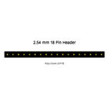
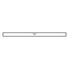
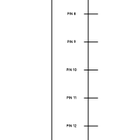
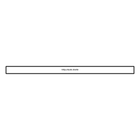
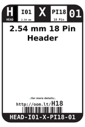
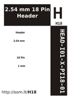
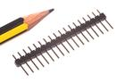

Contents
========

* [H18 > 2.54 mm 18 Pin Header](#h18--254-mm-18-pin-header)
	* [Diagrams](#diagrams)
	* [Datasheets](#datasheets)
	* [Labels](#labels)
	* [EDA](#eda)
	* [Images](#images)
	* [Tags](#tags)
  
![][im]
# H18 > 2.54 mm 18 Pin Header

- ID: HEAD-I01-X-PI18-01
- Hex ID: H18
- Name: 2.54 mm 18 Pin Header
- Description: 2.54 mm 18 Pin Header
- Long Link: [http://oom.lt/HEAD-I01-X-PI18-01](http://oom.lt/HEAD-I01-X-PI18-01)
- Short Link: [http://oom.lt/H18](http://oom.lt/H18)

## Diagrams
  
  

|diagBBLS|diagDIAG|diagIDEN|diagSCHEM|diagSIMP|
| :---: | :---: | :---: | :---: | :---: |
||||||

## Datasheets

- Datasheet: [datasheet.pdf](datasheet.pdf)

## Labels
  
  

|label-front|label-inventory|label-spec|
| :---: | :---: | :---: |
||||

## EDA

### Footprints
  

|[  FOOTPRINT-eagle-SparkFun-Eagle-Libraries-Sparkfun-Connectors-1X18](https://github.com/oomlout/oomlout_OOMP_eda/tree/main/FOOTPRINT/eagle/SparkFun-Eagle-Libraries/Sparkfun-Connectors/1X18/)|[  FOOTPRINT-eagle-SparkFun-Eagle-Libraries-Sparkfun-Connectors-1X18_NO_SILK](https://github.com/oomlout/oomlout_OOMP_eda/tree/main/FOOTPRINT/eagle/SparkFun-Eagle-Libraries/Sparkfun-Connectors/1X18_NO_SILK/)|[  FOOTPRINT-eagle-Adafruit-Eagle-Library-adafruit-1X18](https://github.com/oomlout/oomlout_OOMP_eda/tree/main/FOOTPRINT/eagle/Adafruit-Eagle-Library/adafruit/1X18/)|[  FOOTPRINT-kicad-kicad-footprints-Connector_PinHeader_2.54mm-PinHeader_1x18_P2.54mm_Vertical](https://github.com/oomlout/oomlout_OOMP_eda/tree/main/FOOTPRINT/kicad/kicad-footprints/Connector_PinHeader_2.54mm/PinHeader_1x18_P2.54mm_Vertical/)|
| :---: | :---: | :---: | :---: |
|||||

### Symbols
  

|[  SYMBOL-kicad-kicad-symbols-Connector-Conn_01x18_Male](https://github.com/oomlout/oomlout_OOMP_eda/tree/main/SYMBOL/kicad/kicad-symbols/Connector/Conn_01x18_Male/)|[  SYMBOL-kicad-kicad-symbols-Connector_Generic-Conn_01x18](https://github.com/oomlout/oomlout_OOMP_eda/tree/main/SYMBOL/kicad/kicad-symbols/Connector_Generic/Conn_01x18/)|||
| :---: | :---: | :---: | :---: |
  

### Instances
  
Used 2 times.  
Prevalance: (2\10986) 0.0182%  

|OOMP Instances|
| :---: |
|[PROJ-ADAF-782-STAN-01  Adafruit USB Serial RGB Character Backpack PCB  Used 1 times. JP1](https://github.com/oomlout/oomlout_OOMP_projects/tree/main/PROJ-ADAF-782-STAN-01/)|
|[PROJ-SPAR-13632-STAN-01  SparkFun Simblee Breakout Board  Used 1 times. JP4](https://github.com/oomlout/oomlout_OOMP_projects/tree/main/PROJ-SPAR-13632-STAN-01/)|

## Images
  
  

|image|image_RE|diagBBLS|diagDIAG|diagIDEN|diagSCHEM|diagSIMP|label-front|label-inventory|label-spec|
| :---: | :---: | :---: | :---: | :---: | :---: | :---: | :---: | :---: | :---: |
|||||||||||

## Tags

- oompType: HEAD
- oompSize: I01
- oompColor: X
- oompDesc: PI18
- oompIndex: 01
- hexID: H18
- oompSort: 
- oompClass: Through Hole
- oompClassCode: THTH
- ooPitch: 2.54
- ooPinHeight: 11.60
- ooPinWidth: 0.64
- ooPinOffset: 1.53
- oompBbls: variable;pins;18
- oompBbls: template;XXXX-I01-X-XX-01-bbls
- oompDiag: variable;pins;18
- oompDiag: template;HEAD-I01-X-XX-01-diag
- oompIden: variable;pins;18
- oompIden: template;XXXX-I01-X-XX-01-iden
- oompSchem: variable;pins;18
- oompSchem: template;XXXX-XX-X-XX-01-PINS-EVEN-schem
- oompSimp: variable;pins;18
- oompSimp: template;XXXX-I01-X-XX-01-simp
- ooNumPins: 18
- ooDesignator: J1
- schematicSymbol: HEAD-XX-X-PI18-XX
- oompID: HEAD-I01-X-PI18-01
- oompInstances: {'PROJECT': 'PROJ-ADAF-782-STAN-01', 'ID': 'JP1'}
- oompInstances: {'PROJECT': 'PROJ-SPAR-13632-STAN-01', 'ID': 'JP4'}
- footprintEagle: FOOTPRINT-eagle-SparkFun-Eagle-Libraries-Sparkfun-Connectors-1X18
- footprintEagle: FOOTPRINT-eagle-SparkFun-Eagle-Libraries-Sparkfun-Connectors-1X18_NO_SILK
- footprintEagle: FOOTPRINT-eagle-Adafruit-Eagle-Library-adafruit-1X18
- footprintKicad: FOOTPRINT-kicad-kicad-footprints-Connector_PinHeader_2.54mm-PinHeader_1x18_P2.54mm_Vertical
- symbolKicad: SYMBOL-kicad-kicad-symbols-Connector-Conn_01x18_Male
- symbolKicad: SYMBOL-kicad-kicad-symbols-Connector_Generic-Conn_01x18

[im]: image_450.jpg
