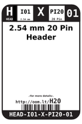
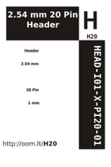
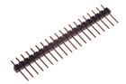
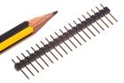

Contents
========

* [H20 > 2.54 mm 20 Pin Header](#h20--254-mm-20-pin-header)
	* [Datasheets](#datasheets)
	* [Labels](#labels)
	* [EDA](#eda)
	* [Images](#images)
	* [Tags](#tags)
  
![][im]
# H20 > 2.54 mm 20 Pin Header

- ID: HEAD-I01-X-PI20-01
- Hex ID: H20
- Name: 2.54 mm 20 Pin Header
- Description: 2.54 mm 20 Pin Header
- Long Link: [http://oom.lt/HEAD-I01-X-PI20-01](http://oom.lt/HEAD-I01-X-PI20-01)
- Short Link: [http://oom.lt/H20](http://oom.lt/H20)

## Datasheets

- Datasheet: [datasheet.pdf](datasheet.pdf)

## Labels
  
  

|label-front|label-inventory|label-spec|
| :---: | :---: | :---: |
||||

## EDA

### Footprints
  

|  [FOOTPRINT-eagle-SparkFun-Eagle-Libraries-Sparkfun-Connectors-1X20](https://github.com/oomlout/oomlout_OOMP_eda/tree/main/FOOTPRINT/eagle/SparkFun-Eagle-Libraries/Sparkfun-Connectors/1X20/)|  [FOOTPRINT-eagle-SparkFun-Eagle-Libraries-Sparkfun-Connectors-1X20_LOCK](https://github.com/oomlout/oomlout_OOMP_eda/tree/main/FOOTPRINT/eagle/SparkFun-Eagle-Libraries/Sparkfun-Connectors/1X20_LOCK/)|  [FOOTPRINT-eagle-SparkFun-Eagle-Libraries-Sparkfun-Connectors-1X20_LOCK_LONGPADS](https://github.com/oomlout/oomlout_OOMP_eda/tree/main/FOOTPRINT/eagle/SparkFun-Eagle-Libraries/Sparkfun-Connectors/1X20_LOCK_LONGPADS/)|  [FOOTPRINT-eagle-Adafruit-Eagle-Library-adafruit-1X20](https://github.com/oomlout/oomlout_OOMP_eda/tree/main/FOOTPRINT/eagle/Adafruit-Eagle-Library/adafruit/1X20/)|
| :---: | :---: | :---: | :---: |
|  [FOOTPRINT-kicad-kicad-footprints-Connector_PinHeader_2.54mm-PinHeader_1x20_P2.54mm_Vertical](https://github.com/oomlout/oomlout_OOMP_eda/tree/main/FOOTPRINT/kicad/kicad-footprints/Connector_PinHeader_2.54mm/PinHeader_1x20_P2.54mm_Vertical/)||||

### Symbols
  

|  [SYMBOL-kicad-kicad-symbols-Connector-Conn_01x20_Male](https://github.com/oomlout/oomlout_OOMP_parts/tree/main/SYMBOL-kicad-kicad-symbols-Connector-Conn_01x20_Male/)|  [----](https://github.com/oomlout/oomlout_OOMP_parts/tree/main/----/)|||
| :---: | :---: | :---: | :---: |
  

### Instances
  
Used 25 times.  
Prevalance: (25\10986) 0.2276%  

|OOMP Instances|
| :---: |
|[PROJ-ADAF-1325-STAN-01  Adafruit FPC SMT Adapter PCBs  Used 2 times. JP2, JP3](https://github.com/oomlout/oomlout_OOMP_projects/tree/main/PROJ-ADAF-1325-STAN-01/)|
|[PROJ-ADAF-1743-STAN-01  Adafruit 3.2 TFT Breakout PCB  Used 2 times. JP1, JP2](https://github.com/oomlout/oomlout_OOMP_projects/tree/main/PROJ-ADAF-1743-STAN-01/)|
|[PROJ-ADAF-1770-STAN-01  2.8 TFT Breakout PCB  Used 1 times. 1X20BREAKOUT](https://github.com/oomlout/oomlout_OOMP_projects/tree/main/PROJ-ADAF-1770-STAN-01/)|
|[PROJ-ADAF-2050-STAN-01  3.5inch TFT Breakout PCB  Used 2 times. JP1, JP2](https://github.com/oomlout/oomlout_OOMP_projects/tree/main/PROJ-ADAF-2050-STAN-01/)|
|[PROJ-ADAF-2090-STAN-01  Adafruit 2.8 TFT with Capacitive Touch PCB  Used 2 times. JP1, JP2](https://github.com/oomlout/oomlout_OOMP_projects/tree/main/PROJ-ADAF-2090-STAN-01/)|
|[PROJ-ADAF-2478-STAN-01  Adafruit 2.4 TFT Breakout PCB  Used 2 times. JP1, JP2](https://github.com/oomlout/oomlout_OOMP_projects/tree/main/PROJ-ADAF-2478-STAN-01/)|
|[PROJ-SPAR-10705-STAN-01  MyDAQ Protoboard Kit  Used 2 times. JP3, JP4](https://github.com/oomlout/oomlout_OOMP_projects/tree/main/PROJ-SPAR-10705-STAN-01/)|
|[PROJ-SPAR-11525-STAN-01  P8X32A Breakout  Used 2 times. JP2, JP3](https://github.com/oomlout/oomlout_OOMP_projects/tree/main/PROJ-SPAR-11525-STAN-01/)|
|[PROJ-SPAR-12849-STAN-01  RN-52  Used 2 times. JP1, JP2](https://github.com/oomlout/oomlout_OOMP_projects/tree/main/PROJ-SPAR-12849-STAN-01/)|
|[PROJ-SPAR-14153-STAN-01  ESP32 Environment Sensor Shield  Used 6 times. J4, J9, J10, J11, J12, J13](https://github.com/oomlout/oomlout_OOMP_projects/tree/main/PROJ-SPAR-14153-STAN-01/)|
|[PROJ-SPAR-14430-STAN-01  ESP32 Motion Shield  Used 2 times. J1, J3](https://github.com/oomlout/oomlout_OOMP_projects/tree/main/PROJ-SPAR-14430-STAN-01/)|

## Images
  
  

|image|image_RE|label-front|label-inventory|label-spec|
| :---: | :---: | :---: | :---: | :---: |
||||||

## Tags

- oompID: HEAD-I01-X-PI20-01
- name: 2.54 mm 20 Pin Header
- hexID: H20
- oompSort: 010120
- oompType: HEAD
- oompSize: I01
- oompColor: X
- oompDesc: PI20
- oompIndex: 01
- oompVersion: 99
- ooPitch: 2.54
- ooPinHeight: 11.60
- ooPinWidth: 0.64
- ooPinOffset: 1.53
- ooNumPins: 20
- ooFootprint: OOMP-HEAD-I01-X-PI20-01
- oompClass: Through Hole Component
- oompClassCode: THTH
- oompBbls: variable;clear
- oompBbls: variable;pins;20
- oompBbls: template;XXXX-I01-X-XX-01-bbls
- oompDiag: variable;clear
- oompDiag: variable;pins;20
- oompDiag: template;HEAD-I01-X-XX-01-diag
- oompIden: variable;clear
- oompIden: variable;pins;20
- oompIden: template;XXXX-I01-X-XX-01-iden
- oompSchem: variable;clear
- oompSchem: variable;pins;20
- oompSchem: template;XXXX-XX-X-XX-01-PINS-EVEN-schem
- oompSimp: variable;clear
- oompSimp: variable;pins;20
- oompSimp: template;XXXX-I01-X-XX-01-simp
- ooDesignator: J1
- schematicSymbol: HEAD-XX-X-PI20-XX
- pcbFootprint: HEAD-I01-X-PI20-01
- oompInstances: {'PROJECT': 'PROJ-ADAF-1325-STAN-01', 'ID': 'JP2'}
- oompInstances: {'PROJECT': 'PROJ-ADAF-1325-STAN-01', 'ID': 'JP3'}
- oompInstances: {'PROJECT': 'PROJ-ADAF-1743-STAN-01', 'ID': 'JP1'}
- oompInstances: {'PROJECT': 'PROJ-ADAF-1743-STAN-01', 'ID': 'JP2'}
- oompInstances: {'PROJECT': 'PROJ-ADAF-1770-STAN-01', 'ID': '1X20BREAKOUT'}
- oompInstances: {'PROJECT': 'PROJ-ADAF-2050-STAN-01', 'ID': 'JP1'}
- oompInstances: {'PROJECT': 'PROJ-ADAF-2050-STAN-01', 'ID': 'JP2'}
- oompInstances: {'PROJECT': 'PROJ-ADAF-2090-STAN-01', 'ID': 'JP1'}
- oompInstances: {'PROJECT': 'PROJ-ADAF-2090-STAN-01', 'ID': 'JP2'}
- oompInstances: {'PROJECT': 'PROJ-ADAF-2478-STAN-01', 'ID': 'JP1'}
- oompInstances: {'PROJECT': 'PROJ-ADAF-2478-STAN-01', 'ID': 'JP2'}
- oompInstances: {'PROJECT': 'PROJ-SPAR-10705-STAN-01', 'ID': 'JP3'}
- oompInstances: {'PROJECT': 'PROJ-SPAR-10705-STAN-01', 'ID': 'JP4'}
- oompInstances: {'PROJECT': 'PROJ-SPAR-11525-STAN-01', 'ID': 'JP2'}
- oompInstances: {'PROJECT': 'PROJ-SPAR-11525-STAN-01', 'ID': 'JP3'}
- oompInstances: {'PROJECT': 'PROJ-SPAR-12849-STAN-01', 'ID': 'JP1'}
- oompInstances: {'PROJECT': 'PROJ-SPAR-12849-STAN-01', 'ID': 'JP2'}
- oompInstances: {'PROJECT': 'PROJ-SPAR-14153-STAN-01', 'ID': 'J4'}
- oompInstances: {'PROJECT': 'PROJ-SPAR-14153-STAN-01', 'ID': 'J9'}
- oompInstances: {'PROJECT': 'PROJ-SPAR-14153-STAN-01', 'ID': 'J10'}
- oompInstances: {'PROJECT': 'PROJ-SPAR-14153-STAN-01', 'ID': 'J11'}
- oompInstances: {'PROJECT': 'PROJ-SPAR-14153-STAN-01', 'ID': 'J12'}
- oompInstances: {'PROJECT': 'PROJ-SPAR-14153-STAN-01', 'ID': 'J13'}
- oompInstances: {'PROJECT': 'PROJ-SPAR-14430-STAN-01', 'ID': 'J1'}
- oompInstances: {'PROJECT': 'PROJ-SPAR-14430-STAN-01', 'ID': 'J3'}
- footprintEagle: FOOTPRINT-eagle-SparkFun-Eagle-Libraries-Sparkfun-Connectors-1X20
- footprintEagle: FOOTPRINT-eagle-SparkFun-Eagle-Libraries-Sparkfun-Connectors-1X20_LOCK
- footprintEagle: FOOTPRINT-eagle-SparkFun-Eagle-Libraries-Sparkfun-Connectors-1X20_LOCK_LONGPADS
- footprintEagle: FOOTPRINT-eagle-Adafruit-Eagle-Library-adafruit-1X20
- footprintKicad: FOOTPRINT-kicad-kicad-footprints-Connector_PinHeader_2.54mm-PinHeader_1x20_P2.54mm_Vertical
- symbolKicad: SYMBOL-kicad-kicad-symbols-Connector-Conn_01x20_Male
- symbolKicad: SYMBOL-kicad-kicad-symbols-Connector_Generic-Conn_01x20_Male

[im]: image_450.jpg
