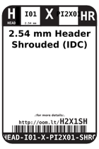
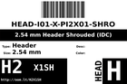
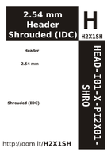

Contents
========

* [H2X1SH > ](#h2x1sh--)
	* [Labels](#labels)
	* [EDA](#eda)
	* [Images](#images)
	* [Tags](#tags)

# H2X1SH > 

- ID: HEAD-I01-X-PI2X01-SHRO
- Hex ID: H2X1SH
- Name: 
- Description: 
- Long Link: [http://oom.lt/HEAD-I01-X-PI2X01-SHRO](http://oom.lt/HEAD-I01-X-PI2X01-SHRO)
- Short Link: [http://oom.lt/H2X1SH](http://oom.lt/H2X1SH)

## Labels
  
  

|label-front|label-inventory|label-spec|
| :---: | :---: | :---: |
||||

## EDA

### Footprints
  

|[  ----](https://github.com/oomlout/oomlout_OOMP_parts/tree/main/----/)||||
| :---: | :---: | :---: | :---: |

### Symbols
  

|[  SYMBOL-kicad-kicad-symbols-Connector-Conn_01x02_Male](https://github.com/oomlout/oomlout_OOMP_eda/tree/main/SYMBOL/kicad/kicad-symbols/Connector/Conn_01x02_Male/)|[  ----](https://github.com/oomlout/oomlout_OOMP_parts/tree/main/----/)|[  SYMBOL-kicad-kicad-symbols-Connector_Generic-Conn_02x01_Row_Letter_First](https://github.com/oomlout/oomlout_OOMP_eda/tree/main/SYMBOL/kicad/kicad-symbols/Connector_Generic/Conn_02x01_Row_Letter_First/)|[  SYMBOL-kicad-kicad-symbols-Connector_Generic-Conn_02x01_Row_Letter_Last](https://github.com/oomlout/oomlout_OOMP_eda/tree/main/SYMBOL/kicad/kicad-symbols/Connector_Generic/Conn_02x01_Row_Letter_Last/)|
| :---: | :---: | :---: | :---: |
|[  ----](https://github.com/oomlout/oomlout_OOMP_parts/tree/main/----/)|[  ----](https://github.com/oomlout/oomlout_OOMP_parts/tree/main/----/)|[  ----](https://github.com/oomlout/oomlout_OOMP_parts/tree/main/----/)||

## Images
  
  

|label-front|label-inventory|label-spec|
| :---: | :---: | :---: |
||||

## Tags

- oompType: HEAD
- oompSize: I01
- oompColor: X
- oompDesc: PI2X01
- oompIndex: SHRO
- hexID: H2X1SH
- oompID: HEAD-I01-X-PI2X01-SHRO
- footprintKicad: FOOTPRINT-kicad-kicad-footprints-Connector_IDC-IDC-Header_2x01_P2.54mm_Vertical
- symbolKicad: SYMBOL-kicad-kicad-symbols-Connector-Conn_01x02_Male
- symbolKicad: SYMBOL-kicad-kicad-symbols-Connector_Generic-DIN41612_02x01_AB
- symbolKicad: SYMBOL-kicad-kicad-symbols-Connector_Generic-Conn_02x01_Row_Letter_First
- symbolKicad: SYMBOL-kicad-kicad-symbols-Connector_Generic-Conn_02x01_Row_Letter_Last
- symbolKicad: SYMBOL-kicad-kicad-symbols-Connector_Generic-Conn_02x01_Counter_Clockwise
- symbolKicad: SYMBOL-kicad-kicad-symbols-Connector_Generic-Conn_02x01_Odd_Even
- symbolKicad: SYMBOL-kicad-kicad-symbols-Connector_Generic-Conn_02x01_Top_Bottom
