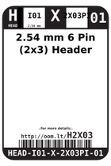
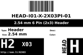

Contents
========

* [ > 2.54 mm 6 Pin (2x3) Header](#--254-mm-6-pin-2x3-header)
	* [Labels](#labels)
	* [EDA](#eda)
	* [Images](#images)
	* [Tags](#tags)

#  > 2.54 mm 6 Pin (2x3) Header

- ID: HEAD-I01-X-PI2X03-01
- Hex ID: 
- Name: 2.54 mm 6 Pin (2x3) Header
- Description: 2.54 mm 6 Pin (2x3) Header
- Long Link: [http://oom.lt/HEAD-I01-X-PI2X03-01](http://oom.lt/HEAD-I01-X-PI2X03-01)
- Short Link: [http://oom.lt/](http://oom.lt/)

## Labels
  
  

|label-front|label-inventory|label-spec|
| :---: | :---: | :---: |
||||

## EDA

### Symbols
  

|  [----](https://github.com/oomlout/oomlout_OOMP_parts/tree/main/----/)|  [----](https://github.com/oomlout/oomlout_OOMP_parts/tree/main/----/)|  [----](https://github.com/oomlout/oomlout_OOMP_parts/tree/main/----/)|  [----](https://github.com/oomlout/oomlout_OOMP_parts/tree/main/----/)|
| :---: | :---: | :---: | :---: |
|  [----](https://github.com/oomlout/oomlout_OOMP_parts/tree/main/----/)|  [----](https://github.com/oomlout/oomlout_OOMP_parts/tree/main/----/)|  [----](https://github.com/oomlout/oomlout_OOMP_parts/tree/main/----/)||
  

### Instances
  
Used 31 times.  
Prevalance: (31\10986) 0.2822%  

|OOMP Instances|
| :---: |
|[PROJ-ADAF-1429-STAN-01  Adafruit TLC5947 PCB  Used 8 times. JP2, JP3, JP4, JP5, JP6, JP7, JP8, JP9](https://github.com/oomlout/oomlout_OOMP_projects/tree/main/PROJ-ADAF-1429-STAN-01/)|
|[PROJ-ADAF-1455-STAN-01  Adafruit TLC59711 Breakout PCB  Used 4 times. JP2, JP3, JP5, JP8](https://github.com/oomlout/oomlout_OOMP_projects/tree/main/PROJ-ADAF-1455-STAN-01/)|
|[PROJ-ADAF-1588-STAN-01  Adafruit Bluefruit Classic PCBs  Used 1 times. JP5](https://github.com/oomlout/oomlout_OOMP_projects/tree/main/PROJ-ADAF-1588-STAN-01/)|
|[PROJ-ADAF-1628-STAN-01  Adafruit Bluefruit EZ Link Shield PCB  Used 1 times. JP5](https://github.com/oomlout/oomlout_OOMP_projects/tree/main/PROJ-ADAF-1628-STAN-01/)|
|[PROJ-ADAF-2466-STAN-01  Adafruit METRO 328 PCB  Used 1 times. ICSP](https://github.com/oomlout/oomlout_OOMP_projects/tree/main/PROJ-ADAF-2466-STAN-01/)|
|[PROJ-ADAF-3382-STAN-01  Adafruit Metro M4 Express PCB  Used 1 times. ICSP](https://github.com/oomlout/oomlout_OOMP_projects/tree/main/PROJ-ADAF-3382-STAN-01/)|
|[PROJ-ADAF-3505-STAN-01  Adafruit Metro M0 Express PCB  Used 1 times. ICSP](https://github.com/oomlout/oomlout_OOMP_projects/tree/main/PROJ-ADAF-3505-STAN-01/)|
|[PROJ-ADAF-4000-STAN-01  Adafruit Metro M4 Express AirLift PCB  Used 1 times. ICSP](https://github.com/oomlout/oomlout_OOMP_projects/tree/main/PROJ-ADAF-4000-STAN-01/)|
|[PROJ-ADAF-4064-STAN-01  Adafruit Grand Central PCB  Used 1 times. ICSP](https://github.com/oomlout/oomlout_OOMP_projects/tree/main/PROJ-ADAF-4064-STAN-01/)|
|[PROJ-ADAF-4775-STAN-01  Adafruit Metro ESP32 S2 PCB  Used 1 times. ICSP](https://github.com/oomlout/oomlout_OOMP_projects/tree/main/PROJ-ADAF-4775-STAN-01/)|
|[PROJ-ADAF-4985-STAN-01  Adafruit FunHouse PCB  Used 2 times. JP1, JP2](https://github.com/oomlout/oomlout_OOMP_projects/tree/main/PROJ-ADAF-4985-STAN-01/)|
|[PROJ-ADAF-659-STAN-01  Adafruit Flora Mainboard  Used 1 times. JP1](https://github.com/oomlout/oomlout_OOMP_projects/tree/main/PROJ-ADAF-659-STAN-01/)|
|[PROJ-ADAF-795-STAN-01  Adafruit Menta PCB  Used 1 times. JP3](https://github.com/oomlout/oomlout_OOMP_projects/tree/main/PROJ-ADAF-795-STAN-01/)|
|[PROJ-ADAF-91-STAN-01  Adafruit_USB_Boarduino_PCB  Used 1 times. JP3](https://github.com/oomlout/oomlout_OOMP_projects/tree/main/PROJ-ADAF-91-STAN-01/)|
|[PROJ-ARDU-LEO-STAN-01  Arduino Leonardo  Used 1 times. ICSP](https://github.com/oomlout/oomlout_OOMP_projects/tree/main/PROJ-ARDU-LEO-STAN-01/)|
|[PROJ-ARDU-MICRO-STAN-01  Arduino Micro  Used 1 times. J4](https://github.com/oomlout/oomlout_OOMP_projects/tree/main/PROJ-ARDU-MICRO-STAN-01/)|
|[PROJ-ARDU-UNO-REV3-01  Arduino Rev3 Uno  Used 2 times. ICSP, ICSP1](https://github.com/oomlout/oomlout_OOMP_projects/tree/main/PROJ-ARDU-UNO-REV3-01/)|
|[PROJ-ARDU-UNO-REV3-SM  Arduino Rev3 Uno (SMD)  Used 2 times. ICSP, ICSP1](https://github.com/oomlout/oomlout_OOMP_projects/tree/main/PROJ-ARDU-UNO-REV3-SM/)|

## Images
  
  

|label-front|label-inventory|label-spec|
| :---: | :---: | :---: |
||||

## Tags

- oompSort: 
- oompClass: Through Hole
- oompClassCode: THTH
- oompType: HEAD
- oompSize: I01
- oompColor: X
- oompDesc: PI2X03
- oompIndex: 01
- oompVersion: 40
- ooPitch: 2.54
- ooPinHeight: 11.60
- ooPinWidth: 0.64
- ooPinOffset: 1.53
- ooNumRows: 2
- ooNumPins: 6
- ooFootprint: OOMP-HEAD-I01-X-PI2x03-01
- ooDesignator: J1
- oompID: HEAD-I01-X-PI2X03-01
- oompInstances: {'PROJECT': 'PROJ-ADAF-1429-STAN-01', 'ID': 'JP2'}
- oompInstances: {'PROJECT': 'PROJ-ADAF-1429-STAN-01', 'ID': 'JP3'}
- oompInstances: {'PROJECT': 'PROJ-ADAF-1429-STAN-01', 'ID': 'JP4'}
- oompInstances: {'PROJECT': 'PROJ-ADAF-1429-STAN-01', 'ID': 'JP5'}
- oompInstances: {'PROJECT': 'PROJ-ADAF-1429-STAN-01', 'ID': 'JP6'}
- oompInstances: {'PROJECT': 'PROJ-ADAF-1429-STAN-01', 'ID': 'JP7'}
- oompInstances: {'PROJECT': 'PROJ-ADAF-1429-STAN-01', 'ID': 'JP8'}
- oompInstances: {'PROJECT': 'PROJ-ADAF-1429-STAN-01', 'ID': 'JP9'}
- oompInstances: {'PROJECT': 'PROJ-ADAF-1455-STAN-01', 'ID': 'JP2'}
- oompInstances: {'PROJECT': 'PROJ-ADAF-1455-STAN-01', 'ID': 'JP3'}
- oompInstances: {'PROJECT': 'PROJ-ADAF-1455-STAN-01', 'ID': 'JP5'}
- oompInstances: {'PROJECT': 'PROJ-ADAF-1455-STAN-01', 'ID': 'JP8'}
- oompInstances: {'PROJECT': 'PROJ-ADAF-1588-STAN-01', 'ID': 'JP5'}
- oompInstances: {'PROJECT': 'PROJ-ADAF-1628-STAN-01', 'ID': 'JP5'}
- oompInstances: {'PROJECT': 'PROJ-ADAF-2466-STAN-01', 'ID': 'ICSP'}
- oompInstances: {'PROJECT': 'PROJ-ADAF-3382-STAN-01', 'ID': 'ICSP'}
- oompInstances: {'PROJECT': 'PROJ-ADAF-3505-STAN-01', 'ID': 'ICSP'}
- oompInstances: {'PROJECT': 'PROJ-ADAF-4000-STAN-01', 'ID': 'ICSP'}
- oompInstances: {'PROJECT': 'PROJ-ADAF-4064-STAN-01', 'ID': 'ICSP'}
- oompInstances: {'PROJECT': 'PROJ-ADAF-4775-STAN-01', 'ID': 'ICSP'}
- oompInstances: {'PROJECT': 'PROJ-ADAF-4985-STAN-01', 'ID': 'JP1'}
- oompInstances: {'PROJECT': 'PROJ-ADAF-4985-STAN-01', 'ID': 'JP2'}
- oompInstances: {'PROJECT': 'PROJ-ADAF-659-STAN-01', 'ID': 'JP1'}
- oompInstances: {'PROJECT': 'PROJ-ADAF-795-STAN-01', 'ID': 'JP3'}
- oompInstances: {'PROJECT': 'PROJ-ADAF-91-STAN-01', 'ID': 'JP3'}
- oompInstances: {'PROJECT': 'PROJ-ARDU-LEO-STAN-01', 'ID': 'ICSP'}
- oompInstances: {'PROJECT': 'PROJ-ARDU-MICRO-STAN-01', 'ID': 'J4'}
- oompInstances: {'PROJECT': 'PROJ-ARDU-UNO-REV3-01', 'ID': 'ICSP'}
- oompInstances: {'PROJECT': 'PROJ-ARDU-UNO-REV3-01', 'ID': 'ICSP1'}
- oompInstances: {'PROJECT': 'PROJ-ARDU-UNO-REV3-SM', 'ID': 'ICSP'}
- oompInstances: {'PROJECT': 'PROJ-ARDU-UNO-REV3-SM', 'ID': 'ICSP1'}
- symbolKicad: SYMBOL-kicad-kicad-symbols-Connector-Conn_01x0303_Male
- symbolKicad: SYMBOL-kicad-kicad-symbols-Connector-DIN41612_02x03_AB
- symbolKicad: SYMBOL-kicad-kicad-symbols-Connector-Conn_02x03_Row_Letter_First
- symbolKicad: SYMBOL-kicad-kicad-symbols-Connector-Conn_02x03_Row_Letter_Last
- symbolKicad: SYMBOL-kicad-kicad-symbols-Connector-Conn_02x03_Counter_Clockwise
- symbolKicad: SYMBOL-kicad-kicad-symbols-Connector-Conn_02x03_Odd_Even
- symbolKicad: SYMBOL-kicad-kicad-symbols-Connector-Conn_02x03_Top_Bottom
