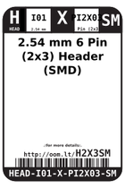
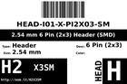
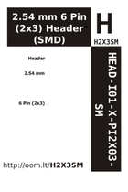

Contents
========

* [H2X3SM > 2.54 mm 6 Pin (2x3) Header (SMD)](#h2x3sm--254-mm-6-pin-2x3-header-smd)
	* [Datasheets](#datasheets)
	* [Labels](#labels)
	* [EDA](#eda)
	* [Images](#images)
	* [Tags](#tags)

# H2X3SM > 2.54 mm 6 Pin (2x3) Header (SMD)

- ID: HEAD-I01-X-PI2X03-SM
- Hex ID: H2X3SM
- Name: 2.54 mm 6 Pin (2x3) Header (SMD)
- Description: 2.54 mm 6 Pin (2x3) Header (SMD)
- Long Link: [http://oom.lt/HEAD-I01-X-PI2X03-SM](http://oom.lt/HEAD-I01-X-PI2X03-SM)
- Short Link: [http://oom.lt/H2X3SM](http://oom.lt/H2X3SM)

## Datasheets

- Datasheet: [datasheet.pdf](datasheet.pdf)

## Labels
  
  

|label-front|label-inventory|label-spec|
| :---: | :---: | :---: |
||||

## EDA

### Footprints
  

|[  FOOTPRINT-kicad-kicad-footprints-Connector_PinHeader_2.54mm-PinHeader_2x03_P2.54mm_Vertical_SMD](https://github.com/oomlout/oomlout_OOMP_eda/tree/main/FOOTPRINT/kicad/kicad-footprints/Connector_PinHeader_2.54mm/PinHeader_2x03_P2.54mm_Vertical_SMD/)||||
| :---: | :---: | :---: | :---: |

### Symbols
  

|[  SYMBOL-kicad-kicad-symbols-Connector_Generic-Conn_02x03_Odd_Even](https://github.com/oomlout/oomlout_OOMP_eda/tree/main/SYMBOL/kicad/kicad-symbols/Connector_Generic/Conn_02x03_Odd_Even/)|[  SYMBOL-kicad-kicad-symbols-Connector_Generic-Conn_02x03_Row_Letter_First](https://github.com/oomlout/oomlout_OOMP_eda/tree/main/SYMBOL/kicad/kicad-symbols/Connector_Generic/Conn_02x03_Row_Letter_First/)|[  SYMBOL-kicad-kicad-symbols-Connector_Generic-Conn_02x03_Row_Letter_Last](https://github.com/oomlout/oomlout_OOMP_eda/tree/main/SYMBOL/kicad/kicad-symbols/Connector_Generic/Conn_02x03_Row_Letter_Last/)|[  SYMBOL-kicad-kicad-symbols-Connector_Generic-Conn_02x03_Counter_Clockwise](https://github.com/oomlout/oomlout_OOMP_eda/tree/main/SYMBOL/kicad/kicad-symbols/Connector_Generic/Conn_02x03_Counter_Clockwise/)|
| :---: | :---: | :---: | :---: |
|[  SYMBOL-kicad-kicad-symbols-Connector_Generic-Conn_02x03_Top_Bottom](https://github.com/oomlout/oomlout_OOMP_eda/tree/main/SYMBOL/kicad/kicad-symbols/Connector_Generic/Conn_02x03_Top_Bottom/)|[  SYMBOL-kicad-kicad-symbols-Connector-Conn_01x06_Male](https://github.com/oomlout/oomlout_OOMP_eda/tree/main/SYMBOL/kicad/kicad-symbols/Connector/Conn_01x06_Male/)|[  SYMBOL-kicad-kicad-symbols-Connector_Generic-Conn_02x03_Odd_Even](https://github.com/oomlout/oomlout_OOMP_eda/tree/main/SYMBOL/kicad/kicad-symbols/Connector_Generic/Conn_02x03_Odd_Even/)|[  SYMBOL-kicad-kicad-symbols-Connector_Generic-Conn_02x03_Row_Letter_First](https://github.com/oomlout/oomlout_OOMP_eda/tree/main/SYMBOL/kicad/kicad-symbols/Connector_Generic/Conn_02x03_Row_Letter_First/)|
|[  SYMBOL-kicad-kicad-symbols-Connector_Generic-Conn_02x03_Row_Letter_Last](https://github.com/oomlout/oomlout_OOMP_eda/tree/main/SYMBOL/kicad/kicad-symbols/Connector_Generic/Conn_02x03_Row_Letter_Last/)|[  SYMBOL-kicad-kicad-symbols-Connector_Generic-Conn_02x03_Counter_Clockwise](https://github.com/oomlout/oomlout_OOMP_eda/tree/main/SYMBOL/kicad/kicad-symbols/Connector_Generic/Conn_02x03_Counter_Clockwise/)|[  SYMBOL-kicad-kicad-symbols-Connector_Generic-Conn_02x03_Top_Bottom](https://github.com/oomlout/oomlout_OOMP_eda/tree/main/SYMBOL/kicad/kicad-symbols/Connector_Generic/Conn_02x03_Top_Bottom/)|[  SYMBOL-kicad-kicad-symbols-Connector-Conn_01x06_Male](https://github.com/oomlout/oomlout_OOMP_eda/tree/main/SYMBOL/kicad/kicad-symbols/Connector/Conn_01x06_Male/)|
|[  SYMBOL-kicad-kicad-symbols-Connector_Generic-Conn_02x03_Odd_Even](https://github.com/oomlout/oomlout_OOMP_eda/tree/main/SYMBOL/kicad/kicad-symbols/Connector_Generic/Conn_02x03_Odd_Even/)|[  SYMBOL-kicad-kicad-symbols-Connector_Generic-Conn_02x03_Row_Letter_First](https://github.com/oomlout/oomlout_OOMP_eda/tree/main/SYMBOL/kicad/kicad-symbols/Connector_Generic/Conn_02x03_Row_Letter_First/)|[  SYMBOL-kicad-kicad-symbols-Connector_Generic-Conn_02x03_Row_Letter_Last](https://github.com/oomlout/oomlout_OOMP_eda/tree/main/SYMBOL/kicad/kicad-symbols/Connector_Generic/Conn_02x03_Row_Letter_Last/)|[  SYMBOL-kicad-kicad-symbols-Connector_Generic-Conn_02x03_Counter_Clockwise](https://github.com/oomlout/oomlout_OOMP_eda/tree/main/SYMBOL/kicad/kicad-symbols/Connector_Generic/Conn_02x03_Counter_Clockwise/)|
|[  SYMBOL-kicad-kicad-symbols-Connector_Generic-Conn_02x03_Top_Bottom](https://github.com/oomlout/oomlout_OOMP_eda/tree/main/SYMBOL/kicad/kicad-symbols/Connector_Generic/Conn_02x03_Top_Bottom/)|[  SYMBOL-kicad-kicad-symbols-Connector-Conn_01x06_Male](https://github.com/oomlout/oomlout_OOMP_eda/tree/main/SYMBOL/kicad/kicad-symbols/Connector/Conn_01x06_Male/)|[  SYMBOL-kicad-kicad-symbols-Connector_Generic-Conn_02x03_Odd_Even](https://github.com/oomlout/oomlout_OOMP_eda/tree/main/SYMBOL/kicad/kicad-symbols/Connector_Generic/Conn_02x03_Odd_Even/)|[  SYMBOL-kicad-kicad-symbols-Connector_Generic-Conn_02x03_Row_Letter_First](https://github.com/oomlout/oomlout_OOMP_eda/tree/main/SYMBOL/kicad/kicad-symbols/Connector_Generic/Conn_02x03_Row_Letter_First/)|
|[  SYMBOL-kicad-kicad-symbols-Connector_Generic-Conn_02x03_Row_Letter_Last](https://github.com/oomlout/oomlout_OOMP_eda/tree/main/SYMBOL/kicad/kicad-symbols/Connector_Generic/Conn_02x03_Row_Letter_Last/)|[  SYMBOL-kicad-kicad-symbols-Connector_Generic-Conn_02x03_Counter_Clockwise](https://github.com/oomlout/oomlout_OOMP_eda/tree/main/SYMBOL/kicad/kicad-symbols/Connector_Generic/Conn_02x03_Counter_Clockwise/)|[  SYMBOL-kicad-kicad-symbols-Connector_Generic-Conn_02x03_Top_Bottom](https://github.com/oomlout/oomlout_OOMP_eda/tree/main/SYMBOL/kicad/kicad-symbols/Connector_Generic/Conn_02x03_Top_Bottom/)|[  SYMBOL-kicad-kicad-symbols-Connector-Conn_01x06_Male](https://github.com/oomlout/oomlout_OOMP_eda/tree/main/SYMBOL/kicad/kicad-symbols/Connector/Conn_01x06_Male/)|
|[  SYMBOL-kicad-kicad-symbols-Connector_Generic-Conn_02x03_Odd_Even](https://github.com/oomlout/oomlout_OOMP_eda/tree/main/SYMBOL/kicad/kicad-symbols/Connector_Generic/Conn_02x03_Odd_Even/)|[  SYMBOL-kicad-kicad-symbols-Connector_Generic-Conn_02x03_Row_Letter_First](https://github.com/oomlout/oomlout_OOMP_eda/tree/main/SYMBOL/kicad/kicad-symbols/Connector_Generic/Conn_02x03_Row_Letter_First/)|[  SYMBOL-kicad-kicad-symbols-Connector_Generic-Conn_02x03_Row_Letter_Last](https://github.com/oomlout/oomlout_OOMP_eda/tree/main/SYMBOL/kicad/kicad-symbols/Connector_Generic/Conn_02x03_Row_Letter_Last/)|[  SYMBOL-kicad-kicad-symbols-Connector_Generic-Conn_02x03_Counter_Clockwise](https://github.com/oomlout/oomlout_OOMP_eda/tree/main/SYMBOL/kicad/kicad-symbols/Connector_Generic/Conn_02x03_Counter_Clockwise/)|
|[  SYMBOL-kicad-kicad-symbols-Connector_Generic-Conn_02x03_Top_Bottom](https://github.com/oomlout/oomlout_OOMP_eda/tree/main/SYMBOL/kicad/kicad-symbols/Connector_Generic/Conn_02x03_Top_Bottom/)|[  SYMBOL-kicad-kicad-symbols-Connector-Conn_01x06_Male](https://github.com/oomlout/oomlout_OOMP_eda/tree/main/SYMBOL/kicad/kicad-symbols/Connector/Conn_01x06_Male/)|[  SYMBOL-kicad-kicad-symbols-Connector_Generic-Conn_02x03_Odd_Even](https://github.com/oomlout/oomlout_OOMP_eda/tree/main/SYMBOL/kicad/kicad-symbols/Connector_Generic/Conn_02x03_Odd_Even/)|[  SYMBOL-kicad-kicad-symbols-Connector_Generic-Conn_02x03_Row_Letter_First](https://github.com/oomlout/oomlout_OOMP_eda/tree/main/SYMBOL/kicad/kicad-symbols/Connector_Generic/Conn_02x03_Row_Letter_First/)|
|[  SYMBOL-kicad-kicad-symbols-Connector_Generic-Conn_02x03_Row_Letter_Last](https://github.com/oomlout/oomlout_OOMP_eda/tree/main/SYMBOL/kicad/kicad-symbols/Connector_Generic/Conn_02x03_Row_Letter_Last/)|[  SYMBOL-kicad-kicad-symbols-Connector_Generic-Conn_02x03_Counter_Clockwise](https://github.com/oomlout/oomlout_OOMP_eda/tree/main/SYMBOL/kicad/kicad-symbols/Connector_Generic/Conn_02x03_Counter_Clockwise/)|[  SYMBOL-kicad-kicad-symbols-Connector_Generic-Conn_02x03_Top_Bottom](https://github.com/oomlout/oomlout_OOMP_eda/tree/main/SYMBOL/kicad/kicad-symbols/Connector_Generic/Conn_02x03_Top_Bottom/)|[  SYMBOL-kicad-kicad-symbols-Connector-Conn_01x06_Male](https://github.com/oomlout/oomlout_OOMP_eda/tree/main/SYMBOL/kicad/kicad-symbols/Connector/Conn_01x06_Male/)|
|||||

## Images
  
  

|label-front|label-inventory|label-spec|
| :---: | :---: | :---: |
||||

## Tags

- oompType: HEAD
- oompSize: I01
- oompColor: X
- oompDesc: PI2X03
- oompIndex: SM
- hexID: H2X3SM
- oompID: HEAD-I01-X-PI2X03-SM
- footprintKicad: FOOTPRINT-kicad-kicad-footprints-Connector_PinHeader_2.54mm-PinHeader_2x03_P2.54mm_Vertical_SMD
- symbolKicad: SYMBOL-kicad-kicad-symbols-Connector_Generic-Conn_02x03_Odd_Even
- symbolKicad: SYMBOL-kicad-kicad-symbols-Connector_Generic-Conn_02x03_Row_Letter_First
- symbolKicad: SYMBOL-kicad-kicad-symbols-Connector_Generic-Conn_02x03_Row_Letter_Last
- symbolKicad: SYMBOL-kicad-kicad-symbols-Connector_Generic-Conn_02x03_Counter_Clockwise
- symbolKicad: SYMBOL-kicad-kicad-symbols-Connector_Generic-Conn_02x03_Top_Bottom
- symbolKicad: SYMBOL-kicad-kicad-symbols-Connector-Conn_01x06_Male
- symbolKicad: SYMBOL-kicad-kicad-symbols-Connector_Generic-Conn_02x03_Odd_Even
- symbolKicad: SYMBOL-kicad-kicad-symbols-Connector_Generic-Conn_02x03_Row_Letter_First
- symbolKicad: SYMBOL-kicad-kicad-symbols-Connector_Generic-Conn_02x03_Row_Letter_Last
- symbolKicad: SYMBOL-kicad-kicad-symbols-Connector_Generic-Conn_02x03_Counter_Clockwise
- symbolKicad: SYMBOL-kicad-kicad-symbols-Connector_Generic-Conn_02x03_Top_Bottom
- symbolKicad: SYMBOL-kicad-kicad-symbols-Connector-Conn_01x06_Male
- symbolKicad: SYMBOL-kicad-kicad-symbols-Connector_Generic-Conn_02x03_Odd_Even
- symbolKicad: SYMBOL-kicad-kicad-symbols-Connector_Generic-Conn_02x03_Row_Letter_First
- symbolKicad: SYMBOL-kicad-kicad-symbols-Connector_Generic-Conn_02x03_Row_Letter_Last
- symbolKicad: SYMBOL-kicad-kicad-symbols-Connector_Generic-Conn_02x03_Counter_Clockwise
- symbolKicad: SYMBOL-kicad-kicad-symbols-Connector_Generic-Conn_02x03_Top_Bottom
- symbolKicad: SYMBOL-kicad-kicad-symbols-Connector-Conn_01x06_Male
- symbolKicad: SYMBOL-kicad-kicad-symbols-Connector_Generic-Conn_02x03_Odd_Even
- symbolKicad: SYMBOL-kicad-kicad-symbols-Connector_Generic-Conn_02x03_Row_Letter_First
- symbolKicad: SYMBOL-kicad-kicad-symbols-Connector_Generic-Conn_02x03_Row_Letter_Last
- symbolKicad: SYMBOL-kicad-kicad-symbols-Connector_Generic-Conn_02x03_Counter_Clockwise
- symbolKicad: SYMBOL-kicad-kicad-symbols-Connector_Generic-Conn_02x03_Top_Bottom
- symbolKicad: SYMBOL-kicad-kicad-symbols-Connector-Conn_01x06_Male
- symbolKicad: SYMBOL-kicad-kicad-symbols-Connector_Generic-Conn_02x03_Odd_Even
- symbolKicad: SYMBOL-kicad-kicad-symbols-Connector_Generic-Conn_02x03_Row_Letter_First
- symbolKicad: SYMBOL-kicad-kicad-symbols-Connector_Generic-Conn_02x03_Row_Letter_Last
- symbolKicad: SYMBOL-kicad-kicad-symbols-Connector_Generic-Conn_02x03_Counter_Clockwise
- symbolKicad: SYMBOL-kicad-kicad-symbols-Connector_Generic-Conn_02x03_Top_Bottom
- symbolKicad: SYMBOL-kicad-kicad-symbols-Connector-Conn_01x06_Male
- symbolKicad: SYMBOL-kicad-kicad-symbols-Connector_Generic-Conn_02x03_Odd_Even
- symbolKicad: SYMBOL-kicad-kicad-symbols-Connector_Generic-Conn_02x03_Row_Letter_First
- symbolKicad: SYMBOL-kicad-kicad-symbols-Connector_Generic-Conn_02x03_Row_Letter_Last
- symbolKicad: SYMBOL-kicad-kicad-symbols-Connector_Generic-Conn_02x03_Counter_Clockwise
- symbolKicad: SYMBOL-kicad-kicad-symbols-Connector_Generic-Conn_02x03_Top_Bottom
- symbolKicad: SYMBOL-kicad-kicad-symbols-Connector-Conn_01x06_Male
