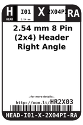
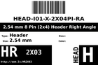
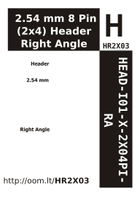

Contents
========

* [HR2X03 > 2.54 mm 8 Pin (2x4) Header Right Angle](#hr2x03--254-mm-8-pin-2x4-header-right-angle)
	* [Labels](#labels)
	* [EDA](#eda)
	* [Images](#images)
	* [Tags](#tags)

# HR2X03 > 2.54 mm 8 Pin (2x4) Header Right Angle

- ID: HEAD-I01-X-PI2X04-RA
- Hex ID: HR2X03
- Name: 2.54 mm 8 Pin (2x4) Header Right Angle
- Description: 2.54 mm 8 Pin (2x4) Header Right Angle
- Long Link: [http://oom.lt/HEAD-I01-X-PI2X04-RA](http://oom.lt/HEAD-I01-X-PI2X04-RA)
- Short Link: [http://oom.lt/HR2X03](http://oom.lt/HR2X03)

## Labels
  
  

|label-front|label-inventory|label-spec|
| :---: | :---: | :---: |
||||

## EDA

### Symbols
  

|  [----](https://github.com/oomlout/oomlout_OOMP_parts/tree/main/----/)|  [----](https://github.com/oomlout/oomlout_OOMP_parts/tree/main/----/)|  [----](https://github.com/oomlout/oomlout_OOMP_parts/tree/main/----/)|  [----](https://github.com/oomlout/oomlout_OOMP_parts/tree/main/----/)|
| :---: | :---: | :---: | :---: |
|  [----](https://github.com/oomlout/oomlout_OOMP_parts/tree/main/----/)|  [----](https://github.com/oomlout/oomlout_OOMP_parts/tree/main/----/)|  [----](https://github.com/oomlout/oomlout_OOMP_parts/tree/main/----/)||

## Images
  
  

|label-front|label-inventory|label-spec|
| :---: | :---: | :---: |
||||

## Tags

- hexID: HR2X03
- oompSort: 
- oompType: HEAD
- oompSize: I01
- oompColor: X
- oompDesc: PI2X04
- oompIndex: RA
- oompVersion: 98
- ooNumRows: 2
- ooNumPins: 8
- ooFootprint: OOMP-HEAD-I01-X-PI2x04-01
- oompID: HEAD-I01-X-PI2X04-RA
- symbolKicad: SYMBOL-kicad-kicad-symbols-Connector-Conn_01x0404_Male
- symbolKicad: SYMBOL-kicad-kicad-symbols-Connector-DIN41612_02x04_AB
- symbolKicad: SYMBOL-kicad-kicad-symbols-Connector-Conn_02x04_Row_Letter_First
- symbolKicad: SYMBOL-kicad-kicad-symbols-Connector-Conn_02x04_Row_Letter_Last
- symbolKicad: SYMBOL-kicad-kicad-symbols-Connector-Conn_02x04_Counter_Clockwise
- symbolKicad: SYMBOL-kicad-kicad-symbols-Connector-Conn_02x04_Odd_Even
- symbolKicad: SYMBOL-kicad-kicad-symbols-Connector-Conn_02x04_Top_Bottom
