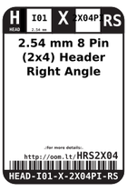
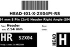
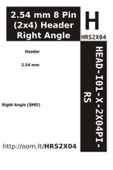

Contents
========

* [H2X4RS > 2.54 mm 8 Pin (2x4) Header Right Angle (SMD)](#h2x4rs--254-mm-8-pin-2x4-header-right-angle-smd)
	* [Datasheets](#datasheets)
	* [Labels](#labels)
	* [EDA](#eda)
	* [Images](#images)
	* [Tags](#tags)

# H2X4RS > 2.54 mm 8 Pin (2x4) Header Right Angle (SMD)

- ID: HEAD-I01-X-PI2X04-RS
- Hex ID: H2X4RS
- Name: 2.54 mm 8 Pin (2x4) Header Right Angle (SMD)
- Description: 2.54 mm 8 Pin (2x4) Header Right Angle (SMD)
- Long Link: [http://oom.lt/HEAD-I01-X-PI2X04-RS](http://oom.lt/HEAD-I01-X-PI2X04-RS)
- Short Link: [http://oom.lt/H2X4RS](http://oom.lt/H2X4RS)

## Datasheets

- Datasheet: [datasheet.pdf](datasheet.pdf)

## Labels
  
  

|label-front|label-inventory|label-spec|
| :---: | :---: | :---: |
||||

## EDA

### Symbols
  

|[  ----](https://github.com/oomlout/oomlout_OOMP_parts/tree/main/----/)|[  ----](https://github.com/oomlout/oomlout_OOMP_parts/tree/main/----/)|[  ----](https://github.com/oomlout/oomlout_OOMP_parts/tree/main/----/)|[  ----](https://github.com/oomlout/oomlout_OOMP_parts/tree/main/----/)|
| :---: | :---: | :---: | :---: |
|[  ----](https://github.com/oomlout/oomlout_OOMP_parts/tree/main/----/)|[  ----](https://github.com/oomlout/oomlout_OOMP_parts/tree/main/----/)|[  ----](https://github.com/oomlout/oomlout_OOMP_parts/tree/main/----/)||

## Images
  
  

|label-front|label-inventory|label-spec|
| :---: | :---: | :---: |
||||

## Tags

- oompType: HEAD
- oompSize: I01
- oompColor: X
- oompDesc: PI2X04
- oompIndex: RS
- hexID: H2X4RS
- oompID: HEAD-I01-X-PI2X04-RS
- symbolKicad: SYMBOL-kicad-kicad-symbols-Connector-Conn_01x0404_Male
- symbolKicad: SYMBOL-kicad-kicad-symbols-Connector-DIN41612_02x04_AB
- symbolKicad: SYMBOL-kicad-kicad-symbols-Connector-Conn_02x04_Row_Letter_First
- symbolKicad: SYMBOL-kicad-kicad-symbols-Connector-Conn_02x04_Row_Letter_Last
- symbolKicad: SYMBOL-kicad-kicad-symbols-Connector-Conn_02x04_Counter_Clockwise
- symbolKicad: SYMBOL-kicad-kicad-symbols-Connector-Conn_02x04_Odd_Even
- symbolKicad: SYMBOL-kicad-kicad-symbols-Connector-Conn_02x04_Top_Bottom
