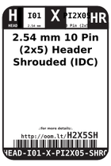

Contents
========

* [H2X5SH > 2.54 mm 10 Pin (2x5) Header Shrouded (IDC)](#h2x5sh--254-mm-10-pin-2x5-header-shrouded-idc)
	* [Labels](#labels)
	* [EDA](#eda)
	* [Images](#images)
	* [Tags](#tags)

# H2X5SH > 2.54 mm 10 Pin (2x5) Header Shrouded (IDC)

- ID: HEAD-I01-X-PI2X05-SHRO
- Hex ID: H2X5SH
- Name: 2.54 mm 10 Pin (2x5) Header Shrouded (IDC)
- Description: 2.54 mm 10 Pin (2x5) Header Shrouded (IDC)
- Long Link: [http://oom.lt/HEAD-I01-X-PI2X05-SHRO](http://oom.lt/HEAD-I01-X-PI2X05-SHRO)
- Short Link: [http://oom.lt/H2X5SH](http://oom.lt/H2X5SH)

## Labels
  
  

|label-front|label-inventory|label-spec|
| :---: | :---: | :---: |
||||

## EDA

### Footprints
  

|  [kicad/FOOTPRINT-kicad-kicad-footprints-Connector_IDC-IDC-Header_2x05_P2.54mm_Horizontal](https://github.com/oomlout/oomlout_OOMP_eda/tree/main/footprints/kicad/FOOTPRINT-kicad-kicad-footprints-Connector_IDC-IDC-Header_2x05_P2.54mm_Horizontal/)|  [kicad/FOOTPRINT-kicad-kicad-footprints-Connector_IDC-IDC-Header_2x05_P2.54mm_Vertical](https://github.com/oomlout/oomlout_OOMP_eda/tree/main/footprints/kicad/FOOTPRINT-kicad-kicad-footprints-Connector_IDC-IDC-Header_2x05_P2.54mm_Vertical/)|||
| :---: | :---: | :---: | :---: |

### Symbols

## Images
  
  

|label-front|label-inventory|label-spec|
| :---: | :---: | :---: |
||||

## Tags

- oompType: HEAD
- oompSize: I01
- oompColor: X
- oompDesc: PI2X05
- oompIndex: SHRO
- hexID: H2X5SH
- oompID: HEAD-I01-X-PI2X05-SHRO
- footprintKicad: FOOTPRINT-kicad-kicad-footprints-Connector_IDC-IDC-Header_2x05_P2.54mm_Horizontal
- footprintKicad: FOOTPRINT-kicad-kicad-footprints-Connector_IDC-IDC-Header_2x05_P2.54mm_Vertical
- symbolKicad: SYMBOL-kicad-kicad-symbols-Connector-Conn_01x0505_Male
- symbolKicad: SYMBOL-kicad-kicad-symbols-Connector-DIN41612_02x05_AB
- symbolKicad: SYMBOL-kicad-kicad-symbols-Connector-Conn_02x05_Row_Letter_First
- symbolKicad: SYMBOL-kicad-kicad-symbols-Connector-Conn_02x05_Row_Letter_Last
- symbolKicad: SYMBOL-kicad-kicad-symbols-Connector-Conn_02x05_Counter_Clockwise
- symbolKicad: SYMBOL-kicad-kicad-symbols-Connector-Conn_02x05_Odd_Even
- symbolKicad: SYMBOL-kicad-kicad-symbols-Connector-Conn_02x05_Top_Bottom
