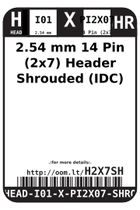
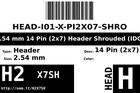
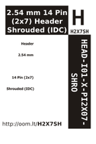

Contents
========

* [H2X7SH > 2.54 mm 14 Pin (2x7) Header Shrouded (IDC)](#h2x7sh--254-mm-14-pin-2x7-header-shrouded-idc)
	* [Labels](#labels)
	* [EDA](#eda)
	* [Images](#images)
	* [Tags](#tags)

# H2X7SH > 2.54 mm 14 Pin (2x7) Header Shrouded (IDC)

- ID: HEAD-I01-X-PI2X07-SHRO
- Hex ID: H2X7SH
- Name: 2.54 mm 14 Pin (2x7) Header Shrouded (IDC)
- Description: 2.54 mm 14 Pin (2x7) Header Shrouded (IDC)
- Long Link: [http://oom.lt/HEAD-I01-X-PI2X07-SHRO](http://oom.lt/HEAD-I01-X-PI2X07-SHRO)
- Short Link: [http://oom.lt/H2X7SH](http://oom.lt/H2X7SH)

## Labels
  
  

|label-front|label-inventory|label-spec|
| :---: | :---: | :---: |
||||

## EDA

### Footprints
  

|  [FOOTPRINT-kicad-kicad-footprints-Connector_IDC-IDC-Header_2x07_P2.54mm_Horizontal](https://github.com/oomlout/oomlout_OOMP_eda/tree/main/FOOTPRINT/kicad/kicad-footprints/Connector_IDC/IDC-Header_2x07_P2.54mm_Horizontal/)|  [FOOTPRINT-kicad-kicad-footprints-Connector_IDC-IDC-Header_2x07_P2.54mm_Vertical](https://github.com/oomlout/oomlout_OOMP_eda/tree/main/FOOTPRINT/kicad/kicad-footprints/Connector_IDC/IDC-Header_2x07_P2.54mm_Vertical/)|||
| :---: | :---: | :---: | :---: |

### Symbols
  

|  [----](https://github.com/oomlout/oomlout_OOMP_parts/tree/main/----/)|  [----](https://github.com/oomlout/oomlout_OOMP_parts/tree/main/----/)|  [----](https://github.com/oomlout/oomlout_OOMP_parts/tree/main/----/)|  [----](https://github.com/oomlout/oomlout_OOMP_parts/tree/main/----/)|
| :---: | :---: | :---: | :---: |
|  [----](https://github.com/oomlout/oomlout_OOMP_parts/tree/main/----/)|  [----](https://github.com/oomlout/oomlout_OOMP_parts/tree/main/----/)|  [----](https://github.com/oomlout/oomlout_OOMP_parts/tree/main/----/)||

## Images
  
  

|label-front|label-inventory|label-spec|
| :---: | :---: | :---: |
||||

## Tags

- oompType: HEAD
- oompSize: I01
- oompColor: X
- oompDesc: PI2X07
- oompIndex: SHRO
- hexID: H2X7SH
- oompID: HEAD-I01-X-PI2X07-SHRO
- footprintKicad: FOOTPRINT-kicad-kicad-footprints-Connector_IDC-IDC-Header_2x07_P2.54mm_Horizontal
- footprintKicad: FOOTPRINT-kicad-kicad-footprints-Connector_IDC-IDC-Header_2x07_P2.54mm_Vertical
- symbolKicad: SYMBOL-kicad-kicad-symbols-Connector-Conn_01x0707_Male
- symbolKicad: SYMBOL-kicad-kicad-symbols-Connector-DIN41612_02x07_AB
- symbolKicad: SYMBOL-kicad-kicad-symbols-Connector-Conn_02x07_Row_Letter_First
- symbolKicad: SYMBOL-kicad-kicad-symbols-Connector-Conn_02x07_Row_Letter_Last
- symbolKicad: SYMBOL-kicad-kicad-symbols-Connector-Conn_02x07_Counter_Clockwise
- symbolKicad: SYMBOL-kicad-kicad-symbols-Connector-Conn_02x07_Odd_Even
- symbolKicad: SYMBOL-kicad-kicad-symbols-Connector-Conn_02x07_Top_Bottom
