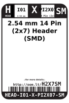
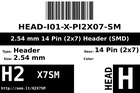
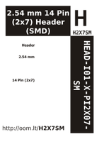

Contents
========

* [H2X7SM > 2.54 mm 14 Pin (2x7) Header (SMD)](#h2x7sm--254-mm-14-pin-2x7-header-smd)
	* [Datasheets](#datasheets)
	* [Labels](#labels)
	* [EDA](#eda)
	* [Images](#images)
	* [Tags](#tags)

# H2X7SM > 2.54 mm 14 Pin (2x7) Header (SMD)

- ID: HEAD-I01-X-PI2X07-SM
- Hex ID: H2X7SM
- Name: 2.54 mm 14 Pin (2x7) Header (SMD)
- Description: 2.54 mm 14 Pin (2x7) Header (SMD)
- Long Link: [http://oom.lt/HEAD-I01-X-PI2X07-SM](http://oom.lt/HEAD-I01-X-PI2X07-SM)
- Short Link: [http://oom.lt/H2X7SM](http://oom.lt/H2X7SM)

## Datasheets

- Datasheet: [datasheet.pdf](datasheet.pdf)

## Labels
  
  

|label-front|label-inventory|label-spec|
| :---: | :---: | :---: |
||||

## EDA

### Footprints
  

|[  FOOTPRINT-kicad-kicad-footprints-Connector_PinHeader_2.54mm-PinHeader_2x07_P2.54mm_Vertical_SMD](https://github.com/oomlout/oomlout_OOMP_eda/tree/main/FOOTPRINT/kicad/kicad-footprints/Connector_PinHeader_2.54mm/PinHeader_2x07_P2.54mm_Vertical_SMD/)||||
| :---: | :---: | :---: | :---: |

### Symbols
  

|[  SYMBOL-kicad-kicad-symbols-Connector-Conn_01x14_Male](https://github.com/oomlout/oomlout_OOMP_eda/tree/main/SYMBOL/kicad/kicad-symbols/Connector/Conn_01x14_Male/)|[  ----](https://github.com/oomlout/oomlout_OOMP_parts/tree/main/----/)|[  ----](https://github.com/oomlout/oomlout_OOMP_parts/tree/main/----/)|[  ----](https://github.com/oomlout/oomlout_OOMP_parts/tree/main/----/)|
| :---: | :---: | :---: | :---: |
|[  ----](https://github.com/oomlout/oomlout_OOMP_parts/tree/main/----/)|[  ----](https://github.com/oomlout/oomlout_OOMP_parts/tree/main/----/)|[  ----](https://github.com/oomlout/oomlout_OOMP_parts/tree/main/----/)||

## Images
  
  

|label-front|label-inventory|label-spec|
| :---: | :---: | :---: |
||||

## Tags

- oompType: HEAD
- oompSize: I01
- oompColor: X
- oompDesc: PI2X07
- oompIndex: SM
- hexID: H2X7SM
- oompID: HEAD-I01-X-PI2X07-SM
- footprintKicad: FOOTPRINT-kicad-kicad-footprints-Connector_PinHeader_2.54mm-PinHeader_2x07_P2.54mm_Vertical_SMD
- symbolKicad: SYMBOL-kicad-kicad-symbols-Connector-Conn_01x14_Male
- symbolKicad: SYMBOL-kicad-kicad-symbols-Connector-DIN41612_02x07_AB
- symbolKicad: SYMBOL-kicad-kicad-symbols-Connector-Conn_02x07_Row_Letter_First
- symbolKicad: SYMBOL-kicad-kicad-symbols-Connector-Conn_02x07_Row_Letter_Last
- symbolKicad: SYMBOL-kicad-kicad-symbols-Connector-Conn_02x07_Counter_Clockwise
- symbolKicad: SYMBOL-kicad-kicad-symbols-Connector-Conn_02x07_Odd_Even
- symbolKicad: SYMBOL-kicad-kicad-symbols-Connector-Conn_02x07_Top_Bottom
