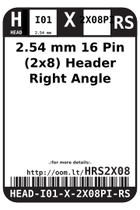

Contents
========

* [HRS2X08 > 2.54 mm 16 Pin (2x8) Header Right Angle (SMD)](#hrs2x08--254-mm-16-pin-2x8-header-right-angle-smd)
	* [Labels](#labels)
	* [EDA](#eda)
	* [Images](#images)
	* [Tags](#tags)

# HRS2X08 > 2.54 mm 16 Pin (2x8) Header Right Angle (SMD)

- ID: HEAD-I01-X-PI2X08-RS
- Hex ID: HRS2X08
- Name: 2.54 mm 16 Pin (2x8) Header Right Angle (SMD)
- Description: 2.54 mm 16 Pin (2x8) Header Right Angle (SMD)
- Long Link: [http://oom.lt/HEAD-I01-X-PI2X08-RS](http://oom.lt/HEAD-I01-X-PI2X08-RS)
- Short Link: [http://oom.lt/HRS2X08](http://oom.lt/HRS2X08)

## Labels
  
  

|label-front|label-inventory|label-spec|
| :---: | :---: | :---: |
||||

## EDA

### Symbols
  

|  [----](https://github.com/oomlout/oomlout_OOMP_parts/tree/main/----/)|  [----](https://github.com/oomlout/oomlout_OOMP_parts/tree/main/----/)|  [----](https://github.com/oomlout/oomlout_OOMP_parts/tree/main/----/)|  [----](https://github.com/oomlout/oomlout_OOMP_parts/tree/main/----/)|
| :---: | :---: | :---: | :---: |
|  [----](https://github.com/oomlout/oomlout_OOMP_parts/tree/main/----/)|  [----](https://github.com/oomlout/oomlout_OOMP_parts/tree/main/----/)|  [----](https://github.com/oomlout/oomlout_OOMP_parts/tree/main/----/)||

## Images
  
  

|label-front|label-inventory|label-spec|
| :---: | :---: | :---: |
||||

## Tags

- oompSort: 
- oompType: HEAD
- oompSize: I01
- oompColor: X
- oompDesc: PI2X08
- oompIndex: RS
- oompVersion: 999
- hexID: HRS2X08
- ooPitch: 2.54 mm
- ooWidth: 20.32 mm
- ooHeight: 5.08 mm
- ooLength: 17.66 mm
- numPins: 16
- numRows: 2
- oompFootprint: HEAD-I01-X-PI2x08-RS
- oompID: HEAD-I01-X-PI2X08-RS
- symbolKicad: SYMBOL-kicad-kicad-symbols-Connector-Conn_01x0808_Male
- symbolKicad: SYMBOL-kicad-kicad-symbols-Connector-DIN41612_02x08_AB
- symbolKicad: SYMBOL-kicad-kicad-symbols-Connector-Conn_02x08_Row_Letter_First
- symbolKicad: SYMBOL-kicad-kicad-symbols-Connector-Conn_02x08_Row_Letter_Last
- symbolKicad: SYMBOL-kicad-kicad-symbols-Connector-Conn_02x08_Counter_Clockwise
- symbolKicad: SYMBOL-kicad-kicad-symbols-Connector-Conn_02x08_Odd_Even
- symbolKicad: SYMBOL-kicad-kicad-symbols-Connector-Conn_02x08_Top_Bottom
