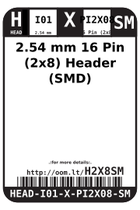
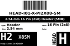
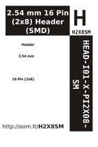

Contents
========

* [H2X8SM > 2.54 mm 16 Pin (2x8) Header (SMD)](#h2x8sm--254-mm-16-pin-2x8-header-smd)
	* [Datasheets](#datasheets)
	* [Labels](#labels)
	* [EDA](#eda)
	* [Images](#images)
	* [Tags](#tags)

# H2X8SM > 2.54 mm 16 Pin (2x8) Header (SMD)

- ID: HEAD-I01-X-PI2X08-SM
- Hex ID: H2X8SM
- Name: 2.54 mm 16 Pin (2x8) Header (SMD)
- Description: 2.54 mm 16 Pin (2x8) Header (SMD)
- Long Link: [http://oom.lt/HEAD-I01-X-PI2X08-SM](http://oom.lt/HEAD-I01-X-PI2X08-SM)
- Short Link: [http://oom.lt/H2X8SM](http://oom.lt/H2X8SM)

## Datasheets

- Datasheet: [datasheet.pdf](datasheet.pdf)

## Labels
  
  

|label-front|label-inventory|label-spec|
| :---: | :---: | :---: |
||||

## EDA

### Symbols
  

|[  ----](https://github.com/oomlout/oomlout_OOMP_parts/tree/main/----/)|[  ----](https://github.com/oomlout/oomlout_OOMP_parts/tree/main/----/)|[  ----](https://github.com/oomlout/oomlout_OOMP_parts/tree/main/----/)|[  ----](https://github.com/oomlout/oomlout_OOMP_parts/tree/main/----/)|
| :---: | :---: | :---: | :---: |
|[  ----](https://github.com/oomlout/oomlout_OOMP_parts/tree/main/----/)|[  ----](https://github.com/oomlout/oomlout_OOMP_parts/tree/main/----/)|[  ----](https://github.com/oomlout/oomlout_OOMP_parts/tree/main/----/)||

## Images
  
  

|label-front|label-inventory|label-spec|
| :---: | :---: | :---: |
||||

## Tags

- oompType: HEAD
- oompSize: I01
- oompColor: X
- oompDesc: PI2X08
- oompIndex: SM
- hexID: H2X8SM
- oompID: HEAD-I01-X-PI2X08-SM
- symbolKicad: SYMBOL-kicad-kicad-symbols-Connector-Conn_01x0808_Male
- symbolKicad: SYMBOL-kicad-kicad-symbols-Connector-DIN41612_02x08_AB
- symbolKicad: SYMBOL-kicad-kicad-symbols-Connector-Conn_02x08_Row_Letter_First
- symbolKicad: SYMBOL-kicad-kicad-symbols-Connector-Conn_02x08_Row_Letter_Last
- symbolKicad: SYMBOL-kicad-kicad-symbols-Connector-Conn_02x08_Counter_Clockwise
- symbolKicad: SYMBOL-kicad-kicad-symbols-Connector-Conn_02x08_Odd_Even
- symbolKicad: SYMBOL-kicad-kicad-symbols-Connector-Conn_02x08_Top_Bottom
