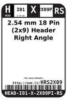
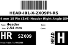
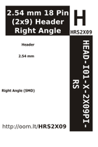

Contents
========

* [HRS2X09 > 2.54 mm 18 Pin (2x9) Header Right Angle (SMD)](#hrs2x09--254-mm-18-pin-2x9-header-right-angle-smd)
	* [Labels](#labels)
	* [EDA](#eda)
	* [Images](#images)
	* [Tags](#tags)

# HRS2X09 > 2.54 mm 18 Pin (2x9) Header Right Angle (SMD)

- ID: HEAD-I01-X-PI2X09-RS
- Hex ID: HRS2X09
- Name: 2.54 mm 18 Pin (2x9) Header Right Angle (SMD)
- Description: 2.54 mm 18 Pin (2x9) Header Right Angle (SMD)
- Long Link: [http://oom.lt/HEAD-I01-X-PI2X09-RS](http://oom.lt/HEAD-I01-X-PI2X09-RS)
- Short Link: [http://oom.lt/HRS2X09](http://oom.lt/HRS2X09)

## Labels
  
  

|label-front|label-inventory|label-spec|
| :---: | :---: | :---: |
||||

## EDA

### Symbols
  

|[  ----](https://github.com/oomlout/oomlout_OOMP_parts/tree/main/----/)|[  ----](https://github.com/oomlout/oomlout_OOMP_parts/tree/main/----/)|[  ----](https://github.com/oomlout/oomlout_OOMP_parts/tree/main/----/)|[  ----](https://github.com/oomlout/oomlout_OOMP_parts/tree/main/----/)|
| :---: | :---: | :---: | :---: |
|[  ----](https://github.com/oomlout/oomlout_OOMP_parts/tree/main/----/)|[  ----](https://github.com/oomlout/oomlout_OOMP_parts/tree/main/----/)|[  ----](https://github.com/oomlout/oomlout_OOMP_parts/tree/main/----/)||

## Images
  
  

|label-front|label-inventory|label-spec|
| :---: | :---: | :---: |
||||

## Tags

- oompSort: 
- oompType: HEAD
- oompSize: I01
- oompColor: X
- oompDesc: PI2X09
- oompIndex: RS
- oompVersion: 999
- hexID: HRS2X09
- ooPitch: 2.54 mm
- ooWidth: 22.86 mm
- ooHeight: 5.08 mm
- ooLength: 17.66 mm
- numPins: 18
- numRows: 2
- oompFootprint: HEAD-I01-X-PI2x09-RS
- oompID: HEAD-I01-X-PI2X09-RS
- symbolKicad: SYMBOL-kicad-kicad-symbols-Connector-Conn_01x0909_Male
- symbolKicad: SYMBOL-kicad-kicad-symbols-Connector-DIN41612_02x09_AB
- symbolKicad: SYMBOL-kicad-kicad-symbols-Connector-Conn_02x09_Row_Letter_First
- symbolKicad: SYMBOL-kicad-kicad-symbols-Connector-Conn_02x09_Row_Letter_Last
- symbolKicad: SYMBOL-kicad-kicad-symbols-Connector-Conn_02x09_Counter_Clockwise
- symbolKicad: SYMBOL-kicad-kicad-symbols-Connector-Conn_02x09_Odd_Even
- symbolKicad: SYMBOL-kicad-kicad-symbols-Connector-Conn_02x09_Top_Bottom
