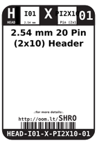
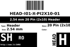
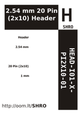

Contents
========

* [SHRO > 2.54 mm 20 Pin (2x10) Header](#shro--254-mm-20-pin-2x10-header)
	* [Labels](#labels)
	* [EDA](#eda)
	* [Images](#images)
	* [Tags](#tags)

# SHRO > 2.54 mm 20 Pin (2x10) Header

- ID: HEAD-I01-X-PI2X10-01
- Hex ID: SHRO
- Name: 2.54 mm 20 Pin (2x10) Header
- Description: 2.54 mm 20 Pin (2x10) Header
- Long Link: [http://oom.lt/HEAD-I01-X-PI2X10-01](http://oom.lt/HEAD-I01-X-PI2X10-01)
- Short Link: [http://oom.lt/SHRO](http://oom.lt/SHRO)

## Labels
  
  

|label-front|label-inventory|label-spec|
| :---: | :---: | :---: |
||||

## EDA

### Symbols
  

|  [----](https://github.com/oomlout/oomlout_OOMP_parts/tree/main/----/)|  [SYMBOL-kicad-kicad-symbols-Connector-DIN41612_02x10_AB](https://github.com/oomlout/oomlout_OOMP_parts/tree/main/SYMBOL-kicad-kicad-symbols-Connector-DIN41612_02x10_AB/)|  [----](https://github.com/oomlout/oomlout_OOMP_parts/tree/main/----/)|  [----](https://github.com/oomlout/oomlout_OOMP_parts/tree/main/----/)|
| :---: | :---: | :---: | :---: |
|  [----](https://github.com/oomlout/oomlout_OOMP_parts/tree/main/----/)|  [----](https://github.com/oomlout/oomlout_OOMP_parts/tree/main/----/)|  [----](https://github.com/oomlout/oomlout_OOMP_parts/tree/main/----/)||

## Images
  
  

|label-front|label-inventory|label-spec|
| :---: | :---: | :---: |
||||

## Tags

- oompType: HEAD
- oompSize: I01
- oompColor: X
- oompDesc: PI2X10
- oompIndex: 01
- hexID: SHRO
- oompID: HEAD-I01-X-PI2X10-01
- symbolKicad: SYMBOL-kicad-kicad-symbols-Connector-Conn_01x1010_Male
- symbolKicad: SYMBOL-kicad-kicad-symbols-Connector-DIN41612_02x10_AB
- symbolKicad: SYMBOL-kicad-kicad-symbols-Connector-Conn_02x10_Row_Letter_First
- symbolKicad: SYMBOL-kicad-kicad-symbols-Connector-Conn_02x10_Row_Letter_Last
- symbolKicad: SYMBOL-kicad-kicad-symbols-Connector-Conn_02x10_Counter_Clockwise
- symbolKicad: SYMBOL-kicad-kicad-symbols-Connector-Conn_02x10_Odd_Even
- symbolKicad: SYMBOL-kicad-kicad-symbols-Connector-Conn_02x10_Top_Bottom
